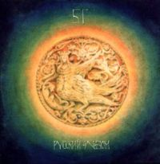

= Русский альбом
Аквариум
1992
:toc:

From::
http://old.aquarium.ru/discography/index.html

== Архистратиг

https://www.google.com/search?q=Аквариум+текст+Архистратиг

== Никита Рязанский

[verse]
____
Никита Рязанский
Строил город, и ему не хватило гвоздя.
Никита Рязанский
Протянул ладони и увидел в них капли дождя.
Никита Рязанский
Оставил город и вышел в сад.
Никита Рязанский
Оставль старца и учаше кто млад…

Святая София,
Узнав о нем, пришла к нему в дом;
Святая София
Искала его и нашла его под кустом;
Она крестила его
Соленым хлебом и горьким вином,
И они молились и смеялись вдвоем:

Смотри, Господи:
Крепость, и от крепости – страх,
И мы, Господи, дети у Тебя в руках,
Научи нас видеть Тебя
За каждой бедой…
Прими, Господи, этот хлеб и вино,
Смотри, Господи – вот мы уходим на дно,
Научи нас дышать под водой…

Девять тысяч церквей
Ждут Его, потому что Он должен спасти;
Девять тысяч церквей
Ищут Его, и не могут Его найти;
А ночью опять был дождь,
И пожар догорел, нам остался лишь дым;
Но город спасется,
Пока трое из нас
Продолжают говорить с Ним:

Смотри, Господи:
Крепость, и от крепости – страх,
И мы, Господи, дети у Тебя в руках,
Научи нас видеть Тебя
За каждой бедой…
Прими, Господи, этот хлеб и вино,
Смотри, Господи – вот мы уходим на дно,
Научи нас дышать под водой…
____

== Государыня

[verse]
____
Государыня, помнишь ли, как строили дом -
Всем он был хорош, но пустой;
Столько лет, шили по снегу серебром,
Боялись прикоснуть кислотой.

Столько лет, пели до седьмых петухов,
Пели, но боялись сказать.
Государыня, ведь если ты хотела врагов,
Кто же тебе смел отказать?

Так что же мы, до сих пор все пьем эту дрянь,
Цапаем чертей за бока?
Нам же сказано, что утро не возьмет свою дань,
Источник teksty-pesenok.ru
Обещано, что ноша легка.

Так полно, зря ли мы
Столько лет все строили дом -
Наша ли вина, что пустой?
Зато теперь, мы знаем, каково с серебром;
Посмотрим, каково с кислотой...
____

== Ласточка

[verse]
____
Прыг, ласточка, прыг, по белой стене.
Прыг, ласточка, прыг, прямо ко мне;
Солнце взошло - видно время пришло.
Прыг, ласточка, прыг - дело к войне.

Прыг, ласточка, прыг, прямо на двор;
Прыг, ласточка, прыг, в лапках топор.
С одной стороны свет; другой стороны нет.
Значит, в нашем дому спрятался вор.

Жизнь канет, как камень, в небе круги.
Прыг, ласточка, прыг - всюду враги.
Источник teksty-pesenok.ru
На битву со злом взвейся сокол, козлом,
А ты, ласточка, пой, а вслед не беги.

Пой, ласточка, пой - а мы бьем в тамтам.
Ясны соколы здесь, ясны соколы там.
Сокол летит, а баба родит;
Значит, все, как всегда, и все по местам...
____

== Волки и вороны

[verse]
____
Пили-пили, а проснулися - и ночь пахнет ладаном.
А кругом высокий лес, темен и замшел.
То ли это благодать, то ли это засада нам;
Весело наощупь, да сквозняк на душе.

Вот идут с образами - с образами незнакомыми,
Да светят им лампады из-под темной воды;
Я не помню, как мы встали, как мы вышли из комнаты,
Только помню, что идти нам до теплой звезды...

Вот стоит храм высок, да тьма под куполом.
Проглядели все глаза, да ни хрена не видать.
Я поставил бы свечу, да все свечи куплены.
Зажег бы спирт на руке - да где ж его взять?

А кругом лежат снега на все четыре стороны;
Легко по снегу босиком, если души чисты.
А мы пропали бы совсем, когда б не волки да вороны;
Они спросили: "Вы куда? Небось, до теплой звезды?.."

Назолотили крестов, навтыкали, где ни попадя;
Да променяли на вино один, который был дан.
А поутру с похмелья пошли к реке по воду,
А там вместо воды - Монгол Шуудан.

А мы хотели дать веселый знак ангелам,
Да потеряли их из виду, заметая следы;
Вот и вышло бы каждому по делам его,
Если бы не свет этой чистой звезды.

Так что нам делать, как нам петь, как не ради пустой руки?
А если нам не петь, то сгореть в пустоте;
А петь и не допеть - то за мной придут орлики;
С белыми глазами, да по мутной воде.

Только пусть они идут - я и сам птица черная,
Смотри, мне некуда бежать: еще метр - и льды;
Так я прикрою вас, а вы меня, волки да вороны,
Чтобы кто-нибудь дошел до этой чистой звезды...

Так что теперь с того, что тьма под куполом,
Что теперь с того, что ни хрена не видать?
Что теперь с того, что все свечи куплены,
Ведь если нет огня, мы знаем, где его взять;

Может правда, что нет путей, кроме торного,
И нет рук для чудес, кроме тех, что чисты,
А все равно нас грели только волки да вороны,
И благословили нас до чистой звезды...
____

== Заповедная песня

[verse]
____
Отчини мне, природа, стакан молока -
Молока от загадочных звезд.
И простой, как река, я пущу с молотка
Свой умственный рост...

Я поставлю в деревне большую кровать,
Приглашу в нее всех лошадей;
И седой с бородой стану бегать с дудой
И никто мне не скажет, что я лицедей...
А когда, наконец, смерть придет ко мне спать,
Она ляжет со мной в тишине;
Она скажет "еще", и опять, и опять,
И - ура! - будет радостно мне...

Не вменяйте мне, ангелы, это в вину;
Не крутите мне, ангелы, хвост:
Кто-то ж должен постичь красоту в глубину
От Москвы до загадочных звезд...
____

== Сирин, Алконост, Гамаюн

[verse]
____
В жилищных конторах лесной полумрак;
На крышах домов фонари с египетской тьмой:
Тронулся лед - так часто бывает весной:
Живущим на льдинах никто не сказал,
Что может быть так...

Откуда нам знать, что такое волна?
Полуденный фавн, трепет русалок во тьме...
Наступила ночь - начнем подготовку к зиме;
И может быть, следующим, кто постучит
К нам в дверь,
Будет война...

Я возьму на себя зеркала,
Кто-то другой - хмель и трепетный вьюн...
Все уже здесь: Сирин, Алконост, Гамаюн;
Как мы условились, я буду ждать по ту
Сторону стекла.
____

== Кони беспредела

[verse]
____
Ехали мы, ехали с горки на горку,
Да потеряли ось от колеса.
Вышли мы вприсядку, мундиры в оборку;
Солдатики любви - синие глаза...

Как взяли - повели нас дорогами странными;
Вели - да привели, как я погляжу;
Сидит птица бледная с глазами окаянными;
Что же, спой мне, птица - может, я попляшу...

Спой мне, птица, сладко ли душе без тела?
Легко ли быть птицей - да так, чтоб не петь?
Запрягай мне, Господи, коней беспредела;
Я хотел пешком, да видно, мне не успеть...

А чем мне их кормить, если кони не сыты?
Как их напоить? - они не пьют воды.
Шелковые гривы надушены, завиты;
Острые копыта, алые следы.

А вот и все мои товарищи - водка без хлеба,
Один брат - Сирин, а другой брат - Спас.
А третий хотел дойти ногами до неба,
Но выпил, удолбался - вот и весь сказ.

Эх, вылетела пташка - да не долетела;
Заклевал коршун - да голубя.
Запрягли, взнуздали мне коней беспредела,
А кони понесли - да все прочь от тебя...
Метились мы в дамки, да масть ушла мимо;
Все козыри в грязи, как ни крути.
Отче мой Сергие, отче Серафиме!
Звезды - наверху, а мы здесь - на пути...
____

== Елизавета

[verse]
____
У Елизаветы два друга:
Конь и тот, кто во сне.
За шторами вечный покой, шелест дождя,
А здесь, как всегда, воскресенье,
И свечи, и праздник,
И лето, и смех,
И то, что нельзя...

Скажи мне, зачем тогда
Статуи падали вниз, в провода,
Зачем мы стрелялись и шли
Горлом на плеть?
Она положила
Мне палец на губы,
И шепчет: "Делай, что хочешь,
Но молчи, слова - это смерть;
Это смерть..."

И наши тела распахнутся, как двери,
И - вверх, в небеса,
Туда, где привольно лететь,
Плавно скользя.
А там, как всегда, воскресенье,
И свечи, и праздник,
И лето, и смех,
И то, что нельзя;
То, что нельзя...
____

== Бурлак

[verse]
____
А как по Волге ходит одинокий бурлак,
Ходит бечевой небесных равнин;
Ему господин кажет с неба кулак,
А ему все смешно - в кулаке кокаин;

А вниз по Волге - Золотая Орда,
Вверх по Волге - барышни глядят с берега.
Ох, козельское зелье - живая вода;
Отпустите мне кровь, голубые снега.
Как мирила нас зима железом и льдом,
Замирила, а сама обернулась весной.
Как пойдет таять снег - ох, что будет потом,
А как тронется лед - ох, что будет со мной...

А то ли волжский разлив, то ли вселенский потоп,
То ли просто господин заметает следы,
Только мне все равно - я почти готов,
Готов тебе петь по-над темной воды;

А из-под темной воды бьют колокола,
Из-под древней стены - ослепительный чиж.
Отпусти мне грехи первым взмахом крыла;
Отпусти мне грехи - ну почему ты молчишь?!
Ты гори, Серафим, золотые крыла -
Гори, не стесняйся, путеводной звездой.
Мне все равно - я потерял удила,
И нет другого пути, только вместе с тобой...

Вот так и вся наша жизнь - то Секам, а то Пал;
То во поле кранты, то в головах Спас.
Вышел, чтоб идти к началу начал,
Но выпил и упал - вот и весь сказ;

А вороны молчат, а барышни кричат,
Тамбовской волчицей или светлой сестрой.
То спасительный пост, то спасительный яд;
Но слышишь, я стучу - открой!
Так причисли нас к ангелам, или среди зверей,
Но только не молчи - я не могу без огня;
И, где бы я ни шел, я все стучусь у дверей:
Так Господи мой Боже, помилуй меня!
____

== 25-й день луны

https://www.google.com/search?q=Аквариум+текст+25-й+день+луны

== Русская симфония

// https://www.google.com/search?q=site:old.aquarium.ru+Русская+симфония

(А. Гуницкий)

[verse]
____
Издалека течет река,
Ей жить осталось года три.
В объятьях черного крюка
Она умрет, а ты смотри:
Там на горе у трех осин
Гуляет полуидиот,
Жует он сгнивший апельсин
И корочки плюет вперед.

Он шел упорно и упрямо,
Он верил в старую сову.
И у дверей святого храма
Ему сломали голову.
Он умер - ну а что сова?
Цела, здорова и жива!

Когда мы были молоды,
Мы все растили бороды,
Мы все носили волосы
И пели ясным голосом.
Теперь другой расклад,
Дороги нет назад...

Зеркала вы мои, зеркала!
Потому что я пьяница, что ли,
Возвращаюсь я к вам поневоле,
Позабыв про другие дела;
Зеркала вы мои, зеркала;
Гастроном на улице Ракова
Был построен зодчим из Кракова,
Но его забыла История;
Вот такая, брат, ...
____

== Ода критику

// https://www.google.com/search?q=site:old.aquarium.ru+Ода+критику

[verse]
____
Ты в плоскости ума
Подобен таракану,
А в остальном подобен пескарю;
Все лысиной вертишь,
И ждешь, когда я кану,
А может быть, сгорю;

И в этот грозный час,
Чапаеву подобен,
Ты выползешь из всех своих щелей;
Как Усть-Илимский ГЭС,
Ты встанешь меж колдобин,
И станешь мне в могильную дыру
Просовывать елей.

А я, бесплатно
Над тобой летая
И хохоча,
Смотрю, как голова твоя,
Портвейном облитая,
Перегорела, как авто-
-мобильная свеча.
____

== Никон

// https://www.google.com/search?q=site:old.aquarium.ru+Никон

[verse]
____
Никон поджигает ночь;
Ночь поджигает коня;
Кони бегут по земле,
Кони говорят человечьим огнем.
А Никону стоять на холме,
У Никона отсюда и досюда броня,
А жена его сидит на земле,
У нее между ног - крылья

Никон поджигает ночь,
Ночь поджигает коня,
А кони поднимают глаза -
И ангелы спустились с небес;
А Никону стоять на холме -
Никону стоять в ожиданьи чудес,
А жена его летит над землей,
У нее между ног - крылья.
____

== Генерал

// https://www.google.com/search?q=site:old.aquarium.ru+Генерал

[verse]
____
Снесла мне крышу кислота,
И свод небес надо мной поет тишиной,
И вся природа пуста такой особой пустотой.

Генерал! разрешите войти без доклада;
Не стреляйте в меня, посидим полчаса в тишине.
Я хотел Вам сказать... - хотя, может быть, лучше не надо:
То, что можно сказать, без того уже видно по мне.

Мы больны, что мы столько лет пьем эту дрянь, и, впридачу,
Нам никак уже не отличить, где враги, где свои:
Генерал! Ах, уедемте лучше на дачу -
Получать, генерал, кислоту из сосновой хвои.

В подмосковных лесах листопад - веселей чем, медали;
Вместо ржавых штыков - вакхканалия белых берез.
А НЗ, генерал, - то, которое нам недодали, -
Прикажите штабным, пусть потратят на девок и коз.

Пусть живут, как хотят, ну а мы с Вами - тропкой тесной:
Самовар, философия, колба и чаша вина;
Так в безлунную ночь нам откроется суть Поднебесной:
Ах, запомнить бы суть - и Россия опять спасена
____

== День радости

// https://www.google.com/search?q=site:old.aquarium.ru+День+радости

[verse]
____
Когда то, что мы сделали,
Выйдет без печали из наших рук;
Когда семь разойдутся,
Чтобы не смотреть, кто войдет в круг;
Когда белый конь
Узнает своих подруг,
Это значит - день радости.

Когда звезда Можжевельник
Ляжет перед нами во сне,
Когда в камнях будет сказано
То, что было сказано мне;
Когда над белых холмом
Будет место звериной Луне,
Это значит - день радости.

Когда то, что мы сделали,
Выйдет без печали из наших рук,
Когда семь разойдутся,
Потому что не от кого прятаться в круг;
Когда белый конь
Поймет и признает своих подруг,
Это значит - день радости.

И теперь, когда растаяла пыль,
Под копытами волчьей зари;
Талая вода
И пламя бесконечной зимы -
Это ж, Господи, зрячему видно,
А для нас повтори:
Бог есть Свет, и в нем нет никакой тьмы.
Бог есть Свет, и в нем нет никакой тьмы.
____
