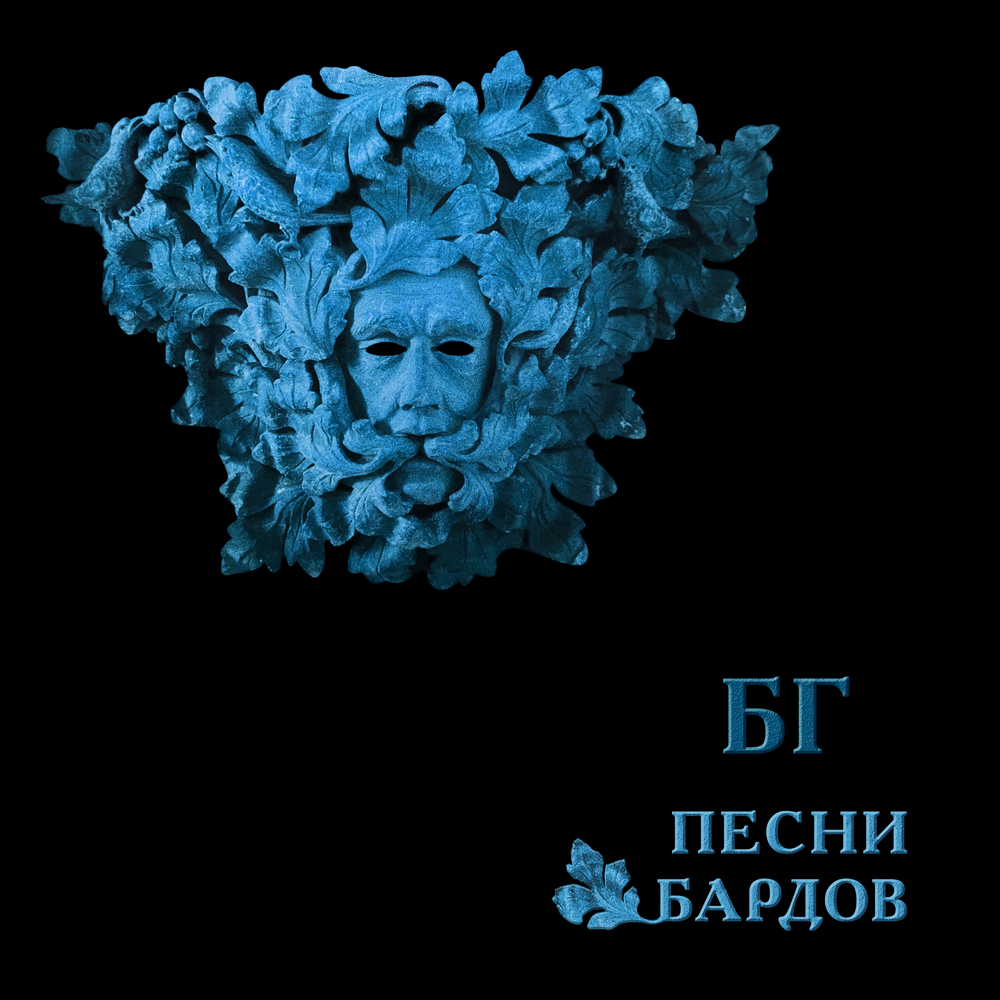

= Песни Бардов
Борис Гребенщиков
:toc:

From https://pesni.guru

== Элегия
_Е. Клячкин-А. Городницкий_

// https://www.google.com/search?q=Клячкин+Городницкий+текст+Элегия

[verse]
____
Сентябрь сколачивает стаи
И первый лист звенит у ног...
Извечна истина простая:
Свободен - значит, одинок.
Мечтая о свободе годы
Не замечаем мы того
Что нашей собственной свободы
Боимся более всего.
И на растерянные лица
Куда нам жизни деть свои
Крылом спасительным ложится
Власть государства и семьи.

В углу за снятою иконой
Вся в паутине пустота
Свободен - значит, вне закона.
Как эта истина проста!
Входная дверь гремит как выстрел
В моем пустеющем дому
Так жить нам вместе словно листьям
А падать вниз по одному
Так жить нам вместе словно листьям
А падать вниз по одному...
____

== Примета
_Б. Окуджава_

[verse]
____
Если ворон в вышине,
дело, стало быть, к войне.

Чтобы не было войны,
надо ворона убить.
Чтобы ворона убить,
надо ружья зарядить.

А как станем заряжать,
всем захочется стрелять.
Ну а как стрельба пойдет,
пуля дырочку найдет.

Ей не жалко никого,
ей попасть бы хоть в кого,
хоть в чужого, хоть в свово..
Во, и боле ничего.

Во, и боле ничего.
Во, и боле никого.
Кроме ворона того:
стрельнуть некому в него.
____

== Песенка о Солдатских Сапогах
_Б. Окуджава_

[verse]
____
Вы слышите: грохочут сапоги,
и птицы ошалелые летят,
и женщины глядят из-под руки?
Вы поняли, куда они глядят?

Вы слышите: грохочет барабан?
Солдат, прощайся с ней, прощайся с ней...
Уходит взвод в туман-туман-туман...
А прошлое ясней-ясней-ясней.

А где же наше мужество, солдат,
когда мы возвращаемся назад?
Его, наверно, женщины крадут
и, как птенца, за пазуху кладут.

А где же наши женщины, дружок,
когда вступаем мы на свой порог?
Они встречают нас и вводят в дом,
но в нашем доме пахнет воровством.

А мы рукой на прошлое: вранье!
А мы с надеждой в будущее: свет!
А по полям жиреет воронье,
а по пятам война грохочет вслед.

И снова переулком — сапоги,
и птицы ошалелые летят,
и женщины глядят из-под руки...
В затылки наши круглые глядят
____

== Неистов и Упрям
_Б. Окуджава_

[verse]
____
Неистов и упрям
Гори, огонь, гори...
На смену декабрям
Приходят январи

Пусть все дано сполна -
И радость, и смех
Одна на всех луна,
Весна одна на всех

Прожить ли так дотла
А там - пускай ведут
За все твои дела
На самый страшный суд

Пусть оправданья нет
И даже век спустя
Семь бед - один ответ
Один ответ - пустяк

Неистов и упрям...
Гори, огонь, гори
На смену декабрям
Приходят январи...
____

== Город
_Ю. Кукин_

[verse]
____
Горы далёкие, горы туманные, горы,
И улетающий, и умирающий снег.
Если вы знаете - где-то есть город, город,
Если вы помните - он не для всех, не для всех.
Странные люди заполнили весь этот город:
Мысли у них поперёк и слова поперёк,
И в разговорах они признают только споры,
И никуда не выходит оттуда дорог.

Вместо домов у людей в этом городе небо,
Руки любимых у них вместо квартир.
Я никогда в этом городе не был, не был,
Я все ищу и никак мне его не найти.
Если им больно - не плачут они, а смеются,
Если им весело - вина хорошие пьют.
Женские волосы, женские волосы вьются,
И неустроенность им заметет уют.

Я иногда проходил через этот город -
Мне бы увидеть, а я его не замечал.
И за молчанием или за разговором
Шел я по городу, выйдя и не повстречав.
Поездом - нет! Поездом мне не доехать.
И самолетом, тем более, не долететь.
Он задрожит миражом, он откликнется эхом.
И я найду, я хочу, и мне надо хотеть.
____

== Ночной Разговор
_Б. Окуджава_

[verse]
____
- Мой конь притомился,
стоптались мои башмаки.
Куда же мне ехать?
Скажите мне, будьте добры.
- Вдоль Красной реки, моя радость,
вдоль Красной реки,
До Синей горы, моя радость,
до Синей горы.

- А как мне проехать туда?
Притомился мой конь.
Скажите, пожалуйста,
как мне проехать туда?
- На ясный огонь, моя радость,
на ясный огонь,
Езжай на огонь, моя радость,
найдешь без труда.

- А где же тот ясный огонь?
Почему не горит?
Сто лет подпираю я небо ночное плечом...
- Фонарщик был должен зажечь,
да, наверное, спит,
фонарщик-то спит, моя радость...
А я ни при чем.

И снова он едет один,
без дороги,
во тьму.
Куда же он едет,
ведь ночь подступила к глазам!..
- Ты что потерял, моя радость?-
кричу я ему.
И он отвечает:
- Ах, если б я знал это сам...
____

== Прощание с Родиной
_Е. Клячкин_

[verse]
____
Я прощаюсь со страной,
где
Прожил жизнь, не разберу
чью
И в последний раз - пока
здесь
Этот воздух как вино
пью.

А на мне, земля, вины
нет
Я не худший у тебя
сын
Если клином на тебе
свет
Пусть я сам решу что свет -
клин.

Быть жестокой к сыновьям -
грех
Если вправду ты для них -
мать
Первый снег, конечно твой
снег
Но позволь мне и второй
знать.

А любовь к тебе, поверь
есть
Я и слякоти твоей
рад
Но отрава для любви -
лесть
Так зачем,скажи ты пьешь
яд?

Ты во мне как я в тебе -
весь
Но не вскрикнет ни один
шрам
То, что болью прозвенит
здесь
Клеветой прошелестит
там.

Я прощаюсь со страной,
где
Прожил жизнь, не разберу
чью
И в последний раз - пока
здесь
Этот воздух как вино
пью.
____

== Романс Князя Мышкина
_Е. Клячкин-И. Бродский_

[verse]
____
Приезжать на Родину в карете,
Приезжать на Родину в несчастьи,
Приезжать на Родину для смерти,
Умирать на Родине со страстью.

Умираешь, ну и Бог с тобою,
Во гробу, как в колыбельке чистой.
Привыкать на Родине к любови,
Привыкать на Родине к убийству.

Боже мой, любимых, пережитых,
Уничтожить хочешь, - уничтожь!
Подними мне руки для защиты,
Если пощадить меня не можешь.

Если ты не хочешь - и не надо.
И в любви испуганно ловимой
Поскользнись на Родине и падай,
Оказавшись во крови любимой.

Уезжать, бежать из Петербурга.
И всю жизнь летит до поворота,
До любви, до сна, до переулка
Зимняя карета идиота.

В Петербурге снег и непогода,
В Петербурге горестные мысли...

А все октябрь за окнами шумит,
И переулок за ночь перемыт
Ни раз, ни два холодною водою
И подворотни дышат пустотой.
Теперь все позже гаснут фонари,
Неясный свет октябрьской зари
Не заполняет мерзлые предместья.
И все ползет по фабрикам туман.
Еще не прояснившимся умам
Мерещатся последние известья,
И, тарахтя и стеклами и жестью,
Трамваи проезжают по домам.
Трамваи проезжают по домам.
____

== Средь Шумных Расставаний Городских
_Е. Клячкин-И. Бродский_

[verse]
____
Средь шумных расставаний городских, 
гудков авто и гулов заводских, 
и теплых магазинных площадей 
опять встречать потерянных людей. 

Какое-то мгновенье вспоминать
и всплескивать руками, догонять,
да, догонять, заглядывать в лицо,
едва ли не попав под колесо.

И узнавать, и тут же целовать,
от радости на месте танцевать
и говорить о перемене дел,
«да-да, я замечаю, похудел»,

«Да-да, пора заглядывать к врачу»,
по-дружески похлопать по плечу,
и, вдруг заметив время на часах
и телефон с ошибкой записав,

опять переминаться и спешить,
приятеля в объятьях придушить
и торопиться за трамваем вслед,
теряя человека на пять лет.

Так обойдется время и со мной.
Мы встретимся однажды на Сенной
и, пары предложений не связав,
раздвинув рты и зубы показав,

расстанемся опять - не навсегда ль? -
и по Садовой зашагает вдаль
мой грозный век, а я, как и всегда,
через канал, неведомо куда. 
____

== Псков
_Е. Клячкин_

[verse]
____
Помнишь этот город, вписанный в квадратик неба,
Как белый островок на синем,
И странные углы косые...
Жаль одно, что я там был тогда, как-будто не был.

Помнишь церковь, что легко взбежала на пригорок
И улеглась на нем свободно,
Отбросив руку с колокольней,
Как лежал бы человек, спокойно глядя в небо.

Ветерок относит тени и друзей, и женщин, -
Что ж, разве это не прекрасно,
Что верить до конца опасно...
Неужели ты чего-нибудь другого хочешь.

Две свечи в ногах, а сами станут в изголовье.
Вот фотография прекрасна,
И время над тобой не властно.
Слава богу, та, с косою, нас еще не ловит.

Стены этих храмов по глаза укрылись в землю.
И добрые седые брови,
И в желтых бородах - улыбки...
Неужели ты в ответ не хочешь улыбнуться!

Камни нас в лицо узнают и запомнят - камни.
Ну, разве нам с тобой не ясно,
Что все устроено прекрасно...
Лица их в морщинах, тяжкие тела их - помни.

Так лежал бы человек, спокойно глядя в небо...
____

== Песня о Времени
_Б. Окуджава_

[verse]
____
Время идет, хоть шути -- не шути,
как морская волна, вдруг нахлынет и скроет.
Но погоди, это все впереди,
дай надышаться Москвою.

Мало прошел я дорогой земной,
что же рвешь ты не в срок пополам мое сердце?
Ну не спеши, это будет со мной,
ведь никуда мне не деться.

Видишь тот дом -- там не гасят огня,
там друзья меня ждут не больным, не отпетым,
ну не спеши, как же им без меня --
надо ведь думать об этом.

Дай мне напиться воды голубой,
придержи до поры и тоску, и усталость.
Ну потерпи, разочтемся с тобой --
я должником не останусь.
____

== Романс Черта
_Е. Клячкин-И. Бродский_

[verse]
____
Новобранцы, новобранцы, новобранцы!
Ожидается изысканная драка,
принимайте новоявленного братца,
короля и помазанника из мрака.
Вот я снова перед вами - одинокий,
беспокойный и участливый уродец,
тот же самый, черно-белый, длинноногий,
одинокий и рогатый полководец.

Перед веком, перед веком, перед Богом,
перед Господом, глупеющим под старость,
перед боем в этом городе убогом
помолитесь, чтобы что-нибудь осталось.
Все, что брошено, оставлено, забыто,
все, что «больше не воротится обратно»,
возвращается в беспомощную битву,
в удивительную битву за утраты.

Как фонарики, фонарики ручные,
словно лампочки на уличных витринах,
наши страсти, как страдания ночные
этой плоти - и пространства поединок.
Так прислушивайся к уличному вою,
возникающему сызнова из детства,
это к мертвому торопится живое,
совершается немыслимое бегство.

Что-то рядом затевается на свете,
это снова раздвигаются кровати,
пробуждаются солдаты после смерти,
просыпаются любовники в объятьях.
И по-новой зачинаются младенцы,
и поют перед рассветом саксофоны,
и торопятся, торопятся одеться
новобранцы, новобранцы, солдафоны.

Как вам нравится ваш новый полководец!
Как мне нравится построенный народец,
как мне нравятся покойники и дети,
саксофоны и ударник на рассвете!
Потому что в этом городе убогом,
где отправят нас на похороны века,
кроме страха перед дьяволом и Богом,
существует что-то выше человека. 
____

== Прощание с Новогодней Елкой
_Б. Окуджава_

[verse]
____
Синяя крона, малиновый ствол,
звяканье шишек зеленых.
Где-то по комнатам ветер прошел:
там поздравляли влюбленных.
Где-то он старые струны задел -
тянется их перекличка...
Вот и январь накатил-налетел,
бешеный как электричка.

Мы в пух и прах наряжали тебя,
мы тебе верно служили.
Громко в картонные трубы трубя,
словно на подвиг спешили.
Даже поверилось где-то на миг
(знать, в простодушьи сердечном):
женщины той очарованный лик
слит с твоим празднеством вечным.

В миг расставания, в час платежа,
в день увяданья недели
чем это стала ты нехороша?
Что они все, одурели?!
И утонченные как соловьи,
гордые, как гренадеры,
что же надежные руки свои
прячут твои кавалеры?

Нет бы собраться им - время унять,
нет бы им всем - расстараться...
Но начинают колеса стучать:
как тяжело расставаться!
Но начинается вновь суета.
Время по-своему судит.
И в суете тебя сняли с креста,
и воскресенья не будет.

Ель моя, Ель - уходящий олень,
зря ты, наверно, старалась:
женщины той осторожная тень
в хвое твоей затерялась!
Ель моя, Ель, словно Спас-на-крови,
твой силуэт отдаленный,
будто бы след удивленной любви,
вспыхнувшей, неутоленной.
____

== Над Синей Улицей Портовой
_Б. Окуджава_

[verse]
____
Над синей улицей портовой
всю ночь сияют маяки.
Откинув ленточки фартово,
всю ночь гуляют моряки.

Кричат над городом сирены,
и чайки крыльями шуршат,
и припортовые царевны
к ребятам временным спешат.

Ведь завтра, может быть, проститься
придут ребята, да не те...
Ах, море -- синяя водица!
ах, голубая канитель!

Его затихнуть не умолишь --
взметнутся щепками суда.
Земля надежнее, чем море,
так почему же вы туда?

Волна соленая задушит --
ее попробуй, упросить...
Эх, если б вам служить на суше,
да только б ленточки носить!
____

== Грустная Песенка о Городских Влюблённых
_Е. Клячкин_

[verse]
____
Говорила Тошенька:
"Миленький, мне тошненько..."
— Ну, чем тебя порадую? —
Что ж, зайдем в парадную.
(Чем тебя порадую?)

Невеселый это путь,
а нам ступеньки — словно мох.
Кто-то смотрит — ну и пусть!
К черту их, а с нами — бог!
(Нам ступеньки — словно мох.)

Стекла в струйках копоти.
Губы — горячее льда.
Голоса на шепоте:
"Ну что же ты — иди сюда..."
(Губы горячее льда.)

Отлетают голоса,
вьется невеселый путь.
Наше время — полчаса,
и стрелок нам не повернуть.
(Вьется невеселый путь.)

Мне сказала Тошенька:
"Ах, все равно — мне тошненько!"
— Ну, чем тебя порадую?
"Ах, только не в парадную! —
Миленький, мне тошненько..." 
____

== По Ночной Москве Идет Девчонка
_Е. Клячкин_

[verse]
____
По ночной Москве идет девчонка,
Каблучками цок-цок-цок.
Вдруг откуда ни возьмись, сторонкой -
Незнакомый паренек.

Он ей говорит со знаньем дела:
"Виноват, который час?"
А она ему на это смело:
"Два-двенадцать-сорок шесть".

Он ей: "Что-то я, пардон, не понял,
Что такое сорок шесть?"
А она: "Да это ж телефон мой,
(Господи, какой балда!)

Позвоните, попросите Асю, -
Это буду лично я.
Ну, а вас зовут, я вижу, Вася -
В общем, познакомились."

Парень осмелел: "А вы поэтов
Знаете ли вы стихи?"
А она ему в ответ на это:
"Евтушенко - мой дружок".

Он ей говорит: "Тогда простите,
Может быть, нам в ресторан?.."
А она: "Вы завтра позвоните,
А сейчас меня ждет муж!"
____

== Романс (Ах, Улыбнись)
_Е. Клячкин-И. Бродский_

[verse]
____
Ах, улыбнись, ах, улыбнись, во след махни рукой
Недалеко за цинковой рекою
Ах, улыбнись, в оставленных домах,
Я различу на лицах твой взмах.
Не далеко за цинковой рекою
Где стекла дребезжат наперебой,
И в полдень нагреваются мосты,
Тебе уже не покупать цветы.
Ах, улыбнись, в оставленных домах,
Где ты живешь средь вороха бумаг
И запаха увянувших цветов,
Мне не найти оставленных следов.
Я различу на улице твой взмах.
Как хорошо в оставленных домах
Любить одних и находить других.
Из комнат бесконечно дорогих
Любовью умолкающей дыша,
На век уйти куда-нибудь спеша.
Ах, улыбнись, ах, улыбнись, во след махни рукой.
Когда на миг все люди замолчат,
Не далеко за цинковой рекой
Твои шаги на целый мир звучат.
Останься на нагревшемся мосту,
Роняй цветы в ночную пустоту,
Когда река блестит из темноты,
Всю ночь несет в Голландию цветы.
____

== Вставайте, Граф
_Ю. Визбор_

[verse]
____
Вставайте, граф, рассвет уже полощется,
Из-за озерной выглянув воды,
И, кстати, та, вчерашняя молочница,
Уже поднялась, полная беды.
Она была робка и молчалива,
Но, ваша честь, от вас не утаю:
Вы несомненно сделали счастливой
Ее саму и всю ее семью.
Вставайте, граф, уже друзья с мультуками
Коней седлают около крыльца.
Уж горожане радостными звуками,
Готовы в вас приветствовать отца.
Не хмурьте лоб, коль было согрешенье,
То будет время обо всем забыть,
Вставайте, мир ждет вашего решения:
Быть иль не быть, любить иль не любить.
И граф встает, ладонью бьет будильник,
Берет гантели, смотрит на дома
И безнадежно лезет в холодильник,
А там зима, пустынная зима.
Он выйдет в город, вспомнит вечер давешний,
Где был, что ел, кто доставал питье.
У перекрестка встретит он товарища,
У остановки подождет ее.
Она придет и глянет мимоходом,
Что было ночью, будто трын-трава:
-Привет!
-Привет! Хорошая погода.
Тебе в метро, а мне ведь на травмай.
А продают на перекрестке сливы,
И обтекает постовых народ.
Шагает граф, он хочет быть счастливым,
И он не хочет, чтоб наоборот.
____

== Фишка #2
_Е. Клячкин_

[verse]
____
Ботиночки дырявые,
От сырости дрожу
И пальцами корявыми
Узоры вывожу
О-о-о-ох! да на асфальте.

Тихонько дождик сыплется
За шиворот ко мне,
Троллейбус не торопится,
А капли на спине
О-о-о-ох! уже согрелись.

Я сам себя баюкаю –
"Хорошенький ты мой,
Нельзя же все с наукою,
Шагал бы ты домой
О-о-о-ох! с одной из этих"

Но с этой не получится,
А дома есть обед.
Но дома нет попутчицы,
А здесь обеда нет.
О-о-о-ох! как надоело!

Ох! пришел троллейбус.
____

== Про Маляров, Истопника и Теорию Относительности
_А. Галич_

[verse]
____
Чувствуем с напарником - ну и ну,
Ноги прямо ватные, все в дыму,
Чувствуем - нуждаемся в отдыхе,
Чтой-то нехорошее в воздухе.

Взали "жигулевского" и "дубняка",
Третьим пригласили истопника,
Приняли, добавили еще раза,
Тут нам истопник и открыл глаза -

На ужасную историю
Про Москву и про Париж,
Как наши физики проспорили
Ихним физикам пари.

Все теперь на шарике вкривь и вкось,
Шиворот-навыворот, набекрень,
И что мы с вами думаем день - ночь,
А что мы с вами думаем ночь - день.

И рубают финики лопари,
А в Сахаре снегу - невпроворот,
Это гады-физики на пари,
Раскрутили шарики наоборот.

И там, где полюс был, там тропики,
А где Нью-Йорк - Нахичевань,
А что люди мы, а не бобики,
Им на это начихать!

Рассказывал нам все это истопник,
Вижу, мой напарник, ну прямо сник, -
Раз такое дело - гори огнем!
Больше мы малярничать не пойдем! -

Взяли в поликлинике бюллетень,
Нам башку работою не морочь!
И что ж тут за работа, если ночью день,
А потом обратно не день, а ночь!

И при всей квалификации
Тут возможен перекос,
Это ж все-таки радиация,
А не медный купорос!

Пятую неделю я не сплю с женой,
Пятую неделю я хожу больной,
Тоже и напарник мой плачется,
Дескать, он отравленный начисто.

И лечусь "столичною" лично я,
Чтобы мне с ума не стронуться,
Истопник сказал - "столичная" -
Очень хороша от стронция.

И то я верю, а то не верится,
Что минует та беда...
А шарик вертится и вертится,
И все время не туда!
____

== Слава Героям
_Г. Шпаликов-А. Галич/А. Галич_

[verse]
____
У лошади была грудная жаба,
Но лошадь, как известно, не овца,
И лошадь на парады выезжала,
И маршалу про жабу ни словца!

А маршал, бедный, мучился от рака,
Но тоже на парады выезжал,
Он мучился от рака, но, однако,
Он лошади об этом не сказал!

Нам этот факт Великая Эпоха
Воспеть велела в песнях и стихах,
Хоть лошадь та давным-давно издохла,
А маршала сгноили в Соловках! 
____

== Она Сказала- «Не Люблю»
_И. Шевцов/В. Высоцкий_

[verse]
____
Она сказала: "Не люблю!"
А он сказал: " Не может быть?"
Она сказала: "Я не пью."
А он сказал: "Мы будем пить."

Когда все кончилось вино,
Она сказала: "Дорогой,
Закройте шторы и окно"
А он сказал: "Пора домой..."
____

== Лесной Вальс
_Б. Окуджава_

[verse]
____
Музыкант в лесу под деревом наигрывает вальс.
Он наигрывает вальс то ласково, то страстно.
Что касается меня, то я опять гляжу на Вас,
а Вы глядите на него, а он глядит в пространство.

Целый век играет музыка. Затянулся наш пикник.
Тот пикник, где пьют и плачут, любят и бросают.
Музыкант приник губами к флейте. Я бы к Вам приник!
Но Вы, наверно, тот родник, который не спасает.

А музыкант играет вальс. И он не видит ничего.
Он стоит, к стволу березовому прислонясь плечами.
И березовые ветки вместо пальцев у него,
а глаза его березовые строги и печальны.

А перед ним стоит сосна, вся в ожидании весны.
А музыкант врастает в землю. Звуки вальса льются...
И его худые ноги как будто корни той сосны -
они в земле переплетаются, никак не расплетутся.

Целый век играет музыка. Затянулся наш роман.
Он затянулся в узелок, горит он - не сгорает...
Ну давайте успокоимся! Разойдемся по домам!..
Но Вы глядите на него... А музыкант играет...
____

== Мокрый Вальс
_Е. Клячкин_

[verse]
____
Как непрочны двери
у страны доверья
для того, кто верит только в замки.
Значит, неизбежно
гасит нашу нежность,
нашу нежность - тяжесть чьей-то руки.

Что нас больше учит:
время или случай, -
вряд ли важно, если даже поймешь.
Но когда нас давит
сон страшнее яви,
выйди ночью под мерцающий дождь.

Все надежды, слышишь? -
он тебе надышит -
дождь бессонный, шелестящий в ночи,
плеск оваций в зале
или губ касанье,
губ касанье можно в нем различить.

И пока над нами
голубое пламя
неизвестной, нас хранящей звезды, -
будет, как и прежде,
сердце греть надежда,
унося нас далеко от беды. 
____

