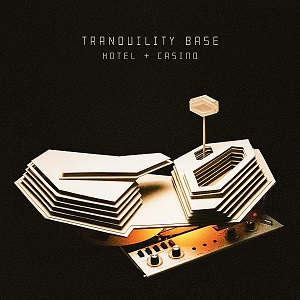

= Tranquility Base Hotel + Casino
Arctic Monkeys
2018
:toc:

link:../../links.html[Other albums]

== Star Treatment

[verse]
____
I just wanted to be one of The Strokes
Now look at the mess you made me make
Hitchhiking with a monogrammed suitcase
Miles away from any half-useful imaginary highway
I'm a big name in deep space, ask your mates
But golden boy's in bad shape
I found out the hard way that
Here ain't no place for dolls like you and me
Everybody's on a barge
Floating down the endless stream of great TV
1984, 2019

Maybe I was a little too wild in the '70s
Rocket-ship grease down the cracks of my knuckles
Karate bandana, warp speed chic
Hair down to there, impressive moustache
Love came in a bottle with a twist-off cap
Let's all have a swig and do a hot lap

So who you gonna call?
The martini police?
Baby, that isn't how they look tonight, oh no
It took the light forever to get to your eyes

I just wanted to be one of those ghosts
You thought that you could forget
And then I haunt you via the rear view mirror
On a long drive from the back seat
But it's alright, 'cause you love me
And you recognise that it's ain't how it should be
Your eyes are heavy and the weather's getting ugly
So pull over, I know the place
Don't you know an apparition is a cheap date?
What exactly is it you've been drinking these days?
Jukebox in the corner, long, hot summer
They've got a film up on the wall and it's dark enough to dance
What do you mean you've never seen Blade Runner?

Oh, maybe I was a little too wild in the '70s
Back down to earth with a lounge singer shimmer
Elevator down to my make-believe residency
From the honeymoon suite
Two shows a day, four nights a week
Easy money

So who you gonna call?
The martini police?
So who you gonna call?
The martini police?
Oh, baby, that isn't how they look tonight
It took the light absolutely forever to get to your eyes

And as we gaze skyward, ain't it dark early?
It's the star treatment
Yeah, and as we gaze skyward, ain't it dark early?
It's the star treatment
It's the star treatment
The star treatment
____

== One Point Perspective
(Live Version)

[verse]
____
Dancing in my underpants
I'm gonna run for government
I'm gonna form a covers band and all
Back there by the baby grand
Did Mr. Winter Wonderland say
"Come here kid, we really need to talk"?
Bear with me, man, I lost my train of thought

I fantasize I call it quits
I swim with the economists
And I get to the bottom of it for good
By the time reality hits
The chimes of freedom fell to bits
The shining city on the fritz
They come out of the cracks
Thirsty for blood

Just as the apocalypse finally gets prioritized
And you cry some of the hottest tears you ever cried
Multiplied by five
I suppose a singer must die

"Singsong 'round the money tree"
This stunning documentary that no one else unfortunately saw
Such beautiful photography, it's worth it for the opening scene
I've been driving 'round listening to the score
Or maybe, I just imagined it all
I've played to quiet rooms like this before
Bear with me, man, I lost my train of thought 
____

== American Sports

[verse]
____
So when you gaze at planet Earth from outer space
Does it wipe that stupid look off of your face?
I saw this aura over the battleground states
I lost the money, lost the keys
But I'm still handcuffed to the briefcase

And I never thought, not in a million year
That I'd meet so many Lolas
Can I please have my money back?
My virtual reality mask is stuck on ‘Parliament Brawl’
Emergency battery pack, just in time for my weekly chat
With God on video call

Breaking news, they take the truth and make it fluid
The trainer's explanation was accepted by the steward
A montage of the latest ancient ruins
Soundtracked by a chorus of "You don't know what you're doing"

And I never thought, not in a million years
That I'd meet so many Lolas

And all of my most muscular regrets
Explode behind my eyes like American sports

And I never thought, not in a million year
That I'd meet so many Lolas 
____

== Tranquility Base Hotel + Casino

[verse]
____
Jesus in the day spa filling out the information form
Mama got her hair done
Just popping out to sing a protest song
I've been on a bender back to that prophetic esplanade
Where I ponder all the questions but just manage to miss the mark

Good afternoon
Tranquility Base Hotel and Casino
Mark speaking
Please tell me how may I direct your call?

This magical thinking
Feels as if it really might catch on
Mama wants some answers
Do you remember where it all went wrong?
Technological advances
Really bloody get me in the mood
Pull me in close on a crisp eve baby
Kiss me underneath the moon's side boob

Good afternoon
Tranquility Base Hotel and Casino
Mark speaking
Please tell me how may I direct your call?
Do you celebrate your dark side
Then wish you'd never left the house?
Have you ever spent a generation trying to figure that one out?

Good afternoon
Tranquility Base Hotel and Casino
Mark speaking
Please tell me how may I direct your call? 
____

== Golden Trunks

[verse]
____
Last night when my psyche's subcommittee sang to me in it's scary voice
You slowly dropped your eyelids
When true love takes a grip it leaves you without a choice

And in response to what you whispered in my ear
I must admit sometimes I fantasize about you too

The leader of the free world reminds you of a wrestler wearing tight golden trunks
He's got himself a theme tune
They play it for him as he makes his way to the ring

And in response to what you whispered in my ear
I must admit sometimes I fantasize about you too

In the daytime, bendable figures with a fresh new pack of lies
Summat else to publicise
I'm sure you've heard about enough

So in response to what you whispered in my ear
I'll be upfront, sometimes I fantasize about you too 
____

== Four Out Of Five

[verse]
____
Advertise in imaginative ways, start your free trial today
Come on in, the water's lovely
Look, you could meet someone you like
During the meteor strike, it is that easy
Lunar surface on a Saturday night, dressed up in silver and white
With coloured old grey whistle test lights

Take it easy for a little while
Come and stay with us, it's such an easy flight
Cute new places keep on popping up
Since the exodus, it's all getting gentrified
I put a taqueria on the roof, it was well reviewed
Four stars out of five
And that's unheard of

Mr. Bridge and Tunnel on the starlight express
The head of special effects in my mind's eye
Hokey Cokey with the opposite sex
The things you try to forget, doesn't time fly?
I'm in no position to give advice, I don't want to be nice
And you know that

Take it easy for a little while
Come and stay with us, it's such an easy flight
Cute new places keep popping up
Around Clavius, it's all getting gentrified
The information action ratio is the place to go
And you will not recognise the old headquarters

All the nights that never happened and the days that don't exist
At the information action ratio
The only time that we stop laughing is to breathe or steal a kiss
I can get you on the list for all the clubs
I can lift you up another semitone

Take it easy for a little while (Take it easy for a little while)
Come and stay with us, it's such an easy flight
Cute new places keep on popping up
(Cute new places keep on popping up)
Since the exodus, it's all getting gentrified
The information action ratio (The information action ratio)
Is the place to go, four stars out of five
Take it easy for a little while (Take it easy for a little while)
Come and stay with us, now, it's such an easy flight
Cute new places keep on popping up
(Cute new places keep on popping up)
Around Clavius, it's all getting gentrified
I put a taqueria on the moon (The information action ratio)
It got rave reviews, four stars out of five

Take it easy for a little while (Take it easy for a little while)
Come and stay with us, four stars out of five
Take it easy for a little while (Take it easy for a little while)
Come and stay with us, four stars out of five
Take it easy for a little while (Take it easy for a little while)
Come and stay with us, four stars out of five
(Take it easy for a little while)
Four stars out of five 
____

== The World's First Ever Monster Truck Front Flip

[verse]
____
You push the button and we'll do the rest
The exotic sound of data storage
Nothing like it
First thing in the morning
You push the button and we'll do the rest
Bastard latin
That's the best thing for it
You push the button and we'll do the rest

You and Lizzy in the summertime
Wrapping my tiny mind around a lullaby

There are things that I just cannot explain to you
And those that I hope I don't ever have to

Pattern language in the mood for love
You push the button and we'll do the rest

You and genie wearing stetson hats
Trying to gain access to my lily pad

There are things that I just cannot explain to you
And those that I hope I don't ever have to

The world's first ever monster truck front flip
I'm just a bad girl trying to be good
I've got a laser guiding my love that I cannot adjust

Forward thinking model villages
More brain shrinking moving images
You push the button and we'll do the rest 
____

== Science Fiction

[verse]
____
Religious iconography giving you the creeps?
I feel rougher than a disco lizard tongue along your cheek
The rise of the machines
I must admit you gave me something momentarily
In which I could believe
But the hand of harsh reality's un-gloved
And it's on its way back to scoop you up
Not on my watch

I want to stay with you my love
The way that some science fiction does reflections in
The silver screen of strange societies
Swamp monster with a hard on for connectivity

The ascension of the cream
Mass panic on a not too distant future colony
Quantitative easing
I want to make a simple point about peace and love
But in a sexy way where it's not obvious
Highlight dangers and send out hidden messages
The way some science fiction does

I've got the world on a wire in my little mirror mirror on the wall
In the pocket of my raincoat
So I tried to write a song to make you blush
But I've a feeling that the whole thing
May well just end up too clever for its own good
The way some science fiction does 
____

== She Looks Like Fun

[verse]
____
One, two, three, four

She looks like fun
She looks like fun
She looks like fun
She looks like

Smile like you've got a straw in something tropical
I've got the party plugged right into my skull
Wayne Manor, what a memorable N.Y.E

(She looks like fun)
Good morning
(She looks like fun)
Cheeseburger
(She looks like fun)
Snowboarding
(She looks like)

Finally, I can share with you through cloudy skies
Every whimsical thought that enters my mind
There ain't no limit to the length of the dickheads we can be

(She looks like fun)
Bukowski
(She looks like fun)
Dogsitting
(She looks like fun)
Screwballing
(She looks like)

Finally, there's a place where you can wag your tongue
Baby, but why can't we all just get along?
Dance as if somebody's watching, because they are

No one's on the streets
We moved it all online
As of March
I'm so full of shite, I need to spend less time stood around in bars waffling on to strangers all about martial arts
And how much I respect them

(She looks like fun)
Key changes
(She looks like fun)
Re-thinking
(She looks like fun)
New order
(She looks like fun) 
____

== Batphone

[verse]
____
I want an interesting synonym to describe this thing
That you say we're all grandfathered in
I'll use the search engine
(We've got much to discuss)
Too much to discuss over a bucket of balls
I can recall the glow of your low beams

It's the big night in Tinsel City
Life became a spectator sport
I launch my fragrance called 'Integrity'
I sell the fact that I can't be bought
Have I told you all about the time that I got sucked into a hole
Through a handheld device?
I will flashback now and again, but I'm usually alright
Thankfully, the process has been simplified
Since the last time you tried

I've recognised the glow of your low beams numerous times
I'll be by the Batphone if you need to get a hold
Making a selection, opening credits roll
Panoramic windows looking out across your soul

You go in through the door
Vengeance trilogy wallpaper walls
They have re-decorated it all
They've changed all the lights and the bar's down the side

I've recognised the glow of your low beams numerous times
Through fairly opaque blinds in the sitting room
Vehicles will pass by, but I know when it's you
I'll be in a nose dive in my flying shoes
Right behind your closed eyes like a memory from your youth
I'll be by the Batphone if you need to get a hold
Making a selection, opening credits roll
Killer Pink Flamingos, computer controlled
Panoramic windows looking out across your soul 
____

== The Ultracheese

[verse]
____
Still got pictures of friends on the wall
Suppose we aren't really friends anymore
Maybe I shouldn't ever have called that thing friendly at all
Get freaked out from a knock at the door
When I haven't been expecting one
Didn't that used to be part of the fun, once upon a time?
We'll be there at the back of the bar
In a booth like we usually were
Every time there was a rocket launch or some big event

What a death I died writing that song
From start to finish, with you looking on
It stays between us, Steinway and his sons
Because it's the ultracheese
Perhaps it's time that you went for a walk
Dressed like a fictional character
From a place they called America in the golden age
Trust the politics to come along
When you were just trying to orbit the sun
When you were just about to be kind to someone because you have the chance

I've still got pictures of friends on the wall
I might look as if I'm deep in thought
But the truth is I'm probably not if I ever was

Oh the dawn won't stop weighing a tonne
I've done some things that I shouldn't have done
But I haven't stopped loving you once 
____
