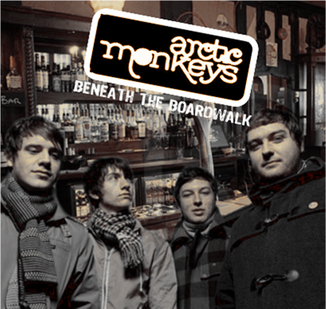

= Beneath The Boardwalk
Arctic Monkeys
2004
:toc:

link:../../links.html[Other albums]

== A Certain Romance

[verse]
____
Well oh they might wear classic Reeboks
Or knackered Converse
Or tracky bottoms tucked in socks
But all of that's what the point is not
The point is that there ain't no romance around there

And there's the truth that they can't see
They'd probably like to throw a punch at me
And if you could only see them, then you would agree
Agree that there ain't no romance around there

You know, oh, it's a funny thing, you know?
We'll tell them if you like
We'll tell them all tonight
They'll never listen
Because their minds are made up
And course it's all OK to carry on that way

'Cause over there there's broken bones
There's only music, so that there's new ringtones
And it don't take no Sherlock Holmes
To see it's a little different around here

Don't get me wrong though there's boys in bands
And kids who like to scrap with pool cues in their hands
And just 'cause he's had a couple of cans
He thinks it's alright to act like a dickhead

Don't you know, oh it's a funny thing you know
We'll tell them if you like
We'll tell them all tonight
They'll never listen
'Cause their minds are made up
And course is all OK to carry on that way
But I said no, oh no!
Well oh, you won't get me to go
Not anywhere, not anywhere
No, I won't go, oh no, no?

But over there there's friends of mine
What can I say, I've known them for a long long time
And yet they might overstep the line
But you just cannot get angry in the same way
No, not in the same way
No not in the same way
Oh no, oh no, no! 
____

== Bigger Boys And Stolen Sweethearts

[verse]
____
There's always somebody taller with more of a wit
And he's equipped to enthrall her and her friends think he’s fit
And you just can't measure up though, you don't have a prayer
Wishing that you'd made the most of her when she was there

They've got engaged there's no intention of a wedding
He's pinched your bird and he'd probably kick your head in

Bigger boys and stolen sweethearts
Oh, you’re better off without her anyway
You said you wasn't sad to see her go
Yeah, but I know you were though

Now you don't know what she's up to you can only assume
If she's not in the front of the shops then they've gone to his room
Bet she's gone 'round in her school stuff, bet that’s what he likes
I know you thought she were different and you thought she were nice

But she's not nice, she's pretty fucking far from nice
She’s looking at you funny rarely looking at you twice

Bigger boys and stolen sweethearts
Oh, you’re better off without her anyway
You said you wasn't sad to see her go
Yeah, but it's so clear you were though

Have you heard what she has been doing? Never did it for me
He picks her up at the school gate at twenty past three
She’s been with all of the boys but, never went very far
And she wagged English and science just to go in his car

They've got engaged there's no intention of a wedding
He's pinched me bird and he'd probably kick my head in
Oh now the girls have grown
Yeah but I'm sure that they still carry on in similar ways

Bigger boys and stolen sweethearts
Oh, I'm better off without her anyway
I said I wasn't sad to see her go
Yeah, but I'm only pretending, you know
Yeah, I'm only pretending, you know
I was only pretending, you know
I was only pretending, you know 
____

== Choo Choo

[verse]
____
My baby wants to drive the train
But don't you let her, don't you let her touch the tracks
I said my baby wants to drive the train
Well all aboard yeah, and don't forget to mind the gap
Don't you let her, don't you know
She's sick and tired of
Being in the background, the passenger
Let her drive the train, oh!

Choo Choo!
Why don't you let her drive the train?
Choo Choo!
Why don't you let her drive the train, yeah

She's setting off from platform four
Make your way down, we'll shut the door bout quarter to five
I said she's setting off from platform four
And they've decided that they're gonna let her drive

Don't you let her, don't you know
She's sick and tired of
Being in the background, the passenger
Let her drive the train, oh!

Choo Choo!
Why don't you let her drive the train, oh...
Choo Choo!
Why don't you let her drive my train, yeah

Choo Choo!
Choo Choo!
Choo Choo!
Choo Choo! 
____

== Cigarette Smoke

[verse]
____
Get out the way, mister
With your short sharp tips
No, I won't read your lips right now
And baby, hey
You send a shiver down my spine
But do you read my mind
Do you...
And you're looking pretty suspicious
And probably planning a heist
He's wanting to go to the strippers
It makes him feel all nice

(Cigarette smoke yeah)
The cigarette smoke in your eyes
Watching a stripper and
(Smacking a bloke yeah)
Smacking a bloke here tonight

Get out the way, mister
With your short sharp tips
No, I won't read your lips right now
And baby, hey
You send a shiver down my spine
But do you read my mind
Do you...

He's prob'ly got stopped by a panda
For speeding on his way there
...flashing of digital cameras
From tourists in trafalgar square

(Cigarette smoke yeah)
The cigarette smoke in your eyes
Watching a stripper and
(Snortin' some coke yeah)
Snortin' some coke off her thighs
Bla-bla-bla-bla-bla-bla...

(Cigarette smoke yeah)
The cigarette smoke in your eyes
Watching a stripper and
(Smacking a bloke yeah)
Smacking a bloke here tonight
And I just can't see for the
(Cigarette smoke yeah)
The cigarette smoke in your eyes
Watching a stripper and
(Snortin' some coke yeah)
Snortin' some coke off her thighs
Lalalalalala laaaaaaaoooo
Oww
____

== Dancing Shoes

[verse]
____
Get on your dancing shoes
There's one thing on your mind
Hoping they're looking for you
Sure you'll be rummaging through

And the shit, shock, horror
You've seen your future bride
Yeah, but it's oh so absurd
For you to say the first word
So you're waiting and waiting and

The only reason that you came
So what you scared for?
Why don't you always do the same?
It's what you're there for, don't you know?

...the lights are flashing
Down in here tonight
And some might exchange a glance
But keep pretending to dance

But don't act like it's not happening
As if it's impolite
To go and mention your name
Instead you'll just do the same
As they all do, and hope for the best...

The only reason that you came
So what you scared for?
Why don't you always do the same?
It's what you're there for but no

Get on your dancing shoes
You sexy little swine
Hoping they're looking for you
Sure you'll be rummaging through

And I said the shit, shock, horror
You've seen your future bride
Yeah, but it's oh so absurd
For you to say the first word
So you're waiting and waiting
____

== Fake Tales Of San Francisco

[verse]
____
Fake Tales of San Francisco
Echo through the room
More point to a wedding disco
Without a bride or groom

There's a super cool band yeah
With their trilbies and their glasses of white wine
And all the weekend rock stars in the toilets
Practicing their lines

I don't want to hear you
(Kick me out, kick me out)
I don't want to hear you no
(Kick me out, kick me out)
I don't want to hear you
(Kick me out, kick me out)
I don't want to hear you
I don't want to hear your

Fake Tales of San Francisco
Echo through the air
And there's a few bored faces at the back
All wishing they weren't there

And as the microphone squeaks
A young girl's telephone beeps
Yeah she's dashing for the exit
Oh, she's running to the streets outside
"Oh you've saved me," she screams down the line
"The band were fucking wank
And I'm not having a nice time"

I don't want to hear you
(Kick me out, kick me out)
I don't want to hear you no
(Kick me out, kick me out)
Yeah but his bird said it's amazing, though
So all that's left
Is the proof that love's not only blind but deaf

He talks of San Francisco, he's from Hunter's Bar
I don't quite know the distance
But I'm sure that's far
Yeah, I'm sure it's pretty far

Yeah, I'd love to tell you all my problem
You're not from New York City, you're from Rotherham
So get off the bandwagon, and put down the handbook
Yeah, yeah, yeah, yeah, yeah

Get off the bandwagon and put down the handbook
Get off the bandwagon and put down the handbook
Get off the bandwagon and put down the handbook
Get off the bandwagon and put down the handbook, yeah 
____

== Knock A Door Run

[verse]
____
Watch me... watch me go
Well I'm struttin' up ever so slow
And now sting me... get in the groove
Cause they're bangin' on the door
Yes they're hard and they'll make a move

We're wakin' up those sleepers
You know we're so mischievous
Just what you'll do to keep us entertained
We're wakin' up those sleepers
You know we're so mischievous
Just what you'll do to keep us entertained

(Knock, run)
She's got you up and she's run, run, runnin' away
(Knock, run)
You're knockin' first if you think that you're comin' to play

And I don't mind
Cause all the time you're talkin' at me
No I don't mind at all

Oh well cap-guns and polystyrene planes
Well I'm buyin' penny bubblies with my change
Cause sting me... get in the groove
Cause they're bangin' on the door
Yes they're hard and they'll make a move

We're wakin' up those sleepers
You know we're so mischievous
Just what you'll do to keep us entertained
Oh well now she says she's goin'
That she's got the towel to throw in
Was just about to blow him and run away!

(Knock, run)
She's got you up and she's run, run, runnin' away
(Knock, run)
You're knockin' first if you think that you're comin' to play

And I don't mind
Cause all the time you're talkin' at me
Well I don't mind at all... no 
____

== Mardy Bum

[verse]
____
Well now then Mardy Bum
I've seen your frown
And it's like looking down the barrel of a gun
And it goes off
And out come all these words
Oh there's a very pleasant side to you
A side I much prefer

It's one that laughs and jokes around
Remember cuddles in the kitchen
Yeah, to get things off the ground
And it was up, up and away
Oh, but it's right hard to remember
That on a day like today when you're all argumentative
And you've got the face on

Well now then Mardy Bum
Oh I'm in trouble again, aren't I?
I thought as much
Cause you turned over there
Pulling that silent disappointment face
The one that I can't bear

Well can't we just laugh and joke around
Remember cuddles in the kitchen
Yeah, to get things off the ground
And it was up, up and away
Oh, but it's right hard to remember
That on a day like today when you're all argumentative
And you've got the face on

And yeah I'm sorry I was late
But I missed the train
And then the traffic was a state
And I can't be arsed to carry on in this debate that reoccurs,
Oh, when you say I don't care
But of course I do, yeah, I clearly do!

So laugh and joke around
Remember cuddles in the kitchen
Yeah, to get things off the ground
And it was up, up and away
Oh, but it's right hard to remember
That on a day like today when you're all argumentative
And you've got the face on 
____

== On The Run From The MI5

[verse]
____
Come and take a leaf out of my book
I'm a crack dealing crook
Selling lots of rock and roll to the masses
And I know if you wanna take a trip to the city
We can go (to Gibraltar)
We can go (to Gibraltar)

Let's go, let's go, let's go, come on
Come on, come on, come on, come on
Let's go, let's go, let's go, come on

Give me your switch card - I'll book some flights

1996 And I'm stuck at the bottom of a truck
Got the road right in my..., got detectives
And I'll say if you catch me that I really wish
That I had stayed (in Gibraltar)
That I had stayed (in Gibraltar)

Let's go, let's go, let's go, come on
Come on, come on, come on, come on
Let's go, let's go, let's go, come on

Give me your switch card - I'll book some flights
____

== Riot Van (Demo)

[verse]
____
We got thrown in a riot van
And the coppers kicked him in
And there was no way he could win
Just had to take it on the chin

Smoked a bong a last night
And stole somebody's telephone
He thinks it's all alright
But they've left him on his own, on his own

But baby stop calling
Over and over yeah
And give me some funny cigarettes
And do what they told you, yeah

Pinched a car with one headlight
And lost control the passengers were screaming
Made him shut his eyes right tight
And think of you, and hope that he was dreaming

Then up rolled the riot van
And called the fire brigade
But it was already too late
And there was no arrests to make
Ohhhhh!

But baby stop calling
Over and over yeah
And give me some funny cigarettes
And do what they told you, yeah 
____

== Scummy

[verse]
____
So who's that girl there?
I wonder what went wrong
So that she had to roam the streets
She don't do major credit cards
I doubt she does receipts
It's all not quite legitimate

And what a scummy man
Just give him half a chance
I bet he'll rob you if he can
Can see it in his eyes, yeah
That he's got a driving ban
Amongst some other offences

And I've seen him with girls of the night
And he told Roxanne to put on her red light
They're all infected but he'll be alright
Cause he's a scumbag, don't you know
I said he's a scumbag, don't you know!

Although you're trying not to listen
I bet your eyes are staring at the ground
She makes a subtle proposition
Sorry love I'll have to turn you down

And oh he must be up to something
Want half a chance to show he's more than likely
I've got a feeling in my stomach
I start to wonder what his story might be
What his story might be

They said it changes when the sun goes down
And they said it changes when the sun goes down
And they said it changes when the sun goes down
Around here
Around

And look here comes a Ford Mondeo
Isn't he Mister Inconspicuous
And he don't have to say 'owt
She understands she's here to get picked up

And she's delighted when she sees him
Pulling in and giving her the eye
Because she must be fucking freezing
Scantily clad beneath the clear night sky
She don't stop in the winter, no and...

They said it changes when the sun goes down
And they said it changes when the sun goes down
And they said it changes when the sun goes down
Around here

They said it changes when the sun goes down
And they said it changes when the sun goes down
And they said it changes when the sun goes down
Around here
Around here

What a scummy man
Just give him half a chance
I bet he'll rob you if he can
Can see it in his eyes that he's got a nasty plan
I hope you're not involved at all
____

== Still Take You Home

[verse]
____
Well, it's ever so funny
'Cause I don't think you're special, I don't think you're cool
You're just probably alright
But under these lights you look beautiful
And I'm struggling
I can't see through your fake tan
Yeah, and you know it for a fact
That everybody's eating out of your hands

But what do you know?
Oh, you know nothing
Yeah, but I'll still take you home
Oh, yeah, I'll still take you home
So what do you know?
Said you don't know nothing

Well, fancy seeing you in here
You're all tarted up and you don't look the same
Well, I haven't seen you since last year
Yeah, surprisingly you have forgotten my name
But you know it
Yeah, and you knew it all along
Oh, and you say you have forgotten
But you're fibbing, go on, tell me I'm wrong

So what do you know?
Oh, you know nothing
Yeah, but I'll still take you home
Oh, yeah, I'll still take you home
So what do you know?
Oh, you don't know nothing, no

So what do you know?
Yeah, you don't know nothing
Yeah, but I'll still take you home
Oh, yeah, I'll still take you home
I said what do you know?
Oh, you don't know nothing, no

I fancy you with a passion
You're a Topshop princess, a rockstar too
But you're a fad, you're a fashion
And I'm having a job trying to talk to you
But it's alright
Yeah, I'll put it on one side
'Cause everybody's looking
You've got control of everyone's eyes, including mine
____

== Wavin' Bye To The Train Or The Bus

[verse]
____
Oh baby, I'm wanting to do you a swap
I'll give you anything, yeah
In return for the noises you've got
And I can see you want to be attended to
Just count to twenty-nine and I'll attend to you
Oh for sure... well certainly, yeah yeah yeah

Wavin' bye to the train or the bus
I'm ever so worried because...
I don't want to get all forgotten...

So very comfortable..
Don't really need to put up my feet,
And even in fat sam's grand slam,
Can't see it being easier to speak.
when you've karate-kicked your way to someone new
And I'm a memory and don't know what to do
All on his own...
Collecting his dole n' stuff

Wavin' bye to the train or the bus
I'm ever so worried because...
I don't want to get all forgotten...
Cause we know
Yeah, we know-oh-oh-oh
Oh we know, a woah-oh-oh

Don't know where we're going, baby
I s'pose it depends
But even if we're all far apart
We can all come back and all be fine
We'll be able to be together again

Be together again
Be together again
Be together again
...
Everybody will be together again!
____

== I Bet You Look Good On The Dancefloor

[verse]
____
Stop making the eyes at me,
I'll stop making my eyes at you.
What it is that surprises me
Is that I don't really want you to

And your shoulders are frozen (as cold as the night)
Oh, but you're an explosion (you're dynamite)
Your name isn't Rio, but I don't care for sand and lighting
The fuse might result in a bang b-b-bang-go

I bet that you look good on the dance floor
I don't know if you're looking for romance or...
I don't know what you're looking for
I said I bet that you look good on the dance floor
Dancing to electro-pop like a robot from 1984
Well, from 1984!

I wish you'd stop ignoring me
Because it's sending me to despair,
Without a sound yeah you're calling me
And I don't think it's very fair

That your shoulders are frozen (cold as the night)
Oh, but you're an explosion (you're dynamite)
Your name isn't Rio, but I don't care for sand and lighting
The fuse might result in a bang, b-b-bang-go

I bet that you look good on the dance floor
I don't know if you're looking for romance or...
I don't know what you're looking for
I said I bet that you look good on the dance floor
Dancing to electro-pop like a robot from 1984
Well, from 1984!

Oh, there ain't no love, no Montagues or Capulets
Are just banging tunes and DJ sets
And dirty dance floors, and dreams of naughtiness!

Well, I bet that you look good on the dance floor
I don't know if you're looking for romance or...
I don't know what you're looking for
I said I bet that you look good on the dance floor
Dancing to electro-pop like a robot from 1984
Said, from 1984!
____

== Stickin' To The Floor

[verse]
____
Won't somebody let me out?
Don't want to stick around no more
Sick of looking at you strange
Sick of sticking to the floor

Not one of you has got an ounce of style in ya
Said not one of you, no

Well fuck it all and break your nose
If they keep on pushing you around
If they keep on stepping on your toes
And pick you up when you fall down

Not one of you has got an ounce of style in ya
Said not one of you, no

Not one of you has got an ounce of style in ya, no
Said not one of you, no 
____

== Space Invaders

[verse]
____
Space invaders flying home
Yeah, they're going to hit the sack
And they are prob'ly going to die getting high
Cause they're mixing crazy moments with the crack
And she's kissing all the boys
She's to clever to be slack
But she's bound to go away for a day
In July, so she won't be coming back

Baby, baby, baby
The good old days have died
Baby, baby, baby
Now won't you dry your pretty eyes
Baby, baby, baby
Your good old days are taxed
So come on!

Spot big bell bottom chords
And a matching with a hat
And you're a rule breaker, baby
Can't you see me standing
Only in your way to hit the sack?

And she's kissing all the boys
She's to clever to be slack
But she's bound to go away for a day
In July, so she won't be coming back

Baby, baby, baby
Your good old days have died
Baby, baby, baby
Won't you dry your pretty eyes
Baby, baby, baby
Your good old days are taxed
So come on! 
____

== Curtains Closed

[verse]
____
I so wanted it long but she cut it short
And now I'm catching a cold
I told you not but no crack in the doobie
But it was already rolled

Oh, I turned down my lights
And my curtains weren't closed
I turned down my lights
And my curtains weren't closed
Oh well, I turned down my lights
And my curtains weren't closed last night
Oh baby, I must be mad

Well, I don't care about your massage oils
It's got my skin going red
Cause I'm a mad mother-fucker
With my curtains open
Sitting tucked up in bed

I turned down my lights
And my curtains weren't closed
I turned down my lights
And my curtains weren't closed
Oh well, I turned down my lights
And my curtains weren't closed last night
Oh baby, I must be mad

I turned down my lights
And my curtains weren't closed
Oh well, I turned down my lights
And my curtains weren't closed
Oh yeah, well I turned down my lights
And my curtains weren't closed last night
Oh baby, I must be mad 
____

== Ravey Ravey Ravey Club

[verse]
____
She's the victim, well fuck all that we ain't goin home today
And she's been too much magic beans to walk all men away
And she's been eatin' too much magic beans to walk all men away
Put up your picture and the playful love will get around
Yeah but we'll get around yeah
Yeah but we'll get around

Well everyones felling alright
I won't be sleeping today
No I won't be sleeping tonight

We're felling silly, I'm feeling oh so sick
And I can't see you through the smoke because the clouds so thick
And theres a fire as your dancing to the disco sound
Put up your picture baby and love will get around
Yeah but we'll get around yeah
But yeah we'll get around

Everyone's feeling alright
I won't be sleeping today
And I won't be sleeping tonight 
____
