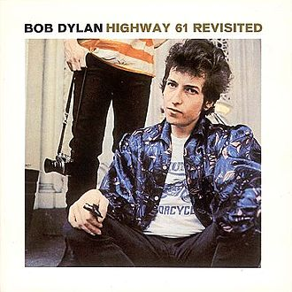

= Highway 61 Revisited
Bob Dylan
1965
:toc:

From https://www.azlyrics.com/d/dylan.html

== Like A Rolling Stone

[verse]
____
Once upon a time you dressed so fine
You threw the bums a dime in your prime, didn't you?
People'd call, say, "Beware doll, you're bound to fall"
You thought they were all kiddin' you
You used to laugh about
Everybody that was hangin' out
Now you don't talk so loud
Now you don't seem so proud
About having to be scrounging for your next meal

How does it feel?
How does it feel
To be without a home
Like a complete unknown
Like a rolling stone?

You've gone to the finest school all right, Miss Lonely
But you know you only used to get juiced in it
And nobody's ever taught you how to live out on the street
And now you're gonna have to get used to it
You said you'd never compromise
With the mystery tramp, but now you realize
He's not selling any alibis
As you stare into the vacuum of his eyes
And say do you want to make a deal?

How does it feel?
How does it feel
To be on your own
With no direction home
A complete unknown
Like a rolling stone?

You never turned around to see the frowns on the jugglers and the clowns
When they all did tricks for you
You never understood that it ain't no good
You shouldn't let other people get your kicks for you
You used to ride on the chrome horse with your diplomat
Who carried on his shoulder a Siamese cat
Ain't it hard when you discover that
He really wasn't where it's at
After he took from you everything he could steal

How does it feel?
How does it feel
To be on your own
With no direction home
Like a complete unknown
Like a rolling stone?

Princess on the steeple and all the pretty people
They're all drinkin', thinkin' that they got it made
Exchanging all precious gifts
But you'd better take your diamond ring, you'd better pawn it babe
You used to be so amused
At Napoleon in rags and the language that he used
Go to him now, he calls you, you can't refuse
When you ain't got nothing, you got nothing to lose
You're invisible now, you got no secrets to conceal

How does it feel
How does it feel
To be on your own
With no direction home
Like a complete unknown
Like a rolling stone? 
____

== Tombstone Blues

[verse]
____
The sweet pretty things are in bed now of course
The city fathers they're trying to endorse
The reincarnation of Paul Revere's horse
But the town has no need to be nervous.

The ghost of Belle Starr she hands down her wits
To Jezebel the nun she violently knits
A bald wig for Jack the Ripper who sits
At the head of the chamber of commerce.

Mama's in the fact'ry
She ain't got no shoes
Daddy's in the alley
He's lookin' for food
I'm in the kitchen
With the tombstone blues.

The hysterical bride in the penny arcade
Screaming she moans, "I've just been made."
Then sends out for the doctor who pulls down the shade
And says, "My advice is to not let the boys in."

Now the medicine man comes and he shuffles inside
He walks with a swagger and he says to the bride
"Stop all this weeping, swallow your pride.
You will not die, it's not poison."

Mama's in the fact'ry
She ain't got no shoes
Daddy's in the alley
He's lookin' for food
I'm in the kitchen
With the tombstone blues.

Well, John the Baptist after torturing a thief
Looks up at his hero the Commander-in-Chief
Saying, "Tell me great hero, but please make it brief
Is there a hole for me to get sick in?"
The Commander-in-Chief answers him while chasing a fly
Saying, "Death to all those who would whimper and cry."
And dropping a bar bell he points to the sky
Saying, "The sun's not yellow it's chicken."

Mama's in the fact'ry
She ain't got no shoes
Daddy's in the alley
He's lookin' for food
I'm in the kitchen
With the tombstone blues.

The king of the Philistines his soldiers to save
Puts jawbones on their tombstones and flatters their graves
Puts the pied pipers in prison and fattens the slaves
Then sends them out to the jungle.

Gypsy Davey with a blowtorch he burns out their camps
With his faithful slave Pedro behind him he tramps
With a fantastic collection of stamps
To win friends and influence his uncle.

Mama's in the fact'ry
She ain't got no shoes
Daddy's in the alley
He's lookin' for food
I'm in trouble
With the tombstone blues.

The geometry of innocent flesh on the bone
Causes Galileo's math book to get thrown
At Delilah who's sitting worthlessly alone
But the tears on her cheeks are from laughter.

I wish I could give Brother Bill his great thrill
I would set him in chains at the top of the hill
Then send out for some pillars and Cecil B. DeMille
He could die happily ever after.

Mama's in the fact'ry
She ain't got no shoes
Daddy's in the alley
He's lookin' for food
I'm in the kitchen
With the tombstone blues.

Where Ma Raney and Beethoven once unwrapped their bed roll
Tuba players now rehearse around the flagpole
And the National Bank at a profit sells road maps for the soul
To the old folks' home in the college.

I wish I could write you a melody so plain
That could hold you, dear lady, from going insane
That could ease you and cool you and cease the pain
Of your useless and pointless knowledge

Mama's in the fact'ry
She ain't got no shoes
Daddy's in the alley
He's lookin' for food
I'm in the kitchen
With the tombstone blues.

Alright! 
____

== It Takes A Lot To Laugh It Takes A Train To Cry

[verse]
____
Well, I ride on a mailtrain, babe
Can't buy a thrill
Well, I've been up all night
Leanin' on the window sill
Well, if I die
On top of the hill
And if I don't make it
You know my baby will

Don't the moon look good, mama
Shinin' through the trees?
Don't the brakeman look good, mama
Flagging down the "Double E"?
Don't the sun look good
Goin' down over the sea?
Don't my gal look fine
When she's comin' after me?

Now the wintertime is coming
The windows are filled with frost
I went to tell everybody
But I could not get across
Well, I wanna be your lover, baby
I don't wanna be your boss
Don't say I never warned you
When your train gets lost 
____

== From A Buick 6

[verse]
____
I got this graveyard woman, you know she keeps my kids
But my soulful mama, you know she keeps me hid
She's a junkyard angel and she always gives me bread
Well, if I go down dyin' you know she bound to put a blanket on my bed

Well, when the pipeline gets broken and I'm lost on the river bridge
I'm all cracked up on the highway and on the water's edge
She comes down the thruway ready to sew me up with the thread
Well, if I go down dyin' you know she bound to put a blanket on my bed

Well, she don't make me nervous, she don't talk too much
She walks like Bo Diddley and she don't need no crutch
She keeps this four-ten all loaded with lead
Well, if I go down dyin' you know she bound to put a blanket on my bed

Well, you know I need a steam shovel mama to keep away the dead
I need a dump truck baby to unload my head
She brings me everything and more, and just like I said
Well, if I go down dyin' you know she bound to put a blanket on my bed 
____

== Ballad Of A Thin Man

[verse]
____
You walk into the room
With your pencil in your hand
You see somebody naked
And you, you say, "Who is that man?"
You try so hard
But you don't understand
Just what you will say
When you get home

Because something is happening here
But you don't know what it is
Do you, Mister Jones?

You raise up your head
And you ask, "Is this where it is?"
And somebody points to you and says
"It's his"
And you say, "What's mine?"
And somebody else says, "Well what is?"
And you say, "Oh my God
Am I here all alone?"

But something is happening
And you don't know what it is
Do you, Mister Jones?

You hand in your ticket
And you go watch the geek
Who immediately walks up to you
When he hears you speak
And says, "How does it feel
To be such a freak?"
And you say, "Impossible"
As he hands you a bone

And something is happening here
But you don't know what it is
Do you, Mister Jones?

You have many contacts
Among the lumberjacks
To get you facts
When someone attacks your imagination
But nobody has any respect
Anyway they already expect you
To all give a check
To tax-deductible charity organizations
You've been with the professors
And they've all liked your looks
With great lawyers you have
Discussed lepers and crooks
You've been through all of
F. Scott Fitzgerald's books
You're very well read
It's well known

But something is happening here
And you don't know what it is
Do you, Mister Jones?

Well, the sword swallower, he comes up to you
And then he kneels
He crosses himself
And then he clicks his high heels
And without further notice
He asks you how it feels
And he says, "Here is your throat back
Thanks for the loan"

And you know something is happening
But you don't know what it is
Do you, Mister Jones?

Now you see this one-eyed midget
Shouting the word "NOW"
And you say, "For what reason?"
And he says, "How?"
And you say, "What does this mean?"
And he screams back, "You're a cow
Give me some milk
Or else go home"

And you know something's happening
But you don't know what it is
Do you, Mister Jones?

Well, you walk into the room
Like a camel and then you frown
You put your eyes in your pocket
And your nose on the ground
There ought to be a law
Against you comin' around
You should be made
To wear earphones

'Cause something is happening
And you don't know what it is
Do you, Mister Jones? 
____

== Queen Jane Approximately

[verse]
____
When your mother sends back all your invitations
And your father to your sister he explains
That you're tired of yourself and all of your creations
Won't you come see me, Queen Jane ?
Won't you come see me, Queen Jane ?

Now when all of the flower ladies want back what they have lent you
And the smell of their roses does not remain
And all of your children start to resent you
Won't you come see me, Queen Jane ?
Won't you come see me, Queen Jane ?

Now when all the clowns that you have commissioned
Have died in battle or in vain
And you're sick of all this repetition
Won't you come see me, Queen Jane ?
Won't you come see me, Queen Jane ?

When all of your advisers heave their plastic
At your feet to convince you of your pain
Trying to prove that your conclusions should be more drastic
Won't you come see me, Queen Jane ?
Won't you come see me, Queen Jane ?

Now when all of the bandits that you turned your other cheek to
All lay down their bandanas and complain
And you want somebody you don't have to speak to
Won't you come see me, Queen Jane ?
Won't you come see me, Queen Jane ? 
____

== Highway 61 Revisited

[verse]
____
Oh God said to Abraham, "Kill me a son"
Abe says, "Man, you must be puttin' me on"
God say, "No." Abe say, "What?"
God say, "You can do what you want Abe, but
The next time you see me comin' you better run"
Well Abe says, "Where you want this killin' done?"
God says. "Out on Highway 61"

Well Georgia Sam he had a bloody nose
Welfare Department they wouldn't give him no clothes
He asked poor Howard where can I go
Howard said there's only one place I know
Sam said tell me quick man I got to run
Ol' Howard just pointed with his gun
And said that way down on Highway 61

Well Mack the finger said to Louie the King
I got forty red white and blue shoe strings
And a thousand telephones that don't ring
Do you know where I can get rid of these things
And Louie the King said let me think for a minute son
And he said yes I think it can be easily done
Just take everything down to Highway 61

Now the fifth daughter on the twelfth night
Told the first father that things weren't right
My complexion she said is much too white
He said come here and step into the light he says hmmm you're right
Let me tell second mother this has been done
But the second mother was with the seventh son
And they were both out on Highway 61

Now the rowin' gambler he was very bored
He was tryin' to create a next world war
He found a promoter who nearly fell off the floor
He said I never engaged in this kind of thing before
But yes I think it can be very easily done
We'll just put some bleachers out in the sun
And have it on Highway 61
____

== Just Like Tom Thumb's Blues

[verse]
____
When you're lost in the rain in Juarez
And it's Eastertime too
And your gravity fails
And negativity don't pull you through
Don't put on any airs
When you're down on Rue Morgue Avenue
They got some hungry women there
And they really make a mess outa you.

Now if you see Saint Annie
Please tell her thanks a lot
I cannot move
My fingers are all in a knot
I don't have the strength
To get up and take another shot
And my best friend, my doctor
Won't even say what it is I've got.

Sweet Melinda
The peasants call her the goddess of gloom
She speaks good English
And she invites you up into her room
And you're so kind
And careful not to go to her too soon
And she takes your voice
And leaves you howling at the moon.

Up on Housing Project Hill
It's either fortune or fame
You must pick up one or the other
Though neither of them are to be what they claim
If you're lookin' to get silly
You better go back to from where you came
Because the cops don't need you
And man they expect the same.
Now all the authorities
They just stand around and boast
How they blackmailed the sergeant-at-arms
Into leaving his post
And picking up Angel who
Just arrived here from the coast
Who looked so fine at first
But left looking just like a ghost.

I started out on burgundy
But soon hit the harder stuff
Everybody said they'd stand behind me
When the game got rough
But the joke was on me
There was nobody even there to bluff
I'm going back to New York City
I do believe I've had enough.
____

== Desolation Row

[verse]
____
They're selling postcards of the hanging
They're painting the passports brown
The beauty parlor is filled with sailors
The circus is in town
Here comes the blind commissioner
They've got him in a trance
One hand is tied to the tight-rope walker
The other is in his pants
And the riot squad they're restless
They need somewhere to go
As Lady and I look out tonight
From Desolation Row.

Cinderella, she seems so easy
"It takes one to know one," she smiles
And puts her hands in her back pockets
Bette Davis style
And in comes Romeo, he's moaning,
"You belong to Me I Believe."
And someone says, "You're in the wrong place, my friend
You'd better leave."
And the only sound that's left
After the ambulances go
Is Cinderella sweeping up
On Desolation Row.

Now the moon is almost hidden
The stars are beginning to hide
The fortune-telling lady
Has even taken all her things inside
All except for Cain and Abel
And the hunchback of Notre Dame
Everybody is making love
Or else expecting rain
And the Good Samaritan, he's dressing
He's getting ready for the show
He's going to the carnival tonight
On Desolation Row.

Ophelia, she's 'neath the window
For her I feel so afraid
On her twenty-second birthday
She already is an old maid
To her, death is quite romantic
She wears an iron vest
Her profession's her religion
Her sin is her lifelessness
And though her eyes are fixed upon
Noah's great rainbow
She spends her time peeking
Into Desolation Row.

Einstein, disguised as Robin Hood
With his memories in a trunk
Passed this way an hour ago
With his friend, a jealous monk
NOW, he looked so immaculately frightful
As he bummed a cigarette
Then he went off sniffing drainpipes
And reciting the alphabet
You would not think to look at him
But he was famous long ago
For playing the electric violin
On Desolation Row.

Dr. Filth, he keeps his world
Inside of a leather cup
But all his sexless patients
They ARE trying to blow it up
Now his nurse, some local loser
She's in charge of the cyanide hole
And she also keeps the cards that read
"Have Mercy on His Soul"
They all play on the penny whistle
You can hear them blow
If you lean your head out far enough

From Desolation Row.
Across the street they've nailed the curtains
They're getting ready for the feast
The Phantom of the Opera
In a perfect image of a priest
They are spoon-feeding Casanova
To get him to feel more assured
Then they'll kill him with self-confidence
After poisoning him with words
And the Phantom's shouting to skinny girls
"Get outta here if you don't know"
Casanova is just being punished for going
To Desolation Row.

At midnight all the agents
And the superhuman crew
Come out and round up everyone
That knows more than they do
Then they bring them to the factory
Where the heart-attack machine
Is strapped across their shoulders
And then the kerosene
Is brought down from the castles
By insurance men who go
Check to see that nobody is escaping
To Desolation Row.

Praise be to Nero's Neptune
The Titanic sails at dawn
Everybody's shouting
"Which side are you on?"
And Ezra Pound and T. S. Eliot
Fighting in the captain's tower
While calypso singers laugh at them
And fishermen hold flowers
Between the windows of the sea
Where lovely mermaids flow
And nobody has to think too much
About Desolation Row.

Yes, I received your letter yesterday
About the time the door knob broke
When you asked me how I was doing
Or was that some kind of joke?
All these people that you mention
Yes, I know them, they're quite lame
I had to rearrange their faces
And give them all another name
Right now I can't read too good
Don't send me no more letters no
Not unless you mail them
From Desolation Row. 
____s
