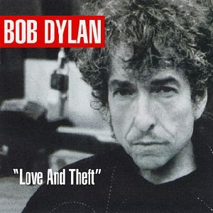

= Love And Theft
Bob Dylan
2001
:toc:

link:../../links.html[Other albums]

++++
 
++++	

== Tweedle Dee And Tweedle Dum

[verse]
____
Tweedle Dum and Tweedle Dee
They're throwin' knives into the tree
Two big bags of dead man's bones
Got their noses to the grind stone
Livin' in the Land of Nod
Trustin' their fate to the hands of God
They pass by so silently
Tweedle Dum and Tweedle Dee

Well, they're goin' to the country, they're goin' to retire
They're takin' a streetcar named Desire
Lookin' at a window with a pecan pie
Lot of things they'd like they would never buy
Neither of them .want. to turn and run
They're makin' a noise to the Sun
"His Master's Voice is calling me"
Said Tweedle Dum to Tweedle Dee

Tweedle Dee and Tweedle Dum
I'll have more than thumb
They walk among the stately trees
They know the secrets of the breeze
Tweedle Dum said to Tweedle Dee,
"Your presence is obnoxious to me.
Feel like baby sittin' on a woman's knee."
Tweedle Dum and Tweedle Dee

Well, the rain beat'n' down on a window pane
I got love for you, and it's all in vain
Brains in a pot, they're beginning to boil
They're drippin' with garlic and olive oil
Tweedle Dee is on his hands and his knees
Sayin', "Throw me something, Mister, please!"
"What's good for you is good for me,"
Said Tweedle Dum to Tweedle Dee.

Well, they're living in a happy harmony
Tweedle Dum and Tweedle Dee
They're one day older and a dollar short
They got a prayer permit and a police escort
They're lyin' low and they're makin' hay
They seem determined to go all the way
They run a brick 'n' tile company
Tweedle Dum and Tweedle Dee

Well, the timeless stream has a deaf last meal
And the noble truth is a sacred creed
My pretty baby, she's looking around
She's wearin' a multi-thousand dollar gown
Tweedle Dee is a low down sorry old man
Tweedle Dum he'll stab you where you stand
"I've had too much of your company,"
said Tweedle Dum to Tweedle Dee. 
____

== Mississippi

[verse]
____
Every step of the way, we walk the line
Your days are numbered, so are mine
Time is piling up, we struggle and we stray
We're all boxed in, nowhere to escape

City's just a jungle, more games to play
Trapped in the heart of it, tryin' to get away
I was raised in the country, I been working in the town
I been in trouble ever since I set my suitcase down

Got nothing for you, I had nothing before
Don't even have anything for myself anymore
Sky full of fire, came pouring down
Nothing you can sell me, I'll see you around

All my powers of expression and thoughts so sublime
Could never do you justice in reason or rhyme
Only one thing I did wrong
Stayed in Mississippi a day too long

Well, the devil's in the alley, mule's in the stall
Say anything you wanna, I have heard it all
I was thinking about the things that Rosie said
I was dreaming I was sleeping in Rosie's bed

Walking through the leaves, falling from the trees
Feeling like a stranger nobody sees
So many things that we never will undo
I know you're sorry, I'm sorry too

Some people will offer you their hand and some won't
Last night I knew you, tonight I don't
I need something strong to distract my mind
I'm gonna look at you 'til my eyes go blind

Well I got here following the southern star
I crossed that river just to be where you are
Only one thing I did wrong
Stayed in Mississippi a day too long

Well my ship's been split to splinters and it's sinking fast
I'm drowning in the poison, got no future, got no past
But my heart is not weary, it's light and it's free
I've got nothing but affection for all those who sailed with me

Everybody's moving, if they ain't already there
Everybody's got to move somewhere
Stick with me baby, stick with me anyhow
Things should start to get interesting right about now

My clothes are wet, tight on my skin
Not as tight as the corner that I painted myself in
I know that fortune is waiting to be kind
So give me your hand and say you'll be mine

Well, the emptiness is endless, cold as the clay
You can always come back, but you can't come back all the way
Only one thing I did wrong
Stayed in Mississippi a day too long. 
____

== Summer Days

[verse]
____
Summer days, summer nights are gone
Summer days and summer nights are gone
I know a place where there's still somethin' going on

I've got a house on the hill, I got hogs out in the mud
I've got a house on the hill, I got hogs all out in the mud
I've got a long haired woman, she got royal Indian blood

Everybody get ready, lift up your glasses and sing
Everybody get ready, lift up your glasses and sing
Well I'm standin' on the table, I'm proposin' a toast to the king

I'm driving in the flats in a Cadillac car
The girls all say "You're a worn out star"
My pockets are loaded, and I'm spending every dime
How can you say you love someone else,
you know it's me all the time

Well the fog's so thick you can't spy the land
Well the fog's so thick that you can't even spy the land
what good are you anyway if you can't stand up to some old businessman

Weddin' bells are ringin' and the choir is beginning to sing
Yes, the weddin' bells are ringin' and the choir's beginning to sing
What looks good in the day, at night is another thing

She's looking in to my eyes, and she's a-holding my hand
She looks in to my eyes, she's holding my hand
she say, "you can't repeat the past,"
I say "You can't? What do you mean you can't?
Of course you can."

Where do you come from, where do you go?
Sorry, that is nothing you would need to know
Well, my back's been to the wall so long it seems like it's stuck
Why don't you break my heart one more time, just for good luck

I got eight carburators and boys I'm usin' 'em all
well, I got eight carburators and boys I'm usin' 'em all
I'm short on gas, my motor's startin' to stall

My dogs are barking, there must be someone around
My dogs are barking, there must be someone around
I got my hammer ringin' pretty baby, but the nails ain't goin' down

If you got something to say, speak or hold your peace
Well, if you got something to say, speak now or hold your peace
If it's information you want, you can get it from the police

Politician's got on his joggin' shoes
he must be runnin' for office, got no time to lose
suckin' the blood out of the genius of generosity
you been rollin' your eyes, you been teasin' me

Standin' by God's river my soul's beginning to shake
Standin' by God's river my soul's beginning to shake
I'm countin' on you, love, to gimme a break

I'm leaving in the morning, as soon as the dark clouds lift
I'm leaving in the morning, as soon as the dark clouds lift
I'm breakin' the roof, set fire to the place as a partin' gift

Summer days, summer nights are gone
Summer days, summer nights are gone
I know a place where there's still something goin' on. 
____

== Bye And Bye

[verse]
____
By and by, I'm breathin' a lover's sigh
While I'm sittin' on my watch so I can be on time
I'm singin' love's praises with sugar coated rhyme
By and by, on you I'm castin' my eye
I'm paintin' the town, swingin' my partner around
Well I know who I can depend on, I know who to trust
I'm watchin' the boats, I'm studyin' the dust

I'm paintin' the town, makin' my last go-round
While I'm scufflin' and I'm shufflin' and I'm walkin' on briars
I'm not even aquainted with my old desires
I'm rollin' slow, I'm doin' all I know
I'm tellin' myself I've found true happiness
That I still got a dream that hasn't been repossessed
I'm rollin' slow goin' where the wild roses grow

Well, the future is already a thing of the past
You were my first love and you will be my last
Papa gone mad, Mama she's feelin' sad
Well, I'm gonna baptize you in fire so you can sin no more
I wanna establish my rule through civil war
Gonna make you see just how loyal and true a man can be.
____

== Lonesome Day Blues

[verse]
____
Well, today has been a sad and lonesome day
Yeah, today has been a sad and lonesome day
I'm just sitting here thinking with my mind a million miles away

Well, they're doing the double shuffle, throwing sand on the floor
They're doing the double shuffle, they're throwing sand on the floor
When I left my longtime darling, she was standing in the door

Well, my pa he died and left me, my brother got killed in the war
Well, my pa he died and left me, my brother got killed in the war
My sister she ran off and got married, never was heard of anymore

Samantha Brown lived in my house for 'bout four or five months
Samantha Brown lived in my house for 'bout four or five months
Don't know how it looked to other people, I never slept with her even once

Well the road washed out, weather not fit for man or beast
Well the road washed out, weather not fit for man or beast
Funny, the things you have the hardest time parting with, are the things you need the least

Well, I'm forty miles from the mill, I'm dropping it into overdrive
I'm forty miles from the mill, I'm dropping it into overdrive
Set my dial on the radio, I wish my mother was still alive

I seen your lover-man coming, coming across the barren fields
I see your lover-man coming, coming across the barren fields
He not a gentleman at all, he's rotten to the core, he's a coward and he's
steel

Well my captain he's decorated, he's well-schooled and he's skilled
My captain he's decorated, he's well-schooled and he's skilled
He's not sentimental, don't bother him at all; how many of his pals have been killed.

Last night the wind was whispering, I was trying to make out what it was
Last night the wind was whispering something, I was trying to make out what it was

Yeh I tell myself something's coming, but it never does

I'm going to spare the defeated, I'm going to speak to the crowd
I'm going to spare the defeated, 'cause I'm going to speak to the crowd
I'm going to teach peace to the conquered, I'm going to tame the proud

Well, the leaves are rustling in the wood, things are falling off of the shelf
Leaves are rustling in the wood, things are falling off the shelf
You're gonna need my help sweetheart, you can't make love all by yourself.
____

== Floater

[verse]
____
Down over the window
From the dazzling sunlit rays
through the back alleys, through the blinds
another one of them endless days

Honey bees are buzzing
leaves begin to stir
I'm in love with my second cousin
I tell myself I could be happy forever with her

I keep listening for footsteps
but I ain't never hearing any
from the boat, I fish for bullheads
I catch a lot, sometimes too many

A summer breeze is blowin'
a squall is setting in
sometimes it's just plain stupid
to get into any kind of wind

Well the old men 'round here
sometimes they get on bad terms
with the younger men,
old, young, age don't carry weight
it doesn't matter in the end

One of the boss' hangers-on
Sometimes comes to call
At times you least expect
Tryin' to bully you, strongarm you,
inspire you with fear
It has the opposite effect

There's a new grove of trees on the outskirts of town
the old one is long gone
10 foot, 2 foot, 6 across
Burns with the bark still on

They say times are hard
if you don't believe it you can follow your nose
it don't bother me, times are hard anywhere
we'll just have to see how it goes

My old man, he's like some feudal lord
he's got more lives than a cat
I've never seen him quarrel with my mother even once
things come alive or they fall flat

You can smell the pine wood burnin'
you can hear the school bell ring
got to get up near the teacher, if you can
if you wanna learn anything

Romeo, he said to Juliet, you got a poor complexion
it don't give you an appearance or a youthful touch
Juliet said back to Romeo,
why don't you just shove off,
if it bothers you so much

They got outta here any way they could
Cold rain can give you the shivers
they went down the Ohio, the Cumberland, the Tennessee,
all the rest of them rebel rivers

If you ever try to interfere with me
or cross my path again,
you do so at the peril of your life
I'm not quite as cool, or forgiving as I sound
I've seen enough heartache and strife

My grandfather was a duck trapper,
he could do it with just dragnets and ropes (?)
my grandmother could sew new dresses out of old cloth,
I don't know if they had any dreams or hopes.

I had 'em once, though I suppose
To go along with all the ring dancing,
Christmas carols and all the Christmas eves
I left all my dreams and hopes
buried under tobacco leaves

Not always easy kicking someone up
got to wait awhile, it can be an unpleasant task
sometimes somebody wants you to give something up
And tears or not, it's too much to ask.
____

== Highwater

For Charlie Patton

[verse]
____
Highwater risin', rising night and day
All the gold and silver are being stolen away
Big Joe Turner looking east and west from the dark room of his mind
He made it to Kansas City, Twelfth Street and Vine
Nothin' standing there
Highwater everywhere

Highwater rising the shacks are sliding down
Folks lose their possessions, the folks are leaving town
Reformation shook it, broke it, then she hung it on the wall
Say you dance with whom they tell you to or you don't dance at all
It's tough out there
Highwater everywhere

I got a cravin' love for blazin' speed
I got a hopped up Mustang Ford
Jump into the wagon, love
Throw your panties overboard
I can write you poems, make a strong man lose his mind
I'm no pig without a wig, I hope you treat me kind
Things are breakin' up out there
Highwater everywhere

Highwater rising, six inches above my head
Coffin's dropping in the street like balloons made out of lead
Water poured into Vicksburg, don't know what I'm gonna do
Don't reach out for me, she said, can't you see I'm drowning too
It's rough out there
Highwater everywhere

Well, George Lewis told the Englishman, the Italian and the Jew
You can't open up your mind, boys, to every conceivable point of view
They got Charles Darwin trapped out there on Highway 5
Judge says to the high sheriff, I want him dead or alive
Either one, I don't care
Highwater everywhere

Well, the cuckoo is a pretty bird, she warbles as she flies
I'm preachin' the word of God, I'm puttin' out your eyes
I asked Fat Nancy for someth'n' to eat, she said take it off the shelf
As great as you are man, you'll never be greater than yourself
I told her I didn't really care
Highwater everywhere

I get up in the mornin', I believe I'll dust my broom
Keepin' away from the women, I'm givin' them lots of room
Thunder rollin' over Clarksdale, everythin' a lookin' blue
I just can't be happy, love, unless you're happy too
It's bad out there
Highwater everywhere
____

== Moonlight

[verse]
____
Seasons they are turning and my sad heart is yearning
I hear again the songbird weep below his tone
Won't you meet me out in the moonlight alone

The dusky light the day is losing
Orchards, poppies, black eyed Susan
The earth and sky that melts with flesh and bone
Won't you meet me out in the moonlight alone

The air is thick and heavy all along the levee
Where the geese into the countryside have flown
Won't you meet me out in the moonlight alone

Well, I'm preaching peace and harmony
The blessings of tranquility
Yet I know when the time is right to strike
I take you 'cross the river, dear
You no need to linger here
I know the kinds of things you like

The clouds are turning crimson, the leaves fall from the limbs and
The branches cast their shadows over stone
Won't you meet me out in the moonlight alone

The boulevards of cypress trees, the masquerade of birds and bees
The petals blinking white, the wind has blown
Won't you meet me out in the moonlight alone

The trailing moss in mystico, the purple blossom soft as snow
My tears keep flowing to the sea
Doctor, lawyer, indian chief, it takes a thief to catch a thief
For whom does the bell toll for, love?
It tolls for you and me

Old pulses running through my palm, the sharp hills are rising from
Yellow fields with twisted oaks that grow
Won't you meet me out in the moonlight alone 
____

== Honest With Me

[verse]
____
Well, I'm stranded in the city that never sleeps
Some of these women they just give me the creeps
I'm avoidin' the south side the best I can
These memories I got they can strangle a man
Well, I came ashore in the dead of the night
Lot of things can get in the way when you're tryin' to do what's right

You don't understand it, my feelin' for you
You'd be honest with me if you only knew

I'm not sorry for nothing I've done
I'm glad I fought, I only wish we won
The Siamese twins are comin' to town
People can't wait, they've gathered around
When I left my home the sky split open wide
I never wanted to go back there, I'd rather have died

You don't understand it, my feelin' for you
You'd be honest with me if only you knew

My woman got a face like a teddy bear
She's tossin' a baseball bat in the air
The meat is so tough you can't cut it with a sword
I'm crashin' my car trunk first into the board
They say that my eyes are pretty and my smile is nice
Well, I'd sell it to ya at a reduced price

You don't understand it, my feeling for you
You'd be honest with me if only you knew

Some things are too terrible to be true,
I won't come here no more if it bothers you.
There's a Southern Pacific leaving at 9:45
I'm havin' a hard time, believing some people we're ever alive
I'm stark naked but I don't care
I'm goin' off into the woods I'm hunt'n' bear
You don't understand it, my feeling for you
Well, you'd be honest with me if only you knew

I'm here to create the new imperial empire
I'm gonna do whatever circumstances require
I care so much for you, didn't think I could
I can't tell my heart that you're no good
Well, my parents, they warned me not to risk my years
And I still got their advice oozing out of my ears

You don't understand it, my feeling for you
Well, you'd be honest with me if only you knew
____

== Po' Boy

[verse]
____
Man came to the door, I say 'for whom were you lookin'?'
Says 'your wife', I say 'she's busy in the kitchen cookin''
Po' boy, where you been?
Already told you, won't tell you again

I say 'how much you want for that, I'll go into the store'
Man says 'three dollars' 'all right', I say, 'will you take four?'
Po' boy, never say die
Things will be all right, by and by

Workin' like in a main line, workin' like the devil
The game is the same it's just up on another level
Po' boy, dressed in black
Police at your back

Po' boy in a red hot town
Out beyond the twinklin' stars
Ridin' first class train
Makin' the rounds
Try to keep from fallin' between the cars

Othello told Desdemona "I'm cold, cover me with a blanket"
"By the way, what happened to that poisoned wine?"
She said "I gave it to you, you drank it"
Po' boy, layin' 'em straight
Pickin' up the cherries fallin' off the plate

Time and love has branded me with its claws
Had to go to Florida, dodgin' them Georgia laws
Po' boy in the hotel called the Palace of Bloom
Called down to room service, said 'send up a room

My mother was the daughter of a wealthy farmer
My father was a traveling salesman, I never met him
When my mother died my uncle took me in to run a funeral parlor
He did a lot of nice things for me and I won't forget him

All I know is that I'm thrilled by your kiss
I don't know any more than this
Po' boy, pickin' up sticks
Build you a house out of mortar and bricks

Knockin' on the door, I say 'who is it, where you from?'
Man say 'Freddie', I say 'Freddie who?'
He say 'Freddie or not, here I come'
Po' boy 'neath the stars that shine
Washin' them dishes, feedin' them swine 
____

== Cry Awhile

[verse]
____
Well, I had to go down to see a guy named Mr. Goldsmith
Nasty, dirty, double-crossin', back-stabbin' phony I didn't want to have to deal with
But I did it for you and all you gave me was a smile
Well, I cried for you, now it's your turn to cry awhile

I don't carry dead weight, I'm no flash in the pan
All right, I'll set you straight, can't you see I'm a union man
I'm lettin' the cat out of the cage, I'm keepin' a low profile
Well, I cried for you, now it's your turn, you can cry awhile

Feel like a fightin' rooster, feel better than I ever felt
But the Pennsylvania line's in an awful mess and the Denver road is a-goin' to melt
I went to the Church house, everyday I go an extra mile
Well, I cry for you, now your turn, you can cry awhile

Last night, 'cross the alley, there was a poundin' on the wall
It must have been Don Pasquale makin' a 2 a.m. booty call
To break a trusted heart like mine was just your style
Well, I cried for you, now it's your turn to cry awhile

I'm on the fringes of the night fightin' back tears that I can't control
Some people they ain't human, they ain't got no heart or soul
But I'm a-cryin' to the Lord, tryin' to be meek and mild
Yes, I cried for you, now it's your turn, you can cry awhile

Well the preacher's in the pulpit and the babiis in their cribs
I'm longin' for that sweet fat that sticks to your ribs
I'm goin' t' buy me a barrel of whisky, I'll die before I turn senile
Yes, I cried for you, now it's your turn, you can cry awhile

Well, you bet on the horses, they ran the wrong way
I always said you'd be sorry and today could be the day
I might need a good lawyer, could be a funeral mad trial
Well, I cried for you, now it's your turn, you can cry awhile 
____

== Sugar Baby

[verse]
____
I've got my back to the sun 'cause the light is too intense
I can see what everybody in the world is up against
Can't turn back, you can't come back, sometimes we push too far
One day you'll open your eyes and you'll see where we are

Sugar baby get on down the road, you ain't got no brains nohow
You went years without me, might as well keep goin' now

Some of these bootleggers, they make pretty good stuff.
Plenty of places to hide things here if you want to hide them bad enough.
I'm staying with Aunt Sally, but you know she not really my aunt.
Some of these memories, you can learn to live with and some of'em you can't

Sugar baby get on down the line, you ain't got no brains nohow
You went years without me, might as well keep goin' now

The ladies down in Darktown, they're doin' the Darktown strut
Y'always got to be prepared, but you never know for what
There ain't no limit to the amount of trouble women bring
Love is pleasing, love is teasing, love not an evil thing

Sugar baby get on down the road, you ain't got no brains nohow
You went years without me, might as well keep goin' now

Every moment of existence seems like some dirty trick
Happiness can come suddenly and leave just as quick
Any minute of the day, the bubble can burst
Try to make things better for someone sometimes you just end up makin' it thousand times worse

Sugar baby get on down the road, you ain't got no brains nohow
You went years without me, might as well keep goin' now

Your charms have broken many a heart and mine is surely one
You got a way of tearin' the world apart, love, see what you've done
Just as sure as we're livin', just as sure as you're born
Look up, look up, seek your maker, for Gabriel blows his horn

Sugar baby, get on down the line, you ain't got no sense nohow
You went years without me, might as well keep goin' now 
____
