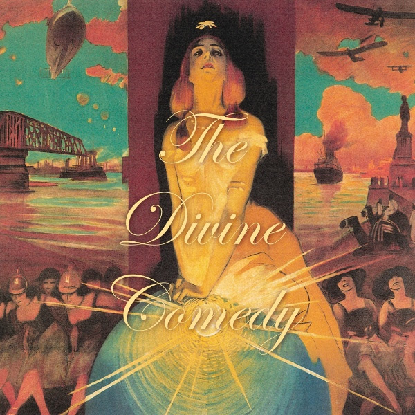

= Foreverland
The Divine Comedy
2016
:toc:

link:../../links.html[Other albums]

== Napoleon Complex

[verse]
____
Who pulls the strings, who makes the deals
Stands five foot three in Cuban heels

Who gets all the girls, then wakes up again
Who will rule the world
Who will make them scream his name…

Napoleon Complex

Who was the true inventor of
The infamous circular firing squad

Who has all the brains, but none of the stature
Who’d make the Child Catcher cry for mom and run away…

Napoleon Complex

Who patiently awaits the hour
When he will seize the reins of power…

Napoleon Complex
____

== Foreverland

[verse]
____
What are we looking for - a piece of heaven they say
What are we looking for - it’s tricky to explain

But you won’t believe it until you’ve seen it
Since I was a boy of fourteen it’s been my plan
To find Foreverland

There’s a tropical breeze there
Blowing throughout the palm trees there
Birds of paradise fly

What are we looking for - an island shrouded in mist
What are we looking for - that’s if it does exist

I know that the crew are dying of hunger
But I’m sure it can’t take much longer
Till we can see Foreverland

There’s a tropical breeze there
Blowing through the palm trees there
Birds of paradise fly

What are we looking for - you’re gonna like it, I swear
What are we looking for - I’ll show you when we’re there

It’s just round the headland, on the horizon
Everybody thinks it’s all lies until they stand on Foreverland

Everybody thinks it’s all lies until they can see Foreverland
____

== Catherine The Great

[verse]
____
Let’s talk of Catherine the Great
Let’s talk of love and the power of the state
She was a crazy spontaneous girl
Everyone paid homage to her
Catherine the Great
There were few brainier
Just ask the King of Lithuania
She could dictate what went on anywhere
She had great hair, and a powerful gait
Catherine the Great

She could converse with the best
She knew Voltaire, Diderot and the rest
She might have conquered a third of the world
But inside she was a sensitive girl
Catherine the Great
With her military might
She could defeat anyone that she liked
And she looked so bloody good on a horse
That they couldn’t wait for her to invade
Catherine the Great

Yekaterina Alexeyevna

Let’s talk of Catherine the Great
Let’s talk of love and the power of the state
If I could touch but the hem of her dress
Tell her a joke, bake her a cake
Catherine the Great
____

== Funny Peculiar

[verse]
____
Funny, funny little smile
Like a guilty child trying to fool ya
Funny, like Zsa Zsa Gabor
Not ‘funny ha ha’, more ‘funny peculiar’

You’re strangely attractive
You’re oddly adorable
And the funny little fact is
Funny peculiar, you are the one

Funny, funny little face
Like a sunny day in the middle of winter
You’re funny
Like a minor chord there isn’t a reason for
They just throw it in there

You’re strangely attractive
You’re oddly adorable
And the funny little fact is
Funny peculiar, you are…
The one for me, honey, yes indeed
You’re the one for me, honey, yes indeed
You’re funny peculiar

You’re strangely attractive
You’re madly magnificent
And the funny little fact is
Funny peculiar, you are…

The one for me, honey, yes indeed
You’re the one for me, honey, yes indeed
You’re funny peculiar, that is what you are
Funny peculiar, that is what you are

The one for me, honey, yes indeed
You’re the one for me, honey, yes indeed
You’re funny peculiar, that is what you are
Funny peculiar, that is what you are
____

== The Pact

[verse]
____
This is our pact, this is our entente cordial
When they attack (and you can be sure that they shall)
We shall without delay come to each others aid
And man the barricades together

This is our pact, this is the treaty that we’ve signed
What one may lack the other party will provide
And everyone must know - you mess with one, you mess with both
And together we’ll beat the bastards back
This is our pact

A bond born of brotherhood, a friendship forged in fire
To benefit the common good and further our desires
A special relationship, a meeting of the minds
Two proud and sovereign nations sit together side by side

This is our pact, and we will come when duty calls
No turning back, it’s all for one and one for all
And though the world may try to come between us by and by
Together we’ll beat the bastards back
This is our pact
____

== To The Rescue

[verse]
____
So many heartbreaks, so little time
Too many tragedies, too many crimes
Put on your body armour, prepare your alibis
‘Cause there is no one else gonna put it right

To the rescue
Down the streets and alleyways
Past the Chinese takeaways
Through the wind and driving rain
To the rescue
When the world won’t understand
And government’s got other plans
Take the law into your hands
To the rescue

Got a vigilante sleeping in my bed
I looked for Marilyn, I got Che instead
But I’ll march behind you wherever you may go
And I’m more proud of you than you can ever know

To the rescue
Through the snow and freezing rain
Down deserted country lanes
Round the world and back again
To the rescue
Taking the forgotten ones
The big and small, the old and young
When nobody else will come
They’ll come to the rescue
To the rescue
____

== How Can You Leave Me On My Own

[verse]
____
How can you leave me on my own
How can you leave me on my own
When did you say that you’re coming home
How can you leave me on my own

When you leave I become a moron
A beer swilling, time killing moron
I surgically remove all of the green food from my diet
I know I should be reading but I’m too lazy to try it
I keep the TV on all day to chase away the quiet when you leave

How can you leave
Me on my own
How can you leave me on my own

How can you leave me on my own
How can you leave me on my own
When did you say that you’re coming home
How can you leave me on my own

When you leave I become a dickhead
A bad smelling, couch dwelling dickhead
I drink too many cups of tea and eat too many biscuits
I think about going out - decide not to risk it
I look at naked ladies ‘cause I’m too weak to resist it when you leave

How can you leave
Me on my own
How can you leave me on my… oboe

How can you leave me on my own
How can you leave me on my own
It’s not the same talking on the phone
How can you leave me on my own

When you leave I become a caveman
A bed head, brain dead caveman
I stare at all the photos and the texts that you have sent me
I curl up with the dogs, I think they’re starting to resent me
I wanna go to bed, but the bed is just too empty when you leave

How can you leave
Me on my own
How can you leave me on my own

How can you leave me on my own
How can you leave me on my own
When did you say that you’re coming home
How can you leave me on my own
____

== I Joined The Foreign Legion (To Forget)

[verse]
____
I joined the Foreign Legion one Thursday cold and wet
I think it was December
But you must remember I Joined the Foreign Legion to forget

I joined the Foreign Legion (La Legion Etranger)
One sultry day in July
Back when I still knew why I joined the Foreign Legion anyway

I joined the Foreign Legion, became a Legionnaire
We’d march to far off regions
To forts we’d be besieged in
Then one day I forgot why I was there

I joined the Foreign Legion somebody to forget
She said I’d find it easier if I had amnesia
Who she was I do not recollect
I joined the Foreign Legion to forget
____

== My Happy Place

[verse]
____
Everything goes to shit
And everyone blames you for it
When good goes bad, and bad to worse
I go where I went first
I go to my happy place
I go to my happy place
I go where the mountains rise on either side of a peaceful valley
I go where the gentle breeze blows through the trees and eases my mind

Everything you have been
Working hard to achieve
Crashes down around your ears
It’s time to disappear
And go to your happy place
I go to my happy place
I go where the mountains rise on either side of a peaceful valley
I go where the gentle breeze blows through the trees and eases my mind
My happy place

When at last you find the one
And all your days are filled with sun
That it could all be snatched away
Where would I go
When you’re my happy place
You’re my happy place
I go where the mountains rise on either side of a peaceful valley
I go where the gentle breeze blows through the trees and eases my mind
I go to my happy place
____

== A Desperate Man

[verse]
____
I made a daring escape in the guise of a nun
It took them most of the day to realise I was gone
I crossed the forests and fields of wheat
A farmer’s daughter gave me something to eat
I stole a paper just to see the picture of me

I’m a desperate man
I’ve gotta keep on running
I’ve gotta do what I can
To get back to you

I made the overnight ferry by the skin of my teeth
I fell asleep between the truckers sprawled across the seats
I see your face everywhere I go
In every cafe and watering hole
What is this hold you’ve got on me, baby

I’m a desperate man
I’ve gotta keep on running
I’ve gotta do what I can
To get back to you

I’m a desperate man
I’ve gotta keep on running
Running back to you
Nobody else will do

I’m a desperate man
I’ve gotta keep on running
Running back to you
Nobody else will do
____

== Other People

[verse]
____
There have been other people in your life
You have had other lovers
So have I
You have talked very sweetly
You have felt very deeply
You have shared many stories with the ones who came before me

There have been other people in your life
Did you change theirs the way that you changed mine
And without them, anyhow, would you be who you are now
And would you even want me in your life

But in the greater scheme of things just think of all the ‘might have beens’
There is no ‘you’, there is no ‘me’, when set against eternity
And jealousy is just an urge to rule over the universe
It is worthless and destructive, and always counter productive

There have been other people in your life
You have had other lovers
So have I
And um, blah blah blah…
____

== The One Who Loves You

[verse]
____
Finding the one who loves you, it doesn’t come along too often
Finding the one who loves you - the one who really loves you
Who thinks so highly of you - doesn’t come round every day

And I love you, I love you, I really really love you

Finding the one who has it isn’t as easy as it should be
Finding the one who’s got it - who is with you besotted
Is like finding the lesser spotted Dodo in Soho - so rare

And you’ve got it, yeah you’ve got it, yeah you’ve really really got it

Finding your other half is anything but a laugh, it’s hard
Finding the one who frees you - the one who really sees you
The one who’ll never ever leave you - it shouldn’t be this hard

But it’s worth it, yeah it’s worth it, yeah it’s really really worth it

The one who loves you, the one who loves you
The one who loves you, who really really loves you
____
