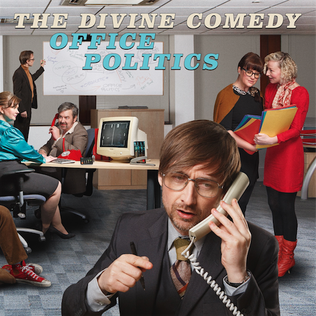

= Office Politics
The Divine Comedy
2019
:toc:

link:../../links.html[Other albums]

== Queuejumper

[verse]
____
I jump the queue, I jump the queue
I jump the queue ‘cause I’m smarter than you
I jump the queue, I jump the queue
I jump the queue ‘cause I’m better than you

Red lights - red lights are all I see
Red lights - red lights don’t apply to me
Red lights - red lights are just for you
Red lights - you stop if you want to

I jump the queue, I jump the queue
I jump the queue ‘cause I’m smarter than you
I jump the queue, I jump the queue
I jump the queue ‘cause I’m better than you

I’m better than you, I’m better than you
I don’t have to play by the usual rules
I take what I want ‘cause it’s there to be taken
And you’re just jealous of the money I’m making

Red lights - red lights are all I see
Red lights - red lights don’t apply to me
Red lights - red lights are just for you
Red lights - you stop if you want to

I’m gonna cruise on through - yeah

I’m better than you, I’m better than you
I don’t have to play by the usual rules
I take what I want ‘cause it’s there to be taken
And you’re just jealous of the money I’m making

Red lights - red lights are all I see
Red lights - red lights don’t apply to me
Red lights - red lights are just for you
Red lights - you stop because you want to
____

== Office Politics

[verse]
____
Intern chokes on his gooseberry fool
Consternation in the typing pool
Press the flesh, do the deal
Book your place on the hamster wheel
See that PowerPoint presentation
Worthy of a BAFTA nomination
Zero hours, maximum pressure
You know what they say about business and pleasure

Sir Hillary looks at them all and sighs
Closes up the venetian blinds
He made his fortune on the horses
Using the rules of market forces
He’s got his eye on a chap named Knox
Sell his granny for some high yield stocks
Always thinks outside the box
Always wears hilarious socks

Office politics…

Christine thinks of the Christmas party
Martini after Martini
William tried but there was no stopping her
Taking a ride on the photocopier
‘Live for now, bugger the future!’
Thus spake Zara Brewster
She put the snaps on her Facebook page
And got sacked the following day

Office politics…

Sir Hillary sighs, recalls the days
You could use your position to get your way
Now put your hand where it shouldn’t be
And soon you’ll be on indefinite leave
No use now for the old school tie
Only the greedy need apply
Another intern chokes on his gooseberry fool
Mild amusement in the typing pool

Office politics…
____

== Norman And Norma

[verse]
____
 Norman and Norma got married in Cromer
April 1983
It could have been warmer but Norman and Norma
Were happy as they’d ever been
They flew to Majorca and swam in the water
It felt just like having a bath
The piña coladas hit Norma hard
And she fell into bed with a laugh
And she said…

Oh, Norman, it’s never ever felt like this before
And oh, Norman, I’ve never really known your kiss before
Oh no, Norman, Norman…

Norman and Norma had three lovely daughters
Nadia, Nora and Niamh
The firm Norma worked at wouldn’t take her back
After maternity leave
They dreamt of Majorca but couldn’t afford to go
On Norman’s salary
So they went to Cromer, got double pneumonia
And Norma remembered when she used to say…

Oh, Norman, it’s never ever felt like this before
And oh, Norman, I’ve never really known your kiss before
Oh no, Norman, Norman…

Twenty years on and the children have gone
And they’re both at a bit of a loss
They’ve tried salsa classes and growing tomatoes
But nothing is getting them off
Then one day in Clacton there’s a re-enactment
Of Normans and Saxons, and this
Gets their juices flowing, before long they’re going
And fighting like it’s 1066!
And she says…

Oh, Norman, it’s never ever felt like this before
And oh, Norman, I’ve never really known such bliss before
Oh no, Norman…
____

== Absolutely Obsolete

[verse]
____
You used to tell me that you loved me, but now I know
You have been trying to get rid of me from the word go
I wasn’t so surprised to know an app could do my job
You’ll find me in the bargain bin at the Oxfam shop
I’m…

Absolutely obsolete
Please shut the door and take a seat
We’re sad to say that you’re completely
Absolutely obsolete - absolutely obsolete
We know that you’ll land on your feet
Clear out your desk and leave discreetly
Absolutely obsolete

I always thought we had a funny relationship
I would do the work that made the money, and you’d spend it
And though I know I was a lowly cog in your machine
You said that I was still a vital member of your team
I’m…

Absolutely obsolete
Please shut the door and take a seat
We’re sad to say that you’re completely
Absolutely obsolete - absolutely obsolete
We know that you’ll land on your feet
Clear out your desk and leave discreetly
Absolutely obsolete

If I could only turn the clock back to a better time
When the world was black and white
And we all had roles to play
Now it’s all just shades of grey

I’m obsolete…
____

== Infernal Machines

[verse]
____
You used to tell me that you loved me, but now I know
You have been trying to get rid of me from the word go
I wasn’t so surprised to know an app could do my job
You’ll find me in the bargain bin at the Oxfam shop
I’m…

Absolutely obsolete
Please shut the door and take a seat
We’re sad to say that you’re completely
Absolutely obsolete - absolutely obsolete
We know that you’ll land on your feet
Clear out your desk and leave discreetly
Absolutely obsolete

I always thought we had a funny relationship
I would do the work that made the money, and you’d spend it
And though I know I was a lowly cog in your machine
You said that I was still a vital member of your team
I’m…

Absolutely obsolete
Please shut the door and take a seat
We’re sad to say that you’re completely
Absolutely obsolete - absolutely obsolete
We know that you’ll land on your feet
Clear out your desk and leave discreetly
Absolutely obsolete

If I could only turn the clock back to a better time
When the world was black and white
And we all had roles to play
Now it’s all just shades of grey

I’m obsolete…
____

== You'll Never Work In This Town Again

[verse]
____
You wanted a life of ease
A world free of drudgery
Everything done by machines
You wanted a life of ease

Now you’ll never work in this town again
You’ll never work in this town again
No, no

Ned Ludd was a working man
Things changed and it forced his hand
He took a hammer and he made a stand
‘Cause Ned Ludd was a working man

Now you’ll never work in this town again
You’ll never work in this town again

You wanted a life of ease
A world free of drudgery
Everything done by machines
Well here it is, your life of ease

That crazy algorithm has you in its sway
It’s making the decisions for you every day
You’re living in a prison of your own design
That crazy algorithm’s making up your mind

You’ll never work in this town again, girl
You’ll never work in this town again
You’ll never work in this town again, boy
You’ll never work in this town again
No, no…
____

== Psychological Evaluation

[verse]
____
Creativity?
Minimal, vague
Viewing?
Big Bang Theory mostly. And BBC4 documentaries about transport infrastructure
Cleanliness?
I had a shower this morning, erm. Although I think I forgot to brush my teeth
Physical wellbeing?
Tired. Limp. Better than yesterday
Reading?
I’m reading Oliver Twist by Charles Dickens in very short nightly doses
Sociability?
Fear of social transgression with resulting isolation

Subject is male and caucasian, lacking in weight and elevation
When faced with fear and confusion resorts to romantic illusion
Cannot do simple equations, but prone to self-congratulation
Too soon to draw a conclusion regarding human evolution

Dreams?
Oh, the usual; hanging from high places, or lingering in endless post office queues
Diet?
Brown
Waste products?
Firm, if slightly irregular
Emotions?
Hmmm…

Subject is male and caucasian, lacking in weight and elevation
When faced with fear and confusion resorts to romantic illusion
Cannot do simple equations, but prone to self-congratulation
Too soon to draw a conclusion regarding human evolution

Emotions?
You asked me that already. I’m fine… I think
Self-image?
Room for improvement
Aspirations?
To take more train journeys. And to be kinder
Regrets?
I’ve had a few. Should have learned French…
Listening?
Human League, OMD, Kraftwerk, Soft Cell, Japan, Eurythmics, Depeche Mode, Gary Numan, Heaven 17, Pet Shop Boys, Buggles, Ultravox, Yazoo, Art Of Noise, Blancmange, Thomas Dolby, Frankie Goes To Hollywood, Landscape, M, New Musik, Propaganda, Visage, Yello…
____

== The Synthesiser Service Centre Super Summer Sale

[verse]
____
We’ve Akai and Alesis, Arturia and ARP
We’ve Emulator, Oberheim and Aries
We’ve Minimoog and Polymoog and Moog Modular
And our Moogerfooger envelopes are scary
We’ve every Korg you’ll ever need, M1 to MS20
We’ve Volca, Delta, Trinity and Triton
There’s Prophecy and Odyssey and microKorgs aplenty
There’s black and brown and grey and red and white ones

You won’t believe the prices, you’ll be glad that you availed
Of the Synthesiser Service Centre Super Summer Sale

We’ve 101s and 303s and 505s galore
We’ve 607080909s
We’ve Siel and Solina and Suzuki Omnichords
And of course Sequential Circuits Prophet 5
We’ve Fairlight, Future Retro and Formanta Polivoks
We’ve Delaware, Synare and Ensoniqs
We’ve Boss and Brute and Buchla and Bananas by the box
We’ve PPG’s and Gleeman Pentaphonics

Come on down, shop around, be like Nine Inch Nails
At the Synthesiser Service Centre Super Summer Sale

We’ve Kurzweil, Karmas, K2000s, Tempests and Bontempis
We’ve Jens, GEMs, Jupiters and Junos
We’ve GX1s, DX1s, DX7s, CS80s
We’ve every single synthesiser you know
From Taurus to Andromeda, Synclavier to Nord Lead
This Synthi AKS has just arrived
We’ve got a mint condition EMS VCS3, but…
Here’s a Casio MT45

You won’t believe the prices, you’ll be glad that you availed
Of the Synthesiser Service Centre Super Summer Sale

We’ve warranties and guarantees in case your filters fail
At the Synthesiser Service Centre Super Summer Sale
____

== The Life And Soul Of The Party

[verse]
____
I am my own invention
I am a one man show
The centre of attention
Bathing in the glow
I’m making conversation
I’m talking really fast
I’m saying things that’ll come back
To bite me in the ass

I am the life and soul of the party…

Tell me what makes you tick
Let me pick your brains
I wanna drive my artic
Down your memory lane
I’ve got a million questions
I could go on for years
I wanna make a connection
And dribble in your ear

I am the life and soul of the party…

Though I can hardly stagger
I’m taking to the floor
I’ve got them moves like Jagger
After a drink or four
I do not like this music
I’m gonna intervene
Just put my pod on shuffle
I’ve got every song there has ever been

I am the life and soul of the party…

I’m saying stupid things now
I’m playing stupid games
I’m spilling people’s drinks now
I’m dropping people’s names
I’m stumbling over sentences
I’m talking to my beer
I’m mumbling to myself because
I’m all alone in here
____

== A Feather In Your Cap

[verse]
____
A feather in your cap, an indent on your pillow
Something you can brag about to all your friends
A feather in your cap, a notch upon your bedpost
How did I compare? Marks out of ten?
A feather in your cap, a shining badge of honour
A tasty little snack to have between your meals
A name that you can add to your list of lovers
I only wish you had informed me of the deal

And though it hurts like hell it’s not the end of the world
I won’t come beating down your door
I should have known that you were only after one thing
I just expected something more
I hope that you’ll forgive me if the next time we meet
I don’t pretend to be ok
And if it makes you feel uncomfortable
You can always walk away
Just walk away…

A feather in your cap, a footnote in your memoir
A holiday snap at the bottom of a drawer
That one day you’ll look at with just a tinge of sorrow
Throw it in the trash and get yourself a beer
____

== I'm A Stanger Here

[verse]
____
Excuse me madam, would you mind
Sparing a moment of your time
I wandered off the beaten track
And now I can’t find my way back
Excuse me sir, may I intrude
I hope you do not think me rude
I went out for a loaf of bread
Now everything I love is dead

I’m a stranger here, I’m a stranger here
You can tell from my voice and my clothing of choice
I’m a stranger here
I’m a stowaway from the olden days
And I’ll play you a song from the place I come from
If you like

When I was young they said to me
This way towards modernity
So if you ask where I come from
I’ll say “the past”
And wander on

I’m a stranger here, I’m a stranger here
You can tell from my tie and the fear in my eye
I’m a stranger here
I’m a stowaway from the olden days
And I’ll play you a song from the place I come from
If you like, if you like
If you like
____

== Dark Days Are Here Again

[verse]
____
Now is the winter of our discontent
The good times came and then the good times went
The college fund has gone to pay the rent
This is the day we thought could never come
The day a veil was drawn across the sun
To hide the darkness in the hearts of men
Dark days are here again

What happened to the world I used to know
Where people seemed to share a common goal
Now we’re just numbers to be bought and sold
Now is the winter of our discontent
The good times came and then the good times went
And culture’s capital is all but spent
Dark days are here again
____

== Philip And Steve's Furniture Removal Company

[verse]
____
Idea for a sitcom:
Philip and Steve’s Furniture Removal Company
Based on the early lives of Philip Glass and Steve Reich in New York in the 60’s
Many hilarious gags about the repetitive nature of the work
And the phases that Steve’s life goes through
Theme tune would be a bit like this…

Philip and Steve’s furniture removal company
Philip and Steve’s furniture removal company
Philip and Steve’s furniture removal company
Philip and Steve’s furniture removal company
Philip and Steve’s furniture removal company
Philip and Steve’s furniture removal company
Philip and Steve’s furniture removal company
Philip and Steve’s furniture removal company
Philip and Steve’s furniture removal company
Philip and Steve’s furniture removal company
Philip and Steve’s furniture removal company
Philip and Steve’s furniture removal company
Philip and Steve’s furniture removal company
Philip and Steve’s furniture removal company
Philip and Steve’s furniture removal company
Philip and Steve’s furniture removal company
Philip and Steve’s furniture removal company
Philip and Steve’s furniture removal company
Philip and Steve’s furniture removal company
Philip and Steve’s furniture removal company
Philip and Steve’s furniture removal company
Philip and Steve’s furniture removal company

If you live in New York City in the 1960’s
And you’re tired of having your stuff scuffed
And tossed about by some Boulez-loving lout
Who is out to make your home all atonal
Call Philip and Steve’s Furniture Removal Company
They will, with minimal disruption to your routine, change your whole scene
They’ll take it apart, put it back together
Strangely familiar but never quite the same again
They’ll do it again, and again, and again…
____

== Opportunity' Knox

[verse]
____
Good morning, Ms Monroe
Erm, have you got a mo?
There’s something you should know
It’s about Billy Bird
He left without a word
And what is more I’ve heard
He had apparently been taking liberties with the company accounts
Somebody must’ve sneaked ‘cause there’s a vacant seat
And that’s what I’m here about

You see these opportunities, opportunities
They don’t come along too often
Opportunities, opportunities
You’ve gotta take them whenever you can
La la la, la la la, la la la, la la la
Opportunities, opportunities
You’ve got to grab them with both of your hands

I know, it is a shame
But if you play that game
You’ve no one else to blame
But… how’s the family?
Perhaps your husband’s free to play some golf with me
This couldn’t be your son
No, no, you’re much too young
And could this be your daughter too?
You really are a wonder
I’d envy anyone who gets to be under you
You know these opportunities, opportunities
They don’t come along too often
Opportunities, opportunities
You’ve gotta take them whenever you can
La la la, la la la, la la la, la la la
Opportunities, opportunities
You’ve got to grab them with both of your hands

Good morning, Officers
What’s that? You’d like a word
Concerning William Bird, hmm…
Well yes, we had a drink
He went straight home I think
This isn’t blood… it’s ink
So I have muddy shoes, what’s that to do with you?
To own a shovel isn’t odd
Hey, take your hands off me!
I will come quietly, just tell me
Tell me if I’ve got the job?!
Because these…

Opportunities, opportunities
They don’t come along too often
Opportunities, opportunities
You’ve gotta take them whenever you can
Opportunities, opportunities
They have come and gone too often
Opportunities, opportunities
You’ve got to grab them with both of your hands
When opportunity knocks… you gotta… urghh
____

== After The Lord Mayor's Show

[verse]
____
When the parade’s moved on
After the crowds have gone
After the last hurrah
The last ta-ran-ta-ran-ta-ra!
When the glory boys depart
That’s when the real work starts
After the Lord Mayor’s show comes the donkey cart

I watched the marching bands
I saw the children wave
Now on this street I stand
And it’s as silent as the grave
And it’s time to do my dance
Time to perfect my art
After the Lord Mayor’s show comes the donkey cart

Parades will come and go
Every year a new star of the show
Girls scream as they go past
But they, they never seem to last
When the glory boys depart
That’s when the real work starts
After the Lord Mayor’s show
After the Lord Mayor’s show
After the Lord Mayor’s show comes the donkey cart
____

== When The Working Day Is Done

[verse]
____
When the working day is done
And the factory whistle blows
When the daily race is run
And you turn once more for home
All the people pushing by
As the sun dips in the sky
All the songs that go unsung
When the working day is done

When the working day is through
And you’re waiting in the rain
For another overdue
Overcrowded railway train
And the movie poster screams
It’s the best film ever seen!
But it’s all a different world
To which you have never been
And you’re bored out of your mind
So you keep yourself amused
Reading the Financial Times
Of the fellow next to you
Then something in you snaps
And you shout with all your lungs
WE GIVE AND GET NOTHING BACK
When the working day is done

When the working day is done
And the factory whistle blows
When the daily race is run
And you turn once more for home
All the people pushing by
As the sun dips in the sky
All the songs that go unsung
When the working day is done
____

////
== Whistle For A Wind

[verse]
____
____

== The Swallow

[verse]
____
____

== The Conquering Heroes

[verse]
____
____

== Fighting Swallow

[verse]
____
____

== The Amazon Pirates

[verse]
____
____

== The Parley

[verse]
____
____

== Better Drowned Than Duffers

[verse]
____
____

== Let's Make The Best Of It

[verse]
____
____

== Navy Stroke

[verse]
____
____

== Like Robinson Crusoe

[verse]
____
____

== Titty's Dream

[verse]
____
____

== The Conquering Heroes, Victory Chorus

[verse]
____
____

== The Black Spot

[verse]
____
____

== The Parley - Flint's Apology

[verse]
____
____

== Swallows And Amazons Forever

[verse]
____
____
////