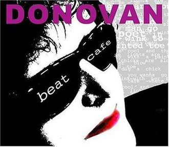

= Beat Cafe
Donovan
2004
:toc:

link:../../links.html[Other albums]

++++
 
++++	

== Love Floats

[verse]
____
If I was your lover, I’d take you to the sky
If you are feeling low, I will make you high
Let me be your lover, baby, I will be your beau
I can take you anywhere that you wanna go.

Let's do it again, yeah.

If I was your lover, I’d take you to the sea
Drown you in kisses like you wanna be
Let me be your lover, my mermaid on the sand
We can be in ecstacy, lemme hold your hand and she said ..

Love floats in space, that space between us
Love floats in space, that space between us.

Let me come in.

Oh, Maeve, Maeve, Maeve ..
Oh, Maeve, Maeve, Maeve ..
Oh, Maeve, Maeve, Maeve ..
Oh, Maeve, Maeve, Maeve ..

If I was your lover, I’d take you to the sky
If you are feeling low, I will make you high
Let me be your lover, baby, I will be your beau
I can take you anywhere that you wanna go, she said ..

Love floats in space, that space between us
Love floats in space, that space between us.

Love floats in space, that space between us
Love floats in space, that space ..

Love floats in space, that space between us
Love floats in space, that space between us.
…

Let me come in.

Oh, Maeve, Maeve, Maeve ..
Oh, Maeve, Maeve, Maeve ..
Oh, Maeve, Maeve, Maeve ..
Oh, Maeve, Maeve, Maeve ..
____

== Poorman's Sunshine

[verse]
____
From outo the darkness and into the light
From outo the darkness and into the light
From outo the blind and into the sight
From outo the darkness and into the light
I'm just a poorman's sunshine
From outo the darkness and into the light.

From outo the water and into the air
From outo the water and into the air
Outo the love and into the where
From outo the water and into the air
I'm just a poorman's sunshine (a poorman's sunshine)
From outo the water and into the air.

I'm just a poorman's sunshine (a poorman's sunshine).

From outo the street and onto the stage
From outo the street and onto the stage
Outo my head and onto the page
From outo the street and onto the stage
I'm just a poorman's sunshine (poorman's sunshine)
From outo the street and onto the stage.

Outo the Lincoln and into the Lear
It's outo the Lincoln and into the Lear
Away with the past, away with the fear
It's outo the Lincoln and into the Lear
I'm just a poorman's sunshine (poorman's sunshine, yeah).

A poorman's sunshine
A poorman's sunshine
A poorman's sunshine
A poorman's sunshine …

I'm just a poorman's sunshine (a poorman's sunshine)
I'm just a poorman's sunshine (poorman's sunshine, oh yeah …)
I'm just a poorman's sunshine (a poorman's sunshine, yeah)
I'm just a poorman's sunshine (poorman's sunshine, sunshine, yeah …)
A poorman's sunshine
A poorman's sunshine. 
____

== Beat Cafe

[verse]
____
Can a cat think? I think so
She asked me, do I wanna go ..

To a beatnik cafe where the lights are low
The music is cool and the chicks are slow
Poet in a beret as the sax he blow
And the bongo-boy, go man go.

Can a kit wink to her beau?
He asked her, do you wanna go ..

To a beatnik cafe where the lights are low
The music is cool and the chicks are slow
Barefoot baby with a painted toe
As the reefer blow, go chick go.

Dig a chick slink with her beau
I ask you, do you wanna go ..

To a beatnik cafe where the lights are low
The music is cool and the chicks are slow
Barefoot baby with a painted toe
As the sax he blow, go man go.

Beatnik cafe
Beatnik cafe
Beatnik cafe
Beatnik cafe, hey man!

Beatnik cafe, hey babe
Beatnik cafe. 
____

== Yin My Yang

[verse]
____
You yin my yang, I'll yang your yin
You be for me, sweet fantasy
You black my white, I'll day your night
You be for me what you want me to be.

And there'll be music
Music in the air, flowers in your hair, life without a care
There'll be music
There'll be music everywhere, life without a care, flowers in your hair.

And there'll be music
Music in the air, flowers in your hair, life without a care
There'll be music
Music everywhere, life without a care, flowers in your hair.

You yin my yang, I'll yang your yin
You be for me, sweet fantasy, mmm.

And there'll be music
Music in the air, flowers in your hair, life without a care
There'll be music
There'll be music everywhere, life without a care, flowers in your hair.

There'll be music
Music in the air, flowers in your hair, life without a care
There'll be music
Music everywhere, life without a care, flowers in your hair.

If you yin my yang. 
____

== Whirlwind

[verse]
____
Like a river she's flowing into my life, my life
Like a river she's flowing into my life, my life.

Wind is blowing all around her hair, into the distance she stare
Wind is blowing all around her hair, into the distance she stare.

Like a zephyr she's blowing into my life, my life
Like a zephyr she's blowing into my life, my life.

Whirlwind blowing all around our love, into the mystic above
Whirlwind blowing all around our love, into the mystic above.

Ooh, ooh.

Like a quiver she's glowing into my life, my life
Like a quiver she's glowing into my life, my life.

Whirlwind blowing all around our love, into the mystic above
Whirlwind blowing all around our love, into the mystic above.

Ooh, ooh. 
____

== Two Lovers

[verse]
____
When two lovers touch hands
They touch the two of them touching hands
They touch the one of them in the space between
As each the others hand doth touch.

When two lovers kiss lips
They kiss the two of them kissing lips
They kiss the one of them in the space between
As each the others lip doth kiss.

Two lovers
Two lovers
Two lovers, two lovers
Two lovers.

When two lovers hold each other
They hold the two of them holding each other
They hold the one of them in the space between
As each the other holds.

Two lovers
Two lovers, two lovers
Two lovers, two lovers
Two lovers.

Two lovers
Two lovers, two lovers
Two lovers, two lovers
Two lovers.
____

== The Question

[verse]
____
Holla ma gollo aholla
Holla ma golla aholla
Holla ma golla aholla
Tell you anything I like.

Holla ma gollo aholla
Holla ma golla aholla
Holla ma golla aholla
Tell you anything I like.

The question that you should not answer
An answer that you should not ask
And the answer is the question
And the question is the task.

As I stroll down through my madness
Without worry or warning
Dark before the depths of sadness
Breathing through the grey morning.

Holla ma gollo aholla
Holla ma golla aholla
Holla ma golla aholla
Tell you anything I like.

Holla ma gollo aholla
Holla ma golla aholla
Holla ma golla aholla
I tell you anything I like.

Deep within the silent forest, in the darkest hour of night
Gleams a gleaming so wondrous, could it be the pale moonlight?
Nay luna ne'r can enter, forests dark and deep as these
See, it is the secret Goddess wandering amidst her trees.

Holla ma gollo aholla
Holla ma golla aholla
Holla ma golla aholla
I tell you anything I like.

Tell me whatcha want, babe, oh yeah.

Gonna do all the things I never done before
I gonna get myself together somehow
Gonna do all the things I never done before
I gonna get myself together somehow
Gonna do all the things I never done before
I gonna get myself together somehow
Gonna do all the things I never done before
I gonna get myself together somehow.

Holla ma go
Holla ma go
Holla ma go
Holla ma gollo.

Holla ma go
Holla ma go
Holla ma go
Holla ma gollo.

Tell you anything I like
Tell you anything I like
Tell you anything I like
I tell you anything I like.

Holla ma gollo aholla
Holla ma golla aholla
Holla ma golla aholla
I tell you anything I like.

Holla ma golla aholla
Holla ma golla aholla
Holla ma golla aholla
I tell you anything I like.

Holla ma gollo aholla
Holla ma golla aholla
Holla ma golla aholla
I tell you anything I like.
____

== Lord Of The Universe

[verse]
____
I’m the Lord of the Universe, it's best you don't mess with me
I’m the Lord of the Universe, it’s best you don't mess with me.

I’m above and below, I’m in your little toe
I’m everywhere you happen to go
I’m within, I’m without though fools often doubt
When they try working me out.

I’m the Lord of the Universe, it's best you don't mess around with me
I’m the king of the king of the Universe, baby, it's best you don't mess with me.

I never live and I never die
It's all the same to me, oh can't you see?
‘Cause I’m the Lord of the Universe, it's best you don't mess with me
‘Cause I’ll stomp on you.

I can freeze your sea, I can burn your tree
I’m everywhere you happen to be
I’m in the North and I’m in the South
I’m in your sweet honey dripping mouth.

Oh, I’m the Lord, I’m the Lord of the Universe, life force is my name
Yes, I’m the Lord, yeah I’m the Lord, I’m the Lord of the Universe, it's best you don't mess with me
I said it's best you don't mess around with me.

You know, I love you, to me you're so dear
That's why, please, please, please, don't mess with me
You know you don't mess with me.

Ooh, ooh yeah, I love you, don't you love me?
If you do, please, don't mess with me. 
____

== Lover O Lover

[verse]
____
Reveal, beloved, hidden ecstasy
Lady of seven veils, administer love to me.

Before thy temple of inner sanctuary
I lay my burden down and rest beneath your tree.

Lover O Lover, lead me within
Lover O Lover, lead me within
Lover O Lover, lead me within
Lover O Lover, lead me within.

Sister of succor, your kiss is my balm
With your wand you bid the beast in me be calm.

Arise Serpent arise, come out your fairy lair
Dance for the maiden with the moonlight in her hair.

Lover O Lover, lead me within
Lover O Lover, lead me within
Lover O Lover, lead me within
Lover O Lover, lead me within.

Lover O Lover, lead me within
Lover O Lover, lead me within
Lover O Lover, lead me within
Lover O Lover, lead me within.

Oh yeah, Lover O Lover, lead me within
Lover O Lover, lead me within
Lover O Lover, lead me within
Lover O Lover, lead me within. 
____

== The Cuckoo

[verse]
____
Well, the cuckoo she's a pretty bird and she warble as she fly
And she never warble cuckoo till the fourth day of July
Jack of diamonds, jack of diamonds, well I know you of old
Well, you robbed my poor pocket of the silver and the gold.

Well, the cuckoo is a pretty bird and she warbles as she fly
But she never warble cuckoo till the fourth day of July
Well, I’ve gambled in London and I’ve gambled in Spain
And I bet you, my silver saddle, that I’ll beat you next game.

Oh, the cuckoo she's a pretty bird and she warble as she fly
But she never warble cuckoo till the fourth day of July
Well, she brings us glad tidings and tells us no lies
Oh, the cuckoo she's a pretty bird and she warble as she fly.

Oh, the cuckoo she's a pretty bird and she warble as she fly
But she never warble cuckoo till the fourth day of July
Little darlin’, little darlin’, I miss you on the road
Well, you are my only darlin’, my one and only true abode.

Oh, the cuckoo she's a pretty bird and she warble as she fly
And she never warble cuckoo till the fourth day of July.

Oh yeah, oh yeah. 
____

== Do Not Go Gentle

[verse]
____
Do not go gentle into that good night
Old age should burn and rave at close of day
Rage, rage against the dying of the light.

Though wise men at their end know dark is right
Because their words had forked no lightning
They do not go gentle into that good night.

Good men, the last wave by crying how bright
Their frail deeds might have danced in a green bay
Rage, rage against the dying of the light.

Wild men who caught and sang the sun in flight
And learn, too late, they grieved it on its way
Do not go gentle into that good night.

Grave men, near death, who see with blinding sight
Blind eyes could blaze like meteors and be gay
Rage, rage against the dying of the light.

And you, my father, there on the sad height
Curse, bless me now with your fierce tears
I pray, do not go gentle into that good night.

Rage, rage against the dying of the light
Do not go gentle into that good night.

Rage, rage against the dying of the light
Do not go gentle into that good night.

Rage, rage against the dying of the light
The dying of the light.
____

== Shambhala

1 2 3 4

[verse]
____
Take me home back to Shambhala where mmm peaceful rivers flow
Take me home back to Shambhala where, where seeds of love they sow
Through this dream called life we all play a part
Till the day we awake unto the gentle heart.

Take me home back to Shambhala where mmm peaceful rivers flow
Take me home, home back.

Please, take me home
Take me home back to Shambhala where mmm peaceful rivers flow. 
____
