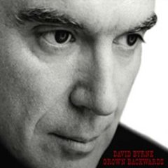

= Grown Backwards
David Byrne
2004
:toc:

From https://www.azlyrics.com/d/davidbyrne.html

== Glass, Concrete & Stone

[verse]
____
Now, I'm waking at the crack of dawn
To send a little money home
From here to the moon

Is rising like a discotheque
And now my bags are down and packed
For traveling

Looking at happiness
Keeping my flavor fresh
Nobody knows I guess
How far I'll go, I know, so I'm

Leaving at six o' Clock
Meet in a parking lot
Harriet Hendershot
Sunglasses on she waits by this

Glass and concrete and stone
It is just a house, not a home

Skin that covers me from head to toe
Except a couple tiny holes
And openings

Where the city's blowing in and out
And this is what it's all about
Delightfully

Everything's possible
When you're an animal
Not inconceivable
How things can change, I know, so I'm

Putting on aftershave
Nothing is out of place
Gonna be on my way
Try to pretend it's not only

Glass and concrete and stone
That it's just a house, not a home

And it's glass and concrete and stone
It is just a house, not a home
And my head is fifty feet high
Let my body and soul be my guide 
____

== The Man Who Loved Beer
(originally by Lambchop)

[verse]
____
To whom can I speak today?
The brothers they are equal
But the old friends of today
They have become unlovable
To whom can I speak today?
The gentleness has perished
And the violent man has come down on everyone

To whom can I speak today?
The wrong which roams the earth
There can be no end to it
It is just unstoppable
Death is in my sights today
As when a man desires
To see home after many years in jail

February through December
We have such a tragic year
As separate as the fingers
Suddenly, as one
As the hand

And the violent man has come down on everyone
And the violent man has come down on everyone
And the violent man has come down
On everyone 
____

== Au fond du Temple Saint

[verse]
____
Au fond du temple saint
Paré de fleurs et d'or,
Une femme apparaît!
Je crois la voir encore!
Une femme apparaît!
Je crois la voir encore!

La foule prosternée
La regarde, etonnée,
Et murmure tous bas:
Voyez, c'est la déesse!
Qui dans l'ombre se dresse
Et vers nous tend les bras!

Son voile se soulève!
Ã" vision! ô rêve!
La foule est à genoux!

Oui, c'est elle!
C'est la déesse
plus charmante et plus belle!
Oui, c'est elle!
C'est la déesse
qui descend parmi nous!
Son voile se soulève et la foule est à genoux!

Mais à travers la foule
Elle s'ouvre un passage!
Son long voile déjÃ
Nous cache son visage!
Mon regard, hélas!
La cherche en vain!

Elle fuit!
Elle fuit!

Oui, c'est elle! C'est la déesse!
En ce jour qui vient nous unir,
Et fidèle à ma promesse,
Comme un frère je veux te chérir!
C'est elle, c'est la déesse
Qui vient en ce jour nous unir!
Oui, partageons le même sort,
Soyons unis jusqu'Ã la mort! 
____

== Empire

[verse]
____
In national elections
In songs raised on high
With stirring emotions
As tears fill our eyes
In democratic fever
For national defense
I am a mountain
I am a mountain
I am a mountain
Like birds upon a fence
Like birds upon a fence

Young artists and writers
Please heed the call
What's good for business
Is good for us all
For as it is in nature
So it is in life
The weak among us perish
The weak among us perish
The weak among us perish
The strong alone survive
The strong alone survive

Voices like thunder
Decisions like steel
The past and the future
They belong to us all
From every mountain
The water and the land
The world that we've created
The world that we've created
The world that we've created
By working hand in hand
By working hand in hand
Mm-mm-mm-mm-mm
Mm-mm-mm-mm-mm 
____

== Tiny Apocalypse

[verse]
____
Raise up, shake them lazy bones
Read the T-shirt but still don't understand
Comin' home with a little apocalypse
It comes, now do you have time for this?

A 3-tone carpet and a Jackie Chan spear
Lookin' at a hairdo and a belly full of beer
Well, I ain't no poet, ain't got no rhyme
But I got me a car and I know how to drive

In the event of pressure loss
All our lines are busy now
I will be laughing out loud anyhow

Every day a little apocalypse
Lay down, lay down next to this
Lookin' at the body, well, I don't even know his name
Call me in the morning, was a friend of mine

Well, the wind so strong, it's blowing us all around
Wind so strong, nobody settle down
Every day, another apocalypse
Had a TV but I don't know how deep it is

Please read the print advisory
Would you like to go ahead?
Dancin' wherever she goes, tippy toes

Rhetorical
Memorial
Invisible
Incredible
Unstoppable
Emotional
Illogical
Sensational

Little sister gotta take her medicine
Baby brother, gonna do it all again
Runnin' fast but cannot catch the bus
Funny feelin', this is part of us

And you must take your medicine
Getting better every day
Good for a limited time, feelin' fine

We will return your things to you
When it's time for you to leave
So quiet nobody knows, tippy toes 
____

== She Only Sleeps

[verse]
____
She might dance all night
In a topless bar
Fool around, go too far
But I don't mind
You see things are not what they appear
'Cause she only sleeps with me.

She might drink a bit
Lose her way
Crash the car
But come out OK
And my friends might laugh
But they only know what they can see
And she only sleeps with me

Nights on Times Square
Live and on stage
High heels
She feels
That she's dancin' for me

And the little bird
Flies from tree to tree
To the highest branch
Where she thinks she's free
She can have it all
That's the reason you wouldn't believe
That she only sleeps with me

There's a porno book
In the library
Nothin' ever goes
Were it shouldn't be
And the world is queer
And the human is strangest of all
And she only sleeps, yeah, she only sleeps
Yeah, she only sleeps with me 
____

== Dialog Box

[verse]
____
Picture this
Bumping lips
Everyone talks
Do a dialogue box

They shake and bake
Make a cranky face
They got rocks in the head
Got rocks in the bed

Pull the hood down
Grab the fold out
Is it too loud?
Is it all right?

Makin' contact
And you know that
Need a tight fit
To survive

Romeo
Said Juliette
Got a dialogue box
Hey look at me, that's my answer

All Sparkly white
Shiny bright
A genuine smile
The Renegade style

Gonna heat 'em up
And stir the pot
Bake it a while
Then cool on the side

Tribulation
Revelation
Absolution
Prophesized

I'm a rich man,
I'm a poor man
But the main thing
I'm alive

Lost in Space
Cosmic haze
Beautiful wreck
Special effect

Clean and pure
Swift and sure
I'm ready to drop
In a dialogue box

Decoration
Innovation
My creation
Any size

If you try it
And you like it
You can have it customized

Gonna test ya
With a gesture
Do I feel ya?
Are ya scared?

In the darkness
In the details
At the movies
Or a play

All crinkled up
Delirious
Fall through the cracks
In a dialogue box

With a smiley bump
Gonna line 'em up
And the question I ask

Hey look at me
That's my answer 
____

== The Other Side of This Life

[verse]
____
I don't have any more problems
All of my worries are gone
Beautiful angels appear at my side
And corporate sponsors will act as my guide
Agents & analysts take me inside
The other side of this life

Beautiful people are walking
And beautiful people are we
Bright as the sunlight at noon ev'ry day
The people in nightclubs they all turn away
But when it's over we're returning to
The other side of this life

I made a church of your hair-do
And I made a shrine of your legs
I promised to love and to worship each day
I know that heaven is not far away
Management told me they're sure I will play
The other side of this life

Lookin' in the mirror
Peekin' 'round the corner
Where the grass is always greener
Peekin' through the curtain
I gotta have a peek in
It's genuine upholstered leather

Doctor I'm back for a visit
The symptoms are worse than before
Although it's spelled wrong, my name's up in lights
I feel so good, but you say it's all right
I'll pay the price if you help me to find
The other side of this life
The other side of this life 
____

== Why

[verse]
____
I don't have any philosophy
Why do I know what I know?
I see the world in a coffee cup
And when I drink it down there I go

We have our own kind of universe
Sometime but not always true
How come? Wait! Maybe I think it is
The view is very nice and it's big through and through

I got skills and I got secrets, I can part my hair
I feel an empty space where love could be
In adjoining universes
Touching here and there
I stick my head outside and I can see - that

Particles spin 'round a nucleus
Planets encircle the sun
Further out there is the Milky Way
The coolest part of all cracks me up, Ev'rytime

Life isn't really miraculous
It had to happen this way
We had to meet in this checkout line
Explain it as a simple twist of fate
But we can't - be - sure 
____

== Pirates

[verse]
____
A distant car, a quiet night
Like starin' at the ceiling
My sleepy eyes, you smell so nice
It's such a funny feeling
Got no idea, what time it is
Delightfully confusing
The trees outside, the morning light
Arrives, like pirates on parade
Surprise, it's pirates on parade

A ray of light, between the blinds
I lie there in a stupor
I hear a thud, and then a flush
Guess it must be the neighbors
I blink my eyes, I laugh inside
Imagine what they're saying
I see your shape and through the night
Here come, those pirates on parade
Ahoy, it's pirates on parade

Through the rough and stormy weather
On a search for buried treasure
There's an island to explore
Ev'ry wave that whispers softly
"Stay in bed, 'cause it's still early"
Dolphins frolic by the shore
And the phone never rings when the pirates are singing

Well there's 16 men on a dead man's chest
In this hallucination
The map we got, x marks the spot
We're following directions
The 7 seas, the balmy breeze
The pleasure of surrender
The end is nigh, the sun is high
It's late, for pirates on parade
Too late, for pirates on parade

Traffic noises down below me
A helicopter circles slowly
Monsters sink into the deep
Mountainous and downy billows
Float among those fluffy pillows
Maybe I'll go back to sleep
And the phone never rings when the pirates are singing

This wicked life
So what's in store behind that velvet curtain?

The night is gone
And the day is here
The stupid sun is shinin'
The moon reflects
Your hair's a mess
It's lovely imperfections

My crew and I
The clear blue skies
Sail on, with pirates on parade
Sail on, you pirates on parade

Yo, yo, yo
Yo, yo, yo
Yo, yo, yo
Yo, yo, yo
Yo, yo, yo
Yo, yo, yo
Yo, yo, yo
Yo, yo, yo 
____

== Civilization

[verse]
____
Somewhere between the darkness and light
Faces all glow but it's not too bright
Civilization, it's all about knives and forks

Isn't she here? What time is it now?
Is this the right place? Do I fit with her crowd?
I'm gonna be a civilized man someday

Part of me wants to jump and shout
Part of me wants to tear it down
I thought you might prefer the cabernet

Civilization, it's all about sex
Havin' a ball in a padded banquet
I'm gonna be that really cool guy someday

The waiter looks me over
Would you like cream or sugar?
I don't know - what was I supposed to say

She wonders if I'll notice
I should have brought some roses
Her plate is full, she hasn't eaten all day

Glasses collect we order some booze
She looks at me, I stare at her shoes
Mature situations, maybe a broken heart

Maybe I ought to pay the bill
Maybe she thinks I never will
A million things that cross a woman's mind

Just be yourself, well that's what they say
I barely know who I was yesterday
I'm gonna be that civilized guy someday

Good friends and conversations
The rise and fall of nations
A moments glory and they've had their day

And on my high school folder
I drew a big gorilla
Something familiar, something far, far away

Somewhere between the darkness and light
She touches my hand, she don't seem to mind

We can go home, we can be civilized 
____

== Astronaut

[verse]
____
The Western lands
Day turns to Night
Immaterial play of light
It's very nice out here

Poked my hand in a hornet's nest
They flew out around my face
I guess it's just self defense

The camera pans
The focus shifts
The world is a hornet's nest
I learned my lesson well

I surf the net
And watch TV
There's peace in the Middle East
Feel like I'm an astronaut
Now I am an astronaut 
____

== Glad

[verse]
____
I'm glad I've got skin, I'm glad I've got eyes
I'm glad I got hips, I'm glad I've got thighs
I'm glad I'm allowed to say the things I feel
I'm glad Igot hair, glad I got ears
I'm glad I got lungs, I'm glad I got tears
Glad that I never ever know what's real

I'm glad I got lost
I'm glad I'm confused
I'm glad I don't know, what I like
I'm glad I got stoned
I'm glad I got high
I'm glad I found out I'm all right

I'm glad when the sex is not so great
I'm glad that I doubt, I know what they say
I'm glad when I get my girlfriends names confused

I'm glad I know how my life will end
I'm glad I don't have no common sense
I'm glad the things are wrong I thought I knew

I'm glad I'm a mess
I'm glad you don't mind
I'm glad you're better than me
I'm glad that I changed
I'm glad I'm not nice
I'm glad it's the way, it must be

I'm glad I can't see beyond myself
I'm glad when the conversation ends
It's good when it's bad, I'm glad it's not worrin' me 
____

== Un Dì, Felice, Eterea

[verse]
____
Un di, felice, eterea,
Mi balenaste innante,
E da quel di tremante
Vissi d'ignoto amor.

Di quell'amor ch'e palpito
Dell'universo, Dell'universo intero,

Misterioso, Misterioso altero,

Croce e, Croce e delizia
Croce e delizia, delizia al cor.

Misterioso, Misterioso altero,

Croce e delizia al cor.
Croce e delizia al cor.

Delizia, delizia al cor.
Delizia, delizia al cor.

Croce e delizia, delizia al cor
Croce e delizia al cor.
____

== Lazy

[verse]
____
I'm lazy when I'm lovin', I'm lazy when I play
I'm lazy with my girlfriend a thousand times a day
I'm lazy when I'm speaking, I'm lazy when I walk
I'm lazy when I'm dancin' and I'm lazy when I talk

I open up my mouth, it comes rushin' out
Nothin', doin' nadda, never, how you like me now?
Wouldn't it be mad, wouldn't it be fine
Lazy, lucky lady, dancin', lovin' all the time

I-I-I-I'm wicked and I'm lazy
Ooh, don't you wanna save me

Some folks they got money an' some folks lives are sweet
Some folks make decisions an' some folks clean the streets, now
Imagine what it feels like, imagine how it sounds
Imagine life is perfect an' everything works out

No tears are fallin' from my eyes
I'm keepin' all the pain inside
Now don't you wanna live with me?
I'm lazy as a man can be!

I-I-I-I'm wicked and I'm lazy
Ooh, don't you wanna save me

Imagine there's a girlfriend, imagine there's a job
Imagine there's an answer, imagine there's a God
Imagine I'm a Devil, imagine I'm a Saint
Lazy money, lazy sexy, lazy outta space!

No tears are fallin' from my eyes
I'm keepin' all the pain inside
Now don't you wanna live with me?
I'm lazy as a man can be!

I-I-I-I'm wicked and I'm lazy
Ooh, don't you wanna save me

Lazy when I work, lazy on the bed
Screamin' all you like, but it only fades away
I'm lazy when I'm prayin', lazy on the job
Got a lazy mind, a lazy eye, a lazy lazy father

Hard men, hard lives
Hard keepin' it all inside
Good times, good God
I'm so lazy I almost stop!

I-I-I-I'm wicked and I'm lazy
Ooh, don't you wanna save me

I-I-I-I'm wicked and I'm lazy
Ooh, don't you wanna save me 
____

== Strange Enough

[verse]
____
I love you, baby, I don't know why
I know you hang out with lots of guys
I think you do it to get close to me
Yeah, it's strange enough to be true

Well, they may take pictures of you behind
But I swing my rocket inside your mind
And touch your mammaries whenever I please
It's strange enough to be true

Well, I wind my window down, turn my head around
See you lookin' right back at me
Strange and beautiful, irresistible
It sounds incredible, it just might be

I wind my window down, turn my head around
See you lookin' right back at me
Strange and beautiful, irresistible
It sounds incredible, it just might be

I called for angels, but here you come
I stole some kisses behind the club
I think that maybe you're falling for me
It's strange enough to be true
Yeah, it's strange enough to be true
____

== 50212

[verse]
____
With every swell and every wave
The riptide carries me away out to sea
And in a sheltered cove, I found
The pretty people hanging out there for me

Picture perfect, memographic
Money market, what you gonna do?
Beg and borrow, the old straight and narrow
Supple tomorrow, 50212

Like someone whistling in the dark
Got used to living in my car for a while

Going places, wearing braces
Remember faces, all you gotta do
Go to college, gather knowledge
Get acknowledged, 50212, 50212, 50212

Silently watching as she sleeps
Brushing the hair from off her cheek
And she says

Mind your manners, I'm growing backwards
The seven wonders, I'll be black and blue
Touching, feeling, and heavy breathing
Oh, what you using? 50212
Forget about it, mmh, but I doubt it
Got around it, see that point of view
I can't remember the private number
The unknown caller, 50212, 50212, 50212 
____

== Ausencia

[verse]
____
Ausencia, ausencia
Si asa um tivesse
Pa voa na esse distancia
Si um gazela um fosse
Pa corrê sem nem um cansera

Anton ja na bo seio
Um tava ba manchê
E nunca mas ausencia
Ta ser nôs lema

Ma sô na pensamento
Um ta viajà sem medo
Nha liberdade um tê'l
E sô na nha sonho

Na nha sonho miéforte
Um tem bô proteçäo
Um tem sô bô carinho
E bô sorriso

Ai solidäo tô'me
Sima sol sozim na céu
Sô ta brilhà ma ta cegà
Na sê claräo
Sem sabe pa onde lumia
Pa ondê bai
Ai solidäo é um sina

Ausencia, ausencia
____

== Dreamworld

[verse]
____
[Verse 1: Caetano Veloso]
Tem, quem não tem
Ela tem, diz que tem
Mas também nem precisa dizer

[Verse 2: David Byrne]
And if it is real
Wanna touch, wanna feel
She can dance, she belongs, she believes

[Chorus: Caetano Veloso & David Byrne]
Marco de Canaveses é o nome da terra
Onde Iara Oxum nasceu
And the taste of each flower is sweet
So why do they say she's a bad girl?

[Verse 3: David Byrne]
She lives in the dark
Breathing in, breathing out
It is wild, it is real, it is good

[Verse 4: Caetano Veloso]
Mãos, pés e mãos
Contramãos, sins e nãos
Olhos sãos de rolar e de ver

[Chorus: David Byrne & Caetano Veloso]
She's living in a dreamworld like regular people
And she's caught by the tail
Filha de um mestre cafuso
Deusa do céu como tu e eu

[Bridge: Caetano Veloso]
Ela veio, ela vem
Vem trazer encanto ao mundo
Ela veio, ela vem
Vem trazer encanto ao mundo
Ela veio, ela vem
Vem trazer encanto ao mundo
Ela veio, ela vem
Vem trazer encanto ao mundo

[Chorus: David Byrne]
She's living in a dreamworld like regular people
And she's caught by the tail
And the taste of each flower is sweet
So why do they say she's a bad girl?

[Verse 5: Caetano Veloso]
Em 1980 é que ela veio ao mundo com os olhos azuis
E na testa as estrelas da cruz
Ela agora é moça, agora é ela, agora faz
E na pele castanha ela traz uma luz de cajus
[Chorus: Caetano Veloso]
Marco de Canaveses é o nome da terra
Onde Iara Oxum nasceu
Filha de um mestre cafuso
Deusa do céu como tu e eu

[Bridge: David Byrne & Caetano Veloso]
Take away, take away
Take away that hurting feeling
Ela veio, ela vem
Vem trazer encanto ao mundo
Wash away, wash away
Wash away that hurting feeling
Ela veio, ela vem
Vem trazer encanto ao mundo
____

== Show and Tell

[verse]
____
Cherry Hill
'Scuse me, girl
Stop the world
The game we played was show and tell

I'd like you to be myself
You might even like it
If only I could see me now
Show and tell, show and tell

Cherry Hill
'Scuse me, girl
Stop the world
The game we played was show and tell

Because of the way we look
We're indigenous people
So check out my flesh and blood
Show and tell, show and tell

Cherry Hill
'Scuse me, girl
Stop the world
The game we played was show and tell

The future is yesterday
I remember tomorrow
So proud of your pretty face
Show and tell, show and tell

Wake me up
Let me lie
Let me look in your eye
At the time the game we played was show and tell

The man in the limousine
Got a bomb in his jammies
My girlfriend knows what this means
Show and tell, show and tell

Cherry Hill
'Scuse me, girl
Stop the world
The game we played was show and tell

Inner-vision particles
I'm a digital daddy
The drugs made me who I am
Show and tell, show and tell

Mm-mm-mm-mm, da-da-da
Da-da-da, da-da
Mm-mm-mm-mm, da-da-da
Da-da-da, da-da
Mm-mm-mm-mm, da-da-da
Da-da-da, da-da
Mm-mm-mm-mm, da-da-da
Da-da-da, da-da 
____

== The Bumps

[verse]
____
I could never be a professional lover
I don't even know what to say
It doesn't really matter I'm drunk or I'm sober
Talkin' only gets in the way

But I ride in the middle of the road
Traffic all around me
I've got a language of my own
Ridin' in the back of the van waitin' for the show to begin

Hittin' all the bumpity-bumps
Feelin' it go thumpity-thump
Tappin' on the window outside
Now are they gonna let us tonight?

All the pretty girls have their own special language
Anyone can see that they do
What do they mean when they whisper sweet nothings
Keepin' all their boyfriends confused?
But I don't have no reason or no rhyme
None of them could find me
Feel like I've practiced all my life
Nothin' ever happens on time, waitin' for the show is all

Ride in the middle of the road
Traffic swirls around me
I have got a language of my own
I don't know what to do with my hands, I never had a very good plan

Now the band is starting to play
I can sorta hear it okay
Now I can feel the music inside
Wanted, wanted, wanted tonight

I ride in the middle of the road
Traffic all around me
I have got a lanugage of my own
Any little music will do
Listen for a minute or two

Hittin' all the bumpity-bumps
Feelin' it go thumpity-thump
Tappin' on the window outside
Now are we gonna go for a ride? 
____
