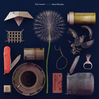

= Fatal Mistakes
Del Amitri
2021
:toc:

   

From: https://www.azlyrics.com/d/delamitri.html

== You Can't Go Back

[verse]
____
You can't go back
Honey, that is what they told us
You know what I think of that
Cos I'm back here at your side
Were you lonely?
Were you eaten up inside
Thinking if only we'd tried...

You can't go back
But back then nobody could hold me
So I've come back round
And I'm holding you to this
That thing between us
That we knew was something special
Well, it seems it still is...

They can't destroy us
We put the seal on it
So be joyous
Cos once the fuse is lit
You can't go back
You can't go back

That thing between us
That we knew was something special
Well, it seems it still is...

You can't go back
That is what they told us
I know what you think of that
You've made it pretty clear
So, baby
Promise me forever
You will stay right here...

And you can't go back
You can't go back
You can't go back
You can't go back

That is what they told us...
(You can't go back...) 
____

== All Hail Blind Love

[verse]
____
Is this a revival
Or just the last breath
At the end of the regime?
People toast our survival
As if slogging on
Is living out the dream

So hold up your faces
Left to your devices
You'd have killed us off
We would have never kept going
If the going wasn't so damned rough

All hail blind love
All hail blind love

Don't assume we've mellowed
We still think of one another
As a fraud
Such strange bedfellows
It's the hatred and resentment
You applaud

So fill up your glasses
Here's to another thirty years full of
Wounding each other
Like we just can't get enough

All hail blind love
All hail blind love

All hail the trail of failures
Slights and snide remarks
Flung with a sneer
So add your wishes here
We can only hope you're both
Still blind next year

So hold up your faces
Left to your devices
You'd have killed us off
We would have never kept going
If the going wasn't so damned rough

All hail blind love
All hail blind love
All hail blind love
All hail blind love

All hail, all hail blind love 
____

== Musicians and Beer

[verse]
____
God doesn't love you
God doesn't care
You lie on the slab with
Blood in your hair
And the voices of angels
Are flat and austere
Well, that's what you get if you don't book
Musicians and beer

You stand on the vanquished
Your feet on their chests
Posing like starlets
In bulletproof vests
Your wife doesn't love you
She's sick of the fear
Sick of living without
Musicians and beer

So lock up your daughters
Shit, you already did
At least Muddy Waters
Can't fuck with your kids
I'm an avid blasphemer
With a passion for queer
Cos I can't live without
Musicians and beer

My granddaddy's bible
So brooding and black
Lies like a tombstone
On my own daddy's back
And we lowered him down
Without a tear
So he died like a pauper
Without musicians and beer
So this is an order
Get yourself some
Musicians and beer 
____

== Close Your Eyes and Think of England

[verse]
____
Day by day we're winnowing away
At the kind of world the heathens have their eyes on
Step by step the sun is gonna set
On the waves that sully the horizon

So close your eyes and think of England
That boat afloat on the ocean sets my spine a-tingling
So let the boys brigade be singing
Close your eyes, close your eyes

Blow by blow, there's gonna be a show
We're gonna teach the goons the who is who of history
Deal by deal we'll crush them on a wheel
Of progress and manifest destiny

So close your eyes and think of England
That boat afloat on the ocean with the chains of state a-jingling
And at the sight of intermingling
Close your eyes, close your eyes

Close the door behind you, I feel kinda blue
I guess I miss the time
The scapegoat was always someone new
So step up to the camera, you

And close your eyes and think of England
That boat afloat all alone on the ocean is sinking
And a telephone is ringing, the coastguard have been drinking
Nobody had an inkling 'cause they closed their eyes
Close your eyes, close your eyes, close your eyes 
____

== Losing the Will to Die

[verse]
____
I wish I could feel like people feel
I wish I didn't have a heart
That sits like a stone in its jail of bones
Ready to be ripped apart

But yesterday I felt a funny thing
Maybe you know why
I'm losing the will
I'm losing the will to die

I thought I was done, I was way beyond
The solace of the sight of land
No flash of distress in the blackness
Everything beautifully planned

But suddenly I see searchlights
Maybe you know why
I'm losing the will
I'm losing the will to die

I've got pills and poisons
Hosepipes, knives
And ropes in rich supply
But the notes I wrote are mouldy
And the inkwell's going dry

Cos I'm losing the will
I'm losing the will to die

Hooray! Hooray! It's Saturday
Time to tie the noose
All praise to you and your savagery
The rope has another use

So happy that I've got an aim in life
Maybe you know why
I'm losing the will
I'm losing the will to die
I'm losing the will
I'm losing the will to die 
____

== Otherwise

[verse]
____
Otherwise
We'd be dancing on a beach
In the starlight
With a margarita each
Otherwise
We'd be riding on a bus
Into nowhere
Babe, I wish it was

Otherwise
Not barely getting through
Another night
With the curtains drawn
To keep us from
Seeing other people's lives

Otherwise
We'd be rolling in the aisles
And kids
Would be rolling their eyes

Otherwise
We're holding on
To the lifeboat's sides
And the only thing
Keeping us afloat
Is to dream what might have been
Otherwise...

Otherwise
I'd be leaving you alone
Not watching you try
To push the blood back in a stone
Otherwise
We'd walk along the sea
Not realise
That life is going to be
Otherwise
Babe, I wish it was
Otherwise
Babe, I wish it was
Otherwise 
____

== It's Feelings

[verse]
____
All the raindrops in the air
Come make a river through my hair
Come down and drown me
I don't care

'Cause it's feelings
That cut you
It's feelings
I can't bear
But it's feelings
That put you there

All the sickness, all the bruises
All the shit that no one chooses
Bring it on in its disguises
I'll take the knockouts with the prizes

'Cause it's feelings
That cut you
And it's feelings
I can't bear
But it's feelings
That put you there

(Put you there)
Trying to make some sense of why you can't see straight
(Put you there)
While the world goes past like a pantomime behind the glass
(Put you there)
Holding a dead man's hand as his watch ticks like the rain

It's just feelings
That cut you
It's just feelings
That put you there
It's just feelings 
____

== I'm so Scared of Dying

[verse]
____
I'm so scared of dying
And leaving you behind

Every day I try just to stay alive
So you won't be sitting by
That empty chair at night
I'm smoking like a factory
Come on, keep ahead of me
Don't wanna think of you
Happy and alone

Cos I'm so scared of dying
And leaving you behind

I put a little poison in your cup one time
So lock me up, baby if mercy is a crime
I check your breathing as you sleep
Hoping it slows and stops for keeps
Don't wanna think you might
Have to be alone

Cos I'm so scared of dying
And leaving you behind

Don't wanna think of you
Running through the worst of me
Or you to figure out
You should've long ago got free
It is better for us both if I survive
So you never know how it feels
To truly be alive

Cos I'm so scared of dying
And leaving you behind
I'm so scared of dying
And leaving you behind
I'm so scared of
I'm so scared of dying
I'm so scared of
Every day I just try to stay alive
Cos I'm so scared of dying 
____

== Mockingbird, Copy Me Now

[verse]
____
I shout it at the moon
But my love gets hit by her lampoon
I'm just waiting for
My mockingbird to copy me now

She shoots straight from the throat
Under my gate, over the moat
But I'm just waiting for
My mockingbird to copy me now

Once I get the pills inside me
She'll follow through
She'll lie like a fresh kill beside me
Swallow what I do

I'll drink this venom at my leisure
And she'll mimic me measure for measure
I'm just waiting for
My mockingbird to copy me now

Mockingbird, copy me now
Baby, copy me now
Baby, copy me now 
____

== Missing Person

[verse]
____
I am lipsticked like a tart
In the cherry red of Côtes-du-Rhône
Prodding at the little fire of my phone
The lights behind the bar
Twinkle like they've always known
Only desperate little men ever drink alone

But as long as I'm here, I've disappeared
And it's vanishing
I'm a missing person doing my thing

As midnight strikes
I slip into this queen of dives
And quietly oblivion like sleep arrives
But I couldn't live without
This sewer of a place to be
Alone with my one obsession - me, me, me
Yeh, I can hear her remonstrate
You fool, that's three

What I'm doing here, ain't drinking beer
It's vanishing
I'm a missing person doing my thing
Just a missing person doing my thing

Missing the time I threw your crutch away
And ruined a perfect day
Now it's all ruins from here to daybreak

So I hang on to my chair
In this fish tank of sinking stars
Pickling their memories in Mason jars
I head out for a smoke
Leave your ghost there to hold my place
And line up with the other cheaters
In disgrace
Like runners in exile
From the human race

But as long as I'm here, this last brutal year
Is vanishing
I'm a missing person doing my thing
Just a missing person doing my thing 
____

== Second Staircase

[verse]
____
There is a second staircase
Leading from a chamber of my heart
Concealed behind a bookcase
Leading up into the dark
And the second staircase
Is tearing the house apart

There's a secret number
Written on a ticket in a drawer
I don't know if I love her
But I've been crazy since I saw her
There is a second staircase
Only I know what it's for

It is burning through my mind
I don't wanna leave this all behind
I built it all up from the ground
Why would I tear the old place down?

So I blocked the second staircase
Behind some old junk we never use
I threw the ticket in the fireplace
Forgot everything I knew
Cos beyond the second staircase
Is life without you
I can't take the second staircase
It's all too much to lose 
____

== Lonely

[verse]
____
Lonely I have been without her
Lonely I have been so long
The only thing that keeps me going is
I know she's wrong

Wrong to think I wouldn't miss her
Wrong to think I'd be alright
And wrong is all I feel
In bed at night

I listen out for the bell to ring
In the chapel on the hill
The crowd of sound from the streets around
Is a howl of sadness still

I don't think I could ever wander
I don't think I could ever stray
The mark she left on my heart
Is gonna stay

I walk my rumour through the city
To fill the empty afternoon
And turn for home
Under the mocking of the moon

The crazy thing about a golden ring
Is it will melt in any fire
But I didn't think for a minute
She would simply melt at his desire 
____

== Nation of Caners

[verse]
____
We're a nation of caners
Excusers, explainers
We're wasting away every night, every day
Assuring ourselves we're blameless
Of everything heading their way

We use and we use, throw away and away
Caning the plains, planing the cane
Jetting the snuff and snuffing the pain
Nothing's enough, nothing's enough
A sniff on a cuff and a fag to a flame
Downing the foam and filling the drain
Ravenous men, ravenous girls
Ravage it all until nothing remains

Blue yonder, the wonder
Of getting beyond the pale
Slipping out of the jailed brain to a cage
We made in a rage of thirst
Thirst for ease, thirst for plunder
Thirst for junk and speed and candour
Thirst for splendour, a binge, a bender
Return to sender

Burn the canopy churn the blender
Rape the barley, bend the fender
Burn the embers, burn the embers
Cane and cane and cane dissenters
Ream the renters, shame the campers
Stamp the punters through
Members get a tent to hurl into
We all know where we're going to

We're a nation of caners
Who could blame us –
Have you seen the state of what
They left for us to use?
Have you seen the place
They think is fit for humans, fit for purpose?
Purpose being caning, caning
Purges in the virgin forest
Urges in the depth of dreaming
Muffled screaming coming from the cane
Desperate praying underneath the rain
Consume it all you must
Or there'll be never ending pain
A future filled with cesspits of the slain
A future that we never could
Explain for all the world
The caner boys, the caner girls
Buried in their shame
Nation against nation
Never sickening of the game

We're a race apart of caners
Floggers, torturers in trainers
Ostrich headed party planners
Carry-onners, carry-outers
Flat denial earthers, science doubters
Flabby thinkers, shabby lovers
Anti-social fatal drinkers
Shirkers, duckers, divers, wankers
Blissed and pissed within our blinkers

A caning nation
An acidic aberration
A full-force pillage through
The gifts of the creation
Heaven was our source
The underworld our destination
There are worthless whirls of bank notes
Floating through the station
Can you hear the desperate praying
Underneath the rain?
Can you feel the past
Shoving us on to the train?

We're a nation of caners
And who can blame us?
Mamma lets us follow
Anywhere our nature takes us
Fruit loop blitzers
We've got a taste for space
And need to fill the void with chasers
Need to drink to our disgraces
Peak grease racers
We can't stop until we die
Pull me back into the bar
Before I see the sky

Baby, you're working for the man
You're doing everything you can
The weight of shit you carry round
One day you're gonna just derail
Every time I pick you up
It's like I'm springing you from jail

We're a nation of caners
Who can blame us?
A nation of caners
Who can blame us?
We're a nation of caners
Who can blame us?
A nation of caners
Who can blame us?

Who can blame us?
Who can blame us?
Who can blame us?
Who can blame us?
Who can blame us?
Who can blame us?
Who can blame us?
Who can blame us?

Can you hear the desperate praying
Underneath the rain?
Can you feel the past
Shoving us on to the train?

Who can blame us?
Who can blame us?
Who?
Who can blame us?
Who? 
____
