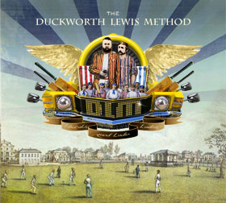

= The Duckworth Lewis Method
The Duckworth Lewis Method
2009
:toc:

From https://genius.com/albums/The-duckworth-lewis-method/The-duckworth-lewis-method

++++
 
++++	

== The Coin Toss

[verse]
____
Hello.
Good morning. (Morning!)
We're tossing a coin to begin.
Duckworth go ahead.
No Lewis; up to you.
May the best man win,
And may the best Duckworth lose.
Let's begin.

It's heads,
You called it.
I think I'll go in for bat.
And that's that.
____

== The Age of Revolution

[verse]
____
Princes and lawyers played with the English elite
Years of repression started a noise from the streets

CHORUS:
The age of revolution, the age of revolution
from Bangalore to Kingston, the age of revolution
Go and get your pads on, take your place in the sun
from Bangalore to Kingston, the age of revolution

It's the age of revolution... It's the age of 
revolution

Mankad in Madras, but suddenly Sunil is king.
Kids in the valleys, bats bound together with string, 
oh yeah!

"Time to take the new ball, the dollars and the rubles.
Stormont to the Oval, we're all going global."

CHORUS

It's the age of revolution... It's the age of 
revolution
It's the age of revolution... It's the age of 
revolution

Here's to the future, Punjab and Tamil Nadu.
Always remember the passion of '32, oh yeah, yeah!

"Always denied entry by the English gentry.
Now we're driving Bentley's playing 20/20"

CHORUS 2x
____

== Gentlemen And Players

[verse]
____
Gentlemen and players play sunday afternoon
gentlemen and players play april, may and june

a bored young William Ward M.P.
bought lords from Thomas Lord in 1825
Oh to sweep perchance to dream
of cricket played between two teams of...

gentlemen and players play sunday afternoon
gentlemen and players play april, may and june

Fuller Pilch pulls on his pipe
and nonchalantly pops his top hat on his head
but Mr. Pilch he comes a cropper
knocks the bails off with his topper....

gentlemen and players play sunday afternoon
gentlemen and players play april, may and june

to enhance the gentry's chances
they were granted the advantage of an extra stump
but still they couldn't hit a barn door,
just another "Ripping Yarn" for...

gentlemen and players play sunday afternoon
gentlemen and players play april, may and june
____

== The Sweet Spot

[verse]
____
I can hit the sweet spot; hit it oh so fine.
I can hit the sweet spot; like the sweetest wine.
I'm down on one knee just to please you all the time.

When I hit the sweet spot, I see it in your eyes,
When I hit the sweet spot, you win the sweetest prize, oh yeah.
Don't ever stray, 'cause that ain't no compromise.

Find the sweet spot.
Hit the sweet spot.
Find the sweet spot.
Hit the sweet spot.
Find the sweet spot.
Hit the sweet spot.
Find the sweet spot.

I can hit the sweet spot; sweet as apple pie.
I can hit the sweet spot; hit you really high.
My aim is true, gonna hit you out of sight.

I can find the sweet spot; sweet as sugar love.
I can find the sweet spot; the diamond in the rough.
No I ain't gonna share though I just can't get enough.

Find the sweet spot.
Hit the sweet spot.
Find the sweet spot.
Hit the sweet spot.

I can hit the sweet spot; hit it oh so fine.
I can hit the sweet spot; like the sweetest wine.
I'm down on one knee just to please you all the time.
My aim is true, gonna I hit you out of sight.
Don't ever stray, 'cause that ain't no compromise.
I'm down on one knee just to please you all the time.
____

== Jiggery Pokery

[verse]
____
'Twas the first test of the Ashes Series 1993
Australia had only managed 289 and we
felt all was going to plan
that first innings at Old Trafford.
Then Merv Hughes and his handlebar moustache
dismissed poor Athers.

I took the crease to great applause
and focussed on me dinner.
I knew that I had little cause
to fear their young leg spinner.
He loosened up his shoulder
and, with no run-up at all,
he rolled his right arm over
and he let go of the ball.

It was jiggery pokery, trickery, jokery,
How did he open me up?
Robbery, muggery, Aussie skull-duggery,
Out for a buggering duck.
What a delivery.
I might as well have been,
holding a contra bassoon.
Jiggery Pokery who was this nobody
making me look a buffoon?
Like a blithering old buffoon.

At first the ball looked straight enough
I had it in me sights,
but such was its rotation
that it swerved out to the right.
I thought 'Well, that's a leg break.
That's easily defended.'
So I stuck my left leg out
and jammed my bat against it.

But the ball it span obscenely 
and out of the rough it jumped,
veered back across my bat and pad
clipping my off stump.
It took a while to hit me,
I momentarily lingered.
But then I saw old Dickie Bird
slowly raise his finger.

It was jiggery pokery, trickery, jokery.
How did he open me up?
Robbery, muggery, Aussie skull-duggery.
Out for a buggering duck.
What a delivery.
I might as well have been
holding a child's balloon.
Jiggery Pokery, who was this nobody
making me look a buffoon?
Like an accident-prone baboon.

How such a ball could be bowled?
I don't know but if you asked me
if it has been a cheese roll,
it would never have got past me.

It was jiggery pokery, trickery, jokery.
How did he open me up?
Robbery, muggery, Aussie skull-duggery.
What in the buggery
was his delivery?
I might as well have been
holding a cob of corn.
Jiggery Pokery, who was this nobody
making me look so forlorn?

I hate Shane Warne!
____

== Mason on The Boundary

[verse]
____
On a sunny summers day, we'll enjoy a full days play
Out on the boundary
All of Masons friends are there, Lily with the sunflower 
hair
Out on the boundary

Theres no surprise, Mason resides on the boundary

Whistling an old world song, Mason knows that he belongs
Out on the boundary
Drinking in the history in the shade of a willow tree
Out on the boundary

Masons gone to Zanzibar, underneath his panama
Out in the boundary
Fading in the evening sun, hopelessly panglossian
Out on the boundary

Theres no surprise, theres peace in his eyes.........On 
the Boundary

Mason on the boundary (Till the end)
____

== Rain Stops Play

== Meeting Mr. Miandad

[verse]
____
Woke up from a dream Thursday morning
Mr. Miandad to me was calling, yeah
Got Duckie on the phone and when he'd stopped yawning
I said "Pack up your bags we're going to Pakistan" cause...

We're meeting Mr. Miandad, meeting Mr. Miandad
When we get to Pakistan in our VW camper van
We're meeting Mr. Miandad, meeting Mr. Miandad
It's our historical phantasmagorical destiny

Everywhere we go people know us
When we lose our way people show us
When we break down people tow us
And send us on our way with a smile and a little wave
Hey Hey Hey!

We're meeting Mr. Miandad, meeting Mr. Miandad
When we get to Pakistan in our VW camper van
We're meeting Mr. Miandad, meeting Mr. Miandad
It's our historical phantasmagorical destiny

It's gonna take a while but when we get there
Mr. Miandad will be met there
We'll shake him by the hand and he'll say
"Wait there, while I get my guitar I'm a rock'n'roll star like you"
Woo Hoo Hoo!

We're meeting Mr. Miandad, meeting Mr. Miandad
When we get to Pakistan in our VW camper van
We're meeting Mr. Miandad, meeting Mr. Miandad
It's our historical phantasmagorical destiny

It's our historical phantasmagorical destiny
____

== The Nightwatchman

[verse]
____
I'm the nightwatchman
I lie awake
Wondering what's gonna happen when the dawn breaks

I'm the nightwatchman
I take the fall
I'll always be around when you call

'Cause all that I have is yours
I'd give it all and more to be by your side in the morning light

I'm the nightwatchman
Alone in my bed
Fighting the ghosts and the demons inside my head

Morning has broken and I've got to go 
How it's gonna end I don't know

But all that I have is yours
I'd give it all and more
When they let you down, call me I'll be around
'Cause all that I have is yours
I'd give it all and more to be by your side
In the morning light.
In the morning light
____

== Flatten The Hay

[verse]
____
Finding the sun in an Irish summer
Is somewhat akin to Russian roulette... anyway
We would spend August in Arklow and Courtown
And I would be clutching my cricket set. Gotta play!

Jump over walls, flatten the hay

A quick evening session before we could even
Have time to reflect on our holiday commencing
Will we play football or go pitch and putting? We know we have
Swing-ball but we'd always plump for the gentlemen's game

Yellow the grass, flatten the hay. All day...

The farmer would come before the bad weather
Our pavilion would seem like a blur in the ether

The night would creep in on our Indian summer
But tomorrow would bring a new crease to discover

D.i and I.t, Gatting and Willey
May sound so silly to the uninitiated
For me and my brother they conjured up visions
Of heroes who stood against all of the things that we hated

Let's jump over walls and flatten the hay
All day... all summer long
When we were young
____

== Test Match Special

[verse]
____
Give me the sun and a big tv
Give me a chair positioned beautifully
Give me a hat trick from the SCG
Give me a Test Match Special
And set me free

Show me the outfield from a zeppelin
Show me the coin toss that we never win
Peruse the paper, sip some Earl Grey tea
And let the Test Match Special
Set you free

Test Match Special
Will set you free
The Test Match Special

It's time for drinks!

And now we're back on the field of play
And we'll be here for the next five days
Look there's a streaker (*whistles*) running through the crease
Only the Test Match Special
Can set you free

The Test Match Special
Will set you free
The Test Match Special
Will set you free
The Test Match Special
It's gonna set you free
Test Match Special

*woo!*
____

== The End of The Over

[verse]
____
One. Two
Three. Four
Five. Six

One. Two
Three. Four
Five. Six

One. (One two three) Two. (four five six)
Three. (One two three) Four. (four five six)
Five. (one two three) Six. (four five six)

One. (One two three) Two. (four five six)
Three. (One two three) Four. (four five six)
Five. (one two three) Six. (four five six)
[repeat]

The end of the over
The over is ending
The end of the end of the
Over is over
The end of the end of the
Over is ended
The end of the over
The Over is ended
The end of the end of the
Over is over
The end of the end of the
Over my friend

The end of the over
The over is ended

Duckworth and Lewis are out
____
