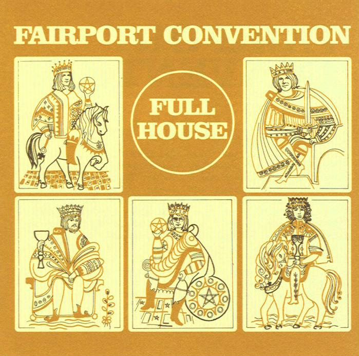

= Full House
Fairport Convention
1970
:toc:

From::
https://oldielyrics.com/f/fairport_convention.html +
https://www.azlyrics.com/f/fairportconvention.html

== Walk Awhile

[verse]
____
Walk awhile, walk awhile, walk awhile with me
The more we walk together love, the better we'll agree
We'll agree

One hand in your mouth and a finger in your eye
Undertakers bow their heads as you go walking by

Walk awhile, walk awhile, walk awhile with me
The more we walk together love, the better we'll agree
We'll agree

Here comes another Sunday, ringing on the bell
And here comes your own dear child with another tale to tell

Walk awhile, walk awhile, walk awhile with me
The more we walk together love, the better we'll agree
We'll agree

Bring along the brewer's head, bring the cuckoo tree
Bring your lady mother along to keep us company

Walk awhile, walk awhile, walk awhile with me
The more we walk together love, the better we'll agree
We'll agree

Two miles down the road, Henry Tomkins' wife
Three miles down the road, he's running for his life

Walk awhile, walk awhile, walk awhile with me
The more we walk together love, the better we'll agree
We'll agree

O walk awhile, walk awhile, walk awhile with me
The more we walk together love, the better we'll agree
We'll agree
____

== Dirty Linen

== Sloth

[verse]
____
Just a roll, just a roll
Just a roll on your drum
Just a roll, just a roll
And the war has begun

Now the right things, the wrong things
No more excuses to come
Just one step at a time
And the war has begun

Just a roll, just a roll
Just a roll on your drum
Just a roll, just a roll
And the war has begun

She's run away, she's run away
And she ran so bitterly
Now call to your colours, friend
Don't you call to me

Just a roll, just a roll
Just a roll on your drum
Just a roll, just a roll
And the war has begun

Don't you cry, don't you cry
Don't you cry upon the sea
Don't you cry, don't you cry
For your lady and me

Just a roll, just a roll
Just a roll on your drum
Just a roll, just a roll
And the war has begun
Just a roll, just a roll
Just a roll on your drum
Just a roll, just a roll
And the war has begun
____

== Sir Patrick Spens

[verse]
____
The King sits in Dunfirmline town, drinking of the blood-red wine
"Where can I get a steely skipper to sail this mighty boat of mine?"

Then up there spoke a bonny boy, sitting at the King's right knee
"Sir Patrick Spens is the very best seaman that ever sailed upon the sea"

The King has written a broad letter and sealed it up with his own right hand
Sending word unto Sir Patrick to come to him at his command

"An enemy then this must be who told the lie concerning me
For I was never a very good seaman, nor ever do intend to be"

"Last night I saw the new moon clear with the old moon in her hair
And that is a sign since we were born that means there'll be a deadly storm"

They had not sailed upon the deep a day, a day but barely free
When loud and boisterous blew the winds and loud and noisy blew the sea

Then up there came a mermaiden, a comb and glass all in her hand
"Here's to you my merry young men for you'll not see dry land again"

"Long may my lady stand with a lantern in her hand
Before she sees my bonny ship come sailing homeward to dry land"

Forty miles off Aberdeen, the waters fifty fathoms deep
There lies good Sir Patrick Spens with the Scots lords at his feet
____

== Flatback Caper

== Doctor Of Physick

[verse]
____
Take care daughter dear
Don't dream of many gallant men tonight
Take care daughter dear
For the doctor comes to steal your goods in the dead of night
Every sigh he'll hear
So wear your relic near
Doctor Monk unpacks his trunk tonight

Oh father dear
I dreamed last night a man sat on me bed
And I fear
When I awoke I could not find my maidenhead
Every sigh he'll hear
So wear your relic near
Doctor Monk unpacks his trunk tonight

He'll have you all
You fine young ladies pure as fallen snow
He'll have you all
If you think upon improper things the doctor will know
Every sigh he'll hear
So wear your relic near
Doctor Monk unpacks his trunk tonight
Doctor Monk unpacks his trunk tonight
____

== Flowers Of The Forest

[verse]
____
I've heard them lilting
At our ewe-milking
And I've heard them lilting
Before light o' day

Now they are mourning
For all time lamenting
The flowers of the forest
Are all wede away

Sad they for the order
That sent them to the border
The English by guile
For once won the day

Now they are mourning
For all time lamenting
The flowers of the forest
Are all wede away

I've heard them lilting
At our ewe-milking
And I've heard them lilting
Before light a-day

Now they are mourning
For all time lamenting
The flowers of the forest
Are all wede away
____

== Now Be Thankful

[verse]
____
When the stone is grown too cold to kneel
In crystal waters I will be bound
Cold as stone, weary to the sounds upon the wheel

Now be thankful for good things below
Now be thankful to your maker
For the rose, the red rose blooms for all to know

When the fire is grown too fierce to breathe
In burning irons I will be bound
Fierce as fire weary to the sounds upon the wheel

Now be thankful for good things below
Now be thankful to your maker
For the rose, the red rose blooms for all to know

When the stone is grown too cold to kneel
In crystal waters I'll be bound
Cold as stone, weary to the sounds upon the wheel

Now be thankful for good things below
Now be thankful to your maker
For the rose, the red rose blooms for all to know 
____

== Bonny Bunch Of Roses

[verse]
____
By the margin of the ocean, one summer day in the month of June
The feather'd warbling songsters their voices sweetly sang in tune
It was there I met a female all overcome with grief and woe
Conversing with Napoleon on the Bonny Bunch of Roses, O

Then up spoke young Napoleon and he took her by the hand
Saying "Mother dear, be patient, and I soon will take command
And I'll raise a mighty army, and through tremendous dangers go
And I'll conquer all the universe, and I'll have the Bonny Bunch of Roses, O"

"When first you saw great Bonaparte, you fell upon your bended knee
And asked your father's life of him he granted it most manfully
It was then he took an army, and o'er the frozen Alps did go
Saying, "I'll conquer Moscow and come back for the Bonnie Bunch of Roses, O"

Oh he took a mighty army, princes and dukes were in his train
He was so well provided for, enough to sweep the world for gain
But when he came to Moscow, all overpowered by sleet and snow
And Moscow was a-blazing, he lost the Bonnie Bunch of Roses, O

Now son, don't speak so venturesome, for England has the heart of oak
And England, Ireland, Scotland, their unity will ne'er be broke
So remember your father, in Saint Helena he lies low
And you will follow after, beware of the Bonnie Bunch of Roses, O

Adieu, adieu forever, now I bow my youthful head
Had I lived I might have been clever, but now I lie on my dying bed
And as the waters do flow and the weeping willows over me grow
The name of brave Napoleon will enshrine the Bonnie Bunch of Roses, O
____
