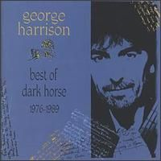

= Best Of Dark Horse 1976-1989
George Harrison
:toc:

From https://www.azlyrics.com/g/georgeharrison.html

== All Those Years ago

[verse]
____
I'm shouting all about love
While they treated you like a dog
When you were the one who had made it
so clear
All those years ago.

I'm talking all about how to give
They don't act with much honesty
But you point the way to the truth when you say
All you need is love.

Living with good and bad
I always look up to you
Now we're left cold and sad
By someone the devil's best friend
Someone who offended all.

We're living in a bad dream
They've forgotten all about mankind
And you were the one they backed up to
the wall
All those years ago
You were the one who Imagined it all
All those years ago.

Deep in the darkest night
I send out a prayer to you
Now in the world of light
Where the spirit free of the lies
And all else that we despised.

They've forgotten all about God
He's the only reason we exist
Yet you were the one that they said was
so weird
All those years ago
You said it all though not many had ears
All those years ago
You had control of our smiles and our tears
All those years ago 
____

== Blow Away

[verse]
____
Day turned black, sky ripped apart
Rained for a year 'til it dampened my heart
Cracks and leaks
The floorboards caught rot
About to go down
I had almost forgot.

All I got to do is to love you
All I got to be is, be happy
All it's got to take is some warmth to make it
Blow Away, Blow Away, Blow Away.

Sky cleared up, day turned to bright
Closing both eyes now the head filled with light
Hard to remember what a state I was in
Instant amnesia
Yang to the Yin.

All I got to do is to love you
All I got to be is, be happy
All it's got to take is some warmth to make it
Blow Away, Blow Away, Blow Away.

Wind blew in, cloud was dispersed
Rainbows appearing, the pressures were burst
Breezes a-singing, now feeling good
The moment had passed
Like I knew that it should.

All I got to do is to love you
All I got to be is, be happy
All it's got to take is some warmth to make it
Blow Away, Blow Away, Blow Away. 
____

== Cheer Down

[verse]
____
(from "Lethal Weapon 2" Soundtrack)

I can see by your grin
That you're trembling within
It's all over town, cheer down
And the smile on your face
Is sometimes out of place
Don't mind, no frowns, cheer down.

If your hair should fall
If your shares should crash
You'll get by even without getting a rash

There's no tears to be shed
I'm gonna love you instead
I want you around, cheer down.

When your teeth drop out
You'll get by even without taking a bite

If your dog should be dead
I'm gonna love you instead
The world loves a clown, cheer down.
I want you around, cheer down
____

== Cloud Nine

[verse]
____
Have my love
It fits you like a glove
Join my dream, tell me yes
Bail out should there be a mess
The pieces you don't need are mine

Take my time
I'll show you cloud nine
Take my smile and my heart
They were yours from the start
The pieces to omit are mine

Have my love
Use it while it does you good
Share my highs but the times
That it hurts pay no mind
The pieces you don't need are mine

I'll see you there on cloud nine

Take my hope
Maybe even share a joke
If there's good to be shown
You may make it all your own
And if you want to quit that's fine
While you're out looking for cloud nine 
____

== Cockamamie Business

[verse]
____
Bust my back on the Levy - broke my strings on the BBC
Found my chops on Eel Pie Island - paid my dues at the Marquee
Slagged off by the N.M.E. - lost my stash and my virginity
In this Cockamamie Business

Got my face on Ed Sullivan - broke my heart on the Soul Train
Introduced to Bad Company - lost cells down at Brain Drain
And before I could mend - lost the missus, missed the girlfriend
In this Cockamamie Business

Now we like to air condition - though the air has no ozone ring
Still they're chopping down the forest for McDonalds and the Burger King
Eating cows with such persistance - doesn't offer much resistance
To this Cockamamie Business

There are too many things - stressing out the nervous system
Girls you used to know - fellas that may have kissed'em
Some got rabies - Some got fleas - some got incurable diseases
From this Cockamamie Business

Everybody's after as many points as they can get
As long as it's not them that has to pay
No one really minds the Debt
5-Star actors, tax inspectors, film producers and directors
With their Cockamamie Business

Well you do what you can - can't do much more than that
(No you can't do what he just said)
Some days you're pretty sharp - on other days you feel half dead
(While you make your daily bread)
Didn't want to be a star - wanted just to play guitar
In this Cockamamie Business 
____

== Crackerbox Palace

[verse]
____
I was so young when I was born
My eyes could not yet see
And by the time of my first dawn
Somebody holding me . . . they said

I welcome you to Crackerbox Palace
We've been expecting you
You bring such joy in Crackerbox Palace
No matter where you roam know our love is true

While growing up or trying to
Not knowing where to start
I looked around for someone who
May help reveal my heart - someone said

While you're a part of Cracerbox Palace
Do what the rest all do
Or face the fact that Crackerbox Palace
May have no other choice than to deport you

I welcome you to Crackerbox Palace
We've been expecting you
You bring us joy in Crackerbox Palace
No matter where you roam know our love is true

Sometimes are good . . . sometimes are bad
That's all a part of life
And standing in between them all
I met a Mr. Grief - and he said

I welcome you to Crackerbox Palace
Was not expecting you
Let's rap and tap at Crackerbox Palace
Know that the Lord is well and inside of you

[Chorus]
____

== Gone Troppo

[verse]
____
There he, sitting in the moonlight
Not found, livin no city
He smile, mucho in a sunshine
High life, counting de fruit bat

Troppo, gone troppo, troppo
It's time you know I gone troppo

Plant me, in de Helicona
No thank, meeting de peoples
Wake me, eata the papaya
Much hot, not much on the body

Troppo, gone troppo, gone troppo
It's time you know I gone troppo

Warm sea, see right to the bottom
No like, shoveling snowfall
Good time, drinking on me bottle
The high wide Moreton Bay Fig

Troppo, gone troppo, troppo
It's time you know I gone troppo

Quite like, you ain't seen a sunset
Could be, living in Rain hill
Sun hot, you don't got a backache
Brown skin and very a peeling

Troppo, gone troppo, gone troppo
It's time you know I gone troppo 
____

== Got My Mind Set On You

[verse]
____
I got my mind set on you
I got my mind set on you
I got my mind set on you
I got my mind set on you

But it's gonna take money
A whole lotta spending money
It's gonne take plenty of money
To do it right child

It's gonna take time
A whole lot of precious time
It's gonna take patience and time, ummm
To do it, to do it, to do it, to do it, to do it,
To do it right child

I got my mind set on you
I got my mind set on you
I got my mind set on you
I got my mind set on you

And this time I know it's for real
The feelings that I feel
I know if I put my mind to it
I know that I really can do it

I got my mind set on you
Set on you
I got my mind set on you
Set on you

But it's gonna take money
A whole lotta spending money
It's gonna take plenty of money
To do it right child

It's gonna take time
A whole lot of precious time
It's gonna take patience and time, ummm
To do it, to do it, to do it, to do it, to do it,
To do it right child

I got my mind set on you
I got my mind set on you
I got my mind set on you
I got my mind set on you

And this time I know it's for real
The feelings that I feel
I know if I put my mind to it
I know that I really can do it

But it's gonna take money
A whole lotta spending money
It's gonna take plenty of money
To do it right child

It's gonna take time
A whole lot of precious time
It's gonna take patience and time, ummm
To do it, to do it, to do it, to do it, to do it,
To do it right

Set on you
Set on you
[Repeat]
____

== Here Comes The Moon

[verse]
____
Everybody's talking up a storm
Act like they don't notice it
But here it is and here it comes . . .
Here comes the moon, the moon, the moon, the moon, the moon.

Impulse always quickens when it's full
As it turns my head around me
Yes it does and here it comes
Here comes the moon, the moon, the moon, the moon, the moon.

God's gift I see that's moving up there into the night . . .
Though dark the mirror in the sky reflects us our light:
Looks like a little brother to the sun
Or mother to the stars at night
And here it is and here it comes
Here comes the moon, the moon, the moon, the moon, the moon.

Breath is always taken when it's new
Enhance upon the clouds around it
Yes it is and here it comes
Here comes the moon, the moon, the moon. 
____

== Life Itself

[verse]
____

You are the One
You are my love
You send the rain and bring the sun
You stand alone and speak the truth
You are the breath of life itself, oh yes you are
You are the One

You're in my dream
I hold you there in high esteem
I need you more each step I take
You are the love in life itself, oh yes you are
You are the One

You are the one that I'd die for
And you're all that is real
You are the essence of that which
We taste, touch and feel

You are the One
No matter what
You are the real love that I've got
You are my friend and when life's through
You are the light in death itself, oh yes are
You are the One

They call you Christ, Vsnu, Buddha, Jehovah,
Our Lord
You are, Govindam, Bismillah, Creator of All

You are the One
No matter what
You are the real love that I've got
You are my friend and when life's through
You are the light in death itself, oh yes are
You are the One
You are my love
You send the rain and bring the sun
You stand alone and speak the truth
You are the breath of life itself, oh yes you are
You are the breath of life itself, oh yes you are
You are the One 
____

== Love Comes To Everyone

[verse]
____
Go do it
Got to go through that door
There's no easy way out at all
Still it only takes time
'Til love comes to everyone

For you who it always seems blue
It all comes, it never rains
But it pours
Still it only takes time
'Til love comes to everyone

There in your heart
Something that's never changing
Always a part of
Something that's never ageing
That's in your heart

It's so true it can happen to you all; there
Knock and it will open wide
And it only takes time
'Til love comes to everyone

There in your heart
Something that's never changing
Always a part of
Something that's never ageing
That's in your heart

It's so true it can happen to you all; there
Knock and it will open wide
And it only takes time
'Til love comes to everyone

It only takes time
´Til love comes to everyone 
____

== Poor Little Girl

[verse]
____
Poor little girl
With her head in the air
There's a poorly sick world all around you

Poor horny boy
One thing on his mind
That poor little girl
He must find you

[Chorus:]
There's a whole lotta love
Shaking inside of me
And I must figure out why it's there

There's a bottomless heart
That's hooked into all of you
And it's wondering how much you care

Poor little girl
With a whole in her heart
There's a poorly sick world all around you

Poor horny boy
One thing on his mind
That poor little girl
He must find you

There's a whole lotta love
Shaking inside of me
And I must figure out why it's there

There's a bottomless heart
Hooked into all of you
And it's wondering how much you care

Poor little boy
Head in a whirl
There's a phony slick world all around you

That poor little girl
With her head in the air
That poor little boy he must find you

There's a whole lotta love
Shaking inside of me
And I must figure out why it's there

There's a bottomless heart
Hooked into all of you
And it's wondering how much you care

There's a need and desire I have
To express what's inside of me
I must figure it out while it's still there

And an endless amout of
Of a joy that you touch me with
Thought it's almost too much for me to bear

Poor little girl 
____

== That's The Way It Goes

[verse]
____
There's a man talking on the radio
What he's saying I don't really know
Seems he's lost some stocks and shares
Stops and stares
He's afraid I know
That's the way it goes

There's a man talking of the promised land
He'll aquire it with some Krugerrand
Subdivide and deal it out
Feel his clout
He can stoop so low
And that's the way it goes

There's an actor who hopes to fit the bill
Sees a shining city on a hill
Step up close and see he's blind
Wined and dined
All he has is pose
And that's the way it goes

There's a fire that burns away the lies
Manifesting in the spiritual eye
Though you won't understand the way I feel
You conceal, all there is to know
That's the way it goes 
____

== Wake Up My Love

[verse]
____
Here I go again
Hear that knockin' won't you let me in
Only want that same old thing
Yet it's me here ring, ring, ring

I want your love
Wake up my love
And let it in

Well you know it's me out here
Can't give up now let us make that clear
All I've had's the run around
Though I'm barking like some hound

I want your love
Wake up my love
And let it in

I want your love
Wake up my love
And let it in

My life's been so many ways
Too much darkness gets me crazed
All around us people fight
Christ I'm looking for some light

Inside your love
Wake up my love
And let it in

I don't have no friends of mine
Who can swing me down that vine
Not much sense in what I do
That is why I'm calling you

Inside my love
Wake up my love
And let it in
I want your love
Wake up my love
And let it in
I want your love
Wake up my love
And let it in 
____
