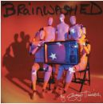

= Brainwashed
George Harrison
2002
:toc:

From https://www.azlyrics.com/g/georgeharrison.html

== Any Road

[verse]
____
(Give me that plenty of that guitar.)

But I've been traveling on a boat and a plane
In a car on a bike with a bus and a train
Traveling there, traveling here
Everywhere in every gear

But oh Lord we pay the price
With the spin of the wheel with the roll of the dice
Ah yeah you pay your fare
And if you don't know where you're going
Any road will take you there

And I've been traveling through the dirt and the grime
From the past to the future through the space and the time
Traveling deep beneath the waves
In watery grottoes and mountainous caves

But oh Lord we've got to fight
With the thoughts in the head with the dark and the light
No use to stop and stare
And if you don't know where you're going
Any road will take you there

You may not know where you came from
May not know who you are
May not have even wondered
How you got this far

I've been traveling on a wing and a prayer
By the skin of my teeth, by the breadth of a hair
Traveling where the four winds blow
With the sun on my face, in the ice and the snow

But oooeeee it's a game
Sometimes you're cool, sometimes you're lame
Ah yeah it's somewhere
And if you don't know where you're going
Any road will take you there

But oh Lord we pay the price
With the spin of the wheel with the roll of the dice
Ah yeah you pay your fare
And if you don't know where you're going
Any road will take you there

I keep traveling around the bend
There was no beginning, there is no end
It wasn't born and never dies
There are no edges, there is no sides

Oh yeah you just don't win
It's so far out, the way out is in
Bow to God and call him Sir
But if you don't know where you're going
Any road will take you there
And if you don't know where you're going
Any road will take you there
If you don't know where you're going
Any road will take you there

(Yeah hey! Ah ee ah! Ah he ah!) 
____

== P2 Vatican Blues (Last Saturday Night)

[verse]
____
Gazed at the ceiling from below
A splendid Michelangelo
Filled my heart with delight
Last Saturday night

Arrived believing from home
Climbed every step inside St. Peter's Dome
Claustrophobic and ex-Catholic
Last Saturday night

Now how come nobody really noticed
Puff of white smoke knocked me out
The truth is hiding, lurking, banking
Things they do at night

It's quite suspicious to say the least
Even mentioned it to my local priest
One Our Father, three Hail Marys
Each Saturday night

(Let's hear it. Call him on ??.
Play a chord, Dhani.)

I wish somebody would tell me
That it's only a show
I'll confess, own up, let's face it
In my concrete tuxedo

It's quite suspicious to say the least
While mentioning it to my priest
One Our Father, three Hail Marys
Each Saturday night

(Hello Father, Father, stick a little right upon with us. It'll be alright.)

One Our Father, three Hail Marys
Each Saturday night
One Our Father, three Hail Marys
Each Saturday night 
____

== Pisces Fish

[verse]
____
Mm mm hmm hmm hmm hmm hmm hmm hmm hmm hmm mm

Rowers gliding on the river
Canadian geese crap along the bank
Back wheel of my bike begins to quiver
The chain is wrapped around the crank

Old ladies, who must be doggie training
Walking, throwing balls, chasing all the sheep
While the farmer stands around, and he's complaining
His mad cows are being put to sleep

And I'm a Pisces fish and the river runs through my soul

Smoke signals from the brewery
Like someone in there found the latest Pope
In a vat of beer that keeps pumping out with fury
While the churchbell ringer's tangled in his rope

There's a temple on an island
I think of all the Gods and what they feel
You can only find them in the deepest silence
I got to get off of this big wheel

And I'm a Pisces fish and the river runs through my soul
I'm a Pisces fish and the river runs through my soul

And I'll be swimming until I can find those waters
That one unbounded ocean of bliss
That's flowing through your parents, sons and daughters
But still an easy thing for us to miss

Blades go skimming through the water
I hear the coxon shouting his instructions about
With this crew oh it could be a tall order
Have we time to sort all of these things out?

Some times my life it seems like fiction
Some of the days it's really quite serene
I'm a living proof of all life's contradictions
One half's going where the other half's just been

And I'm a Pisces fish and the river runs through my soul
I'm a Pisces fish and the river runs through my soul
Mm mm hmm hmm hmm hmm hmm hmm hmm hmm hmm mm
I'm a Pisces fish and the river runs through my soul
Mm mm hmm hmm hmm hmm hmm hmm hmm hmm hmm mm Composer 
____

== Looking For My Life

[verse]
____
Oh Lord, won't you listen in to me now
Oh Love, I got to get me back to you somehow

I never knew that life was loaded
I'd only hung around birds and bees
I never knew that things exploded
I only found it out when I was down upon my knees
Looking for my life, looking for my life

Oh boy, you've not idea what I've been through
Oh Lord, I feel so stuck that I can't get to you

Had no idea that I was heading
Toward a state of emergency
I had no fear where I was treading
I only found it out when I was down upon my knees
Looking for my life
Caught up on me with intensity
Had no idea where I was heading
I only found it out when I was down upon my knees
Looking for my life, looking for my life

Oh boys, you've no idea what I've been through
Oh Lord, I got to get back somehow to you

I never knew that life was loaded
I only hung around birds and bees
I never knew that things exploded
I only found it out when I was down upon my knees
Looking for my life
I never got any GCE's
I never knew that things exploded
I only found it out when I was down upon my knees
Looking for my life, looking for my life
Looking for my life, looking for my life
Looking for my life 
____

== Rising Sun

[verse]
____
On the street of villains taken for a ride
You can have the devil as a guide
Crippled by the boundaries, programmed into guilt
Til your nervous system starts to tilt
In a room of mirrors you can see for miles
But everything that's there is in disguise
Every word you've uttered and every thought you've had
Is all inside your file the good and the bad

But in the rising sun you can feel your life begin
Universe at play inside your DNA
You're a billion years old today
Oh the rising sun and the place it's coming from
Is inside of you and now your payment's overdue
Oh the rising sun, oh the rising sun

On the avenue of sinners I have been employed
Working there til I was near destroyed
I was almost a statistic inside a doctor's case
When I heard the messenger from inner space
He was sending me a signal that for so long I had ignored
But he held on to my umbilical cord
Until the ghost of memory trapped in my body mind
Came out of hiding to become alive

And in the rising sun you can hear your life begin
And it's here and there nowhere and everywhere
Though it's atmosphere is rare
Oh the rising sun and the place that it's coming from
Is inside of me and now I feel it constantly
Oh the rising sun, oh the rising sun

And in the rising sun you can feel your life begin
Universe at play inside your DNA
You're a billion years old today
Oh the rising sun and the place it's coming from
Is inside of you, now your payment's overdue
Oh the rising sun, oh the rising sun
Oh the rising sun, ooh 
____

== Stuck Inside A Cloud

[verse]
____
Never slept so little
Never smoked so much
Lost my concentration I could even lose my touch

Talking to myself
Crying out loud
Only I can hear me
I'm stuck inside a cloud

I made some exhibition
I lost my will to eat
The only thing that matters to me is to touch your lotus feet

Talking to myself
Crying out loud
Only I can hear me
I'm stuck inside a cloud
Talking to myself
Crying out loud
Only I can hear me
And I'm stuck inside a cloud

Talking to myself
Crying out loud
Only I can hear me
I'm stuck inside a cloud

Never been so crazy
But I've never felt so sure
I wish I had the answer to give
Don't even have the cure

Just talking to myself
Crying as we part
Knowing as you leave me
I also lose my heart
Talking to myself
Now crying as we part
Knowing as you leave me
I also lose my heart
____

== Run So Far

[verse]
____
You fly out as your smile wears thin
I sigh knowing the mess you're it
And you know that you can't get away
And you know that you can't hide it from yourself

Lonely days, blue guitar
There's no escape, can only run so far

I know something I ought to say
Stuck here, trying to find a way
And you know that you can't get away
And you know that you can't hide it from yourself

Lonely nights, traveling far
There's no escape, can only run so far
Lonesome tears, after dark
There's no escape, can only run so far

Ooh ooh

You fly out as your smile wears thin
I sigh knowing the mess you're in
And you know that you can't get away
And you know that you can't hide it from yourself

Lonely days, blue guitar
There's no escape, can only run so far
Lonely nights, traveling far
There's no way out, can only run so far
Lonesome tears, after dark
There's no escape, can only run so far

Ooh ooh, ooh ooh ooh ooh ooh ooh
Ooh ooh, ooh ooh ooh ooh ooh ooh 
____

== Never Get Over You

[verse]
____
I know I'll never get over you
So deep this feeling that I have for you
Your eyes pierce through my heart
Your smile tears me apart
I knew it, it's so true
I'll never get over you

You touch me making my heart race
So much was written on your face
I knew when you arrived
That no words could describe
What your love made me do
I'll never get over you

Girl, you're so much heart and soul
Ooh girl, was a moonlit night you came into my life
And now this feeling has grown
And if you leave me alone I know
I'll never get over you

So hide the moments when I feel blue
You warm the coldest feet
Can cool me in the heat
And although love was new
I'll never get over you
My understanding grew
But I'll never get over, never get over you
You, you
____

== Between The Devil And The Deep Blue Sea

[verse]
____
(I'm in. 1, ah 2, ah 1, 2, 3.)

I don't want you
But I hate to lose you
You got me in between the devil and the deep blue sea

I forgive you
Cos I can't forget you
You've got me in between the devil and the deep blue sea

I want to cross you off my list
But when you come knocking at my door
Fate seems to give my heart a twist
And I come running back for more

I should hate you
But I guess I love you
You've got me in between the devil and the deep blue sea

I want to cross you off my list
But when you come knocking at my door
Fate seems to give my heart a twist
And I come running back for more

I should hate you
But I guess I love you
You've got me in between the devil and the deep blue sea

You've got me in between
The devil and the deep (The devil and the deep)
The devil and the deep blue sea 
____

== Rocking Chair In Hawaii

[verse]
____
I'm going down to the river gonna take me my rocking chair
Going down to the river gonna take me my rocking chair
And if those blues don't leave me
Gonna rock on away from here

(The reasons why I love you)

If you want me woman please don't act so shy
If you want me woman please don't pass me by
I love those sideways glances (Yeah)
Your shoulder and your thigh

(The reasons why I love you)
I see inside your eyes, the Baba's Sai
The reasons why I love you

So if you're still busy hiding what it is you've got
If you're frightened of losing what you like a lot
You may be cruising backwards
While thinking that you're not

(The reasons why I love you)
I see into your eyes, the Baba Sais
The reasons why I love you

So if you don't get the picture, you won't know what I feel
If you don't get the picture, then you won't have a depth of field
You may be going some place
Some place you've already been
____

== Brainwashed

[verse]
____
Brainwashed in our childhood
Brainwashed by the school
Brainwashed by our teachers
And brainwashed by all their rules
Brainwashed by our leaders
By our Kings and Queens
Brainwashed in the open
And brainwashed behind the scenes

God God God
A voice cries in the wilderness
God God God
It was on the longest night
God God God
An eternity of darkness
God God God
Someone turned out the spiritual light

Brainwashed by the Nikkei
Brainwashed by Dow Jones
Brainwashed by the FTSE
Nasdaq and secure loans
Brainwashed us from Brussels
Brainwashed us in Bonn
Brainwashed us in Washington
Westminster in London

God God God
You are the wisdom that we seek
God God God
The lover that we miss
God God God
Your nature is eternity
God God God
Your are Existence, Knowledge, Bliss

The soul does not love, it is love itself
It does not exist, it is existence itself
It does not know, it is knowledge itself
How to Know God, pag 130

They brainwashed my great uncle
Brainwashed my cousin Bob
They even got my grandma
When she was working for the mob
Brainwash you while you're sleeping
While in your traffic jam
Brainwash you while you're weeping
While still a baby in your pram
Brainwashed by the military
Brainwashed under duress
Brainwashed by the media
You're brainwashed by the press
Brainwashed by computer
Brainwashed by mobile phones
Brainwashed by the satellite
Brainwashed to the bone

God God God
Won't you lead us through this mess
God God God
From the places of concrete
God God God
Nothing's worse than ignorance
God God God
I just won't accept defeat

God God God
Must be something I forgot
God God God
Down on Bullshit Avenue
God God God
If we can only stop the rot
God God God
Wish that you'd brainwash us too

Namah Parvarti Pataye Hare Hare Mahadev
Namah Parvarti Pataye Hare Hare
Namah Parvarti Pataye Hare Hare

Shiva Shiva Shankara Mahadeva
Hare Hare Hare Hare Mahadeva
Shiva Shiva Shankara Mahadeva
Shiva Shiva Shankara Mahadeva

Namah Parvarti Pataye Hare Hare
Namah Parvarti Pataye Hare Hare
Shiva Shiva Shankara Mahadeva
Shiva Shiva Shankara Mahadeva 
____

