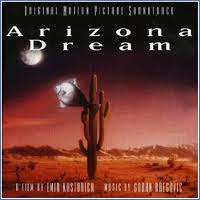

= Arizona Dream
Iggy Pop
1993
:toc:

From::
https://www.justsomelyrics.com/762305/arizona-dream-in-the-deathcar-lyrics.html +
https://www.lyricsmania.com/arizona_dream_album_lyrics_goran_bregovic.html

++++
 
++++	

== In the Deathcar

[verse]
____
A bowling wind is whistling in the night
My dog is growling in the dark
Something's pulling me outside
To ride around in circles
I know that you have got the time
Coz anything I want, you do
You'll take a ride through the strangers
Who don't understand how to feel
In the deathcar, we're alive
In the deathcar, we're alive

I'll let some air come in the window
Kind of wakes me up a little
I don't turn on the radio
Coz they play s___, like... You know
When your hand was down on my d___
It felt quite amazing
And now that, that is all over
All we've got is the silence
In the deathcar, we're alive
In the deathcar, we're alive
So come on mandolins, play

When I touched you
I felt that you still had your baby fat
And a little taste of baby's breath
Makes me forget about death
At your age you're still joking
It ain't time yet for the choking
So now we can own the movie and see each other truly
In the deathcar, we're alive
In the deathcar, we're alive
I want to hear some mandolins
____

== Dreams

instrumental

== Old Home Movie

instrumental

== TV Screen

[verse]
____
Find a beautiful old street
Not rushing through this time
In a bar where a fat lady reigns supreme
Come in and drink with a false name
In circus clothes forget their pain
They are the zombie bodies
Caught in the glow of the TV screen
Just forget it?

Forget it all
The TV screen
TV screen makes you feel small
No life at all

Now that you have turned it off
It's harder than you thought
No one wants to give a damn
Or even hear a thought
They rush from one fad to the next
You talk and it has no effect
You are the target for stars
And the planets on the TV screen
Just forget it?

Forget it all
The TV screen
TV screen makes you feel small
No life at all 
____

== 7-8 & 11-8

[verse]
____
Uci me majko
karaj me
kako da ja zembam
Biljana
Biljana moma
ubava
Biljana
tenka, visoka
Biljana
edna
plavajka
Biljadna edna
plavajka

Teach me mother
show me
the way to love
Biljana
Biljana maiden
lovely
Biljana
slim, tall
Biljana
one
blond girl
Biljana
one
blond girl
Biljana
one
blond girl
____

== Get the Money

[verse]
____
Hey lucky people, North and South
This is your leader, I'm called "the mouth"
We're gonna play a game that's funny
Get the, get the, get the money

Money, money, money, money, money
Money, money

Walking on the beach, all disenchanted
Blackness in my heart
Anything they want now, they can't stop me,energy goes dead.
Riviera buildings, high, depressing
Look like cookie boxes
In my heart a huricane is blowing
In my head a clock ticks.
Tic-tack

Get the money, Mr. Potato
Get the money, pay the Eskimo

Money, money, money, money, money

ABC
Schoolboys, schoolgirls, don't make funny
Take a deep breath, get the money

Money, money, money, money, money

A lot of neigbourhood, oncrete and windows
Uphere on the mountain
I wonder if somebody sees me walking
I could hide in that fountain.
Pretty little girl, I like to know her, coming this way
Back in school, I can't believe that I could not obey

Get the money, Mr. Potato
Get the money, pay the Eskimo

Money, money, money, money, money

Crawl on your belly, bust your skull
There's the money, real as hell

William Tell

Money, money, money, money, money
Money, money

I met an actor, river speed boat
He made crabby movies
Robin Maxwell had a yacht
But it didn't die so groovy

Me, I confess, I like to swim and
watch the telly,my news
I've been hanging 'round the beach
But the money pays my kwanos

Get the money, Mr. Potato
Get the money, pay the Eskimo

Money, money, money, money, money,

It's kind of like a fortress, it's kind of like a tomb
Sitting with your money in a near dark room

Feels like a discharge, feels like a death
Feels like a taste of dying breath

Feels like a toed, feels like a frog
Feels like a serpent, all night long 
____

== Gunpowder

instrumental

== Gypsy Reggae

instrumental

== This Is a Film

[verse]
____
This is a film about a man and a fish
This is a film about dramatic relationship between man and fish
The man stands between life and death
The man thinks
The horse thinks
The sheep thinks
The cow thinks
The dog thinks
The fish doesn't think
The fish is mute, expressionless
The fish doesn't think because the fish knows everything
The fish knows everything
____
