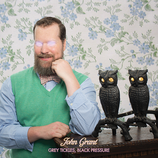

= Grey Tickles, Black Pressure
John Grant
2015
:toc:

From https://www.azlyrics.com/j/johngrant.html

== Intro

[verse]
____
Love is patient, love is kind. It does not envy, it does not boast, it is not proud. It does not dishonor others, it is not self-seeking, it is not easily angered, it keeps no record of wrongs. Love does not delight in evil but rejoices with the truth. It always protects, always trusts, always hopes, always perseveres.

Love is patient, love is kind. It does not envy, it does not boast, it is not proud. It does not dishonor others, it is not self-seeking, it is not easily angered, it keeps no record of wrongs. Love does not delight in evil but rejoices with the truth. It always protects, always trusts, always hopes, always perseveres. 
____

== Grey Tickles, Black Pressure

[verse]
____
I did not think I was
The one being addressed
In hemorrhoid commercials
On the TV set
I often stand and stare
At nothing in the grocery store
Because I do not know
What to buy to eat any more

And parapraxis is
The order of the day
I never heard that word
Until tonight I have to say
And I'm supposed to believe that there's some guy
Who will take the pain away

And there are children who have cancer
And so all bets are off
Cause I can't compete with that
So all bets are off
Cause I can't compete with that

I've got grey tickles and black pressure
And I'd rather lose my arm inside of a corn thresher
Just like Uncle Paul
Just like Uncle Paul
I, I, I

They won't be happy til
They tear down everything
Which looks remotely cool
Or is older than two weeks
You must be kidding me
Except I do know better than to ask

I can't believe I missed
New York during the 70's
I could have gotten a head start
In the world of disease
I'm sure I would have contracted
Every single solitary thing

And there are children who have cancer
And so all bets are off
Cause I can't compete with that
So all bets are off
Cause I can't compete with that

They say let go let go let go
You must learn to let go
If I hear that fucking phrase again
This baby's gonna blow

Into a million itsy bitsy tiny pieces
Don't you know
Just like my favorite scene in Scanners
Apparently there was an outcry of some sort today
Which no-one heard incidentally and by the way

I have not had the strength
To leave my place in days or weeks
And I'll never understand
What's happening in the Middle East

And there are children who have cancer
And so all bets are off
Cause I can't compete with that
So all bets are off
Cause I can't compete with that

I've got grey tickles and black pressure
And I'd rather lose my arm inside of a corn thresher
Just like Uncle Paul
Just like Uncle Paul
I, I, I

I've got grey tickles and black pressure
And I'd rather lose my arm inside of a corn thresher
Just like Uncle Paul
Just like Uncle Paul
I, I, I 
____

== Snug Slacks

[verse]
____
Is it difficult for you to be so beautiful?
Or do you find the advantages tend to outweigh
The disadvantages?
Am I being rude?
I'm sorry, I've never really had the appropriate attitude
Do you think that life is easier when one looks as good as you do?
Or do people always say that you're a narcissist?
Do they ingratiate themselves to you and act all obsequious?
Come on now baby, you can tell me it's just between the two of us

Snug slacks baby snug slacks
Now you're giving me a different kind of panic attack, I said a
Sick joke, baby crack smoke, now take me out in your pick up for a midnight poke
I said Stonehenge baby drug binge
Now you got me all damp down in my netherlands
Snug slacks baby snug slacks
Now let's get you out of those and see what kind of punch your manhood packs

You know it takes an ass like yours to make it possible for me
To have developed such a very high tolerance for inappropriate behaviour
I mean I can take it or leave it, I don't need it
And I hope I haven't spoken out of turn
But if you'd be so kind I could use some help with my thesis on carpet burn
By the way I got tickets for us to see Joan Baez tonight
Oh? I guess I misunderstood, I never heard of Joan as policewoman
But I do love me some Angie Dickinson
And let's be clear, Joan Baez makes GG Allin look like Charlene Tilton

Snug slacks baby snug slacks
Now you're giving me a different kind of panic attack
I said sick joke, baby crack smoke, now take me out in your pick up for a midnight poke
I said Stonehenge baby drug binge
Now you got me all damp down in my netherlands
Snug slacks baby snug slacks
Now let's get you out of those and see what kind of punch your manhood packs 
____

== Guess How I Know

[verse]
____
You laughed all the way through Ordinary People, baby
That's how I knew
Something ain't right, there's no other way to say it, baby
There's something wrong with you
Made a crazy scene at the dairy queen
Only blood sausage will do
I didn't like it in Germany and I ain't gonna start liking it for you

Guess how I know you're a zombie baby cause you rip the heart right out of my chest
You don't really have any feelings baby. You're as cold as ice, it's obvious you're dead
Guess how I know you're a zombie baby cause you rip the heart right out of my chest
You don't really have any feelings baby. You're as cold as ice, it's obvious you're dead

You got real rambunctious at the restaurant
You wouldn't stop throwing food
People gonna start spreading nasty little rumours baby if you don't find a way to fix your mood
Your bed side manner makes me wanna watch Cujo baby for the 20th time
But it kinda gets me hot, kinda hits the spot, I guess it's gotta be an unforgettable crime

Guess how I know you're a zombie baby cause you rip my heart right out of my chest
You don't really have any feelings baby. You're as cold as ice, it's obvious you're dead
Guess how I know you're a zombie baby cause you rip the heart right out of my chest
You don't really have any feelings baby. You're as cold as ice, it's obvious you're dead

Auf wiedersehen, baby
Bon débarras
I'll catch you on the flip side honey
Dasvidania
Auf wiedersehen, baby
Bon débarras
I'll catch you on the flip side honey
Dasvidania
Auf wiedersehen, baby
Bon débarras
I'll catch you on the flip side honey
Dasvidania
Dasvidania 
____

== You And Him 
(Feat. Amanda Palmer)

[verse]
____
You're so hot I bet you hear that a lot
You're so cool I almost wish I were you
You're so slick it's like you're not even trying
You're so fine but can you tell that I'm lying?
You're so cute but you remind me of somebody else
It's on the tip of my tongue no it's not Orson Welles
You're so ambitious you just know you're gonna win
You're so cute I hope they taught you how to swim

You and Hitler oughta get together
You oughta learn to knit and wear matching sweaters
You oughta learn the finer points of decoupage
You oughta spend your weekends cleaning out the garage
You and Hitler oughta tie the knot
You could do it at Taco Bell to spice up the plot
Get on the phone and call your buddy Pol Pot
You could play some Twister and watch Heavy Metal Parking Lot

You're so sweet I really love how you hate
You seem like someone they should chemically castrate
I bet you're planning to have 17 kids
Then 2 nanoseconds later you'll regret that you did because
You're not thinking, you have trouble with that
You think you're super special but you're just a big twat
You probably went to Chernobyl for your honeymoon
You probably acted surprised when they showed you the room

You and Hitler oughta get together
You oughta learn to knit and wear matching sweaters
You oughta learn the finer points of decoupage
You oughta spend your weekends cleaning out the garage
You and Hitler oughta tie the knot
You could do it at Taco Bell to spice up the plot
Get on the phone and call your buddy Pol Pot
You could play some Twister and watch Heavy Metal Parking Lot
You and Hitler oughta get together
You oughta learn to knit and wear matching sweaters
You oughta learn the finer points of decoupage
You oughta spend your weekends cleaning out the garage
You and Hitler oughta tie the knot
You could do it at Taco Bell to spice up the plot
Get on the phone and call your buddy Pol Pot
You could play some Twister and watch Heavy Metal Parking Lot 
____

== Down Here

[verse]
____
You do this, and you'll get that
I want what I was promised, I'm a bit impatient
And what is it exactly that you think that you deserve
No more, no less, is that ridiculous

Cause what we got down here is oceans of longing
And guessing games, and no guarantees
And you work so hard to be in control
And now you're laughing at yourself because you can't let go

Cause all we're doing is learning how to die
Do you really think that nobody see's the fear behind your smile?
And why do you care what anybody thinks at all
It's all going to the same thing in the end

And what we got down here is oceans of longing
And guessing games, and no guarantees
And you work so hard to be in control
And now you're laughing at yourself because you can't let go

And what we got down here is oceans of longing
And guessing games, and no guarantees
And you work so hard to be in control
And now you're laughing at yourself because you can't let go 
____

== Voodoo Doll

[verse]
____
You can't get out of your bed because you're so depressed
No-one understands this and they think that you're a mess
I know this is not the case and I believe in you
I won't stop until I have convinced you of the truth

I made a voodoo doll of you
And I gave it some chicken soup
Did you feel any warmth down deep inside
Did you feel how your blues went away and died
I made a voodoo doll of you
I even put it in a corduroy jumpsuit
Cause I thought that's what you'd do
If you had the opportunity to choose

Even on your worst day I hate no-one less than you
Break in to my house and read my diary if you need some proof
You are going to make it and you'll do much more than that
Just don't stop, just keep on moving
There's no turning back

I made a voodoo doll of you
And I gave it some chicken soup
Did you feel any warmth down deep inside
Did you feel how your blues went away and died
I made a voodoo doll of you
I even put it in a corduroy jumpsuit
Cause I thought that's what you'd do
If you had the opportunity to choose
I made a voodoo doll of you
And I administered hot chocolate too
One time I spilled it all over the place
I really hope you don’t got no burns on your face
I made a voodoo doll of you
I didn't know what else to do
I know you don't get out that much
So I took it on a trip to Kalamazoo
I made a voodoo doll of you
And I gave it some chicken soup
Did you feel any warmth down deep inside
Did you feel how your blues went away and died
I made a voodoo doll of you
I even put it in a corduroy jumpsuit
Cause I thought that's what you'd do
If you had the opportunity to choose
I made a voodoo doll of you
And I administered hot chocolate too
One time I spilled it all over the place
I really hope you don’t got no burns on your face
I made a voodoo doll of you
I didn't know what else to do
I know you don't get out that much
So I took it on a trip to Kalamazoo
I made a voodoo doll of you
____

== Global Warming

[verse]
____
You people and your cute little terms
you like to throw around and make everybody squirm
Upper class, middle class, lower class, Sassafras
Everybody these days thinks that they're a bad-ass
And how am I supposed to live in a world
with no Madeline Kahn my favourite girl is gone
And Bonnie Doon's is now an auto zone
31 is trashed and now I just want to be left alone

Global warming is ruining my fair complexion
Augmenting all my imperfections
And Brazil does not need more encouragement
Global warming encourages slack jawed troglodytes
To leave their homes with guns and knives
In search of bodily refreshments and some homicide

I'm so sick of hearing people talk about the sun
They sound like a bunch of Aztec Indians
And all they do is hang out clogging up the streets
Congratulating each other on their pedicured feet
Sure I like to see the fella's skateboard in their Vans
Stripped down to their shorts so they can work on their tans
I know I shouldn't care cause I'm a taken man
But I guess you can look, nobody said that you can't

Global warming is ruining my fair complexion
Augmenting all my imperfections
And Brazil does not need more encouragement
Global warming encourages slack jawed troglodytes
To leave their homes with guns and knives
In search of bodily refreshments and some homicide

All I've got are first world problems
I guess I better get some more third world kind
____

== Magma Arrives

[verse]
____
We see our hero in his chambers now
Luxuriating on a water bed
He should enjoy it if he can somehow
Cause soon he'll wish that he were dead
Did you hear the one about the monkey's paw
Some people dig that sort of thing
Well this will be much worse I promise you
He'll never see another spring

Magma arrives
With fire in his eyes
He says it's time to fill our hero's veins
With shame that runs so deep
It makes impossible his sleep
Affecting countless destinies and lives
Magma arrives
With fire in his eyes
He says it's time to fill our hero's veins
With shame that runs so deep
It makes impossible his sleep
Affecting countless destinies and lives

Your face will melt right off your skeleton
You see his bite is much worse than his bark
You cannot take it back you made your bed
This won't be no damn walk in no damn park
You won't be able to hide anything
There will be no place to put the blame
It's almost tempting to feel sorry for you now
But can you guess what is my name?

Magma arrives
With fire in his eyes
He says it's time to fill our hero's veins
With shame that runs so deep
It makes impossible his sleep
Affecting countless destinies and lives
Magma arrives
With fire in his eyes
He says it's time to fill our hero's veins
With shame that runs so deep
It makes impossible to sleep
Affecting countless destinies and lives

Magma arrives
With fire in his eyes
He says it's time to fill our hero's veins
With shame that runs so deep
It makes impossible to sleep
Affecting countless destinies and lives
Magma arrives
With fire in his eyes
He says it's time to fill our hero's veins
With shame that runs so deep
It makes impossible to sleep
Affecting countless destinies and lives 
____

== Black Blizzard

[verse]
____
Grasslands, sweet grasslands
This will be our home
We will work the soil and wait
Because we know our time will come
We own this land

Black blizzard
Souls will wither
Crushing hearts and bones
Black blizzard
Eternal winter
Will you forsake your own

Blue skies Sunday morning
We welcome back the sun
Maybe we'll have peace now
The conquerors have won

Black blizzard
Souls will wither
Crushing hearts and bones
Black blizzard
Eternal winter
Now you forsake your own

Black blizzard
Chicken gizzard
Morning afterglow
Call my flocks in the devil's black snow
Black blizzard
Chicken gizzard
Morning afterglow
Call my flocks in the devil's black snow

Black blizzard
Souls will wither
Crushing hearts and bones
Black blizzard
Eternal winter
Now you forsake your own 
____

== Disappointing (Feat. Tracey Thorn)

[verse]
____
Rollercoasters and Earl Gray Malts
Ocelot babies but not bath salts
Harvest moon in the arms of a tree
Which has been growing there for centuries

Bassoons, trombones and French horn sections
Bass clarinets and string art collections
Owls and guitars when they do not match
Gilda, Kristen, Cheri, Tina, Amy and Rachel Dratch

All these things they're just disappointing
All these things they're just disappointing compared to you
There‘s nothing more beautiful than your smile as it conquers your face
There‘s nothing more comforting than to know, know you exist in this time, in this place

The genitive case in German it's true,
Is something that I’m quite partial to
Rachmaninov, Scriabin, Prokofiev
Dostoevsky, Bulgakov, Vysotsky and Lev

Francis Bacon, dolomites
Ballet dancers with or without tights
Central Park on an autumn day
Will always be stunning and never cliché

All these things they're just disappointing
All these things they're just disappointing compared to you
There‘s nothing more beautiful than your smile as it conquers your face
There‘s nothing more comforting than to know, know you exist in this time, in this place

All these things they're just disappointing
All these things they're just disappointing compared to you
There‘s nothing more beautiful than your smile as it conquers your face
There‘s nothing more comforting than to know, know you exist in this time, in this place
____

== No More Tangles

[verse]
____
Stockholm is a place that I adore
But the syndrome by that name is one that I abhor
Patty Hearst cannot compete with me
I bet she thinks she can
I'll prove her wrong at tea for free
Words don't mean anything to you
Emotions turn right in to lies like black turns in to blue
Because the fear has made you blind
You don't know anything
And you thought that I was being kind

No more tangles
No more tears
No more reindeer games with narcissistic queers
Or any other such type of human being

This is a metaphor for fear
Answers to questions you've been asking me for years
What of our drink and fatigue
I've got a lot of that
Just tell me how much do you need
You spend your days tied up in knots
You know how to tie them in your flesh and in your thoughts
Even without reading Moby Dick
Tell me how does one learn that at your age so that it sticks

No more tangles
No more tears
No more reindeer games with narcissistic queers
Or any other such type of human being
No more angles, no more dumbing it down
Gee your hair smells perfect but I cannot stand to have you around
Not now
Or any other time 
____

== Geraldine

[verse]
____
Paranoia, the uncertainty
The stupid knowing way they're grinning when they look at me
They say it's me
How do they know?
My mind and body have betrayed me and it shows
My brain reboots each time the sun begins to shine
And if I didn't know better then i'd swear to you that it's not mine
I can't control my face
I can't avoid that furrowed brow
Would've thought they'd send someone right over to show me how

Geraldine
Please tell me that you didn't have to put up with this shit
Geraldine
Please tell me that you didn't have to do it
Like the others
We're not like them, we're not that strong
At least that's what they have been telling us all along
Geraldine
Please tell me that it wasn't that way for you

You are a grown up now, the program is complete
And everybody knows this because of the things you say when you speak
You know the drill
It's time to kill
And if you won't they'll find somebody else who will
This is a hostile world
Don't act like you weren't told
Nobody's going to buy that noise if you talk like that when you get old
Don't lose your cool
Don't come unglued
Be a man
Don't walk into the light
It's a trap dear Carol Anne

Geraldine
Please tell me that you didn't have to put up with this shit
Geraldine
Please tell me that you didn't have to do it
Like the others
We're not like them, we're not that strong
At least that's what they have been telling us all along
Geraldine
Please tell me that it wasn't that way for you 
____

== Outro

[verse]
____
Love is patient, love is kind. It does not envy, it does not boast, it is not proud. It does not dishonor others, it is not self-seeking, it is not easily angered, it keeps no record of wrongs. Love does not delight in evil but rejoices with the truth. It always protects, always trusts, always hopes, always perseveres, love never fails. 
____
