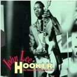

= The Ultimate Collection (CD 1)
John Lee Hooker
:toc:

From http://www.parolesmania.com/paroles_john_lee_hooker_11917.html

== Teachin' The Blues

== Boogie Chillen'

[verse]
____
Well my mama she didn't 'low me, just to stay out all night long, oh Lord
Well my mama didn't 'low me, just to stay out all night long
I didn't care what she didn't 'low, I would boogie-woogie anyhow

When I first came to town people, I was walkin' down Hastings Street
Everybody was talkin' about, the Henry Swing Club
I decided I drop in there that night
When I got there, I say, "Yes, people"
They was really havin' a ball!
Yes, I know
Boogie Chillen'!

One night I was layin' down,
I heard mama 'n papa talkin'
I heard papa tell mama, let that boy boogie-woogie,
It's in him, and it got to come out
And I felt so good,
Went on boogie'n just the same
____

== Sally Mae

[verse]
____
Sally Mae, Sally Mae
Lord, you know you ain't treat'n me right
Sally Mae, Sally Mae
Lord, you know you ain't treat'n me right
You stay out all night long,
Lord, you know you ain't treat'n me right

You're a no good weed1
Lord, the cows, won't mow you down
You're a no good weed
Lord, the cows, won't mow you down
I was chief of police, I would drive you out of town
George! Play the blues!

You ought to leave this town, Sally Mae
You ought to leave here to stay
You ought to leave this town
Y'ought to leave here to stay
Your reputation, Sally Mae,
Your reputation ain't no good

Sally Mae, Sally Mae
Y'ought to change in your younger days
Yeah!
Sally Mae, Sally Mae
Y'oughtta change your ways in your younger days
Better change now Sally Mae,
Change in your younger days
____

== Let Your Daddy Ride

[verse]
____
Lower down your chariot, baby
And let your daddy ride
Low down your chariot, baby
And let your daddy ride
'Cause your daddy's sick and tired
You know I wanna lay down

I hold out my handle
I stretch forth hand to thee
Hold out my handle girl
And I stretch forth hand to thee
I gonna love you little girl
I don't want nobody else

Yeah, little girl
I got to leave you now
Yeah, little girl, little girl
I got to leave you now 
____

== Crawlin' King Snake

[verse]
____
You know I'm a crawlin' king snake baby, and I rules my den
You know I'm a crawlin' king snake baby, and I rules my den
I don't want you hangin' around my mate, wanna use her for myself

You know you caught me crawlin' baby when the, when the grass was very high
I'm just gonna keep on crawlin' now baby until the day I die,
Because I'm a crawlin' king snake baby, and I rules my den
Don't you hangin' around my mate, wanna use her for myself

You know I'm gon' crawl up to your window baby,
Wanna crawl up to your door, you got anything I want baby,
Wanna crawl up on your floor
Because I'm a crawlin' king snake baby, and I rules my den

You know you caught me crawlin' baby when the, when the grass was very high
I'm just gonna keep on crawlin' now baby until the day I die,
Because I'm a crawlin' king snake baby, and I rules my den 
____

== Weeping Willow Boogie

[verse]
____
Well, my baby she long and she tall and she weep like a willow tree
Well, my baby long and she's tall and she weep like a willow tree
Ev'ry time she love me, she make my love come down

I seen my baby this mornin', she was weepin' to herself
I seen my baby this mornin', she was weepin' to herself
She says, "John Lee, I need lovin' and I just can't help myself, yes, baby"

Uh, huh?

Hey, yes love me, love me, love me, daddy, love me all night long
Yeah, love me, love me, daddy and love me all night long
'cause your baby, she need lovin', lovin' with a thrill 
____

== Hobo Blues

[verse]
____
When I first thought to hobo'in, hobo'in,
I took a freight train to be my friend, oh Lord
You know I hobo'd, hobo'd, hobo'd, hobo'd,
Hobo'd a long, long way from home, oh Lord

Yes, my mother followed me that mornin', me that mornin'
She followed me down to the yard, oh yeah
She said my son he'd gone, he'd gone, he'd gone
Yes he's gone in a, poorsome wear*, oh yeah

Yes I left my dear old mother, dear old mother
I left my honor, need* a crime, oh Lord
Take care of my child,
Take care, take care of my child 
____

== Huckle Up Baby

[verse]
____
Says huckle up, baby
Says huckle up, baby
Just huckle up baby
Huckle up all day long
Gotta let me ride
Gotta let me go
Gotta let me live
Gotta let me go
Huckle up, huckle up all day long

Baby love me now
Baby love me now
I love her, too
Love my baby now
Like the way she huckle
Huckle buckin' now
Huckle buck now baby
Huckle buck now baby
Huckle buck, now huckle buck all night long

Said, huckle up baby
Said, huckle up baby
Said, huckle up baby
Huckle buck all night long

Oooooh!
Said, huckle up baby
Said, huckle up baby
Oh, huckle up baby
Huckle up all night long 
____

== I'm In The Mood

[verse]
____
I'm in the mood baby, I'm in the mood for love
I'm in the mood baby, I'm in the mood for love
I'm in the mood, I'm in the mood, baby, I'm in the mood for love

I said night time is the right time, to be with the one you love
You know when night come baby, God know, you're so far away
I'm in the mood, I'm in the mood baby, I'm in the mood for love
I'm in the mood, in the mood, baby, in the mood for love

I said yes, my mama told me, to leave that girl alone
But my mama didn't know, God know, girl was puttin' down
I'm in the mood, I'm in the mood baby, in the mood for love
I'm in the mood, I'm in the mood, baby, in the mood for love 
____

== John L's House Rent Boogie

[verse]
____
[Spoken:]
Hey!
It's the house rent boogie

I come home last Friday, talk to the woman that I lost my job
She says don't confront me an' so I have my rent next Friday
An' next Friday come, I didn't have the rent an' out the door I went
Yes, yes!

Hmm, hmm
Yes, yes!

Come here now y'all, right 'cross the street here
Help me get this rent together
Some give me a nickel and some give me a dime

I'm tired of keepin' this movin' every night
I can't hold out much longer
Now I got this rent, now let's get together, y'all
Let's have a ball

Hey, hey, hey, hey, hey, hey, hey, hey, hey, hey, hey!
____

== No More Doggin'

[verse]
____
Honey, no more doggin', foolin' 'round with you
Honey, no more doggin', foolin' 'round with you
I'm gonna let'cha out baby, and that's what I've got to do

Well, told you all the straights and I made you fine
You spend my money on whiskey, beer and wine
No more doggin', foolin' 'round with you,
I'm gonna let'cha out baby, and that's what I've got to do

Well, ya told me that'cha love me and you told me a lie
Yes, I'll love you until the day I die
No more doggin', foolin' 'round with you
I gotta let'cha out, baby, and that's what I've got, oh yes

Well, ya know I love ya baby and I can't help myself
Yes, I'll love you until the day I die
No more doggin', foolin' 'round with you
I gotta let'cha out, baby, and that's what I've got to do
I gotta let'cha out, baby, and that's what I've got to do
I gotta let'cha out, baby, and that's what I've got to do 
____

== I Need Some Money

[verse]
____
The best thing in life is free,
But you can give it to the birds an' bees
I need some money, need some money
Oh, yeah, what I want

Your love gimme such a thrill,
But your lovin' don' t pay my bills
I need some money, need some money
Oh, yeah, what I want

I need some money, honey
I need some money right away
I need some money bad
I need some money
Oh, yeah, what I want

Money don't get ever'thing it's true
But what it don't buy, daddy, I can't use
I need money, I need money, yeah
What I want

[Spoken:]
I need some money, honey
I need some money so bad
All o' my bills behind
I need some money right now
I know your love is good, baby

I need some money, oh yeah
What I want
What I want 
____

== Frisco Blues

[verse]
____
I left my heart in San Francisco
I left my heart, people, in San Francisco
High on the hill, at the Golden Gate, 'cross the bay,
In San Francisco, on the hill, the mornin' fog,
And the cool, cool night
That's where, I wanna be, San Francisco
That's where my heart
Up in New York City,
I've been to Chicago,
But found no place, like San Francisco,
With the cable car, high, high, on the hill
In the mornin' fog,
The evening breeze,
The cool, cool night,
Is where I wanna be
Oh yeah
Oh yeah
Work, work people, tell me about it,
Work out, work out
I got the blues for San Francisco
Yes, yes, yes, yes

My heart is there, high, on the hill,
Right down by, the Golden Gate, 'cross the bay,
That's where I wanna be
I left my heart right there, in San Francisco
With the mornin' fog and the cool, cool night, the cable cars, on the hill
That's where I wanna be people,
My heart is there, my heart is there, in San Francisco 
____

== Dimples

[verse]
____
I love the way you walk
I love the way you walk
I'm crazy 'bout your walk
I love the way you walk
You my babe, I got my eyes on you

I like the way you switch
I like the way you switch
I like the way you switch
I like the way you switch
You my babe, I got my eyes on you

You got dimples in your jaw
You got dimples in your jaw
You got dimples in your jaw
You got dimples in your jaw
You my babe, I got my eyes on you

Well I see you every day
Well I see you every day
If you need to look
Well I see you every day
Well I see you every day
You my babe, I got my eyes on you 
____

== It Serves Me Right To Suffer

[verse]
____
It serves me right to suffer
It serves me right to be alone
It serves me right to suffer
It serves me right to be alone
Because you’re still livin’
in days done past and gone
It serves me right to suffer
It serves me right to be alone
It serves me right to suffer
It serves me right to be alone
Just why, just why, just why
You can keep me fine
It serves me right to suffer
It serves me right to be alone
It serves me right to suffer
It serves me right to be alone
Your doctor put you on milk, cream and alcohol
you can’t sleep at night
Every time you see a woman
she makes you think of yours
Everytime you see a woman
she make you think of your own
She treated you so bad
Every time I see a woman
She makes me feel alone
Everytime you see a woman
she make you think of your own
She treated you so bad
Umm, umm, mmm, you’re still livin’ in the days
Done gone past and gone and memories
You can’t live on in that way, in the past
Them days is gone, gone 
____

== Bottle Up And Go

[verse]
____
I used to have a gal, she was little and low
She used to love me but she don't no mo' she just....

[Chorus:]
Bottle up and go, just bottle up and go
Listen to me tell ya, tell ya, ya Bottle up and go.

I went downtown to have a little fun,
Up stepped a sheriff with a big shotgun he said, "Ya Bottle up...

[Chorus]

I know a woman she lives way upstairs
She makes her living by putting on airs, she just...

[Chorus]

A nickel is a nickel, a dime is a dime
You shake yours and baby I'll shake mine, ya just...

[Chorus]
____
