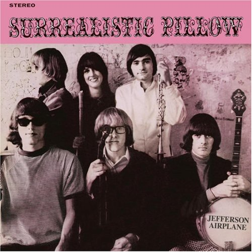

= Surrealistic Pillow
Jefferson Airplane
1967
:toc:

From https://www.azlyrics.com/j/jeffersonairplane.html

== She Has Funny Cars

[verse]
____
Every day I try so hard to know your mind
And find out what's inside you
Time goes on and I don't know just who you are
Or how I'm going to find you

You can do whatever you please
The world's waiting to be seized
You can collect all neglect
Or all the self-respect you need, what you need

And I know... and I know... and I know

Your mind's guaranteed
It's all you'll ever need
So what do you want with me?

We live but once
But good things can be found around
In spite of all the sorrow

If you see black
You can't look back
You can't look front
You cannot face tomorrow

Some have it nice
Fat and round, flash, paradise
They're very wise to their disguise
Trying to revolutionize tomorrow

And I know... and I know... and I know

Your mind's guaranteed
It's all you'll ever need 
____

== Somebody To Love

(originally by The Great Society)

[verse]
____
When the truth is found
To be lies
And all the joy
Within you dies

Don't you want somebody to love?
Don't you need somebody to love?
Wouldn't you love somebody to love?
You better find somebody to love
Love

When the garden flowers
Baby, are dead, yes
And your mind, your mind
Is so full of red

Don't you want somebody to love?
Don't you need somebody to love?
Wouldn't you love somebody to love?
You better find somebody to love

Your eyes, I say your eyes
May look like his
Yeah, but in your head, baby
I'm afraid you don't know where it is

Don't you want somebody to love?
Don't you need somebody to love?
Wouldn't you love somebody to love?
You better find somebody to love

Tears are running
They're all running down your breast
And your friends, baby
They treat you like a guest

Don't you want somebody to love?
Don't you need somebody to love?
Wouldn't you love somebody to love?
You better find somebody to love 
____

== My Best Friend

[verse]
____
Ah, you're my best friend
(You are my best friend)
And I love you so well
Till the end of time you won't see me
Ah, you're my best friend
(You are my best friend)
When I see you, it seems
Now I can see I've fallen into your love stream
I follow your dream
Do you know what I mean, yeah
I follow you wherever time will take me to
Forever I'll be one with you
One with you
One with you

Ah, you're my best friend
(You are my best friend)
And I saw that you're seein'
I'll set you free and just like me you'll be bein'
In love with me
Do you know what I mean, yeah
Do you know what I mean now
(Do you know what I mean)
I'm gonna set you free now
(Do you know)
You'll be in love with me
(Do you know what I mean)
You're my best friend now

Ah, you're my best friend
(You are my best friend)
And I love you so well
Till the end of time you won't see me
Ah, you're my best friend
(You are my best friend)
When I see you, it seems
Now I can see I've fallen into your love stream
I follow your dream
Do you know what I mean, yeah
Do you know what I mean now
(Do you know what I mean)
You'll be in love with me now
(Do you know)
I'm gonna set you free, yeah
(What I mean)
Oh you're my best friend now 
____

== Today

[verse]
____

Today, I feel like pleasing you
More than before
Today, I know what I want to do
But I don't know what for
To be living for you
Is all I want to do
To be loving you
It'll all be there
When my dreams come true

Today, you'll make me say
That I somehow have changed
Today, you'll look into my eyes
I'm just not the same
To be any more than all I am
Would be a lie
I'm so full of love
I could burst apart
And start to cry

Today, everything you want
I swear it all will come true
Today, I realize how much
I'm in love with you
With you standing here
I could tell the world
What it means to love
To go on from here
I can't use words
They don't say enough

Please, please listen to me
It's taken so long to come true
It's all for you, all for you 
____

== Comin' Back To Me

[verse]
____
The summer had inhaled and held its breath too long
The winter looked the same as if it never had gone
And through an open window where no curtain hung
I saw you
I saw you
Comin' back to me

One begins to read between the pages of a look
The shape of sleepy music and suddenly you're hooked
Through the rain upon the trees that kisses on the run
I saw you
I saw you
Comin' back to me

You came to stay and live my way
Scatter my love like leaves in the wind
You always say you won't go away
But I know what it always has been
It always has been

A transparent dream beneath an occasional sigh
Most of the time I just let it go by
Now I wish it hadn't begun
I saw you
Yes I saw you
Comin' back to me

Strolling the hills overlooking the shore
I realize I've been here before
The shadow in the mist could have been anyone
I saw you
I saw you
Comin' back to me

Small things like reasons are put in a jar
Whatever happened to wishes, wished on a star?
Was it just something that I made up for fun?
I saw you
I saw you
Comin' back to me 
____

== 3/5 Of A Mile In 10 Seconds

[verse]
____
Do away with people blowing my mind
Do away with people wasting my precious time
Take me to a simple place
Where I can easily see my face
Baby, baby I can see that you're fine
Know I love you baby, yes I do
Know I love you baby, yes I do

Do away with people laughing at my hair
Do away with people climbing on my precious prayers
Take me to a circus tent
Where I can easily pay my rent
And all the other freaks can share my cares
Know I love you baby, yes I do
Know I love you baby, yes I do

Do away with things that come on obscene
Like hot rods real clean real fine nicotine
Sometimes the price is 65 dollars
Prices like that make a grown man holler
'Specially when it's sold by a kid that's only 15
Know I love you baby, yes I do
Know I love you baby, yes I do 
____

== D.C.B.A. - 25

[verse]
____
It's time you walked away
set me free
I must move away
leave you be...
time's been good to us, my friend
wait and see how it will end
we come and go as we please...
we come and go as we please...
that's how it must be

Here in crystal chandelier, I'm home
too many days, I've left unstoned
if you don't mind happiness
purple-pleasure fields in the Sun
ah, don't you know I'm runnin' home...
don't you know I'm runnin' home...
to a place to you unknown?

I take great peace in your sitting there
searching for myself, I find a place there
I see the people of the world
where they are and what they could be...

I can but dance behind your smile...
I can but dance behind your smile...

you were the world to me for a while 
____

== How Do You Feel

[verse]
____
Look into her eyes
Do you see what I mean
Just look at her hair
And when she speaks, oh what a pleasant surprise

How do you feel
Just look at her smile
Do you see what I mean
She is looking our way
Oh how I wish we could stay, just stay for a while
How do you feel

When I meet a girl like that
I don't know what to say
But to meet a girl like that
Brightens up my day
My day, oh
How do you feel

Just look at her walk
Do you see what I mean
She is coming our way
Oh, how my heart beats, I don't even think I can talk
How do you feel

When I meet a girl like that
I don't know what to say
But to meet a girl like that
Brightens up my day
My day, oh
How do you feel

How do you feel
Do you know how you feel
Just look at her smile
(Tell me how do you feel)
Look into her eyes
(Tell me how do you feel)
She is coming our way
(Tell me how do you feel)
Look into her eye
(Tell me how do you feel)
She is coming our way
(Tell me how do you feel) 
____

== Embryonic Journey

(Instrumental)

== White Rabbit

[verse]
____
One pill makes you larger
And one pill makes you small
And the ones that mother gives you
Don't do anything at all
Go ask Alice
When she's ten feet tall

And if you go chasing rabbits
And you know you're going to fall
Tell 'em a hookah-smoking caterpillar
Has given you the call
Call Alice
When she was just small

When the men on the chessboard
Get up and tell you where to go
And you've just had some kind of mushroom
And your mind is moving low
Go ask Alice
I think she'll know

When logic and proportion
Have fallen sloppy dead
And the White Knight is talking backwards
And the Red Queen's off with her head
Remember what the dormouse said
Feed your head
Feed your head 
____

== Plastic Fantastic Lover

[verse]
____
Her neon mouth with the blinkers-off smile
Nothing but an electric sign
You could say she has an individual style
She's part of a colorful time

Secrecy of lady-chrome-covered clothes
You wear cause you have no other
But I suppose no one knows
You're my plastic fantastic lover

Her rattlin' cough never shuts off
Is nothin' but a used machine
Her aluminum finish, slightly diminished
Is the best I ever have seen

Cosmetic baby plugged into me
I'd never ever find another
I realize no one's wise
To my plastic fantastic lover

The electrical dust is starting to rust
Her trapezoid thermometer taste
All the red tape is mechanical rape
Of the TV program waste

Data control and IBM
Science is mankind's brother
But all I see is drainin' me
On my plastic fantastic lover 
____

== In The Morning

// https://www.google.com/search?q=Jefferson+Airplane+lyrics+In+The+Morning

[verse]
____
In the morning, well in the morning
Hang my head and I cry
Well in the morning, oh in the morning
Well when you're gone, ain't going to worry mine no more

Well 'til the morning, tell me true
Will tell my way of acting, blow in somebody new
Now, in the morning, well 'til the morning, tell me true
Well when you're gone, ain't going to worry mine no more

Well one of these mornings, and lord it won't be long
Look for your daddy and your daddy will be gone
I won't come back no more, back no more
Gonna look for your daddy, but down the road I go
____

== J.P.P.McStep B. Blues

// https://www.google.com/search?q=Jefferson+Airplane+lyrics+J.P.P.McStep+B.+Blues

[verse]
____
Got a feelin' comin' from inside
A love for you my friends that I can't hide
And on these words that come I hope you ride
And I hope that my feelin' and meanings come through

One short moment and I knew you
Like lookin' in a mirror I looked through you
My night time rider has flown to you
And I hope you can see me like I've been seein' you

This is a song of your hand
Written so you would understand
A special feelin' taken by my stand
And I know you're goin' to love me like I've been lovin' you

And because you had a hand to lend
And you know the sands of time are just made of sand
Even though you might be in another land
I know I am with you forever my friend
____

== Come Back Baby

// https://www.google.com/search?q=Jefferson+Airplane+lyrics+Come+Back+Baby

[verse]
____
Come back baby, baby please don't go
One more time just before you hit the road
Come back baby, let's talk it over one more time
One more time, one more time
Let's talk it over one more time
Come back baby, let's talk it over one more time 
____