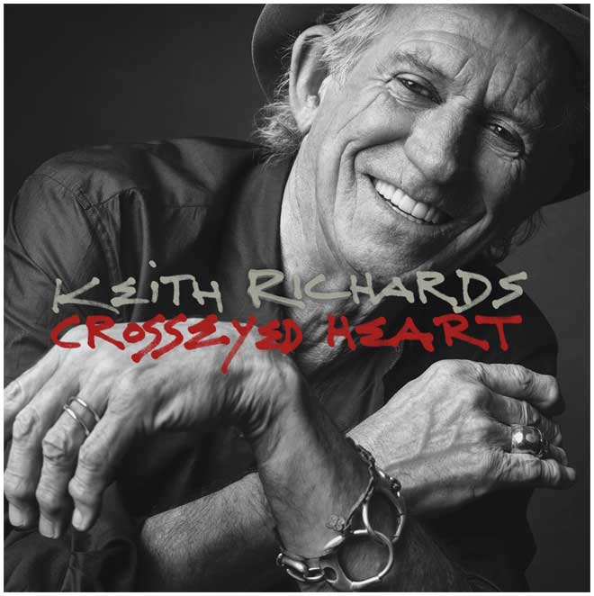

= Crosseyed Heart 
Keith Richards 
2015
:toc:

From https://www.azlyrics.com/k/keithrichards.html

== Crosseyed Heart

[verse]
____
I love my sugar but I love my honey too 
I'm a greedy mother, you don't know what to do 
I've got a cross-eyed heart 

Oooh she's so sweet but she drives me round the bend
I go round the corner and find another friend
I got a cross-eyed heart
____

== Heartstopper

[verse]
____
My babe don't like me, she loves me just the same 
I just can't help it, it goes against the grain 
But when she holds me something starts anew 
She forgives me, and I forgive her too

She's vegetarian, but me, I love my meat
She likes it when it's cool, but I just love the heat
But when she holds me something starts anew
She forgives me, and I forgive her too

When we walking down the street, oh it blows their minds
Everybody wants a piece, a piece of mine
Even if I cross the road she's always on the phone
I don't know who she's talking to, but I've walked home alone
But when she holds me something starts anew
She forgives me and I forgive her too

That bitch don't like me, but she loves me just the same
And when she loves me I don't feel no pain

She don't like me [repeat]
____

== Amnesia

[verse]
____
Nowhere, nowhere

Don't know who I am, forgotten my name
I got no address and who the hell's to blame
Knocked on my head, everything went blank
I didn't even know, the Titanic sank

Nowhere, nowhere

Check my past parts but it seems I've been around
But I can't remember time like baggage lost and found
Thought I met mother, she said "You don't belong to me
Behind you must be trouble, broken hearts and misery"

Nowhere, I'm talkin' nowhere

(Remember)

I try and jock my memory it's a futile exercise
When you amount to nowhere, ha, you don't get a prize
How can I regret, it's so easy to forget
You know everything I do, I know nothing about you

No-fucking-where (Remember)

I can't recall the past

Nowhere, nowhere
Nowhere
____

== Robbed Blind

[verse]
____
Someone stole some money
Who it is, it ain't quite clear
Stolen from my honey
She holds my stash 'round here
The cops, you know, I can't involve them
They'd only interfere
So, I hit the usual suspects
But I drew a blank round then

I'm robbed blind, robbed blind

Found a letter to her
It was from a, a friend of mine
It was a plan to screw me
That's what he had in mind
The cops, I, can't involve them
Don't want them coming near
'Cause this thing is getting personal
And picture is now quite clear

I'm robbed blind, robbed blind, bled dry

The stash, no longer matters
And he ain't hard to find
Cause he leave the money, honey
But the heart you stole is mine
The cops, I, can't involve them
God knows what they could find
But I've learned a lesson from my girl
Whose faith is yet to been defined

Been robbed blind, robbed blind
Robbed blind, thank you sweet
Bled dry, that was a damn good try
Robbed blind, been robbed blind
Robbed blind, bled dry
____

== Trouble

[verse]
____
Just because you find yourself off the streets again
That don't mean that I can help you or I ain't your friend

Baby, trouble is your middle name
Your trouble is that, that's your game

Now you're out of circulation, out of reach and out of touch
Let me keep you in the loop, though I can't tell you much

Baby, trouble is your middle name
The trouble is that, that's your game

Just because I can't see, see you anymore
That's because honey, you're doing two to four

Baby, trouble is your middle name
The trouble is that, that's your game

Just because you find yourself, back to jail again
That don't mean that we can connect
You know, I'm still your friend

Baby, trouble is your middle name
The trouble is that, that's your game

Even though you are still inside
I could get you off the hood
But I know if I get you out
I won't get a second look

Baby, trouble is your middle name
The trouble is that, that's your game

Trouble
Too much trouble
Too much trouble
Too much trouble
____

== Love Overdue

[verse]
____
Listen darling
Who's gonna hold and squeeze me tight?
Now that she's gone out of my lisle
Who's gonna make me feel the way she used to do
Now that my love is overdue
Now that my love is overdue

I'm all alone in the wilderness
Searching to find some peace and rest
She wasn't the best girl
But she brought happiness into my world
And now I'm a prisoner of loneliness
And now I'm a prisoner of loneliness
Well I'm a prisoner of loneliness
That what I'm

Listen darling
Who's voice is gonna say goodnight
Now that she's gone out of my sight
Who's gonna tell lies and let me think the are true
Now that my love is overdue
Now that my love is overdue
Now that my love is overdue
I don't know just what to do honey, yeah
Stop it babe
____

== Nothing On Me

[verse]
____
You ain't got nothing on me, nothing on me
They laid it too thick, they couldn't make it stick
They ain't got nothing on me

You know they laid another charge
That's why I'm still a large
No they got nothing on me, that's right

You know they watch me like hawk
Yeah, they even took for s walk
You know they tried to make me squawk
But they got nothing on me, no nothing on me
Not a thing

They've gone through this before
I can't do this anymore and I'm walking out the door
Cause you've got nothing on me, nothing on me
I don't resist arrest, I think it's for the best
You know they've got nothing on me

I was in-between
It's something unforeseen and I was squeaky clean
They ain't got nothing on me
We've been through this before
Ya know, I can't do this no more and I'm walking out the door
You got nothing on me

They shoot infront of the hip and I'm gonna plead the fifth
Nothing on me!
____

== Suspicious

[verse]
____
Suspicious as it seems you're cropping up in dreams
What've you done to me?
I knew it from the start, you better barricade your heart
Look what've you done to me

Why should we break up?
Some kinda shakeup?
I deserve more sympathy

Somewhere in your heart you saved a little part
Look what've you done to me
Well, you're satisfied with what've you done to me

Don't let us breakup
Some kinda shakeup
Go give some sympathy
Somewhere deep inside you've been taken for a ride
Look what've you done to me

And now that we all cried, well I hope you're satisfied
You're almost done to me
Suspicious as it seems you're cropping up in dreams
What've you done to me?

Why should we breakup?
Some kinda shakeup?
I deserve more sympathy

In your heart, I know that there is a part
That you've kept just for me
No matter what you do I'm still a part of you
You'll never be free of me

Why should we breakup?
Some kinda shakeup?
I deserve more sympathy

I told you from the start you better barricade your heart
Cause what've you done to me
____

== Blues In The Morning

[verse]
____
Got the blues in the morning 
I believe that's far too long 
Got the blues in the morning 
Now babe it stayed too long
It's hardcore babe but I gotta sing this song

Maybe frayed around the edges but a little bit loose outside
Strong around the edges but really, really loose inside
I'm long gone honey, you ain't gonna be my bride

Blues in the morning
Babe they last too long
Me got the Blues in the morning
Babe they last too long
Had a hard-on babe but now it's come and gone
Holes in my pocket
Babe don't ask me why

They got holes in my pocket but, babe don't ask me why
I bought you everything and now you're gonna say goodbye

Got a picture of your face and I hold it up to the light
Got a picture of your face and I hold it up to the light
But on a good day babe it sure gives me a fright

I had the blues in the morning and I had them far too long
I had the blues in the morning and I had them too far long
Come back babe and see if we can get along

Blues in the morning but they keep on all day long
Got the blues in the morning but babe they'd last too long
I don't care cause I'm a billionaire
____

== Something For Nothing

[verse]
____
We can figure the odds
We can pray to the gods
Something for nothing
You can shuffle the deck until you're a wreck
Something for nothing
Money they don't make anymore, at least not around me
Might as well beg from the poor, pitiful me, pitiful me yeah

This is the game, the rules never change
Something for nothing
It's just w roll of the dice that you put on ice
Something for nothing
Money, they don't make anymore, not around me
Might as well beg from the poor, poor poor pitiful me
Pitiful me, yeah poor pitiful me

Gimme a break, I'm losing my stake
Something for nothing
Money, they don't make anymore, not around me
Might as well beg from the poor, pitiful me, poor pitiful me, pitiful me
Oh yeah
Something for nothing
____

== Illusion
(feat. Norah Jones)

[verse]
____
It's an illusion in my blood
But it's not the one you're thinking of
Illusion, in my heart
Doesn't mean we have to part babe
Just an illusion that's for sure
Nothing that you've seen before
Baby, an illusion
But not the one you're looking for

Between you and me
Yes, between (Between you and me)
You and me
Between you and me

What's this illusion in your eyes?
We see each other different ways
A solution, babe
But it's not the one you're thinking of, babe
Such an intrusion in my soul
But I never said I'd let you go
This illusion is haunting me
But it ain't the one you're looking for, babe

Between you and me
Oh what's the difference? (Between you and me)
Oh what's the difference? (Between you and me)

No conclusion babe
So you say
I'm not the one you're thinking of, babe
A confusion to my heart
It nearly tore us apart
She's an illusion babe
But not the one you're looking for, babe
Between you and me
What's the difference between you and me?
Something that deeply set you free
It's an illusion
Yeah that's the difference honey
Between you and me. That's the difference
What's the difference between you and me?
To my blood
But not the one you're thinking of
It's an illusion in my heart
____

== Just A Gift

[verse]
____
Just how I resist a kiss that don't exist?
It's behind me
You're just like shooting stars hanging round in bars
Well it bores me
If you find yourself in need and need a friend to call
Well you know where I live
And I'll open up that door

Whatever they may say, there's nothing that can stay behind me
Cause this just a gift and you give me a lift
Come on, surprise me
If you want and feel a need to call
You know my name
My address hasn't changed at all and I'm still the same

That's all right. That's all aright
That's all right with me

Nothing's what it seems
maybe just a dream
If you should find me
Cause I'm hanging around in bars with alot of shooting stars
And they bore me
If you find that you may need a friend
You know who to call
If you want I'll meet yo down the stairs and open up the door

Cause that's all right, that's all right
That's all right with me.
____

== Goodnight Irene
(originally by Lead Belly)

[verse]
____
Irene goodnight, Irene goodnight
Goodnight Irene, goodnight Irene
I'll see you in my dreams

Last Saturday night I got married
Me and my wife settled down
Now me and my wife have parted
I'm gonna take a little stroll downtown

Irene goodnight, Irene goodnight
Goodnight Irene, goodnight Irene
I'll see you in my dreams

Some times I live in the country
Some times I live in town
Some times I take a great notion
To jump in the river and drown

Irene goodnight, Irene goodnight
Goodnight Irene, Goodnight Irene
I'll see you in my dreams

Quit your rambling, quit your gambling
Stop staying out late at night
Stay home with your wife and family
And stay by the fireside of right

Irene goodnight, Irene goodnight
Goodnight Irene, goodnight Irene
I'll see you in my dreams

Irene goodnight, Irene goodnight
Goodnight Irene, goodnight Irene
I'll see you in my dreams
____

== Substantial Damage

[verse]
____
Just dance, oh dammit baby
You're breaking my heart

What's that thing attached to your ear
I'm talking to you but you don't seem to hear
I'm paying for dinner, and I might as well mop in here

Substantial damage, babe
You're kidding me
Substantial damage

What are we doing, together
You got to prove, and I've got a favor

Substantial damage, baby

I know you go honey it's just your way your game
"I have no idea"
Good [?] Molly
I don't know why I love you, I don't know what I'm doing
I must be a masochist or something
____

== Lover's Plea

[verse]
____
Baby, baby, baby
Let me lay it out to you
I don't know where you're going
But I know what you've been through

A little wishing 
Or just an apparition
Lately, lately, baby, baby
This is my lover's plea to you

Honey, honey, honey
Being left out in the cold
Nothing turns to silver
Nothing ever turns to gold

It's been a while
For you I'd walk that extra mile
Baby, baby, baby
My lover's plea to you

This is my lover's plea to you
This is my lover's plea to you

Bitter wind is blowing 
And winter's getting close
It's me that wants to keep you warm
But I'm not the one you chose

It seems too tough, yeah 
Confusion can get s little rough
Baby, baby, baby
My lover's plea to you

I wonder how you're feeling now
I leave it up to you
This seems such a problem
Let me help you see it through

Yeah it seems so cheap
It's enough to make a grown man weep
Baby, baby, baby
My lover's plea to you

This is my lover's plea to you
This is my lover's plea to you
This is my lover's plea to you
____
