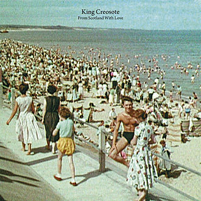

= From Scotland with Love
King Creosote
2014
:toc:

From http://lyrics.wikia.com/wiki/King_Creosote:From_Scotland_With_Love_(2014)

See http://www.kingcreosote.com/music/from-scotland-with-love/

== Something To Believe

[verse]
____
Will I see him on the TV preachin' 'bout the promised land
He tells me to believe in Jesus
And steals the money from my hand
Some say he was a good man
But Lord I think he sinned, yeah

Twenty-two years of mental tears
Cries a suicidal Vietnam vet
Who fought a losing war on a foreign shore
To find his country didn't want him back

Their bullets took his best friend in Saigon
Our lawyers took his wife and kids, no regrets
In a time I don't remember, in a war he can't forget
He cried "Forgive me for what I've done there
Cause I never meant the things I did"

And give me something to believe in if there's a Lord above
And give me something to believe in Oh, Lord arise

My best friend died a lonely man
In some Palm Springs hotel room
I got the call last Christmas Eve
And they told me the news

I tried all night not to break down and cry
As the tears rolled down my face
I felt so cold and empty
Like a lost soul out of place
And the mirror mirror on the wall sees my smile it fades again

Sometimes I wish to God I didn't know now
The things I didn't know then road you gotta take me home

I drive by the homeless sleeping on a cold dark street
Like bodies in an open grave
Underneath the broken old neon sign
That used to read JESUS SAVES

A mile away live the rich folks
And I see how they're living it up
While the poor they eat from hand to mouth
The rich is drinkin' from a golden cup

And it just makes me wonder why so many lose, so few win

You take the high road and I'll take the low road

Sometimes I wish to God I didn't know now
The things I didn't know then
And give me something to believe in
____

== Cargill

[verse]
____
Bored, yet busy with my hands
Cargill, you'll have me round the bend
Cargill, you're pulling all the strands
Of my heartstrings entangled in your net

My love's turned, thrown away the quayside
Yours, a sister on each arm
Strong of shoulder, weak at the knees
Cargill, I'm the finest catch that you'll land

Cargill, do not presume to understand
The dread of counting home the fleet
The sudden thrill of seeing you're safely back
Your catch is fallen at your feet

Cargill, do not presume to understand
The dread of sounding the alarm
The sudden thrill of seeing you're safely back
Cargill, I'm the finest luck that you'll chart

Cargill, do not presume to understand
The dread of counting home the fleet
The sudden thrill of seeing you're safely back
Cargill, I'm the finest catch that you'll land

Cargill, I'm the finest luck that you'll chart
Cargill, I'm the finest catch that you'll land
____

== Largs (long)

[verse]
____
So who cares if nothing
Comes out of this morning
But an earful of sea and a neck-full of sun
And a deckchair always broken
When sunbathed upon

Each of us is as backwards
At coming forwards
Silence from me
Whilst you're keeping schtum
My mind's still as blank
As that postcard we've barely begun

So would you look at this gang
How we all burst forth at sun up
From our caravan parks
Whilst the kids are going mental
Kicking up sand I shall take this chance
To slope off, find the queen of ice-creams
I shall ask her to dance
While she dithers with her wafers
99 is the number of my knockbacks

The water here doesn't get any warmer
She won't let me get anything near her
I'm just looking for a bandstand
Holiday only romance

Or at least share a slider
While sitting beside her
I'll kid on I'm rich, kid on I'm older and wiser
Kid I'm foreign
Maybe kid on I'm only from Largs

So would you look at this gang
How we all burst forth at sun up
From our caravan parks
Whilst the kids are going mental kicking up sand
They're kicking up sand

So would you look at this gang
How we all burst forth at sun up
From our caravan parks
Whilst the kids are going mental
Kicking up sand I shall take this chance
To slope off, find the queen of ice-creams
I shall ask her to dance
While she dithers with her wafers
99 is the number of my knockbacks
Of my knockbacks
____

== Miserable Strangers

[verse]
____
I've done with being brave
And oh how we slaved to pave our way
And only to be dropped upon this quay
And only to be press-ganged overseas
Is this the end of the begining or the begining of the end
And these miserable strangers will be the making of our friends
They've been dropped upon this quay
Just the same as you and me
With each step forward there's two looks back
Are you so bewildered inside
But you know we'll have the new life that we talked of loud and proud
Hack them high and hold them dear
For we'll soon forget these faces in the crowd blurred by our tears
And yet we'll miss them year on year
So let's pull ourselves together like the others
We'll throw our hats into the air
And try to raise a hearty cheer
And at the back of my mind and I was always hoping I might just get back
At the back of my mind and I was always hoping I might just get back
Always hoping I might just get back
At the back of my mind I was always hoping I might just get back
At the back of my mind I was always hoping I might just get back
Always hoping that I might just get back
Always hoping that I might just get back
____

== Leaf Piece (long)

[verse]
____
I'm clinging on to my homeland
My fingers clawing earth, peat and sand
My back's still hurting bad
But my eyes are still attached
To a vivid dream of lousing times
And the promise of my leaf piece
In the furrows of my bag
And in my laughter lines

I hear the songs my father sang
I have but half the voice he had
I keep it harnessed reign it in
Until the sun it melts on the horizon
That's when I clap eyes upon my lass
And I find I'm singing like a lark
My voice is calloused and my back is choked
And out of earthen clods my heart will soar
For now my tongue is held
And my wheesht is haud

But for now my tongue is held
And my wheesht is haud
____

== ​For One Night Only

[verse]
____
You know on a Friday
I hand you the housekeep
I pocket the small change
I hide it, I save it
Now it's the weekend, we're stepping out bowling
Spending our money, c'mon just enjoy it.

One turns to several and out comes another
Unpredictable drunkard
You caught him, you named him
Now it's the weekend, we're spending our money
Wayne is appearing for one night only

You know on a Friday
I hand you the housekeep
I pocket the small change
I hide it, I save it
Now it's the weekend, we're stepping out bowling
Spending our money, c'mon celebrate it.

One turns to several and out comes another
Unpredictable drunkard
You caught him, you named him
Now it's the weekend, we're spending our money
Wayne is appearing for one night only

Wayne is appearing for one night only
____

== ​Bluebell, Cockleshell, 123

[verse]
____
Bluebell, Cockleshell, 1 2 3
Stand at ease, bend your knees
Bow to the west, salute to the east
We're all sitting on our mammy's knees

Bluebell, Cockleshell, 1 2 3
Stand at ease, bend your knees
Salute to the king, bow to the queen
What a lot of fisherwives I can see

Ding dong goes the castle bell
So fare thee well my mother
Bury me in the old churchyard
Beside my only brother
My coffin shall be black
Six white angels at my back
Two to sing, two to pray
Two to carry my soul away

Bluebell, Cockleshell, 1 2 3
Stand at ease, bend your knees
Salute to the king, bow to the queen
What a lot of fisherwives I can see

Bluebell, Cockleshell, 1 2 3
Stand at ease, bend your knees
The queen didnae want me so she sent me to the king
The king said close your eyes and count to sixteen

Ding dong goes the castle bell
Fare thee well my mother
Bury me in the old churchyard
Beside my only brother
My coffin shall be black
Six white angels at my back
Two to sing, two to pray
Two to carry my soul away

Bluebell, Cockleshell, 1 2 3
Stand at ease, bend your knees
The queen didnae want me so she sent me to the king
The king said close your eyes and count to sixteen

Bluebell, Cockleshell, 1 2 3
Stand at ease, bend your knees
Bow to the west, salute to the east
We're all sitting on our mammy's knees
____

== ​One Floor Down

[verse]
____
Release me slowly
Don't leave me cold
This sadness only
Appears after dark

You tear from me a hello
Enlighten me in the ways of the world
You know that I live only one floor down
You know that I live in a bubble of my own

You tear from me a hello-o
Enlighten me in the ways of the world
You know that I live only one floor down
You know that I live in a bubble of my own
____

== Crystal 8s

== ​Pauper's Dough

[verse]
____
Injustice on its knees underground
The clawed-out tonnage is to our detriment

In these clarty surrounds
The combined earnings of our tenements
Won't stretch to many rounds
And yet we're striving to be counted

We'll fight for what is right
And we'll strike for what is rightfully ours
And I want better for my boy
To bury my father in dry, consecrated ground

You've got to rise above the gutter you are inside
You've got to rise above the gutter you are inside
You've got to rise above the gutter you are inside
You've got to rise above the gutter you are inside

Rise ...
Rise ...

Rise above the gutter you are inside
Rise above the gutter you are inside
Rise above the gutter you are inside
Rise above the gutter you are inside

You've got to rise above the gutter you are inside
You've got to rise above the gutter you are inside

Rise (above the gutter you are inside) x2
____

== A Prairie Tale
