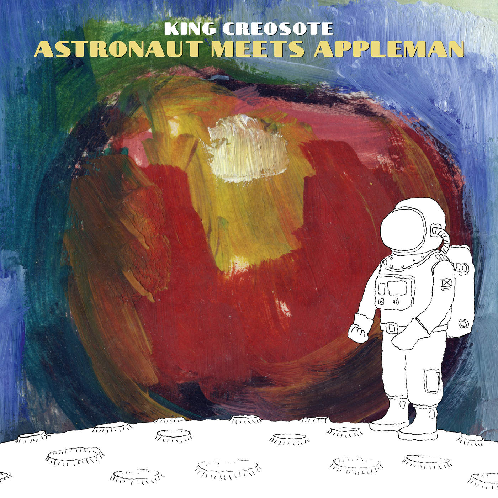

= Astronaut Meets Appleman
King Creosote
2016
:toc:

   

From::
https://genius.com/artists/King-creosote +
https://www.kingcreosote.com/music/astronaut-meets-appleman/

== You Just Want

////
https://www.google.com/search?q=King+Creosote+lyrics+You+Just+Want
////

[verse]
____
When you just want someone to lie there and be used as a slave
Can I be him?

When you just want someone more for their being and not so much for their brains
Can I be him?

When you need someone to cry on in the depths of despair
I shall be elsewhere

When you're all talked out and languished silent in the physical realm
I will be waiting

When you just want someone to lie there and be used as a slave
Can I be him?

When you just want someone more for their being and not so much for their brains
Can I be him?
Can I be him?
Can I be him?
____

== Melin Wynt

////
https://www.google.com/search?q=King+Creosote+lyrics+Melin+Wynt
////

[verse]
____
Don't be the one to slam the door, for I let you back in
With my track record, jaws will hit the floor
But all that has to change
Once they see from Melin Wynt off-shore

A turbine regiment is moving here
We're all set to die
And with your green credentials and your ice white eyesore
It's landfill off the scale

Where the sails turn from Melin Wynt
I see off shore
A turbine regiment moving in
We're all set to die

Don't be the one to slam at the door
I won't let you back in
We're all set to die
____

== Wake Up To This

https://www.google.com/search?q=King+Creosote+lyrics+Wake+Up+To+This

[verse]
____
____

== Faux Call

////
https://www.google.com/search?q=King+Creosote+lyrics+Faux+Call
////

[verse]
____
And I'm so sorry I let you down again and this was my call now I'm stalling under the pretence being just friends.
I wish I was better at helping you through all of this.
I wish I could call, have a good cry, hold you again.
It's those sparks in the foyer no matter the film, that I'm missing that I'm missing.
No kidding.
It's the silence that somehow says it all, that I'm missing, that I'm missing, missing.
It's the backhanded praise for what you really befall (?) that I'm missing that I'm missing.
No kidding.
It's the silence that somehow says it all, that I'm missing, that I'm missing.
I'm better in song than I am in this role full of callousness.
Now that I'm gone I hope you'll remember that I'm here in this verse.
I wish I was clever at steering you through all of this.
I wish you would call, have a good cry, you're setting me off again.
And I'm so sorry I let you down again and this was my call now I'm stalling the pretence being friends.
And I'm so sorry I let you down again and this was my call now I'm stalling the pretence being friends.
____

== Betelgeuse

////
https://www.google.com/search?q=King+Creosote+lyrics+Betelgeuse
////

[verse]
____
Fix the shortest month
Fix my magnetic north
Oh my bipolar crash, squeezed the arctic air out of my lungs

Drop off the key
For my boat has sailed to Bolivia
And I may not be back in one piece.
Peace at last for me
Peace at last for me

It's taken my favourite month
To realign the stars
Oh I have travelled far
To douse the astro fire within my heart
Drop off the radar screen
My ship has set course for the space in between Orion's Belt and Betelgeuse
I may not be back
I may not be back,
Believe me.
Peace at last, please.

For peace at last, a last minute plea
For peace at last, a last minute plea
For peace at last, a last minute plea

It took the shortest month
To fix my magnetic north
Oh my bipolar crash, you've squeezed the arctic air out of my lungs.
Drop off the key,
For my boat has sailed to Bolivia
And I may not be back in one piece.

That's peace at last, for me.
Peace at last, for me. Please.

For peace at last, a last minute plea.
____

== Love Life

https://www.google.com/search?q=King+Creosote+lyrics+Love+Life

[verse]
____
____

== Peter Rabbit Tea

[verse]
____
____

== Surface

////
https://www.google.com/search?q=King+Creosote+lyrics+Surface
////

[verse]
____
I fled at the thought of losing you again
But then, you're someone who has never been found
You're someone who has never been found

And now it's my turn to hide, if not out here then inside
It's both of us have run to ground
My life is a whole lot safer underground

Why would I ever surface again?
To be outshone and eclipsed by your invisible friend
Why would I ever surface again?
I'm no less obsucure and ignored than your invisible friend
Why would I ever surface again?
I'm no more in love(?) and cast down than your invisible friend
Why would I ever surface again?
Why would I ever surface again?

I close my eyes and I count to ten times ten
And ready or not and it's a heady descent
Ready or not and it's a heady descent

I fled at the thought of losing you again
But then, you're someone who has never been found
As someone hardly desperate to be found

Why would I ever surface again?
To be outshone and eclipsed by your invisible friend
Why would I ever surface again?
I'm no less obsucure and ignored than your invisible friend
Why would I ever surface again?
I'm no more in love(?) and cast down than your invisible friend
Why would I ever surface again?
Why would I ever surface again?
____

== Rules Of Engagement

////
https://www.google.com/search?q=King+Creosote+lyrics+Rules+Of+Engagement
////

[verse]
____
The things I've got to get done
Are getting harder to do.
The one thing I thought of as fun
Has become a battle with you
A battle both of us lose.
Rules of engagement
Rules of containment
Girls (?) look for meaning
The truth was what we got was
(?) at their listening post
Covert (?) and containment.
The things that I've got to get done
Are getting harder to do. 
____

== The Long Fade

https://www.google.com/search?q=King+Creosote+lyrics+The+Long+Fade

[verse]
____
____
