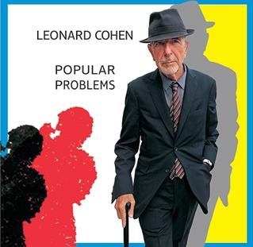

= Popular Problems
Leonard Cohen
2014
:toc:

From http://www.azlyrics.com/c/cohen.html 

== Slow

[verse]
____
I’m slowing down the tune
I never liked it fast
You want to get there soon
I want to get there last

It’s not because I’m old
It’s not the life I led
I always liked it slow
That’s what my momma said

I’m lacing up my shoe
But I don’t want to run
I’ll get here when I do
Don’t need no starting gun

It’s not because I’m old
It’s not what dying does
I always liked it slow
Slow is in my blood

I always liked it slow:
I never liked it fast
With you it’s got to go:
With me it’s got to last

It’s not because I’m old
It’s not because I’m dead
I always liked it slow
That’s what my momma said

All your moves are swift
All your turns are tight
Let me catch my breath
I thought we had all night

I like to take my time
I like to linger as it flies
A weekend on your lips
A lifetime in your eyes

I always liked it slow...

I’m slowing down the tune
I never liked it fast
You want to get there soon
I want to get there last

So baby let me go
You’re wanted back in town
In case they want to know
I’m just trying to slow it down 
____

== Almost Like The Blues

[verse]
____
I saw some people starving
There was murder, there was rape
Their villages were burning
They were trying to escape
I couldn't meet their glances
I was staring at my shoes
It was acid, it was tragic
It was almost like the blues

I have to die a little
Between each murderous thought
And when I'm finished thinking
I have to die a lot
There's torture and there's killing
And there's all my bad reviews
The war, the children missing
Lord, it's almost like the blues

So I let my heart get frozen
To keep away the rot
My father says I'm chosen
My mother says I'm not
I listened to their story
Of the Gypsies and the Jews
It was good, it wasn't boring
It was almost like the blues

There is no God in Heaven
And there is no Hell below
So says the great professor
Of all there is to know
But I've had the invitation
That a sinner can't refuse
And it's almost like salvation
It's almost like the blues 
____

== Samson In New Orleans

[verse]
____
You said that you were with me
You said you were my friend
Did you really love the city
Or did you just pretend

You said you loved her secrets
And her freedoms hid away
She was better than America
That’s what I heard you say

You said how could this happen
You said how can this be
The remnant all dishonored
On the bridge of misery

And we who cried for mercy
From the bottom of the pit
Was our prayer so damn unworthy
The Son rejected it?

So gather up the killers
Get everyone in town
Stand me by those pillars
Let me take this temple down

The king so kind and solemn
He wears a bloody crown
So stand me by that column
Let me take this temple down

You said how could this happen
You said how can this be
The chains are gone from heaven
The storms are wild and free

There’s other ways to answer
That certainly is true
Me, I’m blind with death and anger
And that’s no place for you

There’s a woman in the window
And a bed in Tinsel Town
I’ll write you when it’s over
Let me take this temple down 
____

== A Street

[verse]
____
I used to be your favorite drunk
Good for one more laugh
Then we both ran out of luck
Luck was all we ever had
You put on a uniform
To fight the Civil War
You looked so good I didn’t care
What side you’re fighting for

It wasn’t all that easy
When you up and walked away
But I’ll save that little story
For another rainy day
I know the burden’s heavy
As you wheel it through the night
Some people say it’s empty
But that don’t mean it’s light

You left me with the dishes
And a baby in the bath
You’re tight with the militias
You wear their camouflage
You always said we’re equal
So let me march with you
Just an extra in the sequel
To the old red white and blue

Baby don’t ignore me
We were smokers we were friends
Forget that tired story
Of betrayal and revenge
I see the Ghost of Culture
With numbers on his wrist
Salute some new conclusion
Which all of us have missed

I cried for you this morning
And I’ll cry for you again
But I’m not in charge of sorrow
So please don’t ask me when
There may be wine and roses
And magnums of champagne
But we’ll never no we’ll never
Ever be that drunk again

The party’s over
But I’ve landed on my feet
I’ll be standing on this corner
Where there used to be a street 
____

== Did I Ever Love You

[verse]
____
Did I ever love you
Did I ever need you
Did I ever fight you
Did I ever want to

Did I ever leave you
Was I ever able
Are we still leaning
Across the old table

Did I ever love you...

Was it ever settled
Was it ever over
And is it still raining
Back in November

The lemon trees blossom
The almond trees wither
Was I ever someone
Who could love you forever

Was it ever settled
Was it ever over
And is it still raining
Back in November

The lemon trees blossom
The almond trees wither
It's Spring and it's Summer
And it's Winter forever

Did I ever love you
Does it really matter
Did I ever fight you
You don't need to answer

Did I ever leave you
Was I ever able
Are we still leaning
Across the old table

Did I ever love you... 
____

== My Oh My

[verse]
____
Wasn’t hard to love you
Didn’t have to try
Wasn’t hard to love you
Didn’t have to try
Held you for a little while
My Oh My Oh My

Drove you to the station
Never asked you why
Drove you to the station
Never asked you why
Held you for a little while
My Oh My Oh My

All the boys are waving
Trying to catch your eye
All the boys are waving
Trying to catch your eye
Held you for a little while
My Oh My Oh My

Wasn’t hard to love you
Didn’t have to try
Wasn’t hard to love you
Didn’t have to try
Held you for a little while
My Oh My Oh My
____

== Nevermind

[verse]
____
The war was lost
The treaty signed
I was not caught
I crossed the line

I was not caught
Though many tried
I live among you
Well disguised

I had to leave
My life behind
I dug some graves
You'll never find

The story's told
With facts and lies
I had a name
But never mind

Never mind
Never mind
The war was lost
The treaty signed

There's truth that lives
And truth that dies
I don't know which
So never mind

السلام على السلام يا سلام
سلام سلام على السلام

Your victory
Was so complete
That some among you
Thought to keep

A record of
Our little lives
The clothes we wore
Our spoons our knives

The games of luck
Our soldiers played
The stones we cut
The songs we made

Our law of peace
Which understands
A husband leads
A wife commands

And all of this
Expressions of
The Sweet Indifference
Some call Love

The High Indifference
Some call Fate
But we had Names
More intimate

Names so deep and
Names so true
They're blood to me
They're dust to you

There is no need
That this survive
There's truth that lives
And truth that dies

Never mind
Never mind
I live the life
I left behind

There's truth that lives
And truht that dies
I don't know which
So never mind

السلام على السلام يا سلام
سلام سلام على السلام

I could not kill
The way you kill
I could not hate
I tried I failed

You turned me in
At least you tried
You side with them
Whom you despise

This was your heart
This swarm of flies
This was once your mouth
This bowl of lies

You serve them well
I'm not surprised
You're of their kin
You're of their kind

Never mind
Never mind
I had to leave
My life behind
The story's told
With facts and lies
You own the world
So never mind

Never mind
Never mind
I live the life
I left behind

I live it full
I live it wide
Through layers of time
You can't divide

My woman's here
My children too
Their graves are safe
From ghosts like you

In places deep
With roots entwined
I live the life I left behind

The war was lost
The treaty signed
I was not caught
I crossed the line

I was not caught
Though many tried
I live among you
Well disguised
____

== Born In Chains

[verse]
____
[SHARON, HATTIE AND CHARLEY:]
I was born...

[LEONARD:]
I was born in chains but I was taken out of Egypt
I was bound to a burden, but the burden it was raised
Oh Lord I can no longer keep this secret
Blessed is the name, the name be praised.

[SHARON:]
I fled to the edge of the mighty sea of sorrow
Pursued by the riders of a cruel and dark regime
But the waters parted and my soul crossed over
Out of Egypt, out of Pharaoh’s dream

[LEONARD:]
Word of words and the measure of all measures
Blessed is the name, the name be blessed
Written on my heart in burning letters
That’s all I know, I do not know the rest

[HATTIE:]
I was idle with my soul, when I heard that you could use me
I followed very closely, but my life remained the same
But then you showed me where you had been wounded
In every atom broken is the Name

[CHARLEY:]
I was alone on the road, your love was so confusing
And all my teachers told me that I had myself to blame
But in the grip of sensual illusion
A sweet unknowing unified the name

[LEONARD:]
Word of words, and the measure of all measures
Blessed is the name, the name be blessed
Written on my heart in burning letters
That’s all I know, I cannot read the rest

[LEONARD:]
I've heard the soul unfolds in the chambers of its longing
And the bitter liquor sweetens in the hammered cup
Ah but all the ladders of the night have fallen
Just darkness now, to lift the longing up

[LEONARD:]
Word of words and measure of all measures
Blessed is the name, the name be blessed
Written on my heart in burning letters
That’s all I know, I cannot read the rest

[SHARON, HATTIE AND CHARLEY:]
Just darkness now, to lift the spirit up 
____

== You Got Me Singing

[verse]
____
You got me singing
Even tho' the news is bad
You got me singing
The only song I ever had

You got me singing
Ever since the river died
You got me thinking
Of the places we could hide

You got me singing
Even though the world is gone
You got me thinking
I'd like to carry on

You got me singing
Even tho' it all looks grim
You got me singing
The Hallelujah hymn

You got me singing
Like a prisoner in a jail
You got me singing
Like my pardon's in the mail

You got me wishing
Our little love would last
You got me thinking
Like those people of the past

You got me singing
Even though the world is gone
You got me thinking
I'd like to carry on

You got me singing
Even tho' it all went wrong
You got me singing
The Hallelujah song 
____
