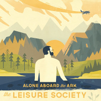

= Alone Aboard the Ark
The Leisure Society
2013
:toc:

From::
https://genius.com/artists/The-leisure-society +
https://www.elyricsworld.com/the_leisure_society_lyrics.html

== Another Sunday Psalm

// https://www.google.com/search?q=Leisure+Society+lyrics+Another+Sunday+Psalm

[verse]
____
So I'd send them back
With their red little bird
And why they smile
When you know i'm done

These pay on the air
And a lazy old sun
To keep the heat in every earclamp
A forest far side was thinking

The trees all try
A thousand times
To wrestle down the wind

If they're in the hays
At the opening roam
A far that he wants but I must let go
Cause how many years can you keep this fall
Too many other Cats are craving

They're polishing
Their paws and saying
In Fifteen words
What took me years
To hang my name upon

The crowd float the isles
As you render in slump
Over yellow stone cliffs to holy love
It sees this disease
And all that is done
Consoling all the unpayed artists
The chance to finish what tey've started
____

== A Softer Voice Takes Longer Hearing

// https://www.google.com/search?q=Leisure+Society+lyrics+A+Softer+Voice+Takes+Longer+Hearing

[verse]
____
Mid the pause
In the wreckage came
The peculiar light
Of a Saturday

Fictions form
In the ghost of years
But they fell apart
As they always do

Seething limbs all stick together
Where a firmer hand would serve you better
Cause the streets you walk are unforgiving
And a softer voice takes longer hearing

Father said
Well there isn't much
That you couldn't do
WIth the right approach
Every hour
Is a cavalcade
To be gazed upon
As it slips away

Seething limbs all stick together
Where a firmer hand would serve you better
Cause the streets you walk are unforgiving
And a softer voice takes longer hearing

Thought you'd found
Everything you'd lost
In the open arms
Of a council paw
All our hopes
On this summer's day
Is it boring you?
Cause it's boring you

Seething limbs all stick together
Where a firmer hand would serve you better
Cause the streets you walk are unforgiving
And a softer voice takes longer hearing
A softer voice takes longer hearing
____

== Fight For Everyone

// https://www.google.com/search?q=Leisure+Society+lyrics+Fight+For+Everyone

[verse]
____
When you're saved by the ring of the bell,
Is it hard to relax when you're told that you can never fail?
Has the spit that you spit from your teeth
Been replaced by a taste that has all but lost its novelty,
You don't need to change,
You just need fire and a little faith

In order to get what you want done, you must fight for everyone.
In order to get to what you needed, you spend time and nothing much.

And the moral is you live and learn.
There's a barb in your heart in a world on which we turn
And it seems you see what you mean
When you say last train and sold and rolling over me,
You don't need to change; you just need fire a little faith.

X2

And the moral is you live and learn.
____

== Tearing The Arches Down

// https://www.google.com/search?q=Leisure+Society+lyrics+Tearing+The+Arches+Down

[verse]
____
When you're three sheets to the wind
It's best to move slowly
Forgiving yourself your sins
A part of the process
You're born with the bloodshot eyes
And legend in your lunch time

The words you scrawl on the wall
Are filling the silence
A totem pole in your home
For warding off violence
Ignoring the outstretched arms
The body you pushed too hard

Don't you know the cracks can be seen?
It's space you know what I mean
What this beat will never be
Tearing the arches down
And nailing the old doors shut
And tearing the arches down

These streets they used to look big,
These houses were holy.
A low fidelity scene
Unblemished by progress
The memory stained foot steps
Will bury the day we left

Don't you know the cracks can be seen?
It's space you know that I mean
What this beat will never be
So tearing through the urban heart
But the more you see the more you want
Oh, but the tragedy is it has to stop
Tearing the arches down
And nailing the old doors shut
And tearing the arches down
____

== The Sober Scent Of Paper

// https://www.google.com/search?q=Leisure+Society+lyrics+The+Sober+Scent+Of+Paper

[verse]
____
Chains stretch the great lake around you
Pull you along by the knots in your hair
It's just like you'd never been there
Cold tooth and ice scattered islands
Faithfully facing the warmth of the sun
All to the quickening dawn
Fever on the thorough-way brow
The sober scent of paper
Teething cries in what the rain hides
Where not enough to save you
Faith is a race from the silence
Widens and swallows you
Head first and whole
Fight through the whitening bones
Secede while you can while you're able
Sorrow may tap at the root of your song
Light sparks the opening bomb
Fever on the thorough-way brow
The sober scent of paper
Teething cries in what the rain hides
Where not enough to save you
Every ache is dissolved in the brine
And the waves from the bay and then rise
But the shark ridden garden will run dry again
____

== All I Have Seen

// https://www.google.com/search?q=Leisure+Society+lyrics+All+I+Have+Seen

[verse]
____
Got a song in my head
And it's driving me mad
No more, no more
All I have seen
Take it from me
Heard a sound from the East
Now we all have to leave
Slow down, slow down
All I have seen
Take it from me;
Got a sting in my thimp
And it's a side I'll conceal
No more, no more
All I have seen
Take it from me;
At a rise
Seeing nothing
Sever the shores
Of vaulting to scenes
But I can't stop looking
And settle beside
A note in a mean
Got a song in my head
And it's driving me mad
No more, no more
All I have seen
Take it from me;
All I have seen
Take it from me;
____

== Everyone Understands

// https://www.google.com/search?q=Leisure+Society+lyrics+Everyone+Understands

[verse]
____
God-damned these things that keep bleeding
I'm wriggling like a dog in a sack
Taunt by the thought but
Still grinning like a criminal
What do you get for all the
Free wheeling?
A Pirouette in a castle of sand
Try for the prize and unravel in
The blink of an eye
You've been given a role that everyone understands
To be given a role that everyone understands
With the money that you hawk
You build another wall
Unhook the phone
Stop ringing
Come at the outcome of the man
Feeling the heat and the oven isn't even on
The eyes in the night are not fiddles
Trembling in the weight of the air
Regards us now their menace is subliminal
You've been given a role that everyone understands
To be given a role that everyone understands
Whith the money that you hawk
You build another wall
Beats in the feed
You can do what you want with it
I took the owners to hell with the ownership
Five years and sixes and sevens
Sated the taste by not singing
Too many inns and not enough outs
Slain on the eve of another indefensible day
This isn't quite what I had envisaged
Whithering with the NišIćibee
The flame on the lawn overran us
In the dead of the night
You've been given a role that everyone understands
To be given a role that everyone understands
With the money that you hawk
You can build nothing at all
____

== Life Is A Cabriolet

// https://www.google.com/search?q=Leisure+Society+lyrics+Life+Is+A+Cabriolet

[verse]
____
All the rain keeps us up all night
It drips through cracks and it fuses light
But the life we used to live
Was so much sadder than this

Now you're teaching me wrong from right.
I am the thorn in your tender side
A convict cast in chains
A soul that won't be saved
Won't be saved.

And it's so good to see you smile
As we make light of those darker times
When hopelessness was hit
And tragedy a thing.

In the arc of the crazy ride
The wheels careened off the mountainside
Let every heart confess
In breath upon the glass
Don't look back.

These ups and downs will soon come round
Your expectations frayed
Oh, life is a cabriolet!
____

== One Man And His Fug

// https://www.google.com/search?q=Leisure+Society+lyrics+One+Man+And+His+Fug

[verse]
____
By the way dunno what's gotten into me
I was raised revering the Bible
Born to be a paragon of Industry
See me now chasing survival
It's all right to split from a scene
It's all new to me now.
If I say what you want to hear,
The face in the mirror won't look right.
The face in the mirror won't look right.

In a way I miss the thought of apathy
And the great days it surrounded.
Buried in the comfort of monotony
Treading water keeps you from drowning
Too late I fear I've been seen
A flood spoke in a wheel
If I say what you want to hear,

The face in the mirror won't look right.
The face in the mirror won't look right.

So you see
I lost a little appetite
Wading through the hot water musing
WHen the string of day to day and half the night
Stays the same you just have to use it.
It's all new to me now.
If I say what you want to hear,
The face in the mirror won't look right.
The face in the mirror won't look right.
The face in the mirror won't look right.
The face in the mirror won't look right
It's all new to me now.
If I say what you want
____

== Forever Shall We Wait

// https://www.google.com/search?q=Leisure+Society+lyrics+Forever+Shall+We+Wait

[verse]
____
In silence we shall sit
Contemplating everything
The world and how we came to be
Alone aboard the ark
The same thoughts every night
Bathed in cold fluorescent light
If this is it then what a ride,
Wake me when it's through.
To have it all and seize the day.
To go where no one else dare stray
Bereft shall we wait

In light of developments
I suggest we start again
The 9 to 5 the 6 to 10 have
Swallowed ever urge
And it makes no difference
When all your money goes on rent
The never ending arguments
To be put up in arms
To have a place to call our own
To shorn the old familiar road
Forever shall we wait

These arms are heavy
These feet are raw
I cannot walk
But I can crawl
Into the arms of another
Monster lurking somewhere deep inside
My mind set on the brink
I miss it from the kitchen sink
Regret the days you didn't glimpse
A spark amid the mild
Invading every scene
Welcome to the working week
A place to hide until we leave
To dream perchance to sleep
To grease the corridors of youth
I let them tell me what to do.
I won't do that again.

These arms are heavy
These feet are raw
I cannot walk
But I can crawl
Into the arms of another
Monster lurking somewhere deep inside
Deep inside, Deep inside, Deep Inside
____

== We Go Together

// https://www.google.com/search?q=Leisure+Society+lyrics+We+Go+Together

[verse]
____
We smoke a last cigarette
And pour ourselves into bed
The afternoon repeats in perfect form
That spot in the devil's shade
Exploded in light again
And even now, the night is caving in.

Sleep just an hour to sing
It's great when you cut back in
We go together.
We go together.

We're burning the midnight oil.
Three cheers for the human form.
We celebrate it's beauty and it's pain.
And what lies in store for me now?
What violence will I sizzle out?
A little bit of all I ever craved.
It's just like you always say,
We make such a perfect mess.
We go together.
We go together.
Each parting kiss
The daylight's out of me.
And endless Sunday slump.
Just waiting for the moment
We have got.
Believe me, believe me
It's all that we've got.

Full bloom on the autumn breeze
We shed the desire to please.
And ever more reveal a paler shade.
Those words that were never said.
Unfurl in an endless list
The sun will rise again on nothing new.
Then as our bodies twist,
You do what you do again.
We go together.
We go together.
____

== The Last In A Long Line

// https://www.google.com/search?q=Leisure+Society+lyrics+The+Last+In+A+Long+Line

[verse]
____
Waiting in line for your happy ending
Blinking away the blood from your eyes
And what is the point of being embarrassed?
And what is the point of living a lie?
We're the last in a long line
We're the last in a long line
Meanwhile outside the magnolia opens
Petals are plucked and flung to the floor
What is the point of sitting in silence?
And what is the point of hiding at all?
We're the last in a long line
We're the last in a long line
We're the last in a long line
The last in a long line
____
