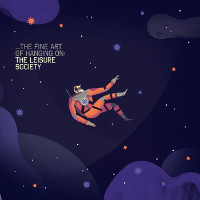

= The Fine Art of Hanging On
The Leisure Society
2015
:toc:

From::
https://genius.com/artists/The-leisure-society +
https://www.elyricsworld.com/the_leisure_society_lyrics.html

== The Fine Art of Hanging On

// https://www.google.com/search?q=Leisure+Society+lyrics+the+fine+art+of+hanging+on

[verse]
____
In the madness and island,
Another lame animal,
Defeating the odds with
A fistful of Avalon.
The pages of angels
Narrating the downfall,
The blood in the veins is all that we've ever known.

If there's nothing above us,
And nothing below us,
And nothing between us,
Then how do I get over that?
A failure, a saviour,
The fine art of hanging on,
Has whipped us to lift a life from the remnants.

And we put it all together,
A port in the eye of the storm.
Does it pain you that the flame we thought would grow
Now burns so low?

We were boarding the tall ships,
Eclipsing oblivion,
Deciding it all sang
A whole new significance.
It's made in the waiting,
Afloat on a reservoir.
It's borne us to form a start from an ending.

And we put it all together,
Born in the eye of the storm.
Does it pain you that the flame we thought would grow
Now burns so low?

Does it pain you that the flame we thought would grow
Now burns so low?
____

== Nothing Like This

// https://www.google.com/search?q=Leisure+Society+lyrics+nothing+like+this

[verse]
____
Listen up, I've been hanging here
From the bars by the gates
With the kids from the estate.
Fill-ins fought for an opening,
And they say you're no good,
But I know what I feel.

There's nothing like this.
There's nothing like this.
There's nothing like this.

Made our vows, then we disappeared
On a boat, to the coast
Well it keeps us afloat.
The secret days in the fallow fields,
They were mine, they were yours.
I was caught in your arms.

There's nothing like this.
There's nothing like this.
There's nothing like this.

Time and tide make the same mistakes.
I remember the day that you said we should wait.
____

== Tall Black Cabins

// https://www.google.com/search?q=Leisure+Society+lyrics+tall+black+cabins

[verse]
____
Pacing the deck, a lonely bowson
Check tide [?] and find beneath the salt of ocean

Lend me an anchor to sink this planet
Unhook these arms to ply their godly habit

There's so many tides it makes it go to waste
So many tides it makes it go to waste

Framing the eyes, this ancient altar
This sacred trade is everywhere and nowhere

Hung out to dry in tall black cabins
Facing the cliffs against the gulfs and habits

There's so many tides it makes it go to waste
So many tides it makes it go to waste

Even now the hulls are all poured out
Wasting in the midday sun

And the yards will be replaced
And we all shall be replaced
____

== The Undefeated Ego

// https://www.google.com/search?q=Leisure+Society+lyrics+the+undefeated+ego

[verse]
____
Fight - you know you have to
You do it every day
A search for hidden meaning
In everything you see
The undefeated ego
The ire behind the eyes
Have all but up and left you
It came as no surprise

Avoid all disappointment
And never try again
The old familiar habits
Are trapped beneath the skin
Imperfect our alliance
Awry and overnight
The waves were raised to wash us safe
Alive but out of sight
Alive but out of sight
____

== Outside In

// https://www.google.com/search?q=Leisure+Society+lyrics+outside+in

[verse]
____
When life is a maw
That chews you and spits you
Back into the bowl,
It's just a reminder

You find a way to work
A fire from every spark,
Embracing who you are,
You're pouring it into
Everything you do.

In your heart you know your worth
More than you were ever told.
Always hanging on your own,
Always looking from the outside in.

A wrong, then a right.
A major, a minor.
Alone in the night,
It's pressing and binding.

You don't have to be afraid:
We all must make mistakes.
Enlightened by the pain,
You're pouring it into
Everything you do.

In your heart you know your worth
More than you were ever told.
Always hanging on your own,
Always looking from the outside...

In your heart you know your worth
More than you were ever told.
Always hanging on your own,
Always looking from the outside in.
____

== I’m a Setting Sun

// https://www.google.com/search?q=Leisure+Society+lyrics+i'm+a+setting+sun

[verse]
____
Though you tried to hide your grave distaste for what I spout
Your shackled hackles ripple through that pretty dress
We made this tryst the cold old-fashioned kind
The sonnet starved of inspiration

We were caught in a battle of wills
On with everything we'd learned
Toe to toe in the heat of the hurt
Don't you love the way it burns

Make space for the ride that you're on
Make space for the ride
Make space for the ride that you're on
For the ride that you're on, make space [?]

We arrived on a will on a whim
Bending memory with desire
Never fussed at the back of the hit [?]
All relate to you and I

Make space for the ride that you're on
Make space for the ride
Make space for the ride that you're on
For the ride that you're on, make space [?]
For the ride that you're on, make space [?]
Pulling camels through the eye of a needle
Taking pictures of the ground beneath us
I'm a setting sun, don't you know it
I'm a setting sun

I always thought that love should be misguided
I always felt it kept the flame alive but
I'm a setting sun, don't you know it
I'm a setting sun, oh oh
I'm a setting sun, don't you know it
I'm a setting sun

Ah, ooh (x7)

Oh, I'm a setting sun
____

== You Are What You Take

// https://www.google.com/search?q=Leisure+Society+lyrics+you+are+what+you+take

[verse]
____
A man of the crowd again
Riding the rushes in
Lifted unveiled
All this for sale
We're unsteady but alive
In the heaven of a reckless night

Waking the walls shift
Brewed in the artifice
Without, within
Flood me again
Serve me severed from the earth
Interstellar, on a perfect curve

Just leave me out on a limb
Pale as the day, bored as the rain
How high the answers
Laid us to waste
You are what you take

Here's where the buck stops
Beautifully ruinous
Lust lies awake
You are what you take
Hold me heavy in your arms
Armageddon in a racing heart

Just leave me out on a limb
Pale as the day, bored as the rain
How high the answers
Laid us to waste
You are what you take to take of
____

== You’ll Never Know When It Breaks

// https://www.google.com/search?q=Leisure+Society+lyrics+you'll+never+know+when+it+breaks

[verse]
____
I was light as a feather
Caught and squalled in the crosswind
And, unrecognized, started something
At the water's edge someone said it was nothing
But a crack in the old seam

I get you, you get me
Let's get together untethered, unbound by reason

Anchor Earth to the ether
One more time like you mean it
All so effortless our arrival
Fooling everyone, getting on
Now survival is farthest we can reach

Then she said,
"It's no use handing out platitudes
Our luck is so uneven,
You'll never know when it breaks"

You'll never know when it breaks

Reset, sold and divided
Poured our forms through the silence
On another road, ever winding
If you want it then give it in
We decided to be artless and happy
____

== All Is Now

// https://www.google.com/search?q=Leisure+Society+lyrics+all+is+now

[verse]
____
Inside a mind designs are tied
They shiver in defeat
Recorded all we ever saw
And how compulsions meet

I wrote this, didn't notice
I was bathed in something new
And all is now and all is blue

Fading in the morning
Fading in the morning
Fading in the morning

The languid hours are over now
The haze dies in the heat
As bleeding hearts in every bar
Are folded incomplete

They're calling in the auteurs
Elevating every scene
And all is now and all is dream

Fading in the morning
Fading in the morning
Fading in the morning

Blind us, set your eyes in us
The auger's pushing through
Sate us, find a place for us
The days formed and flew
It was all down to do
It was all down to do

The faded paint of yesterday
Reveals a perfect view
Discovered though it came and went
It's all worth… 
____

== Wide Eyes at Villains

// https://www.google.com/search?q=Leisure+Society+lyrics+wide+eyes+at+villains

[verse]
____
And the radio keeps
Playing on regardless
Soft music set to violence

Another weekend binge
A promise things will change

They're making wide eyes
At villains
Avoiding all assistance
In stasis
Unchanging

Staring though the rain
With empty eyes
At nothing
Unfavoured or forgotten

But after all is said
Maybe he's not so bad?

They're making wide eyes
At villains
Avoiding all assistance
In stasis
Unchanging

Better found than lost alone?
Better the devil that you know!
In a world descending

And the radio keeps
Playing on regardless
Soft music set to violence
____

== As the Shadows Form

// https://www.google.com/search?q=Leisure+Society+lyrics+as+the+shadows+form

[verse]
____
A lost truth revealed
Curating a museum
To calogue the end of eras
An old VHS
That Carnabetian dress
Laid out amid the faded ages

And all this may just keep you sane
As the shadows form around you
As the shadows form around you

The breaks on the wheel
A part of the machine
That holds the body still to ponder
Alone on a hill
Alive to hope until
The evidence consumes the ideal

And all this may just keep you sane
As the shadows form around you
As the shadows form around you

I called by the hall
But you were never home
Well hid beneath the poison ivy
An awful descent
I know it must end
I know it has to end
I know that this must be the end
____
