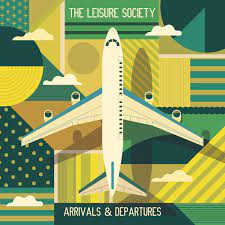

= Arrivals & Departures
The Leisure Society
2019
:toc:

From: https://genius.com/artists/The-leisure-society 

== Arrivals & Departures

[verse]
____
Arrivals and departures sit united in unconsciousness
Old friends become acquaintances in lives never better
We're out of luck and out of time
The mortal coil of modern life has summoned us to start a fire
Or writhe in the gutter in the rain

I notice you now you’re not here, a silence speaks the saddest end
Too late to fill, too late to mend, so I sit and weather
A raging sea without a shore, well maybe I'm not here at all
A phantom life dissolved in thoughts of why, where and whether you were true

We're out of phase, impossible now
Bitter the pill swallowed or sucked dry
Making a maze out of my mind
Now I put aside every letter I write
I wait for the cactus to bloom
I leant away for a minute to save
A final reminder of you
____

== A Bird a Bee Humanity

[verse]
____
Cut from the act, a trail in the underpass
Fall on your feet, feigning morality
We're chained to the heat
We're bound up in ecstasy
It's on then it's off
It starts then it never stops, it's never enough

I burn to see the best of me
A made up fate alive on the breeze
A bird, a bee, humanity
Well it ain't all that much, it ain't all that much

Asleep on the job
Dreaming the hours lost
A meaningless feat consuming the whole of me
I jumped out of sight
To live for another night
To feast on the art
A splint for my crooked heart

I burn to see the best of me
A made up fate alive on the breeze
A bird, a bee, humanity
Well it ain't all that much, it ain't all that much

We're all born crazy, that's the way we're made to be
We're all born crazy now
You might also like
God Has Taken A Vacation
The Leisure Society
Arrivals & Departures
The Leisure Society
Fight for Everyone
The Leisure Society
Cut from the act, a trail in the underpass
It's on then it's off
It starts then it never stops, it's never enough
____

== God Has Taken a Vacation

[verse]
____
[Verse 1]

God has taken a vacation
Birds are singing out of key
There are tales of ordinary sorrow
As the sun dissolves into the sea

[Chorus]

When an eye for an eye is all we try
What hope is there to be?

[Verse 2]

Rings are forming round the planet
The void is beckoning us in
Should I raise imaginary children
To repeat the same mistakes as me?

[Extended Chorus]

When an eye for an eye is all we try
What hope is there to be?
When an eye for an eye is all we try
What hope is there for me?
____

== I’ll Pay for It Now

[verse]
____
I'm carving in my arm
Boy you've really done it now
You've broken every heart
That you cared to be etched upon

So stick me in the ground
I made a fool of everyone who stuck around
And there's no way back for me now

I made a big mistake
And god knows I'll pay for it now

Digging in the dirt
There's a lot that you can learn
To lead this tainted town
In an ode to the underground

But I'm sticking to the floor
Like an over-bitten core that's tossed
And turning brown
There's a drop but I won't look down

I made a big mistake
And god knows I'll pay for it now
I made a big mistake
And god knows I'll pay for it now
____

== Overheard

[verse]
____
Joining the line at five, faithfully waiting
Fleeing the day's endeavor
Watching the summer die, bursting like rainclouds
You held it all together

We were fire, we were ice, in the arc of a dive
There is no better than you, there is no more left to do
And if it flies, I would let it

Under a blood-red sky, facing our failures
We know it's now or never
God isn't on our side, faith wouldn't change it
Avoiding the light forever

We were fire, we were ice, in the arc of a dive
There is no better than you, there is no more left to do
But if you had the time I could stay a while
____

== Let Me Bring You Down

[verse]
____
What's with the face that follows you around?
There were bones on your plate and a smile you couldn’t hide
But the animal in me needs a place to sleep
Just for a while, let me bring you down

Oh for the days that swallowed us alive
You were up in the gods, you were perched at the perfect height
But a love as sure as that, it could never last
Not long enough, let me bring you up

Lost in the haze, you left me here to lie
In the bed that we made on that burning summer night
And we did it all as one, drowned ourselves in song
Just for a while, you let me bring you down
____

== Be You Wherever

[verse]
____
Back when the lamplight was lit
I said I'll get used to this
Defied every reason and risk
To see you again

Corralled in the comfort of faith
We slipped through the open gate
And now we're all over the place
The days pass and blend

Be you wherever
Be you wherever with whoever

Prized into something grand
Perfected with trials and then
The weight of the world in your hands
You sink through the sand

Be you wherever
Be you wherever with whoever
Be you wherever
Be you wherever with whoever

There's a darkness creeps the corners of the room
There's a losing streak that hovers you
Just like the once famous singers on the road
Just like the seven billion ringers trying hard just to hold on
You might also like
Arundel Tomb
The Leisure Society
Let Me Bring You Down
The Leisure Society
A Bird, A Bee, Humanity
The Leisure Society
Why don't you let it go?
Why aren't you made of stone?

The clocks cup the hours in their hands
Your patience is wearing thin
I linger as long as I can
Then make other plans

Be you wherever
Be you wherever with whoever
Be you wherever
Be you wherever with whoever
____

== Arundel Tomb

[verse]
____
We were staring at the water through the gravely-written stones
Sitting out beneath the seasons, every story ever told
And the gravel keeps piling as the mourners shuffle through
Our branches were made to break too soon

Had a dream that I was sleeping when you came into the room
Slipped beside me, barely breathing, silhouetted by the moon
And we lay there like statues in a cold Arundel tomb
Our branches were made to break too soon

Is there anybody else in this tree?
Do the eyes fill the heart with a dream?
Will time's passage erase this memory?

Seven years without a warning, seven summers came and went
Petered out like any other, pulled the harvest from the beds
We were changing, mutating, tried to climb for a better view
Our branches were made to break too soon
They were made to break too soon
They were made to break too soon

Is there anybody else in this tree?
____

== Don’t Want to Do It Again

[verse]
____
Back to where we start, to where it all began
I don't want to do it again, I don't want to do it again
The sound it never stops, it permeates my brain
I don't want to do it again, I don't want to do it again

I feel like a landslide, so hold tight
I'm not ready, I'm not ready, oh no!

The feelings all unfold, defeated lives are framed
I don't want to do it again, I don't want to do it again

I feel like a landslide, so hold tight
I'm not ready, I'm not ready, oh no!
I'm not ready, I'm not ready, oh no!

Back to where we start, to where it all began
I don't want to do it again, I don't want to do it again
____

== Mistakes on the Field, Pt. I

[verse]
____
Show me tomorrow, I'll know how to feel
I'll make my mistakes on the field
No more excuses, no more appeals
I'll make my mistakes on the field

Show me tomorrow, I'll know how to feel
I'll make my mistakes on the field
No more excuses, no more appeals
I'll make my mistakes on the field

I'll make my mistakes on the field
I'll make my mistakes on the field
____

== Mistakes on the Field, Pt. II

(Instrumental)

== Leave Me to Sleep

[verse]
____
Caught in the crush again, all this is odd
Mired in the arms of the beast
Lacking in acumen, so much for me
Substitute man for machine

Moonless the night spits the stars from the sky
We mark off the days of the week
Leave me to sleep
Leave me to sleep

Blood on the rocks again, light lifts the east
Lends me the strength to proceed
Burrowing on through the lightly-etched streets
Trailing a life on a leash

Still we survive - and we do it in style
We mark off the days of the week
Leave me to sleep
Leave me to sleep
Leave me to sleep
Leave me to sleep

Sing me a song from the pit brow to ease
Wave after wave of repeat
It's hard to move on when you're dead on your feet
Find me a new life to lease
Or leave me to sleep
Leave me to sleep
Leave me to sleep
You might also like
Beat Of A Drum
The Leisure Society
Mistakes On The Field (Part 2)
The Leisure Society
A Bird, A Bee, Humanity
The Leisure Society
(Spoken)
Come love, when you're done in
When your bones creak and the light sinks
Tell me, did we dream it
That dusk when we rushed like birds
Through the gloaming
To write the last words
On the page of the evening...
____

== Beat of a Drum

[verse]
____
A search for a sound
Billowing in the nowhere of now
It's unheard, on the wire
And the minute it hits is the minute I'm unbound

Always on the beat of a drum, and no I never know why
Always on the beat of a drum, and no I never know why
Always on the beat of a drum, and no I never know why
Always on the beat of a drum, and no I never know why
I never know why, I never know why

The world is unfurled
It's limitless in the weight and the worth
It survives through the fire
And rhythm will lift the id and the ire

Always on the beat of a drum, and no I never know why
Always on the beat of a drum, and no I never know why
I never know why, I never know why, I never know why

The two of us are on the Earth
For everything and nothing much
We're falling through the black light, blinking

And now we are found
Shivering in the cold light of doubt
No more shall we pause
From the minute we lift to the minute we drop down
You might also like
There Are No Rules Around Here
The Leisure Society
Leave Me To Sleep
The Leisure Society
A Bird, A Bee, Humanity
The Leisure Society
Always on the beat of a drum, and no I never know why
Always on the beat of a drum, and no I never know why
Always on the beat of a drum, and no I never know why
Always on the beat of a drum, and no I never know why
I never know why, I never know why
I never know why, I never know why
____

== There Are No Rules Around Here

[verse]
____
Taking in the English air, we were caught together wasting
Seems the more you get to know, the less you seem to rate it
Tired voices on the phone, from boy to man we go
We were lost and left to face the weather

Reason slips there are no bad ideas
Human nature made a mountain out of fear
There are no rules around here
There are no rules around here
There are no rules around here
There are no rules around here

Marching on the vortex floor, we were bound together baited
Seems the more you get to know, well the less you seem to rate it
We shelter from the cold, collapse our truth and go
We were lost and left to face the weather

Reason slips there are no bad ideas
Human nature made a mountain out of fear
There are no rules around here

Seasons shift there are no bad ideas
Human nature made a mountain out of fear
There are no rules around here
There are no rules around here
There are no rules around here
There are no rules around here
____

== You’ve Got the Universe

[verse]
____
I'm waking up in a crowded room
Feel I'm breaking under the gaze of you
All those words weren't enough
To describe the things we've lost
But you've got the Universe

Oh I'll make it, somehow I'll make it through
Though I'm aching, aching before I move
Every night feeds the dust
Every morning breaks untouched
But you've got the Universe

You've got the Universe
You've got the Universe
You've got the Universe
You've got the Universe

Every night feeds the dust
Every morning breaks untouched
But you've got the Universe
____

== Ways to Be Saved

[verse]
____
Another one slips through your grip
Every autumn is saved in song
Though you're a joy to behold I can't keep holding on
We're all the same it seems
The light is seldom off
No more shall I remain, no more shall you be home
I've seen an answer
There are ways to be saved but I don't see them lasting

Anxiety rips us to bits
Underneath, every beast is lost
My independence streaks between the feet and floor
Come one, come all, be amazed!
Every item is syphoned off
Unlock your artistry, unlock this beating heart
I've seen an answer
There are ways to be saved but I don't see them lasting
There are ways to be saved but I don't see them lasting

Technology weighs on your day
There was peace in the great unknown
Corralled in industry, I watch the world unfold
You run like a ghost through the prose
Bleach the page with an aching word
How high your influence exalts the way we were
I've seen an answer
There are ways to be saved but I don't see them lasting
There are ways to be saved but I don't see them lasting
____
