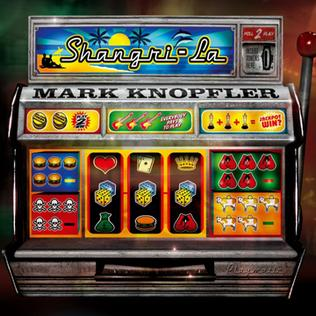

= Shangri-La
Mark Knopfler
2004
:toc:

From: https://www.azlyrics.com/m/markknopfler.html

== 5.15 A.M.

[verse]
____ 
5.15 A.M.
Snow laying all around
A collier cycles home
From his night shift underground
Past the silent pub
Primary school, workingmens club
On the road from the pithead
The churchyard packed
With mining dead

Then beneath the bridge
He comes to a giant car
A shroud of snow upon the roof
A mark ten jaguar
He thought the man was fast asleep
Silent, still and deep
Both dead and cold
Shot through
With bullet holes

The one armed bandit man
Came north to fill his boots
Came up from cockneyland
E-type jags and flashy suits
Put your money in
Pull the levers
Watch them spin
Cash cows in all the pubs
But he preferred the new nightclubs

Nineteen sixty-seven
Bandit men in birdcage heaven
La dolce vita, sixty-nine
All new to people of the tyne

Who knows who did what
Somebody made a call
They said his hands
Were in the pot
That he'd been skimming hauls
He picks up the swag
They gaily gave away
Drives his giant jag
Off to his big pay day

The bandit man
Came north to fill his boots
Came up from cockneyland
E-type jags and flashy suits
The bandit man
Came up the great north road
Up to geordieland
To mine
The mother lode

Seams blew up or cracked
Black diamonds came hard won
Generations toiled and hacked
For a pittance and black lung
Crushed by tub or stone
Together
And alone
How the young and old
Paid the price of coal

Eighteen sixty-seven
My angel's gone to heaven
He'll be happy there
Sunlight and sweet clean air

They gather round the glass
Tough hewers and crutters
Child trappers and putters
The little foals and half-marrows
Who pushed
And pulled the barrows
The hod boys
And the rolleywaymen
5.15 A.M. 
____ 

== Boom, Like That

[verse]
____ 
I'm going to San Bernardino ring-a-ding-ding
Milkshake mixers that's my thing now
These guys bought a heap of my stuff
And I gotta see a good thing sure enough now

Oh my name is not Crock, that's Kroc with a K
Like crocodile but not spelled that way now
It's dog eat dog, rat eat rat
Kroc style... Boom! like that

Folks line up all down the street
Now I am seeing this girl devour her meat now
And then I get it Wham! as clear as day
My pulse begins to hammer then I hear a voice say:

These boys have got this down ought to be one of these in every town
These boys have got the touch It's clean as a whistle and it don't cost much
Wham! Bam! You don't wait long, shake, fries, patty you're gone
How about that friendly name, heck, every little thing ought to stay the same

Or my name is not Crock, that's Kroc with a K
Like crocodile but not spelled that way now
It's dog eat dog, rat eat rat
Dog eat dog, rat eat rat now
Oh it's dog eat dog, rat eat rat
Kroc style... Boom! like that

You gentlemen ought to expand
You're gonna need a helping hand now
So gentlemen well what about me?
We'll make a little business history now

Oh my name's not Crock, you can call me Ray
Like crocodile but not spelled that way now
It's dog eat dog, rat eat rat
Kroc style... Boom! like that

Well we build it up and I buy 'em out
But man they made me grind it out now
They open up a new place flippin meat
So I do too, right across the street

I got the name but I need the town, sell em' in the end and it all shuts down
Sometimes you gotta be an S.O.B. you wanna make a dream reality
Competition sent em south, if they're gonna drown put a hose in their mouth
Do not pass "Go", go straight to hell
I smell that meat hook smell

Oh my name is not Crock, that's Kroc with a K
Like crocodile but not spelled that way now
Ohh it's dog eat dog, rat eat rat
Dog eat dog, rat eat rat now
Ohh it's dog eat dog, rat eat rat
Kroc style... Boom! like that 
____ 

== Sucker Row

[verse]
____ 
Somebody's gotta crack
A whip around here
Who's minding the store?
Shake it up sell some beer
What's your
Money maker for?
Pay day
We're packin' 'em in
Six-gun Annie
And Buffalo Jill
But who's to say
They'll be back again
For a refill?
Honey, you know the drill
Ain't no left turn
Down sleepy time street
You gotta be fast
But you gotta stay loose
Thinking
On your feet
Slick as grass
Through a goose
We gotta
Rationalise
The payroll
Is giving me chills
You and me's
Getting organised
It's kill or be killed
Honey, you know the drill

Well they can all look down
On sucker row
But they all forget
The tallest trees
From acorns grow
Though they ain't yet
I never look down
On a sucker stake
They all pay the bills
I never gave a sucker
An even break
And I never will

A beautiful vision
Keeps coming to me
I see
A miracle mile
Flying in
For free
Service
With a smile
High rollers
Fancy hotels
Big time singers
Topping the bill
You gotta have a feel
For the stuff that sells
Call it a skill
Honey, you know the drill
Somebody's gotta crack
A whip around here
Who's
Minding the store?
Shake it up
Sell some beer
Money walking
Through the door
Annie's arriving
At a dangerous age
Don't you
Go getting ill
Get another woman
Up in the cage
Who ain't over the hill
Honey, you know the drill 
____ 

== The Trawlerman's Song

[verse]
____ 
We're taking on water
Diesel and stores
Laying up awhile
Before I'm back on board
They're patching her up
To go fishing again
They're welding her rudder
Scrubbing her keel
Scars on her belly
Need time to heal
In the dock
With the trawlermen

I know all the people
There's nobody new
Soon we'll be leaving
With the same old crew
On the green water
The tumbling sea
They ain't running
Like the good old days
Time's just slipping
Down the old slipways
In the dock
So dear to me

Dark is the night
I need a guiding light
To keep me
From foundering
On the rocks
My only prayer
Is just to see you there
At the end
Of my wandering
Back in the dock

I could use a layoff
Getting my strength back
But there's a loan to pay off
And a few skipjack
So it's a turnaround
Back in the southerly wind
Pirates coming in
To steal our gold
You can count yourself lucky
With a profit in the hold
In the dock
When we come in

Dark is the night
I need a guiding light
To keep me
From foundering
On the rocks
My only prayer
Is just to see you there
At the end
Of my wandering
Back in the dock 
____ 

== Back To Tupelo

[verse]
____ 
Around the time of 'clambake'
Movie number twenty-five
You and the lying dutchman
Are still in overdrive
You're as strong as when you started
Mississippi in your soul
You can still be marlon brando
And the king of rock and roll

It isn't just the records
No, you must have hollywood
The songs alone are not enough
That much is understood
You'll soon be back in memphis
Maybe then you'll know what to do
The storylines they're giving you
Are just not ringing true

Oh, it's a ways to go
Back to Tupelo

When you're young and beautiful
Your dreams are all ideals
Later on it's not the same
Lord, everything is real
Sixteen hundred miles of highway
Roll back to the truth
And a song to give your mother
In your first recording booth

Around the time of 'clambake'
That old dream's still rolling on
Sometimes there'll be the feeling
Things are going wrong
The morning star is fading
Lord, the mississippi's cold
You can still be marlon brando
And the king of rock and roll

But it's a ways to go
Back to Tupelo 
____ 

== Our Shangri-La

[verse]
____ 
It's the end of a perfect day
For surfer boys and girls
The sun's dropping down in the bay
And falling off the world
There's a diamond in the sky
Our evening star
In our shangri-la

Get that fire burning strong
Right here and right now
It's here and then it's gone
There's no secret, anyhow
We may never love again
To the music of guitars
In our Shangri-La

Tonight your beauty burns
Into my memory
The wheel of heaven turns
Above us endlessly
This is all the heaven we've got
Right here where we are
In our Shangri-La

This is all the heaven we've got
Right here where we are
In our Shangri-La
In our Shangri-La
In our Shangri-La 
____ 

== Everybody Pays

[verse]
____ 
I got shot off my horse
So what? I'm up again
And playing
In one of these
Big saloons on main
You can come up here
Take a look
Around these sinners' dens
You're only ever going to find
One or two real games
Nobody's driving
Me underground
Not yet anyway
But either on the strip
Or on the edge of town
Everybody pays
Everybody pays to play

Yeah, you ought to stay
Right where you are
In sawdust land
It's probably the
Safest place to be
With your
Greasy little pork pies
And your shoestring hands
It makes
No difference to me
All those directions
Which we never took
To go our different ways
Who went and wrote
The oldest story in the book?
Everybody pays
Everybody pays to play

Curl up inside
A boxcar dream
And disappear
With a couple
Low roller friends
You were never one
For trouble
So get out of here
I knew the game
Was dangerous back then
But nobody's breezing
Through these swinging doors
Just ups and walks away
Everybody has to leave
Some blood here on the floor
Everybody pays
Everybody pays to play 
____ 

== Song For Sonny Liston

[verse]
____ 
So many mouths
To feed on the farm
Sonny was the second
To the last one born
His mamma ran away
And his daddy beat him bad
And he grew up wild
Good love he never had

He had a left
Like henry's hammer
A right like betty bamalam
Rode with the muggers
In the dark and dread
And all them sluggers
Went down like lead

Well he hung with the hoods
He wouldn't stroke the fans
But he had dynamite
In both his hands
Boom bam
Like the slammer door
The bell and the can
And the bodies on the floor

Beware the bear's in town
Somebody's money says
The bear's going down
Yeah, the bear never smiles
Sonny's going down
For miles and miles
Sonny's going down
For miles and miles

The writers didn't like him
The fight game jocks
With his lowlife backers
And his hands like rocks
They didn't want to have
A bogey man
They didn't like him
And he didn't like them

Black cadillac
Alligator boots
Money in the pockets
Of his sharkskin suits
Some say the bear
Took a flop
They couldn't believe it
When they saw him drop

He had a left
Like henry's hammer
A right like betty bamalam
Rode with the muggers
In the dark and dread
And all them sluggers
Went down like lead

Joe Louis was his hero
He tried to be the same
But a criminal child
Wears a ball and chain
So the civil rights people
Didn't want him on the throne
And the hacks and the cops
Wouldn't leave him alone

Beware the bear's in town
Somebody's money says
The bear's going down
Yeah, the bear never smiles
Sonny's going down
For miles and miles
Sonny's going down
For miles and miles

At the foot of his bed
With his feet on the floor
There was dope in his veins
And a pistol on the drawer
There was no investigation
As such
He hated needles
But he knew too much

Criss-crossed
On his back
Scars from his daddy
Like slavery tracks
The second-last child
Was the second-last king
Never again was it the same
In the ring

He had a left
Like henry's hammer
A right like betty bamalam
Rode with the muggers
In the dark and dread
And all them sluggers
Went down like lead

They never could be sure
About the day he was born
A motherless child
Set to working on the farm
And they never could be sure
About the day he died
The bear was the king
They cast aside

Beware the bear's in town
Somebody's money says
The bear's going down
Yeah, the bear never smiles
Sonny's going down
For miles and miles
Sonny's going down
For miles and miles 
____ 

== Whoop De Doo

[verse]
____ 
If I'm over the moon
It's because I'm over you
A day at a time
And I'm tickety-boo
I don't carry on
The way I used to
Whoop de doo
Whoop de doo

If I'm doing great
It's because when I get home
I don't go straight
To my answerphone
And the tears don't come
The way they used to
Whoop de doo
Whoop de doo

So many little things
Are so much better now
They were only the little things
Anyhow

If I'm over the moon
It's because that's what I am
Funny that once
I used to give a damn
And I'd do anything
In the whole wide world for you
Whoop de doo
Whoop de doo

Anything
Anything you'd want me to
Whoop de doo
Whoop de doo 
____ 

== Postcards From Paraguay

[verse]
____ 
One thing was leading to the next
I bit off more than I could chew
I had the power to sign the cheques
It wasn't difficult to do
I couldn't stay and face the music
So many reasons why
I won't be sending postcards

From Paraguay
From Paraguay
From Paraguay

I robbed a bank full of dinero
A great big mountain of dough
So it was goodbye companero
And cheerio
I couldn't stay and face the music
So many reasons why
I won't be sending postcards

From Paraguay
From Paraguay
From Paraguay

I never meant to be a cheater
But there was blood on the wall
I had to steal from Peter
To pay what I owed to Paul
I couldn't stay and face the music
So many reasons why
I won't be sending postcards

From Paraguay
From Paraguay
From Paraguay 
____ 

== All That Matters

[verse]
____ 
My darling girl
My darling girl
You're all that matters
In this wicked world
All that matters
All that matters
My darling boy
My darling boy
All of my sunshine
And all of my joy
You're all that matters
All that matters

Well, I can't stop the pain
When it calls
I'm a man
And I can't stop the rain
When it falls, my darling
Who can?

My darling girl
My darling girl
You're all that matters
In this wicked world
All that matters
All that matters
My darling friend
My darling friend
All we've got going
Is love in the end
It's all that matters
All that matters
____ 

== Stand Up Guy

[verse]
____ 
Brew the coffee in a bucket
Double straight man and banjo
If you don't got the snake oil
Buster, you don't got a show
Who puts the doh-re-me
In our pockets
Keeps the party going on?
It's the man
Who sells the potions
I'm just one who plays the songs
Now they generally buys
The bigger size
They usually rub it in
I drank it once, it tasted
Like grease and paraffin
It's mostly alcohol, okay
You can't deny it's strong
We was going through the motions
'til the doctor came along

There stands the bottle
Ladies and gentlemen
All these bottles
Don't have to tell you, friends
These days miracles
Don't come falling from the sky
Raise your glasses to the doctor
To a stand up guy

When the monkeyshine is flying
And he's promising the cure
He says the french
For your lovesick blues
La maladie d'amour
He gets the chumps all laughing
But he gets a few to buy
Here's to beefsteak
When you're hungry
And whiskey when you're dry
Now the band'll blow their moolah
Like sailors gone ashore
Now we're going to west helena
To gamble, drink and whore
Let's you and me
All make whoopee
Here's mud in your eye
Here's to all the gals you ever want
And heaven when you die

There stands the bottle
Ladies and gentlemen
All these bottles
Don't have to tell you, friends
These days miracles
Don't come falling from the sky
Raise your glasses to the doctor
To a stand up guy

There's a big cheese with a cigar
Been sizing up the show
He wants to get the doctor
Pitching on the radio
I will make a switch to guitar
But the rules all still apply
They want to trust somebody
Yeah, they want a stand up guy

There stands the bottle
Here's to absent friends
All these bottles
Dead soldiers in the end
These days miracles
Don't come falling from the sky
Raise your glasses to the doctor
To a stand up guy
To the doctor
A stand up guy 
____ 

== Donegan's Gone

[verse]
____ 
Donegan's gone, Lonnie Donegan
Donegan's gone
Gone, Lonnie Donegan
Donegan's gone
Play that big grand coulee dam
Nobody loves like an irishman
Gone, Lonnie Donegan
Donegan's gone

Donegan's gone, Lonnie Donegan
Donegan's gone
Gone, Lonnie Donegan
Donegan's gone
Lord, I'm just a rolling stone
Rock my soul I wanna go home
Gone, Lonnie Donegan
Donegan's gone

Donegan's gone, Lonnie Donegan
Donegan's gone
Gone, Lonnie Donegan
Donegan's gone
Stackalee and a gamblin' man
Rock my soul in the bosom of abraham
Gone, Lonnie Donegan
Donegan's gone

Donegan's gone, Lonnie Donegan
Donegan's gone
Gone, Lonnie Donegan
Donegan's gone
Time just goes on rolling by
Lord, I feel like I could cry
Gone, Lonnie Donegan
Donegan's gone 
____ 

== Don't Crash The Ambulance

[verse]
____ 
Don't often open up this floor
Since I handed in my gun
What all these keys are for
Now my tour of duty's done
You got to know the switches
Now you got your turn
Watch and learn, junior
Watch and learn

Now you will get your
Trouble spots
Here's one from
Down voodoo way
Bragged he had me
By the you-know-whats
Very funny, you don't say
The big enchilada
Stealing elections
Had to go down there
Trash collection
Got his cojones
On my desk in there
Made into a souvenir
Set of cufflinks, nice pair
The rest of him's
Someplace up here
Sometimes you got to
Put a shoulder to the door
Not so fast, junior
Listen to your pa
Here, son
I'm handing over to you
Don't crash the ambulance
Whatever you do

What we have here's
A dung hole place
Thought it was fly shit
On the map
Fat bastard, ugly face
And the personal crap
You can't move the barriers
You can't mess with oil and gas
Had to go down there
Stick a couple
Aircraft carriers
In his ass
Fancy dress
Medals chest
It's all in here
For all the gigs
Gas mask
Bullet-proof vest
All the usual rigs
There'll be things they missed
They didn't mention
You've even
Got a whistle in there
For attracting attention

Well, I think you're gonna
Be okay, son
You've had the tour, I guess
These two buttons
By the way
This one I hope
You never press
Some holy fool, just watch
Who's not like you or me
That one's the whole
Shooting match
Right there
It's the whole shitaree
We don't forget
Who put us here, jack
That's page one
We talk soft
But carry a big stick
And pack the biggest gun
We don't like accidents
Major or minor
You don't want yourself
An incident
Don't ever invade china

Here, son
I'm handing over to you
Don't crash the ambulance
Here, son
I'm handing over to you
Don't crash the ambulance
Whatever you do 
____ 

