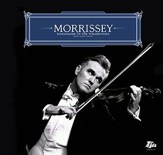

= Ringleader Of The Tormentors
Morrissey
2006
:toc:

link:../../links.html[Other albums]

++++
 
++++

== I Will See You In Far Off Places

[verse]
____
Nobody knows what human life is.
Why we come, why we go.
So why then do I know
I will see you,
I will see you in far off places?

The heart knows why I grieve
And yes one day I will close my eyes forever
But I will see you
I will see you in far off places.

It's so easy for us to sit together
But it's so hard for our hearts to combine
And why?
And why?
Why? Why? Why? Why?

Destiny for some is to save lives
But destiny for some is to end lives
But there is no end
And I will see you in far off places.

If your god bestows protection upon you
And if the USA doesn't bomb you
I believe I will see you somewhere safe
Looking to the camera, messing around
And pulling faces.
____

== Dear God, Please Help Me

[verse]
____
I am walking through Rome
With my heart on a string
Dear God, please help me

And I am so very tired
Of doing the right thing
Dear God, please help me

There are explosive kegs
Between my legs
Dear God, please help me

Will you follow and know
Know me more than you do
Track me down
And try to win me?

Then he motions to me
With his hand on my knee
Dear God, did this kind of thing happen to you?

Now I'm spreading your legs
With mine in-between
Dear God, if I could I would help you

And now I am walking through Rome
And there is no room to move
But the heart feels free

The heart feels free
The heart feels free
But the heart... feels free

The heart feels free
The heart feels free
____

== You Have Killed Me

[verse]
____
Pasolini is me
'Accattone' you'll be
I entered nothing and nothing entered me
'Til you came with the key
And you did your best but

As I live and breathe
You have killed me
You have killed me
Yes I walk around somehow
But you have killed me
You have killed me

Piazza Cavour, what's my life for?

Visconti is me
Magnani you'll never be
I entered nothing and nothing entered me
'Til you came with the key
And you did your best but

As I live and breathe
You have killed me
You have killed me
Yes, I walk around somehow
But you have killed me
You have killed me

Who am I that I come to be here...?

As I live and breathe
You have killed me
You have killed me
Yes I walk around somehow
But you have killed me
You have killed me

And there is no point saying this again
There is no point saying this again
But I forgive you, I forgive you
Always I do forgive you
____

== The Youngest Was The Most Loved

[verse]
____
The youngest was the most loved
The youngest was the shielded
We kept him from the world's glare
And he turned into a killer

Retrousse nose
Turned up and mischievous
Forget-me-not eyes
that cried if we ever left his side

There is no such thing in life as normal
There is no such thing in life as normal

The youngest was the most loved
The youngest was the cherub
A small boy from a poor house
Who turned into a killer

A blush, it rose
If he had to say 'hello'
A lop-sided grin
Strained to keep the shyness in

There is no such thing in life as normal
There is no such thing in life as normal

The youngest was the most loved
The youngest was the cherub
The luck was all before him
With a lovely wife beside him

The youngest was the most loved
The youngest was the cherub
We kept him from the world's glare
And he turned into a killer

There is no such thing in life as normal
There is no such thing in life as normal
____

== In The Future When All's Well

[verse]
____
Armed with wealth and good health
The best of health
In the future when all's well
I will lie down and be counted
In the future when all's well

I thank you
I thank you with all of my heart
I thank you
I thank you with all of my heart
Lee, please stand up and defend me
In the future when all's well
Confront what you are afraid of
In the future when all's well

Every day I play a sad game called
In the future when all's well
Living longer than I had intended
Something must have gone... right!

I thank you
I thank you with all of my heart
I thank you
I thank you with all of my heart
Please, please stand up and defend me
In the future when all's well
Confront what you are afraid of
In the future when all's well

Hold me closely if your will allows it
In the future when all's well
Paired-off,
Pawed till I can barely stand it
The future is ended by a long, long sleep
The future is ended by a long, long sleep
The future is ended by a long sleep
____

== The Father Who Must Be Killed

[verse]
____
Step-child, you have outlived your time
You represent embarrassment and failure
And the Father who must be killed
Is the blight upon your blighted life
And his might is his legal right
To ground you down

Step-child, with every petty swipe
You just might find you're fighting for your life
And the father who must be killed
Is a step-father but nonetheless
The way he chews his food
Rips right through your senses

Step-child, there's a knife in a drawer in a room downstairs
And you, you know what you must do
So the step-child ran with a knife to his sleeping frame
And slams it in his arms, his legs, his face, his neck and says
"There's a law against me now"
And the Father who must be killed
With his dying breath, he grabs her hand
And he looks into her eyes
He says "I'm sorry" and he dies

"Step-child, I release you
With this broken voice I beseech you"

"Why are lives so short?"
The step-child thought heart pointing to the sky
"No one to warn me
No hand to touch me
And no Bible-belters to mess with me
Momma don't miss me
Momma don't miss me
This death will complete me"
"But where I go there will be no one to meet me
I know there will be no one to meet me"
But still the step-child pressed the knife to her throat
Heart pointing to the sky
"Just as Motherless birds fly high
Then... so shall I
So shall I
So shall I
So shall I
So shall I"
____

== Life Is A Pigsty

[verse]
____
It's the same old S.O.S.
But with brand new broken fortunes
And once again I turn to you
Once again I do I turn to you
It's the same old S.O.S.
But with brand new broken fortunes
I'm the same underneath
But this you, you surely knew

Life is a pigsty
Life is a pigsty
Life is a pigsty
Life is a pigsty
Life, life is a pigsty
Life, life is a pigsty
Life, life is a pigsty
Life is a pigsty
And if you don't know this
Then what do you know?
Every second of my life I only live for you
And you can shoot me
And you can throw me off a train
I still maintain
I still maintain
Life, life is a pigsty
Life is a pigsty
And I'd been shifting gears all of my life
But I'm still the same underneath
This you surely knew
I can't reach you
I can't reach you
I can't reach you anymore

Can you please stop time?
Can you stop the pain?
I feel too cold
And now I feel too warm again
Can you stop this pain?
Can you stop this pain?
Even now in the final hour of my life
I'm falling in love again
Again
Even now in the final hour of my life
I'm falling in love again
Again
Again
Again
I'm falling in love again
Again
Again
Again
____

== I'll Never Be Anybody's Hero Now

[verse]
____
Warm lights from the grand houses blind me
Haves cannot stand Have-nots
And my love is under the ground
My one true love is under the ground
And I'll never be
I'll never be
I'll never be anybody's hero now
I'll never be
I'll never be
I'll never be anybody's hero now
They who should love me
Walk right through me
I am a ghost
And as far as I know I haven't even died
And my love is under the ground
My one true love is under the ground
And I'll never be
I'll never be
I'll never be anybody's hero now
I'll never be
I'll never be
I'll never be anybody's hero now

(See as I... See as I... See as I...)

I'll never be
I'll never be
I'll never be anybody's lover now
I'll never be
I'll never be
I'll never be anybody's lover now
Things I've heard and I've seen
And I've felt and I've been
Tell me I'll never be anybody's lover now
It begins in the heart
And it hurts when it's true
It only hurts because it's true
____

== On The Streets I Ran

[verse]
____
Oh a working-class face glares back
At me from the glass and lurches
"Oh forgive me, on the streets I ran
Turned sickness into popular song"
Streets of wet-black holes
On roads you can never know
You never have them but they always have you
Till the day that you croak
It's no joke
Oh a working-class face glares back
At me from the glass and lurches
"Oh forgive me on the streets I ran
Turned sickness into unpopular song"
And all these streets can do
Is claim to know the real you
And warn: "if you don't leave, you will kill or be killed"
Which isn't very nice
Here, everybody's friendly
But nobody's friends
Oh dear God, when will I be where I should be?
And when the palmist said:
"One Thursday you will be dead"
I said: "No, not me, this cannot be
Dear God, take him, take them, take anyone
The stillborn
The newborn
The infirm
Take anyone
Take people from Pittsburgh, Pennsylvania
Just spare me!"
____

== To Me You Are A Work Of Art

[verse]
____
I live a life
I feel the pain
To sing this song
To tell the tale
I wish I never even heard the song
I see the world
It makes me puke
But then I look at you and know
That somewhere there's a someone who can soothe me

To me you are a work of art
And I would give you my heart
That's if I had one

I see the world
It makes me puke
But then I look at you and know
That somewhere there's a someone who can soothe me

To me you are a work of art
And I would give you my heart
That's if I had one, had one

To me you are a work of art
And I would give you my heart
That's if I had one
____

== I Just Want To See The Boy Happy

[verse]
____
Lord, these words I beg of you
As I kneel down at my bed
Because soon I will be dead
Let's face it soon I will be dead
And I just want to
I want to see the boy happy
With some hope in his pale eyes
Is that too much to ask?
Before I die
I have one final dream
For my own life I don't care anything

Lord these words I beg of you
As I kneel down at my bed
Let's face it soon I will be dead
And I just want to
I want to see the boy happy
With his arms around his first love
Is that too much to ask?
Before I die
I have one final dream
For my own life I don't care anything
And I just want to
I want to see this boy happy
Why is this such a bad thing?
____

== At Last I Am Born

[verse]
____
At last I am born
Historians note
I am finally born
I once used to chase affection withdrawn
But now I just sit back and yawn
Because I am born, born, born
"Look at me now
From difficult child
to spectral hand to Claude Brasseur
Oh blah blah blah..."
At last I am born
Vulgarians know
I am finally born
I once thought that time accentuates despair
But now I don't actually care
Because I am born, born, born
"Look at me now
From difficult child
To spectral hand to Claude Brasseur
Oh blah blah blah..."
At last I am born
At last I am born
Living the one true free life born
I once thought I had numerous reasons to cry
And I did, but I don't anymore
Because I am born, born, born
At last I am born
At last I am born
It took me a long, long time
But now I am born
I once was a mess of guilt because of the flesh
It's remarkable what you can learn
Once you are born, born, born
Born, born, born
Born, born, born
____
