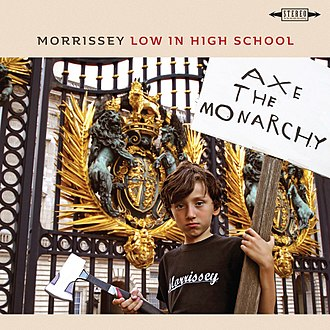

= Low In High School
Morrissey
2017
:toc:

link:../../links.html[Other albums]

++++
 
++++	

== My Love, I'd Do Anything For You

[verse]
____
Teach your kids to recognize and to despise all the propaganda
Filtered down by the dead echelons mainstream media

You know me well
My love, I'd do anything for you
Society's hell
You need me just like I need you

Weren't we all born to mourn and to yawn at the occupations
That control every day of our lives
We can't live as we wish, live as we wish, live as we wish

You know me well
My love, I'd do anything for you
Society's hell
You need me just like I need you
You know me well
My love, I'd do anything for you
Society's hell
You need me just like I need you

We all go our own ways
Separately in the same direction
And here am I every night of my life always missing someone

I'd like to be rotted out just before I become aware of the pain
The more I wish in my heart for someone less likely they come
____

== I Wish You Lonely

[verse]
____
I wish you lonely
If only for one day
So that you might see routine for me
Since the day I was born, born
Think of yourself only
Of everything you demand
You want and you need
And to hell
To hell with everybody else, everybody else

Turn the key slowly
Remember how I can't sleep
Or if ever I do, an earthquake
An earthquake couldn't agitate, couldn't agitate

Tombs full of fools who gave their life upon command
Of monarchy, oligarch, head of state, potentate
And now never coming back, never coming back
Tombs are full of fools who gave their life upon command
Of Romance gone wrong
The same old glue and never coming true, never true
Tombs are full of fools who gave their life upon command
Oh heroin, heroin, heroin, heroin, heroin
And never coming back, never coming back

I wish you lonely
Like the last tracked humpback whale
Chased by gunships from Bergen
But never giving in, never giving in
____

== Jacky's Only Happy When She's Up On The Stage

[verse]
____
Jacky's only happy when she's up on the stage
I make this claim, now let me explain
Since she lost you
Jacky's only happy when she's up on the stage
Free in the truth of make-believe
Since she lost you

She is determined to prove
How she can build up the pain
Of every lost and lonely day

Jacky's only happy when she's up on the stage
She'll make you believe what you'll never believe
Since she lost you
Jacky's only Jacky when she's up on the stage
Living bodies that actually move!
Since she lost you

She is determined to prove
How she can fill up the page
Of every lost and lonely day

"Cue lights! I am singing to my lover at night!
Scene Two: Everyone who comes must go!
Scene Four: Blacker than ever before!
Scene Six: This country is making me sick!"

Jacky cracks when she isn't on stage
See the effects of sexual neglect
No script, no crew, no auto-cue
No audience telling her what to do!
Exit, exit
Everybody's heading for the exit, exit
Everybody's running to the exit, exit
Everybody's running to the exit, exit
Everybody's heading for the exit, exit
Everybody's running to the exit, exit
Everybody's running to the exit, exit
Everybody's running to the exit, exit
Everybody's running to the exit, exit
Everybody's heading for the exit, exit
Everybody's heading for the exit, exit
Everybody's heading for the exit, exit, exit, exit, exit, exit, exit, exit, exit, exit, exit, exit, exit
____

== Home Is A Question Mark

[verse]
____
I have seen many shores
I hug the land but nothing more
Because I haven't met you
I've wined and I've dined
With every bogus music mogul
No sign of you
I've brushed and I've rubbed
Pressing pounds excluding charms
But never in arms

And that's why home is a question mark
Home is some place I dunno
Home is a question mark
Home is some place I dunno

I have been brave
Deep in every shaven cave
And were you
Another film on replay
This time, Hell with Guillaume Canet
For English me

And that's why home is a question mark
Home is some place I dunno
Home is a question mark
Home is some place I dunno

Home, is it just a word?
Or is it something you
Carry within you?
I'm happy just to be here
If I ever find home
If I ever find home
If I ever find home
If I get there, would you meet me?
Wrap your legs around my face just to greet me
If I ever get there, would you meet me?
Wrap your legs around my face just to greet me
If I ever get there, do you really think I will?
Do you really think I will?
Do you really think I will?
How many times I've saved myself
____

== Spent The Day In Bed

[verse]
____
Spent the day in bed
Very happy I did, yes
I spent the day in bed
As the workers stay enslaved
I spent the day in bed
I'm not my type, but
I love my bed
And I recommend that you

Stop watching the news!
Because the news contrives to frighten you
To make you feel small and alone
To make you feel that your mind isn't your own

I spent the day in bed
It's a consolation
When all my dreams
Are perfectly legal
In sheets for which I paid
I am now laid
And I recommend to all of my friends that they

Stop watching the news!
Because the news contrives to frighten you
To make you feel small and alone
To make you feel that your mind isn't your own

Oh time, do as I wish
Time, do as I wish
Oh time, do as I wish
Time, do as I wish
Oh time, do as I wish
Time, do as I wish
Oh time, do as I wish
Do as I wish

I spent the day in bed
You can please yourself
But, I spent the day in bed
Pillows like pillars
Life ends in death
So, there's nothing wrong with
Being good to yourself
Be good to yourself for once!

And no bus, no boss, no rain, no train
No bus, no boss, no rain, no train
No bus, no boss, no rain, no train
No emasculation, no castration
No highway, freeway, motorway
No bus, no boss, no rain, no train
No bus, no boss, no rain, no train
No bus, no boss, no rain, no train
____

== I Bury The Living

[verse]
____
A wretched outcast
With no point of view
What could I do?
Just military servants
I carry out the powerful vulgarian view
I scatter glue
Do as I say or I scatter you

Oh, no, no, no, no, no
You can't blame me
I'm just an innocent soldier
There would be no war if not for me
I'm just a sweet little soldier
No, no, no, no, no
You can't blame me
I'm just an innocent soldier
Give me an order
I'll blow up a border
Give me an order and I'll blow up your daughter

Call me brave, call me a peace-making hero
Call me anything except what I am
From a class without, I haven't a clue
What the war is about
I haven't got a clue
Have you?

Oh no, no, no
You can't blame me
I'm just an innocent soldier
There would be no war if not for me
I'm just a sweet little soldier
No, no, no, no, no
You can't blame me
After all, I'm just

Honor, mad, cannon fodder
Honor, mad, cannon fodder
I'm honor, mad, cannon fodder
I'm honor, mad, cannon fodder
I'm honor, mad, cannon fodder
I'm honor, mad, cannon fodder
I'm honor, mad, cannon fodder
Honor, mad, cannon fodder
Honor, mad, cannon fodder

Duty done by
The moment at hand
I am answerable
Only to Jesus
And with the grace of God
I will die in my own bed
If you wonder what's in my head
It's just the hatred for all human life
When I lose mine, my mother will say:
"He died doing the job he loved"
But I died with a bullet to the forehead
That wasn't the job I loved
That wasn't the job I loved
That wasn't the job I loved

Funny how the war goes on
Without our John
Without our John
It's funny how the war goes on
Without our John
Without our John

La la la la la la la...

Funny how the war goes on
Without our John
Without our John
It's funny how the war goes on
Without our John
Without our John

La la la la la la la...
____

== In Your Lap

[verse]
____
The Arab Spring called us all
The people win when the dictators fall
I heard a bang and an almighty crack
And I just want my face in your lap
The people sing when the warlords all burn
Do not feel sad, it's simply their turn
They tried to wipe us clean off the map
And I just want my face in your lap
I just want my face in your lap

I rescued you in so many ways
You're good for a laugh, that's all you can say
Summer is winter and winter prevails
And I'm so tired of counting the days
I'm so tired of counting the days

The security force is always the worst
Government advised, they're spraying our eyes
They live to kill and they love just to harm
And I'm dreaming of touching your arm
____

== The Girl From Tel-Aviv Who Wouldn't Kneel

[verse]
____
The girl from Tel-Aviv who wouldn't kneel
The girl from Tel-Aviv who wouldn't kneel
Nor for husband, dictator, tyrant or king
Humble homes with mottoes on the walls

Symbols and signs in framed designed
Sure to keep the poor poor
In fear of a god who hadn't saved them after all

And all of my friends are in trouble
They're sorry, they're sick and they know
All of my friends are in trouble
There's no need to go into that now

The girl from Tel-Aviv who wouldn't kneel
The girl from Tel-Aviv who wouldn't kneel
Nor for husband, dictator, tyrant or king

The sorrow my countenance shows
Is hardly worth mentioning now
Impartial application of the law
In other words legalized torture

Of princes and kings and their costly parade
Blitz them all back to the Stone Age
The American way displayed proudly
Is to show lots of teeth and talk loudly
And the land weeps oil
The land weeps oil
What do you think all these armies are for?
Just because the land weeps oil
And the land weeps oil
The land weeps oil
What do you think all these conflicts are for?
It's just because the land weeps oil
____

== All The Young People Must Fall In Love

[verse]
____
Spend more on nuclear war
If that's your chosen illusion
Incinerate innocent men and women and children
The kids around here have the best idea

They say presidents come, presidents go
But all the young people they must fall in love
All the young people they must fall in love
Presidents come, presidents go
And oh look at the damage they do

They never stop talking
They aren't allowed to say
They can't say what they really mean
Do you ever say what you really mean?

Presidents come, presidents go
And oh look at the damage they do
All the young people they must fall in love

So what do you want to do?
It's up to you

Presidents come, presidents go
And nobody remembers their name two weeks after they go
All the young people they must fall in love
All the young people they must fall in love
All the young people they must fall in love, in love, in love, in love, in love
____

== When You Open Your Legs

[verse]
____
It's 4am and once again
I am asked to leave this club in Tel Aviv
It's 4am and once again
I am asked to leave this club in Tel Aviv

Everything I know deserts me now
When you open your legs
Everything I know deserts me now
When you open

I see it all
I see it all as plain as day
How people only give once they receive
Soon there will come the very final pull air
And until then I will sing out your word

Everything I know deserts me now
When you open your legs
Everything I know deserts me now
When you open

Everything I know deserts me now
When you open your legs
Everything I know deserts me now
When you open
____

== Who Will Protect Us From The Police?

[verse]
____
Say Daddy, who will
Protect us from the police?
Say Daddy, who will
Protect us from the police?
"Baby, God will!"

Say Daddy, who will
Protect us from the police?
Say Daddy, who will
Protect us from the police?
"Baby, God will!"

Say Daddy
There are flames high in the sky tonight
Tanks on the street
Attacking free speech
We must pay for what we believe
We must pay for what we believe
We must pay for what we believe
We must pay for what we believe
We must be killed for what we believe

Say Daddy
I'm sorry
I just cannot believe you
Say Daddy
I'm sorry
I just cannot believe you
So what should I do?
What should I do?

"Baby please run
You were right all along!
Baby, please run
Baby, please run!"

VEN-E-ZUE-LA!
VEN-E-ZUE-LA!
VENEZUELA!
VENEZUELA!
____

== Israel

[verse]
____
Realize if you're happy
Jesus sends you straight to hell
Israel, Israel
And should you dare enjoy your body
Here tolls Hades welcome bell
Israel, Israel
You've found a middle course existance
We are all bones and flesh and shell
Israel, Israel
I can't answer for what armies do
They are not you, they are not you, they are not you
In other climes they bitch and whine
Just because you're not like them
Israel, Israel
The sky is dark for many others
They want it dark for you as well
Israel, Israel
Earth is just one big asylum
An explodes a prison cell
See us squirm in our own damaged spell
You were born as guilty sinners
Before your stood upright you fell
Put the fear of many gods in Israel
Nature gave you every impulse
Who are virgin priests to tell
Who, how to love, how to live
Israel
And they who reign, abuse, upon you
They are jealous of you as well
Love yourself as you should
Israel
____
