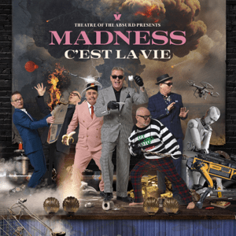

= Theatre Of The Absurd presents C'est La Vie
Madness
2023
:toc:

From: https://www.azlyrics.com/m/madness.html

== Prologue: "Mr Beckett Sir.."

"Mr Becket, it's time. Your audience awaits... "

== Theatre Of The Absurd

[verse]
____
The lights go down on some dark theater in London
Oooooh for the cruelest comedy

The audience hold their breath they freeze and dare not look away
Ooooooh it's the cruelest comedy

The actors stumble on with masks but no real plot
There are no exit signs and all the doors are locked
... the compere jumps up

Ladies and Gentlemen I'm so glad that you've heard
Of the blackest black comedy
From The House of The Absurd-
The blackest black comedy

The orchestra strike up a song that no one's heard of
A story-line that no one knows to sing
This cabaret must never end
A dozen roses no one sends
Ooooh the cruelest comedy

The stage is draped palest, palest bitter blue
And from the wings and right on cue
... the compere jumps up

Ladies and Gentlemen I'm so glad that you heard
Of the blackest black comedy
From The House Of The Absurd-

Ladies and gentlemen will you please walk this way
For the last and only performance of the cruelest cabaret-

The blackest black comedy from The Theater Of The Absurd
____

== If I Go Mad

[verse]
____
Yeah yeah yeah yeah

Oh lucky man
Where have you been
With your hair on and
What have you seen

'Cause I know
We all need the money
And I know
We all miss the show

A little plastic hat
A little plastic nose
Well have a look
There's a plastic house
And plastic clothes

Sure I know
We all need the readies
And I know
We all love the show
But just give me the future
With the girl I know

If I go mad
Without you
If I go mad (if I go mad)
Without you

Here's to everybody, to all of my friends
Here's to all the summers we wish would never end
Here's to all the diggies with no fish
All the people that I really miss
Here's to all the summers with no sun
Here's to all the things that we should've never done
Here's to all the sorrow and the pain
All the passengers on this train

Oh you the crooked man
With a crooked smile
Take a walk along the plank
Walk the crooked mile

Sure yes I know
We all need the money
And I know
That we all love the show
Oh but give me the future
With the girl I know

If I go mad (if I go mad)
Without you (without you)
If I go mad (if I go mad)
Without you

Yeah yeah yeah yeah

If I go mad (if I go mad)
Without you (without you)
If I go mad (if I go mad)
Without you (without you)

Mad
Will I go mad without you (if I go mad)
Probably (without you)
Mad
Will I go mad without you (if I go mad)
Yeah
____

== Baby Burglar

[verse]
____
Guide-less baby burglar
Where are you heading to?
How could you be so selfish
How can you be so cruel

Following in the footsteps of your mentor
Not knowing how you've
Broken all the rules
Adrift on your ship of fools

Aimlessly you turn your blind eye
To all that's in your path upside down
Oblivious in your destruction
Turning other hopes into...
Dying embers, and their ashes into dust

Oh baby burglar
I once trod in your creeping foot steps

Going equipped into the night
If I were to turn
This weapon upon you
Who would be wrong, who would right?

Well, Jesus Christs sake baby burglar
Where will this wanton action end
Under the wheels of a crazy horse
Dragged off in a moment of madness

Oh baby burglar
I once trod in your creeping foot steps

Oh baby burglar
I once trod in your creeping foot steps

Your cause of action, so easily avoided
Not even your god himself could defend
What a tragic mess we are in baby burglar
Their grief will tear and consume but will never end

Faith and time shall prevail over all
It's bright shining light
Will find wrong from right
Offer you a life time to ponder
Think this tragedy through

Oh baby burglar
I once trod in your creeping foot steps
Oh, small time murderer
May god forgive your misguided steps

Oh baby burglar
Oh baby burglar
Oh baby burglar
____

== Act One: "Surrounded On All Sides.."

"Act one, Surrounded on all sides, in an increasingly difficult situation
Is there still the possibility of escape?"

== C'est La Vie

[verse]
____
Life begins at five to eight
No time to waste, it will not wait
A lay-in that was yesterday
Up and at 'em into the fray
There'll be no time to catch your breath
The enemy of life is death
So sweep the hallway, mop the wall
Your destinies about to call...

The legislations in the bag
Justice a toothless old hag
It's every man now on his own
It's all for one, you'd better run
And stand up tall against the wall
And one by one you all shall fall
And though you'll try to get back home
Your cupboards bare, without a bone

Je ne le fais pas, c'est la vie
C'est comme ça que, ça va être
Je ne le fais pas, c'est la vie
C'est comme ça que, ça va être

Stand up tall against the wall
One by one you all shall fall
And though you'll try to get back home
The cupboards bare, without a bone

Some call it Armageddon
I'm sure you've heard them say
It's a Tyrannical heaven
And we're only a moment away

Je ne le fais pas, c'est la vie
C'est comme ça que, ça va être
Je ne le fais pas, c'est la vie
C'est comme ça que, ça va être
____

== What On Earth Is It (You Take Me For?)

[verse]
____
I can barely keep the pace
As I bolt out the door
The watershed dissolves
Into families at war

The crude tube bogs me out
With a cucumber sandwich
Between the cause
And the emotional damage

What on earth is it you take me for
Is your ego doing battle with the ratings
Mocking the afflicted to the very core
Take responsibility for your failings
Matron!

(Take the money, open the box)
(Take the money, open the box)

The problem as I see it
And I'm not one to judge
But your void of compassion
Takes a dive in the sludge

What on earth is it you take me for
Do you judge me purely on the ratings
You bend me like a pretzel, now I'm down on all fours
The money box is open for the takings
Matron!

Abigail and Brittney perform the truffle shuffle
They are having a go in all the kerfuffle
Now don't squirm in your chair, you are the sole director
So just pull the fucking plug out from its connector

Gawping at the dot, disappear into the screen
Stand up to attention for your country and queen
Fellow brothers and sisters, follow your instinct
Avoid being sucked into the prosperous jive

(Take the money, open the box)
(Take the money, open the box)

I can barely keep the pace as I bolt out the door
The ninth bell tolls and it's Pussy Galore

What on earth is it you take me for
Do you judge me purely on the ratings
You bend me like a pretzel, now I'm down on all fours
The money box is open for the takings

What on earth is it you take me for
Do you judge me purely on the ratings
If I bend just a little further more
I'm likely to chuck up upon your failings' railings

What on earth is it you take me for
Do you judge me purely on the ratings
You bend me like a pretzel, now I'm down on all fours
The money box is open for the takings
____

== Hour Of Need

[verse]
____
I just can't sleep
Will it ever be light
The nights dragged on so long
Hold my hand lightly dear
I fear there's something wrong

And it's cold and I'm lonely
I want to rest my head
But hold, hold me gently
And lead me to my bed

This feeling, of uncertainty
Just don't know where to go
Serenity's lost and out of reach
The night is cold as snow

So be my protector
In this my Hour of Need
Bring to me some comfort
Bring to me some ease
Oh so hold me so closely
Hold me oh so near
And let nothing come between us
Burn away my fear

Cause it's cold, and I'm lonely
I want to rest my head
Oh Hold, hold me gently
And lead me to my bed

Just one touch
Just one moment
Just one kind word whispered in my ear
So captivating circulating permeating illuminating

So be my protector
In this my Hour of Need
Bring to me some comfort
Bring to me some ease
Hold me oh so closely
Hold me oh so near
Let nothing come between us
Burn away my fear
____

== Act Two "The Damsel In Distress.."

"Act Two, The Damsel in distress stands alone, with no one to defend her, no one."

== Round We Go

[verse]
____
Round and round we go
Round we go again
Round and round we go
Round we go again

Red cheeks and a pair of wings
Is this what mother gave him
He'll hear the angels sing
On high for all to praise him

Gods gift and no one wants to know him
She'll sing a lullaby and life will show him

The sun comes up and sun goes down
The wheels come off and the deals go down
The news comes out and the star is found
We play the game and go round and round

White teeth and a knowing smile
You'll hear no words of wisdom
Her son is in denial
She hopes the world forgives him

Gods gift and no one wants to know him
She'll sing a lullaby and life will show him

The sun comes up and sun goes down
The wheels come off and the deals go down
The news comes out and the star is found
We play the game and go round and round

Round and round we go
Round we go again
Round and round we go
Round we go again

Her son her little boy
Too sly too cruel to mention
Well crafted lies deployed
He won't accept redemption

Gods gift and no one wants to know him
She'll sing a lullaby and life will show him

The sun comes up and sun goes down
The wheels come off and the deals go down
The news comes out and the star is found
We play the game and go round and round

Round and round we go
Round we go again
Round and round we go
Round we go again
____

== Act Three: "The Situation Deteriorates.."

"Act Three, The situation deteriorates still further, it is becoming dire, the end is possibly nigh"

== Lockdown And Frack Off

[verse]
____
The numbers up
The numbers down
The lights are out
All over town

Lock-downs back
People settling down
For the curtain twitch
Get ready to snitch

Ha ha ha ha, get ready to snitch

Sha na na na na
Sha na na na no

Sha na na na na
Sha na na na no

Life's a bitch
Ain't it rich
Fingers at the ready
Scratch the free phone itch
Dial this number across the nation
For a years supply of vaccination
Come on down
Tonight's the night
Results are good
The Price is right
Satisfy the common need
Gratify the common greed

Hey now
Who you gonna be now
What you gonna do now
When the lights go down

Hey now
Where you gonna run now
Before the setting sun now
Where you gonna go now

Mad Max was right
Petrol heads
Asda was like
The Dawn of the Dead
Panic buying loaves of bread
The toilet roll riots
You'll be left for dead
Powering up
The neighborhood
Who ever thought it would feel this good
So get your fracking hat on
And drill in deep
Any cash you find you get to keep
Boys and girls, ready to blow
All bottled up with nowhere to go
Eco warriors are in the loop
Weaponizing tomato soup
Hey now
Who you gonna be now
What you gonna do now
When the lights go down

Hey now
Where you gonna run now
Before the setting sun now
Where you gonna go now

Hey now
Who you gonna be now
What you gonna do now
When the lights go down

Hey now
Where you gonna run now
Before the setting sun now
Where you gonna go now

Sha na na na na
Sha na na na no
____

== Beginners 101

[verse]
____
And so it came
Not like other game
Don't stand to close to the flame
Nothing ventured nothing gained

We took the money and gone
A flight to cologne or maybe bon

A suit made from mo hair
A little flair
Some brill creamed hair, yeah

Up over the roof
A rope, a jimmy something waterproof
Where eagles dare
A self proclaimed millionaire

Under a silvery moon
We couldn't finish the job too soon
A nod a wink and uncomfortable glance
The man from the special branch

"Ello son"

I should have known
Something wasn't right
It's beginners 101
Into the night
Before the daylight

We was having fun (having fun)
A little hit and run
One for all and all for one
Finish what we begun

Was it all a charade
A mistake to have stayed
Ain't them bars of gold
A sight to behold
A panama so bold

I should have known
Something wasn't right
It's beginners 101
Into the night
Before the daylight

We should have guessed
Did it pass the idiot test
It's beginners 101
Just a burner phone
This bird has flown
____

== Is There Anybody Out There?

[verse]
____
Is there anybody out there
Who would like a little bit of what I got
I promise not to take up too much of your precious time
And it should only take a minute
It's a deal, it's a steal, the sale of the century
Don't walk away or you'll surely regret it

Cause it's bargain time
A consumable delight so get in line
Everything must go, but don't panic
Everything's for sale if you've got the readies
Oi oi oi, oi oi

Is there anybody out there who'd like a little bit of what I got
It's got your name written all over
Sound to good to be true, then it generally is
I got that in red, white, and blue (Red White and blue)
Coffee color yellow right up to curfew (Curfew)
Step back in time for one night only (oooh)
We slenderize for solely the lonely (Soley The Lonely)

Is there anybody out there who would like a little bit of what I got
You're on a promise a slide waranty that comes
With worthless twaddle that I can't guarantee
I sell ice to Eskimos for tuppence a bag (ohhh)
Or a line of guacamole to the holy in drag (yeah yeah yeah)
Oh I'll blow you a smoke screen from the soles of my feet (oooh)
They'll lead you up and down along a one way street (Along a one way street)

Step back in time for one night only (oooh)
We slenderize for solely the lonely (Solely the lonely)
Step back in time for one night only (step back)
Will slenderize for solely the lonely (Solely the lonely)
Step back (back back...)
____

== The Law According To Dr. Kippah

[verse]
____
Everybodies thoughts are with you
Take my hand and don't let go
Father Patrick offers escape
For the cripples down below

Right beside you night and day
Transfixed by twilight, flicker away
Making love to bitter sweet dreams
The Master of illusion shall redeem

Hanging on in their reiterative prayer
Your loved ones comfort
Though in despair
Silence is welcomed on a crashing shore
The shadow of movement shall no more

Do you recall the battle scene
Where billy the hero loses his queen
To ruben the pycho
High on meth-amphetamine
Never the less once we were a team

Though I don't expect any miracles
Try to envisage the wonder of it all
We would captivate and amuse
We will always be here looking up to you

Well She is making some kind of progress, overall
What we have here is a failure to communicate

Oh father I've seen the light
And I comprehend your teachings
Oh father I just can't fight
To break free of this feeling

Cast your mind back 40 odd years to the
Summer of love still ringing in your ears
Hampstead heath and ice cold beers
Dancing in the moonlight to golden years
Mr blue sky doubles over
Thigh high deep in fields of clover
Making love to bitter sweet dreams
The Master of illusion shall redeem

Hanging on in their reiterative prayer
Your loved ones comfort
Though in despair
Silence is welcomed on a crashing shore
The shadow of movement shall no more

Dare not re-enact that battle scene
Along high-gate road with the Highbury
Though we never rocked to rule supreme
We stood our ground in the face of adversity

(Adversity, adversity, adversity, adversity)

Enrico Sidoli dissolves with the holy ghost

Oh father I've seen the light
And I comprehend your teachings
But father I just can't fight
To break free of this feeling

Oh father I've seen the light
And I comprehend your teachings
But father I just can't fight
To break free of this feeling

(Feeling feeling ahhhh)
____

== Epilogue: "And So Ladies And Gentlemen.."

"And So Ladies and Gentleman, Boys and Girl's, we come to the epilogue
They say all clouds have a silver lining. Will out hero be saved.
Who will have the courage to stand and fight? "

== Run For Your Life

[verse]
____
Project fear
Was always here
Let us make that very clear
You're gonna die
Your gonna fry
From the chem trails in the sky

Monkey pox you know it's true
Grow two heads it infects you
It's been tried
It's been tested
It's gonna work
We've invested ('Cause we've invested)

Run for your life
Run for your life

Ice is melting in the sun
New horizons have begun
The tide is high we all agree
Benefits are there to see (to see, open your eyes)

Run for your life
Run for you life

Run for your life
Run for you life

Take away your DNA
Learn to live another way
Cashless is the way ahead
Use your built in chip instead

Run for your life
Run for your life

Run for your life
Run for your life

(Run run, run run,)

Russia's got a nuclear bomb
World war three 'ere it comes
Build a bunker
Settle in
And here's a fact
We will win

Tick Tock, doomsday clock
90 seconds is all we got
Here comes it "The Robot AI
20 seconds to comply"

Run for your life
(Run run,)
Run for your life

Run for your life
(Run run,)
Run for your life

(Run run,)

Keep them scared
Keep them ruled
Keep them fighting
Keep them fooled

The enemy is past the gate
The enemy is the (censored) state
(And what a state we're in)
(Run for it (name?)

Run for your life
(Run run,)
Run for your life

Run for your life
(Run run,)
Run for your life
____

== Set Me Free (Let Me Be)

[verse]
____
Set me free
Oh set me free
Let me be now
Let me be

Oh can't you see
What it's doing to me
I can look out my window
I can see the sky
And I can see the sun
I see the moon
I see the seasons pass
My empty room

Set me free
Just set me free
Oh let me be now
Let me be

As time goes by
I can't see why
We live this life
It makes me wanna cry

Being locked down
In the same ghost town
I'm sure by now
It's doing, more harm than good

Set me free
Set me free
Oh won't you just let me be now
Let me be

Set me free
Oh set me free
Just let me be now
Let me be

(Set me free)
(Set me free)

Don't you see

(Set me free)
(Set me free)

What it's doing to me

(Set me free)
(Set me free)
(Set me free)
(Set me free)
____

== In My Street

[verse]
____
There's Turkish drug dealers
An Irish halfway house
There's ten full black bin bags
Blowing round the gaff
And everybody's moaning about their own birthday
And everybody's talking about getting away

In my street
It's just the people you meet
I've got a line but I can't get away
Oh no well not until judgement day

There's Eggy, & Beany, Popple, & Chainy
Ronnie, & Freddy, Terry, & Painy
All telling their own kids when they should go to bed
All sitting around their living room off their heads

'Cause in my street
It's all the lovely people you meet
I've got a line but I can't get away
Oh no well not until judgement day

It's a strange old thing
When you're on your own
Amongst other people
And your far from home
But at other times
Thinks can change
So quickly
In the nod of a wink
The blink of an eye

And you realize
It's all just in your mind
And you realize
It's all just in your mind
And then your free

In my street
It's just the people you meet

In my street
It's just the people you meet

We moved here so long ago
I don't remember why
Must be 40 odd year now
But don't time fly
When your having fun

A boxer
Footballer
A black cab driver
A gangster
A fraudster
A cheating conniver
And everybody's talking about getting away
Looks like we're here to stay

'Cause in my street
It's all the lovely people you meet
I've got a line but I can't get away
Oh no well not until judgement day

'Cause in my street
It's all the people you meet
We've had a line but we can't get away
No well not judgement day
____

== Fin.: "Ladies And Gentlemen.."

"Ladies and gentlemen, This is The end. Of the begining"

