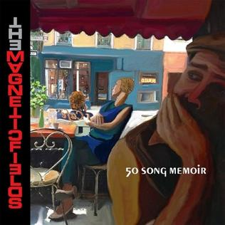

= 50 Song Memoir
Magnetic Fields
2017
:toc:

From https://www.azlyrics.com/m/magneticfields.html

== '66: Wonder Where I'm From

[verse]
____
In Saint Thomas, barefoot Beatniks bonk
On a boat, afloat in rum
Is it there I'm from?
I wonder where I'm from

Up in Yonkers, two blocks from the Bronx
Baby born 'bout as big as your thumb
Is it there I'm from?
I wonder where I'm from

Never stayed in any one place two years
I was made in America, three cheers!
Until

Baden-Baden, in the BRD
Lederhosen on my baby bum
Is it there I'm from?
I wonder where I'm from

Rarely stayed in one place more than a year
I was made in the northern hemisphere

Oh, the seashells, tossed up on the shore
Contain the oceanic hum
They know where they're from
I wonder where I'm from
I wonder where I'm from 
____

== '67: Come Back As A Cockroach

[verse]
____
Be nice or come back as a cockroach
Think twice before being cruel
Those who are unlawful
Will be something awful
When the wheel of life revolves
Flesh dissolves

Behave or demons will devour you
They crave the meat of bad boys
They find most delicious
The fresh flesh of vicious
Tots who would deny the lamb
What a scam

How could one come back as a cockroach?
Why would a spirit eat meat?
I was a dyspeptic
Epileptic skeptic
Other kids ask why at two
I still do

I want to come back as a cockroach
Or haunt some drafty mansion
I'm the type of chil'n
Wants to be the villain
Always separate from the pack
Dressed in black

I'm still a dreadful goody-goody
Won't kill an innocent flea
From the time I began
I was mostly vegan
Let that little cockroach be
Don't kill me
____

== '68: A Cat Called Dionysus

[verse]
____
We had a cat called Dionysus
Everyday another crisis
I used to keep him in my box
Where I kept my toys and blocks

He hated me
But I loved him

Whenever Dionysus saw me
He would arch his back and hiss and claw me
As soon as he could, he got loose
Across the roofs of Syracuse

Away from me
But I loved him

Meows

I kept him in the little chest
Where I was keeping all the rest

He hated me
Cause I loved him 
____

== '69: Judy Garland

[verse]
____
The first brick the drag king threw
To draw blood from the boys in blue
Said "Here lies Judy Garland" on it
It flew through historic air
Even Taylor Mead was there
And Allen Ginsberg wrote a sonnet

One day after the funeral
Stones flew over the Stonewall
Judy Garland
Halfway through her tell-all memoirs
Who flew up into the stars?
Judy Garland
Judy Garland set us free

We tried to drive to Woodstock but
Our little blue bug couldn't cut
Through that last hundred miles of traffic
Love still dared not to speak
In l'année érotique
"Je t'aime" was banned as pornographic

So put those feather boas on
Drink too much wine
And celebrate the revolution
Of '69

Cause life-sized life never was enough
Who called reality's bluff?
Judy Garland
Patron saint, or victim of love?
Let's try "none of the above"
Judy Garland
Judy Garland set us free

Some say its a coincidence
No relation
As if she didn't die for us
Her love nation

Halfway through 1969
Who joined Heaven's conga line?
Judy Garland
Sick and tired of being alive
She flew back to Rigel V
Judy Garland

Judy Garland set us free
Judy Garland set us free
Judy Garland set us free
So be free with me
Judy Garland set us free
Judy Garland set us free
Judy Garland set us free
So be free with me 
____

== '70: They're Killing Children Over There

[verse]
____
So we went to see the Jefferson Airplane
Our Dada was the opening act
Grace Slick was young and angry
She said "My fellow freaks, it's a fact

They're killing children over there
They're killing children over there
I know we're not supposed to care
But they're still killing children over there"

Back then I was even younger than Grace Slick
Even for my age I was small
I thought she meant a massacre
Was taking place inside that hall

They're killing children over there
They're killing children over there
I know we're not supposed to care
But they're still killing children over there

Now that everyone is fat and complacent
I haven't heard a protest in years
We just keep paying our taxes
The taxes keep turning the gears

They're killing children over there
They're killing children over there
I know we're not supposed to care
But they're still killing children over there 
____

== '71 I Think I'll Make Another World

[verse]
____
I think I'll make another world
And fill it with whatever I want
No one can say I can or can't

I can see it now

I think I'll make another world
It may not start out very large
But no one else will be in charge
I can see it now
I can see it now

And we will dance in the all
Like we were very small
Through the air through the night
And through the marble hall

No one can say that's all wrong
Cause I'll say get out of my song

Cause I can see another world
And I can make it with my hands

Who cares if no one understands
I can see it now
I can see it now

Though all the stuff dream about
Since I was just a zygote
The headless karyotic
With her plucky seeing eye-goat

No one can say its all wrong
Cause I can say "Hey, it's my song"

Cause I can see another world
And I can make it with my hands
Who cares if no one understands
I can see it now
I can see it now

I can see it growing
And moving by itself
And talking in its own way
Its realer than the old wives? 
____

== '72: Eye Contact

[verse]
____
Eye contact
Must we make eye contact?
Must we always react
Through frowns and smiles?

Let's make a pact
When we must interact
Facing front would distract
From our profiles
Lovely profiles

Eye contact
How I hate eye contact!
Having to stare
Exactly, in fact, where?

Pretend to care
Where you happen to stare
Break contact if you dare
Haha, I win
Haha, I win

Eye contact
Fully autodidact
Ever and always smacked
Of smarmy charm

Call me barmy
Must we all be warm?
Must all warmth take the form
Of eye contact?
Contact, my eye 
____

== '73: It Could Have Been Paradise

[verse]
____
We lived in Paia
Hippie central, I could hop to the beach
Sometimes we would hitchhike
Miles to school, school being a figure of speech
Where we sang (kahuli aku, kahuli mai)

We lived on a zendo
In the forest, silence for days on end
Caught up on my reading
Huckleberry Finn was my only friend

It could have been paradise
But for the horrible bugs
I could have gone to a real school
But for the murderous thugs
In the forest of paradise
We gathered magic mushrooms
But mostly I sat around
In rooms as quiet as tombs
It was heaven

My mother took up with
A trumpeter, red-bearded, pork pie hat
Found a lyric of mine
He took it home and set music to that
To impress my mother
He stole my song. Better back off, mister
Fast forward two decades
Same thing happened but with Shakespeare's sister

Why should it be paradise?
That's just a place people go
It was home for a little while
But you can give me the snow
Give me the snow

My friend Shell was named for
A shell on the beach. She spoke pidgin English
Everyday I swam out
Onto the reef, catching exotic fish

It could have been paradise
With one good reason to stay
If it had been paradise
Guess we'd still be there today
Singing away 
____

== '74: No

[verse]
____
Is there a man in heaven looking out for you?
Is there a place dead loved ones go?
Is there a source of wisdom that will see you through?
Will there be peace in our time?
No

We knew Karmu, a faith healer, the black Christ, he said
Laying his hands on high and low
Did he cure colds and cancer and bring back the dead?
Did he refuse donations?
No

My friend Scott says there's flying saucers
Hiding inside our hollow moon (our hollow moon)
And then there's Karl, the card-carrying communist
Cause revolution's coming soon (it's coming soon)
And Carolyn believes in fairies
And Gabrielle believes in ghosts
Yeshe believes in reincarnation (we'll meet again)
And David, in heavenly hosts (heavenly hosts)

My mother believes that this physical universe
Is a big holographic show
And she says someday science'll catch up with her
Has she a shred of evidence?
No 
____

== '75: My Mama Ain't

[verse]
____
My mama ain't no madam
Massage is all they do
Law troubles, sure, she's had 'em
Been stopped for speeding too

She says she ain't no hippy
I guess Beatnik's the word
She says the world is trippy
Enough, drugs are absurd

She was an English teacher
Her Master's was in Ed
But she taught Harriet Beecher
Stowe and got fir-ed

My mama ain't no loony
But she likes joining cults
She could've been a Moonie
With similar results

She gave away her monies
And all our furnishings
To benefit the bunnies
And all sentient beings

She flirted once with yoga
We stayed on an ashram
The guru wore a toga
In Saratoga
We chanted [?]

My mama ain't no nudist
Except around the pool
She's a Tibetan Buddhist
Like Catholic only cool

Now Mama's going Vedanta
A similar belief
Her friends look more like Santa
And much less like Gurdjieff

My Mom's a little flaky
Believes in everything
From auras to zen reiki
Except crystal healing

She draws the line at crystal healing 
____

== '76: Hustle 76

[verse]
____
Some people don't know how to dance
It's easy you just move your hips
Now as a chorus line advance
Tomorrow we'll do tango dips

You see darlings the whole world around
We all go wild for this new sound

Hustle 76
Everybody dance now
You gotta dance now

Hustle 76
Move don't make romance now
Please no romance now

Hustle 76
Everybody dance your life away

They sold a record on TV
Big melodies with simple beats
Dance music for the AM dial
Lyrics don't last not for [?]

What can I tell you, I was ten
I should have been in bed by then
I order

Hustle 76
Everybody dance now
You gotta dance now

Hustle 76
Move don't make romance now
Please no romance now

Hustle 76
Everybody dance your life away

Hustle 76
Everybody dance now
You got to dance now

Hustle 76
Move, don't make romance now
Please no romance now

Hustle 76
Everybody dance your life away

Hustle 76
Everybody dance your life away 
____

== '77: Life Ain't All Bad

[verse]
____
When I write my memoirs
You will read them with pain and with shame
You'll be searching in vain for your name
For your bleak, insignificant name

When I write my memoirs
Which will be of course in verse
On the subject of you and how awful you are
I will be infinitely terse

I hope I never run into
Another piece of shit like you
You killed my dog, you killed my mice
You made my house a den of vice

But na na na na
Na na na
You're dead now
Na na na na
Na na na
So I sing
Na na na na
Na na na na
Life ain't all bad

I labored on your ice cream truck
Whenever I was not at school
You mostly used that ice cream truck
To sit there guzzling beer, you tool

But na na na na
Na na na
You're dead now
Na na na na
Na na na
So I sing
Na na na na
Na na na na
Life ain't all bad

You vandalized our brakes and framed
Me for your theft, and was I blamed!
You smashed the bedroom window glass
And stole what you could lift, alas!

Na na na na
Na na na
You're dead now
Na na na na
Na na na
So I sing
Na na na na
Na na na na
Life ain't all bad

Na na na na
Na na na
You're dead now
Na na na na
Na na na
So I sing
Na na na na
Na na na na
Life ain't all bad 
____

== '78: The Blizzard Of '78

[verse]
____
One ten year old was found after three weeks
In a snowdrift ten feet from his door
Some fell asleep in their cars and awakened no more

25 people died shoveling snow
Have that done by somebody you hate
166 looters arrested, but wait

I spent the blizzard of '78
On a commune in Northern Vermont
With all the Isaac Asimov anybody could want

Music was very much not allowed
So we we said "Hey kids, let's start a band"
Proof that Ganesh loves us
There was no tape deck at hand

The first band I'd had was called "One and a Half"
We were a duo, technically
So if Tonto's Expanding Head Band was a band
So were we

I spent the blizzard of '78
On a commune in Northern Vermont
With all the Ursula Le Guin any body could want

I played guitar, Chris played tin cans
Caroline played tambourine
Chris was 11, Caroline 12, I 13

We called ourselves "the Black Widows"
We weren't the last nor the first
But we were almost certainly by far the worst

We made the Cramps sound orchestral
That's an achievement, I guess
As for rehearsal
We made the Shaggs sound like Yes

I spent the blizzard of '78
On a commune in Northern Vermont
With all the Roger Zelazny anybody could want

It was hell 
____

== '79: Rock'n'roll Will Ruin Your Life

[verse]
____
"Listen up, kid" Mama said "I'm gonna make you scream
When I take you backstage behind that rock'n'roll dream
You think it's all money
Controlled substances
P-p-premarital sex and bizarre dances
You think it's all noise
A vast circus of fun
Well I wouldn't say this to just anyone

Rock'n'roll will ruin your life
Like your old no-goodnik dad
Kill your soul and kill your wife
Rock'n'roll will ruin your life
And make you sad
And I mean sad"

You laugh now maybe (ha!) but wait till you hear
I've got no use for groupies, too shy and too queer
The truth about drugs
Well, I can't afford those
Cause a lot of my money flew up the circus's nose
And all that noise gave me hyperacusis
So turn this record down or it'll happen to you, sis

Rock'n'roll will ruin your life
Like your old no-goodnik dad
Kill your soul and kill your wife
Rock'n'roll will ruin your life
And make you sad
And I mean sad

Rock'n'roll will ruin your life
Like your old no-goodnik dad
Kill your soul and kill your wife
Rock'n'roll will ruin your life
And make you sad 
____

== '80: London By Jetpack

[verse]
____
London by Jetpack
It can be done
What we spend on fuel
We'll make on film

From the ICA
To Abbey Road in seconds
On high rooftops
We'll dance the Twist

I spent August in London when
The New Romantics reigned
And though I was oblivious then
My love has never waned
My roots are New Romantic as
Some critics have complained

London by Jetpack
My verse novel
When teenagers fly
They change the sky

It's not the going up
It's not the coming down
It's the zooming 'round
The speed, the sex

When I am monarch of the world
Weighed down by matters weighty
I'll live in London once more
And decree it's 1980
That all may dress as Pierrots
And pirates, like their king
And all will have jetpacks
From club to club we'll go zooming

At the club with no name
We'll dance again
Vivienne Westwood
Will be my queen
There will be no army
Only the Blitz

It's not the going up
It's not the coming down
London by Jetpack
I'll write you yet
____

== '81: How To Play The Synthesizer

[verse]
____
Take a single oscillator
Producing a drone
Send it to the wave shaper
Altering the tone
This can be a triangle
Sawtooth or a square
Modulate the pulse width
Nobody will care

This is how to play the synthesizer
This is how to play the synthesizer

Now go to the filter bank
Low, high, band or notch
Fiddle with the cutoff point
Pour yourself a Scotch
Modern filters oscillate
All by themselves
It sounds like you're torturing
Little metal elves

This is how to play the synthesizer
This is how to play the synthesizer

Nextly, shape the envelope
AKA ADSR
Attack, delay, sustain, release
Which means how loud you are
One millisecond to the next
Whether you pluck or lurch
Or ooze like an organist
In a Venusian church

This is how to play the synthesizer
This is how to play the synthesizer

Now you play the synthesizer
Don't be lazy now
Make it hiss like rattlesnakes
Or moo like a cow
Crash like a hundred marbles
Smashing on the floor
You can make a thousand sounds
Never heard before

This is how to play the synthesizer
This is how to play the synthesizer 
____

== '82: Happy Beeping

[verse]
____
My mother found another jerk
A drummer, Chad, who likes to smirk
At those who lacked his special skills
Keeping loose time with little fills

One morn I found my counterpoint
Homework torn up, tacked to my door
Like Luther's 95 Theses
A note explained what this was for

"Happy Beeping" it said
"Happy Beeping" it read
The creep had come a-creeping
Happy Beeping

He clearly hated Neu! and Can
Postured at Eno and Japan
Though, to be fair, he liked my books
He took my Richard Brautigan

"Happy Beeping" it said
"Happy Beeping" it read
In the night while I was sleeping
Happy Beeping

"Happy Beeping" it said
"Happy Beeping" it read
In the night while I was sleeping
Happy Beeping 
____

== '83: Foxx And I

[verse]
____
Foxx and I
Have the role on TV 303
I should think it will be easy
Miming on top of the boobs

Foxx and I
Liberated from emotions
Exploring other oceans
While you [?]

Anyone can change into a machine
Girl or white, black or boy
Tell a very strange into a machine
Come with me

Foxx and I
Making pictures of tomorrow's sun
Just to prove that there is one
The future thanks a lot

There is sometimes an interlude
Bucolic and serene
Beneath a sky non-repro blue
And grass of green screen green
I'll swing by on my jetpack
I can't wait to be sixteen
I can't wait to be sixteen

Foxx and I
Decades later at my DJ night
A conversation takes flight
Kraftwerk and clavichords

Foxx and I
Backstage at Kentucky ball
Quite like rock stars and all
Why would we want to leave?

Anyone can change into a machine
Girl or white, black or boy
Tell a very strange into a machine
Come with me

Anyone can change into a machine
Girl or white, black or boy
Tell a very strange into a machine
Come with me
____

== '84: Danceteria!

[verse]
____
We don't always go to school
But we always go to Danceteria
There is always something cool
Happening somewhere in Danceteria
Danceteria!

Classes at 7:30am
Sometimes we stay up and go to them
This is more important
You'll get educated at Danceteria
Danceteria!

I always get in for free
I only paid once at Danceteria
Lydia, Mark, Nick and Fee
Tess are on tonight at Danceteria
Danceteria!

Biding time until Save the Robots
Let's arrange our hair like Rorschach blots!
Maybe we can be anything
Or anyone at Danceteria
Danceteria!

I invented the sugar
And lemon sandwich at Danceteria
Lost my hearing when Einsturzende
Neubaten played Danceteria
Danceteria!

All six nights a week unfailingly
Seeing the Shirelles or ESG
Every day's a total blur
When you spend the night at Danceteria
Danceteria!

Culture is not for the faint of heart
Poetry, music, performance art
Everything is theater
And everyone's on stage at Danceteria
____

== '85: Why I Am Not A Teenager

[verse]
____
You won't pluck a robot
Making diddly-squat
This is why I am not a teenager
They all talk down to you
Like they know what to do
Are they trying to screw up your life?
Since they already blew their own

But when I grow up
I'm going to run
My own planetarium
I'll make the shows
All on my own
The world will flock to see 'em

All that money they got
They don't give you a shot
This is why I am not a teenager
When you never get paid
And you never get laid
And you're full of these stupid hormones
And just then they come out with AIDS

But when I grow up
I'm going to be
An underground film maker
I'll have my own
Backlot somewhere
On my own half an acre

So they piss on your dreams
Then they muzzle your screams
This is why I am not a teenager
Making ice cream on drugs
Shoveling horse products
Washing dishes and making popcorn
Toilets, oh the indignity!

Piss on your dreams
Muzzle your screams
Why I am not a teenager
Piss on your dreams
Muzzle your screams
Piss on your dreams
Muzzle your screams
Why I am not a teenager
Piss on your dreams
Muzzle your screams
____

== '86: How I Failed Ethics

[verse]
____
Though majoring in Visual and Environmental Studies
And minoring in History of Sci
I had to retake Ethics from my Mennonite professor
For whom my skepticism didn't fly

The first time I made mincemeat of the standard propositions
Establishing a so-called moral science
And I declared morality an offshoot of aesthetics
And got a failing C for my defiance

So next semester I back to Divinity School trotted
Proverbial tail not between my legs
And spent the whole course positing my own ethical system
While other college students emptied kegs

Information ethics, cyberethics — both since taken —
Said: Maximize the information flow
Toward a hypothetical end state in which the cosmos
Consists entirely of our info
And at the highest level possible, not only data
But data about data dot dot dot
Or life on top of life on top of life, et cetera
Profundity, my mother'd say — I'd not

My Mennonite professor did concede I'd done the coursework
Although my system left him quite dismayed
Depending, as it did, on neither history nor Jahweh
And gave me, finally, a passing grade 
____

== '87: At The Pyramid

[verse]
____
I saw you at the Pyramid
Disco all around you
You danced into my dream world

Bleach blond with caterpillar eyes
Rugby shirt like a bumble bee
A shy-boy smile, dimples for days
Destined never to notice me

I saw you at the Pyramid
Disco all around you
You danced into my dream world

It's true there have been other guys
But what's your name? Guess I'll never know
Your face was burned into my eyes
By strobe lights half my life ago

I saw you at the Pyramid
Disco all around you
You danced into my dreamworld
____

== '88: Ethan Frome

[verse]
____
Masterpiece of catastrophic love
In a small New England town
Ninety-five pages of tragedy
Difficult to put down

La la la la la la la la la la la
Ethan Frome
La la la la la la la la la la la
Ethan Frome

Came to light in 1911
Overnight lit-fic classic
Bringing fame to Edith Wharton
And fortune to Scribner's sons

La la la la la la la la la la la
Ethan Frome
La la la la la la la la la la la
Ethan Frome

I first read you on my birthday
And again umpteen more times
When will they make you a musical
There have been far worse crimes

La la la la la la la la la la la
Ethan Frome
La la la la la la la la la la la
Ethan Frome

Ethan Frome
Ethan Frome
Ethan Frome
Ethan Frome 
____

== '89: The 1989 Musical Marching Zoo

[verse]
____
Anonymous figures with animal heads
Are they human or are they quadrupeds?
Are they psychotics who have gone off their meds and away

The 1989 Musical Marching Zoo
Are coming to play
Inside of your mind

The 1989 Musical Marching Zoo
Are coming to stay
Don't be left behind

And this is the band that I wanted to be
No names and faces and no history
Particularly no pictures of me

The 1989 Musical Marching Zoo
Are coming to play
Inside of your mind

The 1989 Musical Marching Zoo
Are coming to stay
Don't be left behind

If only musicians were invisible
Or, like the Residents, identical
Sod MTV, show me a tractor pull
And the 1989 Musical Marching Zoo 
____

== '90: Dreaming In Tetris

[verse]
____
Make a record
Go to sleep
Make another record in your sleep
Make a record
Go to sleep
Make another record in your sleep

Dreaming in Tetris

Il faut être absolument New Wave
Il faut être absolument New Wave

Dreaming in Tetris

Disco music never died
Everything became disco-fied
Disco music never died
Everything became disco-fied

Dreaming in Tetris

501s are only pants
Back-to-basics is the death of romance
501s are only pants
Back-to-basics is the death of romance

Dreaming in Tetris

All the young dudes of 25
Caught diseases, few survived
All the young dudes of 25
Caught diseases, few survived

Dreaming in Tetris

We expected nuclear war
What should we take precautions for?
We expected nuclear war
What should we take precautions for?

Dreaming in Tetris
____

== '91: The Day I Finally...

[verse]
____
The day I finally snap
Everybody will clap
They'll be lining up for miles
For me to slay them in the aisles
And it won't be long now
No no no, it won't be long now
'Til it comes to a stop

The day I finally croak
Bet my life is a joke
Everybody will laugh
Right off the end of the graph
And they won't be wrong now
No no no, they won't be wrong now

The day I finally (snap) (snap) (snap)
Everybody will (clap) (clap) (clap)
They'll be lining up for miles
For me to slay them in the aisles
And it won't be long now
No no no, it won't be long now
'Til it comes to a stop

The day I finally...
Because my life is a...
There was a young woman from Enus
Who came to our party as Venus
We told her how rude 'twas to come there quite nude
And we brought her a leaf from the greenhouse

Everybody will ha ha ha... 
____

== '92: Weird Diseases

[verse]
____
When I was yea high 'til I was three
I suffered from petit mal epilepsy
Any excitement gave me a fit
But there were drugs to cure me of it

Weird diseases
I get weird diseases
Whenever Krishna sneezes
I get weird diseases

So at the least sign of emotion
I got a tranquilizing potion
Thus from the time I was a young boy
I could feel neither anger nor joy

Weird diseases
Random weird diseases
Once from eating recalled cheeses
I got weird diseases

Nearly fatal renal cysts
Maybe Asperger's if that exists
Pityriasis rosea
Two separate times giardia

Weird diseases
I get weird diseases
Wafting on the toxic breezes
I get weird diseases

Debilitating spider bites
Hiccups for three days and nights
A thousand earaches, one deformed eardrum
Hyperacusis, what's that from?

It's from weird diseases
I get weird diseases
Whenever baby Jesus pleases
He gives me weird diseases

Chronic fatigue
COPD
Petit mal epilepsy
Two big holes inside my brain
Migraine aura sans migraine

Weird diseases
I get weird diseases
Weird diseases
I get weird diseases
____

== '93: Me And Fred And Dave And Ted

[verse]
____
Me and Fred and Dave and Ted
And the dog and the cat and the bugs
All in two rooms with one bed
So we slept on the towels and rugs
But ah! We were young and vaguely in love
And who needed money or drugs?
Not me and Fred and Dave and Ted
And the dog and the cat and the bugs

Fred was only twenty-two
So everything he said was true
Sweet as a clumsy puppy dog
But expletive! Could that boy snog

Me and Fred and Dave and Ted
And the dog and the cat and the bugs
All in two rooms with one bed
So we slept on the towels and rugs
But ah! We were young and vaguely in love
And who needed money or drugs?
Not me and Fred and Dave and Ted
And the dog and the cat and the bugs

Dave offered me the presidency
Of the Log Cabin of New Jersey
I'm not sure who he thought I was
But I smiled and nodded because

Me and Fred and Dave and Ted
And the dog and the cat and the bugs
All in two rooms with one bed
So we slept on the towels and rugs
But ah! We were young and vaguely in love
And who needed money or drugs?
Not me and Fred and Dave and Ted
And the dog and the cat and the bugs

Ted the All-American male
Had recently got out of jail
For asking money of someone
A John while flourishing a gun

Me and Fred and Dave and Ted
And the dog and the cat and the bugs
All in two rooms with one bed
So we slept on the towels and rugs
But ah! We were young and vaguely in love
And who needed money or drugs?
Not me and Fred and Dave and Ted
And the dog and the cat and the bugs
____

== '94: Haven't Got A Penny

[verse]
____
I haven't got a penny to my name
And I'm all alone in this city
Cause I haven't got a penny to my name
I could sell myself if I was pretty

I'll die alone
No one will mourn
I wish I'd known
And not been born

Cause I haven't got a penny to my name
And I've alienated everybody
And I'll never have a penny to my name
I'm a thirty-year-old fuddy-duddy

When I was eight
My mom displayed
Our only dollar
We had it made!
Now I haven't got a penny to my name

I wish, I wish
I'd not been born
... 
____

== '95: A Serious Mistake

[verse]
____
Although we know that someone's heart will break
Hey Jake, let's make a serious mistake
And while we smile, look forward to heartache
Let's undertake a serious mistake

Which one of us will it be
To end this tale of misery?
When will this comedy turn sour?
A year, a month, a week, an hour?

All we can be sure of is it will
All good things come to bad ends
But still

Although we know that someone's heart will break
Hey Jake, let's make a serious mistake
And while we smile, look forward to heartache
Let's undertake a serious mistake

Although we know that someone's heart will break
Hey Jake, let's make a serious mistake
And while we smile, look forward to heartache
Let's undertake a serious mistake 
____

== '96: I'm Sad!

[verse]
____
I'm sad!
You made me sad
You're bad!
Oh, the pain
A tad
More pain and I'd go
Insane and I'd go
Unclad
In the rain

You'd like that, wouldn't you?
You like to make me blue

Egad!
I never had
A dad
Paid my dues
Poor lad
Pitiful orphans
With no endorphins
Wail trad
Blues

Blue blues
Blue, blue blues

I'm sad
You made me sad
I'm glad
That you're gone
You cad
____

== '97: Eurodisco Trio

[verse]
____
I woke up this morning, and didn't recognize my bed
Ever since you left me, I've started wishing I were dead

Wir sind ein Trio Eurodisco
Siamo un trio Eurodisco
Nous sommes un trio Eurodisco
We're a Eurodisco trio

I woke up this morning with nothing in my head but death
Should I try suicide, like Lydia and Susan and Beth?

Wir sind ein Trio Eurodisco
Siamo un trio Eurodisco
Nous sommes un trio Eurodisco
We're a Eurodisco trio

Woke up this afternoon, the tears were running down my face
So lonely in New York, it might as well be outer space

Wir sind ein Trio Eurodisco
Siamo un trio Eurodisco
Nous sommes un trio Eurodisco
We're a Eurodisco trio

Woke up at 4am, awake and out of bed I fell
These trips to paradise will land me in a padded cell

Wir sind ein Trio Eurodisco (Somos un trio)
Siamo un trio Eurodisco (Eurodisco)
Nous sommes un trio Eurodisco (Somos un trio)
We're a Eurodisco trio (Eurodisco)

Woke up in misery, but if I put it in a song
There's hope that someday you will hear it, and you'll sing along

Wir sind ein Trio Eurodisco (We're a Euro)
Siamo un trio Eurodisco (disco trio)
Nous sommes un trio Eurodisco (We're a Euro)
We're a Eurodisco trio (disco trio) 
____

== '98: Lovers' Lies

[verse]
____
Lovers' lies, lovers' lies
They should make us roll our eyes
Oh, if only we were wise!
We'd be lonelier, and wise

Lovers' words, lovers' words
They are strictly for the birds
A strong sense of the absurd's
No defense from lovers' words

Every word you say
Every word you sigh
Every word a lie
Every word you crow
Every word you cry
Every word a lie

Lovers' truth, lovers' truth
Heard in every buddy booth
When we're longer in the tooth
Mothers' milk is lovers' truth

Lovers' lies, lovers' lies
They are only lullabies
Please remind me to devise
A sound to drown out lovers' lies 
____

== '99: Fathers In The Clouds

[verse]
____
I've had no need for fathers
Or fathers in the clouds
Out of the sky
There comes this guy
Saying "I...I...I..."

What does one say?
"Where have you been all this time?"
"Where's my back pay?"
"Was your Broadway play sublime?"

There is a line on my birth certificate
And the other guy would like me to change it
I've met each of them twice

These little things
The correspondence is queer
We've both written songs
Danced to by Richard Gere

I have no need for fathers
Or fathers in the clouds
Saying "I...I...I..." 
____

== '00: Ghosts Of The Marathon Dancers

[verse]
____
The ghosts of the marathon dancers
In an abandoned dancehall
Go whirling around in the eddies of dust
When the wind comes in through a chink in the wall

All the music and the dancers are gone
But the dance goes on
They all danced till some long-ago dawn
But the dance goes on

In the cellars of dead Rockefellers
Hallways and subways and vaults
Go twisting and turning for mile after mile
In a glorious Gilded Age waltz

All the music and the dancers are gone
But the dance goes on
They all danced till some long-ago dawn
But the dance goes on

And I wrote the above in this ghost town
For a movie that wasn't to be
An adaptation of a French musical
Produced by Ted Hope, directed by Ang Lee

All the rights and the money are gone
But the song goes on
Like most movies, it'll never be done
But the song goes on 
____

== '01: Have You Seen It In The Snow?

[verse]
____
They say this city is dirty and gray
But I think it's pretty on a summer day
And on rainy nights
When the streets smudge the lights
It's beautiful, you know

But have you seen it in the snow?
When every light has a halo
When it snows all night
And the world glows white
In the morning light, oh
Have you seen it in the snow?

They'll tell you this town is an ugly thing
It's all falling down and rebuilding
Neither stars nor sun
And I've never seen one rainbow
For rainbows go to Idaho

But have you seen it in the snow?
When every light has a halo
When it snows all night
And the world glows white
In the morning light, oh
Have you seen it in the snow? 
____

== '02: Be True To Your Bar

[verse]
____
Sitting in bars and cafés
Writing songs about songs
And plays within plays
But how rarely we dare
To write something that says
Anything about bars and cafés

Be true to your bar
And don't let it down
Or else it may not always be around
Be true to your friends
And let your friends know
Without your bar you'd have no place to go

You can't drink tea all day long
You'll have two heart attacks
Before you write the third song
And how barely you'll care
If the rhythm's all wrong
Drinking Irish Breakfast all day long

Eight hours is all you can take
Of tea at St. Dymphna's
Until your hands shake
Then repair to your lair
For booze and beefcake
Eight more hours, till you can't stay awake

Be true to your bar
And don't let it down
Or else it may not always be around
Be true to your friends
And let your friends know
Without your bar you'd have no place to go
Be true to your bar
(And don't let it down)
Or else it may not always be around
Be true to your friends
(And let your friends know)
Without your bar you'd have no place to go
Be true to your bar 
____

== '03: The Ex And I

[verse]
____
The ex and I
We had a one night stand
It didn't go as planned
And things got out of hand
And the ex
And I are having sex
At first it was perplexing
But now I think it's grand
So
He used to be my beau
About 8 years ago
And now my tale of woe-woe-woe
Wends
With us as more than friends
Now every evening ends
With ex-ex-ex ex sex 
____

== '04: Cold-Blooded Man

[verse]
____
You need someone thoroughly sadistic
With a less appealing face and form
Someone who comes home and goes ballistic
You need a cold-blooded man
(In a serial-killer van)
You need a cold-blooded man to keep you warm

Someone unfashionably fascistic
Randomly selected from the dorm
One without one good characteristic
You need a cold-blooded man
(Should have known when we began)
You need a cold-blooded man to keep you warm

One who likes his girlfriends masochistic
Too stupid to come in from the storm
Someone who could make you a statistic
You need a cold-blooded man
(I think I need a CAT scan)
You need a cold-blooded man to keep you warm

You need a cold-blooded man
(A dumb, cruel also-ran)
You need a cold-blooded man to keep you warm 
____

== '05: Never Again

[verse]
____
Never again down this cobblestone lane
We'll walk in the rain
Just having a day

Never when newspaper pages blow by
We'll watch as they fly
And sing what they say

I guess there'll be
Other fish in the sea
But I don't want fishes
And you don't want me

Never again will we walk in the snow
With nowhere to go
For ten centuries

Lately I'm thinking of packing it in
And going to Berlin or Los Angeles

I wish I had some place better to go
But lately I can't take New York in the snow

I'm sorry I wasted your summer
I shouldn't have stolen your light
Instead of me gawking
I should've kept walking
Everything would be alright

Never again will I look in your eyes
And see your surprise
At not being dead

Forever then I won't know what to do
With these houses for you
I've built in my head

I wish I had something better to do
But even my own clothes remind me of you
____

=='06: "Quotes"

[verse]
____
All those quotes you never said
For some of which you could have sued
Oh, the hateful mail you've read
Defending things you've not reviewed

All for a punchier headline
Even when the article was thine
Dramatic quotes so rarely true
Has this been happening to you

All those quotes you never said
More famous than you'll ever be
All those prices on your head
For nothing much to do with thee

Some make fun of your speech defects
Some make fun of your homosexuality
Some of your height
Whatever, please just quote you right

All those quotes you never said
Will drown out anything you say
All those trolls who want you dead
Will dance 'round your auto da fe 
____

== '07: In The Snow White Cottages

[verse]
____
In the Snow White cottages
As cute as LA gets
In the Norman Tudor
Two doors from the Raveonettes

In the Snow White cottages
Every day looks like a myth
In the house once occupied
By singer Elliott Smith
By poor dear Elliott Smith

While there, we made a documentary
Concerning my friend Claudia and me
A movie you did not want to be in

In the Snow White cottages
It's always 1410
Walt Disney started down the block
The artists lived here then
They lived here even then

In the Snow White cottages
I lived just like a prince
It's lovely in Mulholland Drive
And hasn't changed much since
And hasn't changed much since 
____

== '08: Surfin'

[verse]
____
Surfin'
I don't wanna go surfing
Why would surfing be fun?

Surfin'
What's the purpose of surfing?
I believe there is none

Surfin'
Boring people go surfing
In those horrible shorts

Surfin'
How moronic is surfing?
It's the dumbest of sports

Surfin'
Crowds are ruining surfing
Which is pointless and dull

Surfin'
Was transgressive and cool, but
Now the oceans are full 
____

== '09: Till You Come Back To Me

[verse]
____
When you come back to me
I will be at the bar
Drinking I will be thoroughly
'Til you come back to me
If you come back to me

Who did you leave me for?
Can't wait to find out who you like more
Who has been sniffing 'round your back door?
You dirty lil'

When you come back to me
Please don't be overlong
I'll be singing this drinking song
'Til you come back to me
If you come back to me

Where did you sleep last night?
You tried to reach me
I'm sure you're right
Irving and I caught an early flight
We're home, where are you?

You've been mean lately
Endlessly critical
I'll play pinball at the Eagle
'Til you come back to me
If you come back to me
At all
____

== '10: 20,000 Leagues Under The Sea

[verse]
____
20,000 leagues under the sea
Hand in hand we will go
And as long as you go there with me
That's all I need to know

The bibelots and bric-a-brac in our big B&B
The strangely flavored ice creams
Cream for you, sorbet for me
My science-fiction score for a 1916 movie

20,000 leagues under the sea
Hand in hand we will go
And as long as you go there with me
That's all I need to know

The panoramic San Francisco view from the sun deck
Your sleepy tongue inside my ear
Your warm breath on my neck
The daddy of all submarines
The peak of steampunk tech

20,000 leagues under the sea
Hand in hand we will go
And as long as you go there with me
That's all I need to know
____

== '11: Stupid Tears

[verse]
____
I hate you, you stupid tears
I mean, come on: seven years?
You'd think I'd be blind by now

Fall from my face
To stain this pillowcase no more
This means war

How long, like a man possessed
Must I keen and beat my breast?
Time to forget. Yes, but how?

Ooze not from me
Counting out misery and pain
It's not sane

I hate you, you stupid tears
Your vast, kitschy chandeliers
Completely obscure the sky

I hate you
I hate you
I hate you 
____

== '12: You Can Never Go Back To New York

[verse]
____
You can never go back to New York
'Cause it changes as quick as the weather
Everyone sing it together
You can never go back to New York

You can go back to Banff or Big Bear
And whatever you loved will still be there
But if you don't plan to ski there
You can never go back to New York

You can go out of town for a week
And they move it all round to confuse you
Adding new things to amuse you
Just in case you come back to New York

I was only away for six years
And you'd think I'd arrived from Wisconsin
Lots of fresh meat for romancing
Woof, it's fun to go back to New York

You can never go back to New York
Anyway, dear, why would you want to?
There's a new New York to move on to
Who would ever go back to New York?

You can never go back to New York
'Cause it changes as quick as the weather
Everyone sing it together
You can never go back to New York

You can go back to Banff or Big Bear
And whatever you loved will still be there
But if you don't plan to ski there
You can never go back to New York
____

== '13: Big Enough For Both Of Us

[verse]
____
This thing is big enough for both of us
It throbs with love enough for two
Bet on the seasons to keep changing
Just like I keep on loving you

Maybe you'd learn to like just being loved
Even learn to love me in some way
This heart is big enough for both of us
But you're three thousand miles away

(Three thousand miles away)
(Three thousand miles away)

There's something big enough for both of us
It's part of my anatomy
You know I'd love to give it all to you
And you can have it all for free

First time I saw you, I could feel a stir
Down in my special body part
I would like you to take it in your hand
But please be careful, it's my heart

(Three thousand miles away)
(Three thousand miles away)
(Three thousand miles away)

This thing is big enough for both of us
It throbs with love enough for two
Bet on the seasons to keep changing
Just like I keep on loving you 
____

== '14: I Wish I Had Pictures

[verse]
____
I wish I had pictures of every old day
Cause all these old memories are fading away
There used to be pictures, but they faded too
Or got lost in the hubbub, or I'd show them to you

Of all my old lovers, folks I used to know
And those I still care for, who died long ago
The glamorous cities, each cute little town
The trees turning purple and yellow and brown

If I were an artist, with charcoal and pad
I'd make my own pictures of each day I've had
If I were a poet, I'd know the right word
I'd make it pretty, and grand, and absurd
If I were an actor, with just a wisecrack
Or some little gesture, I'd bring it all back

But I'm just a singer; it's only a song
The things I remember are probably wrong
I wish I had pictures of every old day
Cause all these old memories are fading away
All these old memories are fading away
All these old memories are fading away
All these old memories are fading away 
____

== '15: Somebody's Fetish

[verse]
____
Everybody's somebody's fetish
Whether grand dame or cutely coquettish
Mainly like Mame or "No, No, Nanette"-ish
Everybody's somebody's fetish

Every persuasion has its adherents
Whether you pitch or run interference
If you're forte is brains or appearance
Every persuasion has its adherents

Nothing's too strange for somebody's palate
Some spank the maid and some wank the valet
Some want to be struck down with a mallet
Nothing's too strange for somebody's palate

Everything is somebody's perversion
One finger in or total submersion
Some need control and some want coercion
Everybody's somebody's fetish

And I, even I, with my wildebeest's face
My eccentricities and my freedom from grace
Even for me has Cupid found a place
At last

One man's poison is another man's meat
Some go for inches and some go for feet
Some want the music and some like the beat
One man's poison is another man's meat

Everyone is somebody's fancy
From 23rd Street down to Delancey
Whether by science or necromancy
Nothing's so weird that nobody does it

And I, who have wandered alone for so long
On my little island just like King Kong
Here at the end I have written a song
For you 
____
