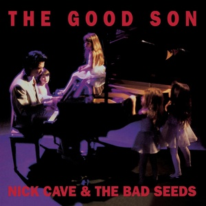

= The Good Son
Nick Cave & The Bad Seeds
1990
:toc:

From https://www.azlyrics.com/n/nickcavethebadseeds.html

== Foi Na Cruz

[verse]
____
Foi na cruz, foi na cruz
Que um dia
Meus pecados castigados em Jesus
Foi na cruz
Que um dia
Foi na cruz

Love comes a-knocking
Comes a-knocking upon our door
But you, you and me, love
We don't live here any more

Foi na cruz, foi na cruz
Que um dia
Meus pecados castigados em Jesus
Foi na cruz
Que um dia
Foi na cruz

A little sleep, a little slumber
A little folding of the hands to sleep
A little love, a little hate, babe
A little trickery and deceit

Foi na cruz, foi na cruz
Que um dia
Meus pecados castigados em Jesus
Foi na cruz
Que um dia
Foi na cruz

Dream on 'till you can dream no more
For all our grand plans, babe
Will be dreams forever more

Foi na cruz, foi na cruz
Que um dia
Meus pecados castigados em Jesus
Foi na cruz
Que um dia
Foi na cruz
____

== The Good Son

[verse]
____
One more man gone
One more man gone
One more man is gone

The good son walks into the field
He is a tiller, he has a tiller's hands
But down in his heart now
He lays down his queer plans
Against his brother and against his family
Yet he worships his brother
And he worships his mother
But it's his father, he says, is an unfair man
The good son
The good son
The good son

The good son has sat and often wept
Beneath a malign star by which he's kept
And the night-time in which he's wrapped
Speaks of good and speaks of evil
And he calls to his mother
And he calls to his father
But they are deaf in the shadows
Of his brother's truancy
The good son
The good son
The good son
The good son

And he curses his mother
And he curses his father
And he curses his virtue like an unclean thing
The good son
The good son
The good son

One more man gone
One more man gone
One more man
One more man gone
One more man gone
One more man
One more man gone
One more man gone
One more man
____

== Sorrow's Child

[verse]
____
Sorrow's child sits by the river
Sorrow's child hears not the water
Sorrow's child sits by the river
Sorrow's child hears not the water
And just when it seems as though
You've got strength enough to stand
Sorrow's child all weak and strange
Stands waiting at your hand

Sorrow's child steps in the water
Sorrow's child you follow after
Sorrow's child wades in deeper
Sorrow's child invites you under
And just when you thought as though
All your tears were wept and done
Sorrow's child grieves not what has passed
But all the past still yet to come
Sorrow's child sits by the water
Sorrow's child your arms enfold her
Sorrow's child you're loathe to befriend her
Sorrow's child but in sorrow surrender
And just when is seems as though
All your tears were at an end
Sorrow's child lifts up her hand
And she brings it down again
____

== The Weeping Song

[verse]
____
Go son, go down to the water
And see the women weeping there
Then go up into the mountain
The men, they are weeping too

Father, why are all the women weeping?
They are all weeping for their men
Then why are all the men there weeping?
They are weeping back at them

This is a weeping song
A song in which to weep
While all the men and women sleep
This is a weeping song
But I won't be weeping long

Father, why are all the children weeping?
Oh they are merely crying son
Oh are they merely crying, father?
Yes, true weeping is yet to come

This is a weeping song
A song in which to weep
While all the little children sleep
This is a weeping song
But I won't be weeping long

Oh father tell me, are you weeping?
Your face it seems wet to touch
Oh then I'm so sorry, father
I never thought I hurt you so much

This is a weeping song
A song in which to weep
While we rock ourselves to sleep
This is a weeping song
But I won't be weeping long
No I won't be weeping long
No I won't be weeping long
No I won't be weeping long
____

== The Ship Song

[verse]
____
Come sail your ships around me
And burn your bridges down
We make a little history, baby
Every time you come around

Come loose your dogs upon me
And let your hair hang down
You are a little mystery to me
Every time you come around

We talk about it all night long
We define our moral ground
But when I crawl into your arms
Everything, it comes tumbling down

Come sail your ships around me
And burn your bridges down
We make a little history, baby
Every time you come around

Your face has fallen sad now
For you know the time is nigh
When I must remove your wings
And you, you must try to fly

Come sail your ships around me
And burn your bridges down
We make a little history, baby
Every time you come around

Come loose your dogs upon me
And let your hair hang down
You are a little mystery to me
Every time you come around

Come sail your ships around me (Come sail your ships around me)
And burn your bridges down (And burn your bridges down)
We make a little history, baby (We make a little history, baby)
Every time you come around (Every time you come around)
____

== The Hammer Song

[verse]
____
I set out on monday
The night was cold and vast
And my brother slept

And though I left quite quietly
My father raged and raged
And my mother wept

Now, my life was like a river
All sucked into the ground
And then the hammer came down
Lord, the hammer came down

Many miles did I roam
Through the ice and through the snow
My horse died on the seventh day

I stumbled into a city
Where the people tried to kill me
And I ran in shame

Then I came upon a river
And I laid my saddle down
And then the hammer came down
Lord, the hammer came down
It knocked me to the ground
And I said, "Please, please
Take me back to my home ground"
Lord, the hammer came down

Now I've been made weak by visions
For visions did I see
All through the night

On the seventh hour an angel came
With many snakes in all his hands
And I fled in fright

I pushed off into the river
And the water came around
And then the hammer came down
Lord, the hammer came down
And it did not make a sound
And I said, "Please, please
Take me back to my home ground"
Lord, the hammer came down

And I pushed off into the river
And the water swelled around
And then the hammer came down
Lord, the hammer came down
And it did not make a sound
And I said, "Please, please
Take me back to my home ground"
Lord, the hammer came down
But it throw me round and round
And I said, "Please, please
Take me back to my home town"
Lord, the hammer came down
And it knocked my to the ground
And I got down on my knees
And I said, "Please"
I said, "Take me to my home town"
Lord, the hammer came down
And it did not make a sound
And I said, "Please, please
Take me back to my home ground"
Lord, the hammer came down
____

== Lament

[verse]
____
I've seen your fairground hair,
your seaside eyes
Your vampire tooth, your little truth
Your tiny lies

I know your trembling hand, your guilty prize
Your sleeping limbs, your foreign hymns
Your midnight cries

So dry your eyes
And turn your head away
Now there's nothing more to say
Now you're gone away

I know your trail of tears, your slip of hand
Your monkey paw, your monkey claw
And your monkey hand

I've seen your trick of blood, your trap of fire
Your ancient wound, your scarlet moon
And your jailhouse smile

So dry your eyes
And turn your head away
Now there's nothing more to say
Now you're gone away

I'll miss your urchin smile, your orphan tears
Your shining prize, your tiny cries
Your little fears
I'll miss your fairground hair, your seaside eyes
Your vampire tooth, your little truth
And your tiny lies

So dry your eyes
And turn your head away
Now there's nothing more to say
Now you're gone away
____

== The Witness Song

[verse]
____
Yeah, yeah
Well, well
I took a walk down to the port
Where strangers meet and do consort
All blinkered with desire
And a winter fog moved thickly on
A winter fog moved thickly on
A winter fog moved thickly on

Now, who will be the witness
When the fog's too thick to see

And I saw a friend beside a wall
Her hands were raised in supplication
And her face I could not see at all
And I raised my hands in rage
And brought them down again
And we entered through the eastern door
And I entered through the eastern door
And she entered through the eastern door

Now, who will be the witness
When you're all to blind to see
O yes, yes, yes

And time gets somewhat muddled here
But no matter, no matter
Here come the events all tumbling down
Now, beyond the wall was a great garden
Into which we passed
Me and my friend
And the place was all overgrown with weeds
And behold from its centre there rose a great fountain
The fountain with the healing waters
And we knelt down by the rim
And I dipped my hand in
And she dipped her hand in too
And I said "Are you healed?"
And she said "Well are you healed?"
And I said "Yes, I'm healed"
And she said "Well, yes I'm healed then too"
And I said "Babe, you are a liar"
"Babe, you are a liar"
"Babe, you are a liar, too"
Now, who will be the witness
When you're all to healed to see

And I kissed her once, I kissed her twice
And made my way to leave her
And she raised her hand up to her face
And brought it down again
I said "That gesture, it will haunt me"
"That gesture it will haunt me"
And I left there by the eastern door
She left there by the western door

Now, who will be the witness there
When you're blind and you can't see
Who will be the witness there
When you're all so clean and you cannot see
Who will be the witness there
When your friends are everywhere
Who will be the witness there
And your enemies have ceased to care
____

== Lucy

[verse]
____
Last night I lay trembling
The moon it was low
It was the end of love
Of misery and woe

Then suddenly above me
Her face buried in light
Came a vision of beauty
All covered in white

Now the bell-tower is ringing
And the night has stole past
O Lucy, can you hear me?
Wherever you rest

I'll love her forever
I'll love her for all time
I'll love her till the stars
Fall down from the sky
Now the bell-tower is ringing
And I shake on the floor
O Lucy, can you hear me?
When I call and call

Now the bell-tower is ringing
And the moon it is high
O Lucy, can you hear me
When I cry and cry and cry
____
