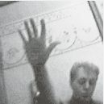

= Driving Rain
Paul McCartney
2001
:toc:

From http://www.azlyrics.com/p/paulmccartney.html  

== Lonely Road

[verse]
____

I tried to get over you
I tried to find something new
But all I could ever do
Was fill my time
With thoughts of you

I tried to go somewhere old
To search for my pot of gold
But all I could ever hold
Inside my mind
Were thoughts of you

I hear your music
And it's driving me wild
Familiar rhythms
In a different style
I hear your music
And it's driving me wild again

Don't want to let you take me down
Don't want to get hurt second time around
Don't want to walk that lonely road again

I hear your music
And it's driving me wild
Familiar rhythms
In a different style
I hear your music
And it's driving me wild again

Don't want to let you take me down
Don't want to get hurt second time around
Don't want to walk that lonely road again

Don't want to let you take me down
Don't want to get hurt second time around
Don't want to walk that lonely road again

[Ad lib to end] 
____

== From A Lover To A Friend

[verse]
____
And when the time comes around
We will be duty bound
To tell the through of what we've seen
And what we haven't found
Will not be going down
Despite too easy ride to see

From a lover to a friend
Take your own advice
Let me love again
Now that you turned out to be
Someone I can trust
Someone I believe

Ohh la la la
How can I walk when I can't find a way
I have a dilemma
All I want is to tell me
You're going to take it away

From a lover to a friend
Take your own advice
Let me love again
Now that you turned out to be
Someone I can trust
Someone I believe

And what we haven't found
Will not be going down
Despite too easy ride to see

From a lover to a friend
You turned out to be
Someone I believe

From a lover to a friend
Take your own advice
Let me love again

Ohh la la la
How can I walk when I can't find a way
I have a dilemma
All I want is to tell me
You're going to take it away

From a lover to a friend
From a lover to a friend
From a lover to a friend
Let me love again 
____

== She's Given Up Talking

[verse]
____
She's given up talking
Don't say a word
Even in the classroom
Not a dickie bird
Unlike other children
She's seen and never heard
She's given up talking
Don't say a word

You see her in the playground
Standing on her own
Everybody wonders
Why she's all alone
Someone made her angry
Someone's got her scared
She's given up talking
Don't say a word

Ah but when she comes home
It's yap-a-yap-yap
Words are running freely
Like the water from a tap
Her brothers and her sisters
Can't get a word in edgeways
But when she's back at school again
She goes into a daze

Ah but when she comes home
It's yap-a-yap-yap
Words are running freely
Like the water from a tap
Her brothers and her sisters
Can't get a word in edgeways
But when she's back at school again
She goes into a daze

She's given up talking
Don't say a word
Even in the classroom
Not a dickie bird
Unlike other children
She's seen and never heard
She's given up talking
Don't say a word

She's given up talking
She don't say a word

Don't say a word 
____

== Driving Rain

[verse]
____
12345 Let's go for a drive
678910 Let's go there and back again

Something's open it's my heart
If something's missing it's when we're apart
If something's good it's when we're back together again

Nothing's wrong it's just insane
Nothing's right until you're back again
Nothing's broken when it's softly spoken
And we're walking slowly down the lane

Why don't we drive in the rain
Straight to the eye of the hurricane
Go for a ride in the driving rain

12345 Let's go for a drive
678910 Ooh Ooh
12345 Let's go for a drive
678910 Let's go there and back again
Baby baby

You come walking through my door
Like the one that I've been waiting for
Letting sunshine in the darkest places when I've been going there again

So why don't we drive in the rain
Straight to the eye of the hurricane

Why don't we drive in the rain
Straight to the eye of the hurricane
Go for a ride in the driving rain
12345 Let's go for a drive
678910 Ooh Ooh
12345 Let's go for a drive
678910 Let's go there and back again
Baby baby

In the driving rain
Why don't we drive
In the driving rain

12345 Ooh Ooh
678910 Let's go back again
12345 Let's go for a drive
678910 Let's go there and back again

You come walking through my door 
____

== I Do

[verse]
____
If you only knew
How much it meant to me
You'd understand
And I would feel
Your love was true
This is all I want
This is all I need
This is all I long for, I do

Just remember this
After a time it's through
And nevermore
Will there be days
For me and you
This is all I ask
All I ask of you
Please remember darling, I do
Love you

Days go by so quickly
When you're having fun
But life is never easy
Even in the sun

Please remember this
After a time it's through
And nevermore
Will there be days
For me and you

This is all I want
This is all I need
Darling please remember, I do
Love you

If you only knew 
____

== Tiny Bubble

[verse]
____
If you're part of my love
Don't leave home tonight
While we're sleeping we can learn to see that
All the world's a tiny bubble
Floating inside
Those of us who notice are
Expected to hide
All the world's a tiny bubble
Floating inside, the truth

When I look in your eyes
I can see the sky
Shining down upon the perfect garden
All the world's a tiny bubble
Floating inside
Those of us who notice are
Expected to hide
All the world's a tiny bubble
Floating inside the truth

You can't imagine just what I've been going through
I wouldn't wish it on a soul much less on you
I well remember when my heart was free
My soul could laugh, so could we

If you're part of my love
Don't leave home tonight
While we're sleeping we can learn to see that
All the world's a tiny bubble
Floating inside
Those of us who notice are
Expected to hide
All the world's a tiny bubble
Floating inside, the truth

You can't imagine just what I've been going through
I wouldn't wish it on a soul much less on you
I well remember when my soul was free
My heart could sing, so could we

If you're part of my love
You won't leave home tonight
While we're sleeping we can learn to see that
All the world's a tiny bubble
Floating inside
All the world's a tiny bubble
Floating inside

All the world's a tiny bubble
Repeat to end
____

== Magic

////
https://www.google.com/search?q=Paul+McCartney+lyrics+Magic
////

[verse]
____
There must have been magic
The night that we met
If I hadn't stopped you
I`d always regret

A few minutes later
You`d have been out that door
And I`d have been lonely
Forever more
Forever more

Oh what made us do it?
Under what holy spell?
Nature`s mother knew it
Only too well

She reached out her fingers
To point at the sky
Leaving me helpless
Not knowing why

And this is the hour
That they turn out the light
Nothing but memories
Burning so bright
Burning so bright

Oh what made us do it?
Under what holy spell?
Nature`s mother knew it
Only too well

There must have been magic
The night that we met
If I hadn't stopped you
I`d always regret

There must have been magic
There must have been magic
There must have been magic
The night that we met
____

== Your Way

[verse]
____
I like it
Please don't take my heart away
It's happy
Where it is so let it stay
You gave me love
You gave me what I wanted
You gave me love your way

I've seen it
Shining from the furthest stars
Like Venus
Saw it on the way to Mars
You gave me love
You gave me what I wanted
You gave me love your way

Your way is strong
You way is right
Your way is mine tonight

I like it
Please don't take my heart away
It's happy
Where it is so let it stay
You gave me love
You gave me what I wanted
You gave me love your way

Your way is strong
You way is right
Your way is mine tonight

Your way is strong
You way is right
Your way is mine tonight

You gave me love your way 
____

== Spinning On An Axis

[verse]
____
World spinning round
To the next revolution
Sun going down
Gonna rise up again

I watch the sun go down
With some sorrow
And now I know it's gonna come back tomorrow
Ain't no reason
It has to do that
It's the season of the culture bat

Spinning on an axis
Spinning on an axis
Staring in the face
Of time and space
Spinning on an axis

World spinning round
To the next revolution
Sun going down
Gonna rise up again

Hear me rising
Rise up and sing, rise up, rise up

Although I'm curious
It isn't a crime
I want to know if I'll
Find out in time
A lot of people busy doing their thing
Gonna wake up and sing

Spinning on an axis
Spinning on an axis
We ask the question
And the answer's yes
Spinning on an axis

I watch the sun go down
With some sorrow
And now I know it's gonna come back tomorrow
Ain't no reason why
It has to do that
It's the season of the culture bat

I watch the sun go down
Wonder if it's gonna come back
Certainly there's no guarantee
But I got a feeling it will be
Spinning on an axis
Spinning on an axis
Spinning on an axis
Spinning on, Spinning on an axis
Spinning on an axis

World spinning round
To the next revolution
Sun going down
Gonna rise up again

World spinning round
To the next revolution
Sun going down
Gonna rise up again
Gonna rise up
Gonna rise up
Gonna rise up
Gonna rise up
____

== About You

[verse]
____
You give me power to get out of bed
When in the morning I'm feeling dead
Living and loving there's a lot to be said it's true

Gonna say it about you
Gonna say it about you

Out of the darkness and into the light
Straight to the centre of everything right
Darling don't worry the sky will be bright and blue

When I say it about you
Gonna say it about you
I'll say it about you

When did you teach me to fly thru the air
Sooner or later we all will be there
I read the headlines and now I can swear it's true

And they said it about you
Gonna say it about you
Gonna say it about you
Gonna say it about you
Gonna say it about you 
____

== Heather

[verse]
____

I'm gonna fly to the moon
Check in outta space
Find me a suitable plot
Build myself a place
There I will stay
For a year and a day
Until the cares of my life blow away
And I will dance to a runcible tune
With the queen of my heart

Heather
____

== Back In The Sunshine Again

[verse]
____
Here we are
Back in the sunshine again
No more worries
and no more pain

We're leaving behind
All our troubles and strife
And that's the way it's gonna be
For the rest of my life

Here we are, here we are
Back in the sunshine again
No more worries, no more worries
And no more pain, no more pain

Life's too short, to spend it lonely
You only throw it away
Listen to your voice of reason, call it a day

Take a ride, take a ride
Out to the land of the free
Don't hurry take your time, take your time
Come and spend it with me

Back in the sunshine
Back in the sunshine

Here we are
Back in the sunshine again
No more worries, no more worries
And no more pain

Life's too short, to spend it lonely
You only throw it away
Listen to your voice of reason, call it a day

Here we are
Back in the sunshine again
No more worries, no more worries
And no more pain

Here we are
Back in the sunshine again
No more worries or pain
And no more pain

Back in the sunshine again
No more worries
Back in the sunshine again 
____

== Your Loving Flame

[verse]
____
How can I hope to reach your love
Help me to discover
What it is you're thinking of

'Cos when we kiss, nothing feels the same
I could spend eternity
Inside your loving flame

What am I to do
If I don't have you
I'll be feeling blue
Just sitting here without you
You could be the one
To chase my blues away, away

So tell me how, how to reach your love
Help me to discover
What it is you're thinking of

'Cos when we kiss, nothing feels the same
I could spend eternity
Inside your loving flame

What am I to do
If I don't have you
I'll be feeling blue
Just sitting here without you
You could be the one
To chase my blues away, away

'Cos when we kiss, nothing feels the same
I could spend eternity
Inside your loving flame

So tell me how, how to reach your love
Help me to discover
What it is you're thinking of

How can I hope to reach your love
Here forever in your loving flame 
____

== Riding Into Jaipur

[verse]
____
Riding to Jaipur
Riding through the night
Riding with my baby
Oh what a delight
Oh what a delight
It is

[Repeat]
____

== Rinse The Raindrops

[verse]
____
Rinse the raindrops
From your head
Wipe your eyes
Go back to bed
In the morning
Skies'll clear
And I'll be here

See the sunlight
Break the ice
For the birds of paradise
Listen to the song they sing
Awakening

[Repeat]
____

== Freedom

[verse]
____
This is my right
A right given by God
To live a free life
To live in freedom

Talkin' about freedom
I'm talkin' 'bout freedom
I will fight
For the right
To live in freedom

Anyone tries to take it away
They'll have to answer
'Cause this is my right

I'm talkin' about freedom
Talkin' 'bout freedom
I will fight
For the right
To live in freedom

I'm talkin' 'bout freedom
I'm talkin' 'bout freedom
I will fight
For the right
To live in freedom

Everybody talkin' 'bout freedom
We're talkin' 'bout freedom
We will fight
For the right
To live in freedom

I'm talkin' 'bout freedom
Talkin' 'bout freedom
I will fight
For the right
To live in freedom

I'm talkin' 'bout freedom
I'm talkin' 'bout freedom
We will fight
For the right
To live in freedom 
____

