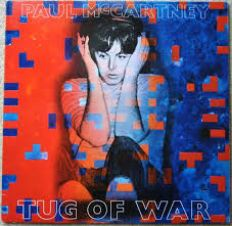

= Tug Of War 
Paul McCartney
1982
:toc:

		
From http://www.azlyrics.com/p/paulmccartney.html

== Tug Of War

[verse]
____
It's A Tug Of War
What With One Thing And Another
It's A Tug Of War
We Expected More
But With One Thing And Another
We Were Trying To Outdo Each Other
In A Tug Of War

In Another World
In Another World We Could
Stand On Top Of The Mountain
With Our Flag Unfurled
In A Time To Come
In A Time To Come We Will Be
Dancing To The Beat Played
On A Different Drum

It's A Tug Of War
Though I Know I Mustn't Grumble
It S A Tug Of War
But I Can't Let Go
If I Do You'll Take A Tumble
And The Whole Thing Is Going To Crumble
It's A Tug Of War

Pushing Pushing, Pulling Puliing
Pushing And Pulling

In Years To Come They May Discover
What The Air We Breathe And The Life We Lead
Are All About
But It Won't Be Soon Enough
Soon Enough For Me
No It Won't Be Soon Enough
Soon Enough For Me

In Another World We Couid
Stand On Top Of The Mountain
With Our Flag Unfurled
In A Time To Come We Willbe
Dancing To The Beat Played
On A Different Drum

We Will Be Dancing To The Beat
Played On A Different Drum
We Will Be Dancing To The Beat
Played On A Different Drum

It's A Tug Of War, A Tug Of War
A Tug Of War
What With One Thing And Another
It's A Tug Of War
We Expected More
But With One Thing And Another
In A Tug Of War

Pushing Pushing, Pulling Pulling
Pushing And Pulling
____

== Take It Away

[verse]
____
Take It Away
Wanna Hear You Play 'Til The Lights Go Down
Take It Away
Don't You Wanna Stay 'Til There's No One Else Around
Lonely Driver
Out On The Road
With A Hundred Miles To Go
Sole Survivor
Carrying The Load
Switches On His Radio
Take It Away
Wanna Hear You Play 'Til The Lights Go Down (Down, Down)
Take It Away
Don't You Wanna Stay 'Til There's No One Else Around
Take It Away
Wanna Hear You Play 'Til The Lights Go Down
Take It Away
Don't You Wanna Stay 'Til There's No One Else Around
In The Audience
Watching The Show
With A Paper In His Hand (In His Hand, In His Hand)
Some Important
Impresario
Has A Message For The Band
Take It Away
Wanna Hear You Play 'Til The Lights Go Down (Down, Down)
Take It Away
Don't You Wanna Stay 'Til There's No One Else Around
Never That His
Baby Listening To Your
Never That His
Baby Listening To Your
Never That His
Baby Listening To Your
Take It Away
Take It Away
After Hours
Late In The Bar
By A Darkened Corner Seat
Faded Flowers
Wade In The Jar
'Til The Evening Is Complete
____

== Somebody Who Cares

[verse]
____
When Your Body Is Coming Apart At The Seams
And The Whole Thing's Feeling Low You're Convincing Yourself
That There's Nobody There, I Know
I Know Now You Feel

Like Somebody Has Taken The Wheels Off Your Car
When You Had Somewhere To Go Well It's Annoying
Not Going To Get Very Far I Know
But Somebody Cares

There's Always Someone, Somewhere, You Should Know By Now
Always Somebody Who Cares It's Happening Day In, Day Out
Well You Know By Now Always Somebody Who Cares

If You Don't Know It How Will It Find You?
How Will We Know Your Whereabouts?
But I Know How You Feel

I Know How You Feel

Like Somebody Has Taken The Wheels Off Your Car
When You Had Somewhere To Go Well It's Frustrating
Not Going To Get Very Far I Know
But Somebody Cares

There's Always Someone, Somewhere, You Should Know By Now
Always Somebody Who Cares It's Happening Day In, Day Out
Well You Know By Now Always Somebody Who Cares

If You Don't Know It How Will It Find You?
How Will We Know Your Whereabouts?
But I Know How You Feel 
____

== What's That You're Doing?

[verse]
____
What's That You're Doing?
Girl I Like What You Do To Me
What's That You're Doing?
'Cos It Makes No Kind Of Sense To Me

You Can Make Me Feel So Proud
You Can Make Me Holler Ow!
Girl You Make Me Want To Dance And Sing
My Mind Is Blown And You're The Blame
I Say It's Sunnin' When There's Rain
I Jump By Leaps And Bounds, Just Call My Name

What's That You're Saying?
Girl I Like The Way You Talk To Me
What's That You're Saying?
Even If It's Wrong Girl I Do Agree

Girl You Make Me Feel So Small
Though I Might Stand Six Feet Tall
What You've Got Cuts Me Right Down To Size
I'll Be The Last, You'll Be The First
I'll Do My Best To Quench Your Thirst
I'm The Lucky One Who Keeps The Prize

Girl I Like What You're Doing
Baby Do It Some More
Girl I Like What You're Doing
Baby Do It Some More
Girl I Like What You
Do To Me, Do To Me
Do It Some More
Do To Me, Do To Me
Do It Some More

What's That You're Doing?
Girl I Like What You Do To Me
What's That You're Doing?
'Cos It Makes No Kind Of Sense To Me

You Can Fill My Appetite
Without Me Taking Up A Bite
Never Knew That Love Could Fill You Up
You're Much Too Good For Me To Pass
I'm For The Taking, You Just Ask
We Can Make It Stick With Love And Luck

Girl I Like What You're Doing
Baby Do It Some More
Girl I Like What You're Doing
Baby Do It Some More
Girl I Like What You
Do To Me, Do To Me
Do It Some More
You Know I Like What You're Doing
Girl I Like What You're Doing
Baby Do It Some More

What's That I'm Feeling?
That Sensation's Such A Mystery
I Know What It's Thrilling
And I Hope This Feeling Lasts Eternally

Girl You Make Me Scream And Shout
Tell Me What It's All About
You Make Me Give In Without A Fight
I Don't Have No Words To Say
You Can Fill It Anyway
And Everything You Do Will Turn Out Alright

Girl I Like What You're Doing
Baby Do It Some More
Girl I Like What You're Doing
Baby Do It Some More
She Loves You Yeah Yeah Yeah
She Loves You Yeah Yeah Yeah Yeah
____

== Here Today

[verse]
____
And If I Say I Really Knew You Well
What Would Your Answer Be.
If You Were Here Today.

Ooh- Ooh- Ooh- Here To - Day.

Well Knowing You,
You'd Probably Laugh And Say That We Were Worlds Apart.
If You Were Here Today.
Ooh- Ooh- Ooh- Here To - Day.

But As For Me,
I Still Remember How It Was Before.
And I Am Holding Back The Tears No More.
Ooh- Ooh- Ooh- I Love You, Ooh-

What About The Time We Met,
Well I Suppose That You Could Say That We Were Playing Hard To Get.
Didn't Understand A Thing.
But We Could Always Sing.

What About The Night We Cried,
Because There Wasn't Any Reason Left To Keep It All Inside.
Never Understood A Word.
But You Were Always There With A Smile.

And If I Say I Really Loved You
And Was Glad You Came Along.

If You Were Here Today.
Ooh- Ooh- Ooh- For You Were In My Song.
Ooh- Ooh- Ooh- Here To - Day. 
____

== Ballroom Dancing

[verse]
____
Well I Used To Smile When I Was A Pup
Sailing Down The Nile In China Cup
With The Recipe For A Lovely Day
Sticking Out My Back Pocket

But It Wasn't Always Such A Pretty Sight
'Cos We Used To Fight Like Cats And Dogs
Till Me Made It Up In The Ballroom

Ballroom Dancing Made A Man Of Me
One, Two, Three, Four
I Just Plain Adore Your
Ballroom Dancing, Seen It On Tv
I Got What I Got From Ballroom Dancing
Big B.D.

Well I Used To Fly When I Was A Kid
And I Didn't Cry If It Hurt A Bit
An A Carpet Ride To A Foreign Land
At The Time Of Davy Crockett

But It Wasn't Always Such A Pretty Sight
'Cos We Used To Fight Like Cats And Dogs
Till Me Made It Up In The Ballroom

Ballroom Dancing Made A Man Of Me
One, Two, Three, Four
I Just Plain Adore Your
Ballroom Dancing, Seen It On Tv
I Got Quite A Lot From Ballroom Dancing
Big B.D.

Well Went So Fast And We All Grew Up
Now The Days That Passed In The China Cup
Are The Memories Of Another Day
And I Wouldn't Want To Knock It

But It Wasn't Always Such A Pretty Sight
'Cos We Used To Fight Like Cats And Dogs
Till Me Made It Up In The Ballroom

Ballroom Dancing Made A Man Of Me
One, Two, Three, Four
I Just Plain Adore Your
Ballroom Dancing, Seen It On Tv
I Got Quite A Lot From Ballroom Dancing
Big B.D.

Oh!...
____

== The Pound Is Sinking

[verse]
____
The Pound Is Sinking
The Peso's Failing
The Lira's Reeling
And Feeling Quite Appalling

The Mark Is Holding
The Franc Is Fading
The Drachma's Very Weak
But Everyone's Still Trading

The Market's Bottom
Has Fallen Right Out
And Only The Strong Are Survivors

Well I Fear, My Dear
That It's Eminently Clear
That You Can't See The Trees
For The Forest
Your Father Was An
Extraordinary Man
But You Don't Seem To Have Inherited
Many Of His Mannerisms

Oh, Any Of His Mannerisms

The Dollar's Moving
The Rouble's Rising
The Yen Is Keeping Up
Which Hardly Seems Surprising

The Market's Bottom
Has Fallen Right Out
And Only The Strong Are Survivors

Hear Me Lover
I Can't Be Held Responsible Now

For Something That Didn't Happen
I Knew You For A Minute
Oh, It Didn't Happen
Only For A Minute
Your Heart Just Wasn't In It Anymore

The Pound Is Sinking
The Peso's Failing
The Lira's Reeling
And Feeling Quite Appalling
____

== Wanderlust

[verse]
____
Light out wanderlust
Head us out to sea
Captain says there'll be a bust
This one's not for me

Take us from the dark
Out where we can see
Captain's out to make his mark
This one's not to be

Light out wanderlust
Help us to be free
Light out wanderlust
Do it just for me - wanderlust

Oh where did I go wrong my love?
What petty crime was I found guilty of?
What better time to find a brand new day?
Oh - wanderlust away

Light out wanderlust
Help us to be free
Light out wanderlust
Do it just for me – wanderlust

Captain's out to make his mark
This one's not to be

Light out wanderlust (oh where did I go wrong my love?)
Head us out to sea (what petty crime was I found guilty of?)
Captain says there'll be a bust (what better time to find a brand new day?)
This one's not for me (oh - wanderlust away)

Dropping a line
Maybe this time
It's wanderlust for me 
____

== Get It

[verse]
____
You've Got To Get It Mm Mm
You've Got To Get It Don't Forget
It Doesn't Come Around Again
You've Got To Get It Mm Mm
You've Got To Get It And You've Got To Get It Good

Once I Had A Little Spanish Guitar
The Neighbours Told Me I Could Go Pretty Far
Well I Came And I Went
And My Guitar Got Bent
But I Discovered That The People Who Love
Are What We Need If We're To Get Up Above It All
And That's That
Unless The World Is Flat

I Wanna Get It Mm Mm
I Wanna Get It Just In Case
It Doesn't Come Around Again
I Wanna Get It Mm Mm
I Wanna Get It And I Wanna Get It Good

Pardon Me If I've Been Misunderstood
I Wanna Get It While The Going Is Good
The Telephone Rang
About A Song I Sang
The Life Of Cadillac And Ultra For Sure
Is Automatic For The Lady Demure
She Came And She Went
Without A Single Dent

Come On, Let's Get It Mm Mm
Come On, Let's Get It Don't Forget
It Doesn't Come Around Again
You've Got To Get It Mm Mm
You've Got To Get It And You've Got To Get It Good

Come On, Let's Get It Mm Mm
Come On, Let's Get It Don't Forget
It Doesn't Come Around Again
You've Got To Get It Mm Mm
You've Got To Get It And You've Got To Get It Good 
____

== Be What You See

[verse]
____
The One You Wanted To Be
Is Now The One You See
The One You Wanted To Be
Is Now The One You See
____

== Dress Me Up As A Robber

[verse]
____
Well You Can Dress Me Up As A Robber
But I Won't Be In Disguise
Only Love Is A Robber
And He Lives Within Your Eyes
Ooh, Ooh Eee Ooh

You Can Dress Me Up As A Sailor
But I'll Never Run To Sea
As Long As Your Love Is Available To Me
What Do I Do With A Sea Of Blue?
Ooh, Eee Ooh

Dressing Me Up
It Doesn't Make A Difference
What You Want To Do
Whichever Way You Look At It
I'm Still In Love With You
If We Go On Forever
I May Never Make A Change

Dressing Me Up
And If I Don't Convince You
You Needn't Look Too Far
To See That I'm Not Lying
'Cos I Love You The Way You Are
And What's The Point Of Changing
When I'm Happy As I Am?

Well You Can Dress Me Up As A Soldier
But I Wouldn't Know What For
I Was The One That Told You He Loved You
Don't Wanna Go To Another War
No, No, No 
____

== Ebony And Ivory

[verse]
____
Ebony and Ivory live together in perfect harmony
Side by side on my piano keyboard, oh Lord, why don't we?

We all know that people are the same wherever we go
There is good and bad in everyone
We learn to live, we learn to give
Each other what we need to survive together alive

Ebony and Ivory live together in perfect harmony
Side by side on my piano keyboard, oh Lord, why don't we?

Ebony, Ivory living in perfect harmony
Ebony, Ivory, Ooh

We all know that people are the same wherever you go
There is good and bad in everyone
We learn to live, when we learn to give
Each other what we need to survive together alive

Ebony and Ivory live together in perfect harmony
Side by side on my piano keyboard, oh Lord, why don't we?

Side by side on my piano keyboard
Oh Lord, why don't we?
____
