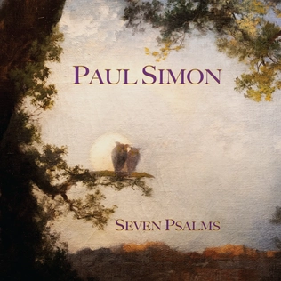

= Seven Psalms
Paul Simon
2023
:toc:

From https://www.azlyrics.com/p/paulsimon.html

== The Lord

[verse]
____
I've been thinking about the great migration
Noon and night they leave the flock
And I imagine their destination
Meadow grass, jagged rock

The Lord is my engineer
The Lord is the earth I ride on
The Lord is the face in the atmosphere
The path I slip and I slide on

A crystal comet
Starlit night
Silver moon
To smooth the edge of daylight
Now turned the evening rose

Tribal voices
Old and young
Celebrations
A history of families sung
The endless river flows

The Lord is my engineer
The Lord is the earth I ride on
The Lord is the face in the atmosphere
The path I slip and I slide on

The Lord is a virgin forest
The Lord is a forest ranger
The Lord is a meal for the poorest of the poor
A welcome door to the stranger

Tears and flowers
Dry over time
Memory leaves us
Melody and rhyme

When the cold wind blows
The seeds we gather
From the gardener's glove
Live forever
Nothing dies of too much love

The Lord
The Lord is the earth I ride on
The Lord is the face in the atmosphere
The path I slip and slide on

And the Lord is a virgin forest
The Lord is a forest ranger
The Lord is a meal for the poorest
A welcome door to the stranger

The Covid virus is the Lord
The Lord is the ocean rising
The Lord is a terrible swift sword
A simple truth surviving
____

== Love Is Like a Braid

[verse]
____
Love is Like a braid
Some say that I that'll disbelieve it
Cowry shells
Fine combs made of jade
To ornament and weave it

I lived a life of pleasant sorrows
Until the real deal came
Broke me like a twig in a winter gale
Call me by my name
And in that time of prayer and waiting
Where doubt and reason dwell
A jury sat deliberating
All is lost
Or all is well

Home, home, sun on my doorstep
Shocks me to find
I'm a child again entwined
In your love
In your light
In your cool summer shade

The garden keeps a rose and a thorn
And once the choice is made
All that's left
Is mending what was torn
Love is like a braid
Love is like a braid
____

== My Professional Opinion

[verse]
____
Good morning, Mr Indignation
Looks like you haven't slept all night
In my professional opinion
Go back to bed and turn off your light

I'm not a doctor or a preacher
I've no particular guiding star
In my professional opinion
I'm no more satisfied than you are

So, what in the world we whispering for?
Everyone's thinking there's nothing to hide
Come carry my grievances down to the shore
Wash 'em away in the tumbling tide

I heard two cows in a conversation
One called the other one a name
In my professional opinion
All cows in the country must bear the blame

So, all rise to the occasion
Or all sink into despair
In my professional opinion
We're better off not going there

Oh, what in the world we whispering for?
Everyone's making there's nothing to hide
Go carry my grievances down to the shore
Wash 'em away in the tumbling tide

Wash 'em away in the tumbling tide
Wash 'em away in the tide
All that really matters is the one who became us
Anointed and gained us with his opinion
____

== The Lord Reprise

[verse]
____
The Lord is my engineer
The Lord is the earth I ride on
The Lord is a face in the atmosphere
The path I'll slip and I'll slide on

The Lord is a virgin forest
The Lord is a forest ranger
The Lord is a meal for the poorest of the poor
A welcome door to the stranger

The Covid virus is The Lord
The Lord is the ocean rising
The Lord is a terrible swift song
A simple truth, surviving

Tu lu, lulu lu...
____

== Your Forgiveness

[verse]
____
Yesterday's boy is gone
Driving through darkness
Searching for your forgiveness

Is sorrow a beautiful song?
Lives in the heart and sings for all
Your Forgiveness

Inside the digital mind
A homeless soul ponders the cold
Of forgiveness

And I the last in the line
Hoping the gates won't be closed before
Your forgiveness

Dip your hand in Heaven's waters
God's imagination
Dip your hand in Heaven's waters
All of life's abundance in a drop of condensation
Dip your hand in Heaven's waters
Ooh, ooh

I, I have my reasons to doubt
There is a case to be made
Two billion heartbeats and out
Waving a flag in the last parade
I have my reasons to doubt

Dip your hand in Heaven's waters
God's imagination
Dip your hand in Heaven's waters
All of life's abundance in a drop of condensation
Dip your hand in Heaven's waters

I have my reasons to doubt
The white light eases the pain
Two billion heartbeats and out
Or does it all begin again?

Dip your hand in Heaven's waters
God's imagination
All of life's abundance in a drop of condensation
____

== Trail of Volcanoes

[verse]
____
When I was young
I carried my guitar down to the crossroads
And over the seas
Now those old roads are a trail of volcanoes
Exploding with refugees
It seems to me
We're all walking down the same road
To wherever it ends
The pity is
The damage that's done
Leaves so little time for amends
____

== The Sacred Harp

[verse]
____
A change of mood
A summer storm erased the sunny sky
Two hapless hitchhikers were
Signaling us
As we were cursing by

Not in the mood
For idle chat or hitchhike company
Nevertheless
We took them on as highway courtesy

Hurry get yourselves inside the truck
We're just going up a ways
The rain should turn to mist
With any luck
And you can find a place to stay

The woman spoke
Her voice a blend
Of regional perfumes
We have no destination
The moon and stars
Provide us with our rooms

My boy and me
We're refugees of sorts
From my home town
They don't like different there
They would have moved us down

He doesn't talk much anymore
Just to the voices in his head
The boy just gazed down at the floor
And nodded once or twice at what
She said

The sacred harp
That David played to make his
Songs of praise
We long to hear those strings
That set his heart ablaze

The ringing strings
The thought that God turns music
Into bliss...
We left the pick-up in the driveway
The moon appeared as amber
In the mist
____

== The Lord Reprise

[verse]
____
The Lord is a puff of smoke
That disappears when the winds blow
The Lord is my personal joke
My reflection in the window
I've been thinking about our troubled nature
Our benediction and our curse
Are we all just trial and error
One of a billion in the universe?

Tu lu, lulu lu...

The Lord is my engineer
The Lord is my record producer
The Lord is the music I hear
Deep in the valley of elusive

The Lord is my engineer
The Lord is the train I ride on
The Lord is the coast, the coast is clear
The path I slip and slide on

Tu lu, lulu lu...
____

== Wait

[verse]
____
Wait
I'm not ready
I'm just packing my gear
Wait
My hand's steady
My mind is still clear

I hear the ghost songs and old
Jumpin', jivin', moanin'
Through a heart broken microphone
Wait

Life is a meteor
Let your eyes roam
Heaven is beautiful
It's almost like home
Children get ready
It's time to come home

I want to believe in
A dreamless transition
Wait
I don't want to be near
My dark intuition

I need you here by my side

My beautiful mystery guide
Wait

Life is a meteor
Let your eyes roam
Heaven is beautiful
It's almost like home
Children get ready
It's time to come home

Amen
____