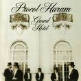

= Grand Hotel
Procol Harum
1973
:toc:

From::
https://www.azlyrics.com/p/procolharum.html

== Grand Hotel

[verse]
____
Tonight we sleep on silken sheets
We drink fine wine and eat rare meats
On Carousel and gambling stake
Our fortunes speed, and dissipate.
It's candlelight and chandelier,
It's silver plate and crystal clear.
The nights we stay at Hotel Grand

Tonight we dine at Hotel Ritz.
(A golden dish with every wish).
It's mirrored walls, and velvet drapes,
Dry champagne, and bursting grapes.
Dover sole, and Oeufs Mornay,
Profiteroles and Peach Flambe,
The waiters dance on fingertips
The nights we dine at Hotel Ritz
One more toast to greet the morn
The wine and dine have danced till dawn
Where's my Continental Bride?
We'll Continental slip and slide
Early morning pinch and bite -
(These French girls always like to fight)
It's serenade and Sarabande,
The nights we stay at Hotel Grand
Les nuits qu'on passe a l'Hotel Grande. 
____

== Toujours l'amour

[verse]
____
She took all the pleasure and none of the pain
All of the credit and none of the blame
I came home to an empty flat
She'd left me a note and taken the cat
The cord that they knotted to keep us apart
Could never be broken: it was tied to my heart
She grew thin and I grew fat
She left me and that was that
I'm thinking of renting a villa in France
A French girl has offered to give me a chance
Or maybe I'll take an excursion to Spain
And buy a revolver and blow out my brains 
____

== A Rum Tale

[verse]
____
She's fuddled my fancy, she's muddled me good
I've taken to drinking, and given up food
I'm buying an island, somewhere in the sun
I'll hide from the natives, live only on rum
I'm selling my memoirs, I'm writing it down
If no one will pay me I'll burn down the town
I'll rent out an aircraft and print on the sky
If God likes my story then maybe he'll buy
I'm buying a ticket for places unknown
It's only a one-way: I'm not coming home
She's swallowed my secret, and taken my name
To follow my footsteps and knobble me lame 
____

== T.V. Ceasar

[verse]
____

T.V. Ceasar Mighty Mouse
Holds his court in every house
Spied in every crack and corner
Watch you eat your TV dinner
Creeping in through eyes and ears
Finding out your secret fears
T.V. Ceasar Mighty Mouse
Shares the bed in every house
T.V. Ceasar Mighty Mouse
Gets the news in every house
Who's been doing what with who
How they do it when they do
Every saint and every sinner
Every fact and every figure
T.V. Ceasar Mighty Mouse
Fights the flab in every house
T.V. Ceasar Mighty Mouse
Shares the bed in every house
T.V. Ceasar Mighty Mouse
Tops the pops in every house
Sandwiched in between the ads
Something for the mums and dads
Great to have you on the show
Sorry that you've go to go
T.V. Ceasar Mighty Mouse
Gets the vote in every house
T.V. Ceasar Mighty Mouse
Shares the bed in every house
T.V. Ceasar Mighty Mouse
Fights the flab in every house
T.V. Ceasar Mighty Mouse
Gets the vote in every house 
____

== A Souvenir of London

[verse]
____
Bought a souvenir in London
Got to hide it from my mom
Can't declare it at the Customs
But I'll have to take it home
Tried to keep it confidential
But the news is leaking out
Got a souvenir in London
There's a lot of it about
Yes, I found a bit of London
I'd like to lose it quick
Got to show it to my doctor
'Cause it isn't going to shrink
Want to keep it confidential
But the truth is leaking out
Got a souvenir in London
There's a lot of it about 
____

== Bringing Home the Bacon

[verse]
____
Bringing home the bacon,
tender juicy steaks
Breast-fed baby dumpling
gobbling up the cakes
Milk-fed baby dumpling,
slobbering, goo-faced, mean
Wet-nursed sour purse spot face,
blubbering in the cream
Emperor baby dumpling,
loaded, bloated curse
Mighty baby dumpling,
stuffing 'til he bursts 
____

== For Liquorice John

[verse]
____
He fell from grace and hit the ground
They tried in vain to bring him round
No one saw him make the fall
They couldn't understand at all
His fall from grace was swift and straight
The doctors didn't hesitate
What he had they were not sure
He didn't have a temperature
His fall from grace was swift and sure
The doctors said they knew no cure.
They felt and poked and pushed his pulse
He couldn't understand at all
He fell from grace and hit the ground
He fell into the sea and drowned
They saw him struggling from the harbour
They saw him wave as he went under 
____

== Fires (Which Burnt Brightly)

[verse]
____
This war we are waging is already lost
The cause for the fighting has long been a ghost
Malice and habit have now won the day
The honours we fought for are lost in the fray
Standards and bugles are trod in the dust
Wounds have burst open, and corridors rust
Once proud and truthful, now humbled and bent
Fires which burnt brightly, now energies spent
Let down the curtain, and exit the play
The crowds have gone home and the cast sailed away
Our flowers and feathers as scarring as weapons
Our poems and letters have turned to deceptions 
____

== Robert's Box

[verse]
____
Doctor where's your remedy?
I've got enough to pay the fee
Can't you see I'm awful sick?
I'll pay you well to do the trick
Doctor where's your magic box
There's no one here to count the cost
Name your price and make the sale
There's no-one here to tell the tale
Doctor please don't lock your door
I've never troubled you before
Just a pinch to ease the pain
I'll never trouble you again 
____
