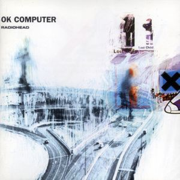

= OK Computer
Radiohead
1997
:toc:

		
From https://www.azlyrics.com/r/radiohead.html

== Airbag

[verse]
____
In the next world war
In a jackknifed juggernaut
I am born again

In the neon sign
Scrolling up and down
I am born again

In an interstellar burst
I am back to save the universe

In a deep deep sleep of the innocent
I am born again

In a fast german car
I'm amazed that I survived
An airbag saved my life

In an interstellar burst
I am back to save the universe

In an interstellar burst
I am back to save the universe 
____

== Paranoid Android

[verse]
____
Please could you stop the noise, I'm trying to get some rest
From all the unborn chicken voices in my head
What's that...? (I may be paranoid, but not an android)
What's that...? (I may be paranoid, but not an android)

When I am king, you will be first against the wall
With your opinion which is of no consequence at all
What's that...? (I may be paranoid, but no android)
What's that...? (I may be paranoid, but no android)

Ambition makes you look pretty ugly
Kicking and squealing gucci little piggy
You don't remember
You don't remember
Why don't you remember my name?
Off with his head, man
Off with his head, man
Why don't you remember my name?
I guess he does....

Rain down, rain down
Come on rain down on me
From a great height
From a great height... height...
Rain down, rain down
Come on rain down on me
From a great height
From a great height... height...
Rain down, rain down
Come on rain down on me

That's it, sir
You're leaving
The crackle of pigskin
The dust and the screaming
The yuppies networking
The panic, the vomit
The panic, the vomit
God loves his children, God loves his children, yeah! 
____

== Subterranean Homesick Alien

[verse]
____
The breath of the morning
I keep forgetting
The smell of the warm summer air

I live in a town
Where you can't smell a thing
You watch your feet
For cracks in the pavement

Up above
Aliens hover
Making home movies
For the folks back home

Of all these weird creatures
Who lock up their spirits
Drill holes in themselves
And live for their secrets

They're all uptight
Uptight.. [x7]

I wish that they'd swoop down in a country lane
Late at night when I'm driving
Take me on board their beautiful ship
Show me the world as I'd love to see it

I'd tell all my friends
But they'd never believe me
They'd think that I'd finally lost it completely

I'd show them the stars
And the meaning of life
They'd shut me away
But I'd be all right
All right..

I'm just uptight
Uptight.. [x7]
____

== Exit Music (For A Film)

[verse]
____
Wake.. from your sleep
The drying of your tears
Today we escape, we escape

Pack.. and get dressed
Before your father hears us
Before all hell breaks loose

Breathe, keep breathing
Don't lose your nerve
Breathe, keep breathing
I can't do this alone

Sing.. us a song
A song to keep us warm
There's such a chill, such a chill

You can laugh
A spineless laugh
We hope your rules and wisdom choke you
Now we are one in everlasting peace

We hope that you choke, that you choke
We hope that you choke, that you choke
We hope that you choke, that you choke
____

== Let Down

[verse]
____
Transport, motorways and tramlines
Starting and then stopping
Taking off and landing
The emptiest of feelings
Disappointed people clinging on to bottles
And when it comes it's so so disappointing

Let down and hanging around
Crushed like a bug in the ground
Let down and hanging around

Shell smashed, juices flowing
Wings twitch, legs are going
Don't get sentimental
It always ends up drivel

One day I'm going to grow wings
A chemical reaction
Hysterical and useless
Hysterical and ...

Let down and hanging around
Crushed like a bug in the ground
Let down and hanging around

Let down again
Let down again
Let down again

You know, you know where you are with
You know where you are with
Floor collapsing
Floating, bouncing back
And one day....
I am going to grow wings
A chemical reaction
Hysterical and useless
Hysterical and...

Let down and hanging around
Crushed like a bug in the ground
Let down and hanging around 
____

== Karma Police

[verse]
____
Karma police, arrest this man
He talks in maths
He buzzes like a fridge
He's like a detuned radio

Karma police, arrest this girl
Her Hitler hairdo is
Making me feel ill
And we have crashed her party

This is what you get
This is what you get
This is what you get when you mess with us

Karma police
I've given all I can
It's not enough
I've given all I can
But we're still on the payroll

This is what you get
This is what you get
This is what you get when you mess with us

For a minute there I lost myself, I lost myself
Phew, for a minute there I lost myself, I lost myself

For a minute there I lost myself, I lost myself
Phew, for a minute there I lost myself, I lost myself 
____

== Fitter Happier

[verse]
____
more productive
comfortable
not drinking too much
regular exercise at the gym (3 days a week)
getting on better with your associate employee contemporaries
at ease
eating well (no more microwave dinners and saturated fats)
a patient better driver
a safer car (baby smiling in back seat)
sleeping well (no bad dreams)
no paranoia
careful to all animals (never washing spiders down the plughole)
keep in contact with old friends (enjoy a drink now and then)
will frequently check credit at (moral) bank (hole in wall)
favours for favours
fond but not in love
charity standing orders
on sundays ring road supermarket
(no killing moths or putting boiling water on the ants)
car wash (also on sundays)
no longer afraid of the dark
or midday shadows
nothing so ridiculously teenage and desperate
nothing so childish
at a better pace
slower and more calculated
no chance of escape
now self-employed
concerned (but powerless)
an empowered and informed member of society (pragmatism not idealism)
will not cry in public
less chance of illness
tires that grip in the wet (shot of baby strapped in back seat)
a good memory
still cries at a good film
still kisses with saliva
no longer empty and frantic
like a cat
tied to a stick
that's driven into
frozen winter shit (the ability to laugh at weakness)
calm
fitter, healthier and more productive
a pig
in a cage
on antibiotics 
____

== Electioneering

[verse]
____
I will stop
I will stop at nothing
Say the right things
When electioneering
I trust I can rely on your vote

When I go forwards you go backwards and somewhere we will meet

Riot shields
Voodoo economics
It's just business
Cattle prods and the IMF
I trust I can rely on your vote

When I go forwards you go backwards and somewhere we will meet
____

== Climbing Up The Walls

[verse]
____
I am the key to the lock in your house
That keeps your toys in the basement.
And if you get too far inside
You'll only see my reflection.

It's always best when the candle's out,
I am the pick in the ice.
Do not cry out or hit the alarm,
You know we're friends 'til we die.

And either way you turn
I'll be there
Open up your skull
I'll be there
Climbing up the walls

It's always best when the light is off,
It's always better on the outside.
Fifteen blows to the back of your head,
Fifteen blows to your mind.

So lock the kids up safe tonight
And shut the eyes in the cupboard.
I've got the smell of a local man
Who's got the loneliest feeling.

That either way he turns - I'll be there
Open up your skull - I'll be there
Climbing up the walls

Climbing up the walls
Climbing up the walls 
____

== No Surprises

[verse]
____
A heart that's full up like a landfill
A job that slowly kills you
Bruises that won't heal

You look so tired, unhappy
Bring down the government
They don't, they don't speak for us
I'll take a quiet life
A handshake of carbon monoxide

No alarms and no surprises
No alarms and no surprises
No alarms and no surprises
Silent, silent

This is my final fit, my final bellyache with

No alarms and no surprises
No alarms and no surprises
No alarms and no surprises please

Such a pretty house, and such a pretty garden

No alarms and no surprises (let me out of here)
No alarms and no surprises (let me out of here)
No alarms and no surprises please (let me out of here) 
____

== Lucky

[verse]
____
I'm on a roll, I'm on a roll
This time, I feel my luck could change
Kill me Sarah, kill me again with love
It's gonna be a glorious day

Pull me out of the aircrash
Pull me out of the lake
'Cause I'm your superhero
We are standing on the edge

The Head of State has called for me by name
But I don't have time for him
It's gonna be a glorious day
I feel my luck could change

Pull me out of the aircrash
Pull me out of the lake
'Cause I'm your superhero
We are standing on the edge

We are standing on the edge
____

== The Tourist

[verse]
____
It barks at no one else but me
Like it's seen a ghost
I guess it seen the sparks a-flowing
No one else would know

Hey man slow down, slow down
Idiot, slow down, slow down

Sometimes I get overcharged
That's when you see sparks
You ask me where the hell I'm going
At a thousand feet per second

Hey man slow down, slow down
Idiot slow down, slow down

Hey man slow down, slow down
Idiot slow down, slow down
____
