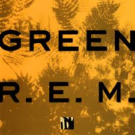

= Green
R.E.M.
1988
:toc:

From https://www.azlyrics.com/r/rem.html

== Pop Song 89

[verse]
____
Hello, I saw you, I know you, I knew you
I think I can remember your name (name)
Hello, I'm sorry, I lost myself
I think I thought you were someone else

Should we talk about the weather?
(Hi, hi, hi)
Should we talk about the government?
(Hi, hi, hi, hi)

Hello, how are you? I know you, I knew you
I think I can remember your name, name
Hello, I'm sorry I lost myself
I think I thought you were someone else

Should we talk about the weather?
(Hi, hi, hi)
Should we talk about the government?
(Hi, hi, hi, hi)

Hello my friend, are you visible today?
You know I never knew that it could be so strange, strange
Hello, I'm sorry, I lost myself
I think I thought you were someone else

Should we talk about the weather?
(Hi, hi, hi)
Should we talk about the government?
(Hi, hi, hi, hi)

(Hi, hi)
(Hi, hi, hi)
(Hi, hi)
(Hi, hi, hi)
(Hi, hi)
(Hi, hi, hi)
____

== Get Up

[verse]
____
Sleep delays my life (get up, get up)
Where does time go? (get up, get up, get up)
I don't know

Sleep, sleep, sleepy head (get up, get up, get up)
Wake it up, up (get up, get up)
You've got all your life (way up ahead)
(Get up, get up, get up)

Dreams they complicate my life (Dreams they complement my life)
I've seen you laying pined (get up, get up)
I've seen you laying pined (get up, get up)

Life is rough, rough (get up, get up, get up)
I've seen you laying down (get up)
With the loving kind (get up, get up)
I know life is hard, hard (where goes your time?)
Where to turn? Where to turn? (get up)

Dreams they complicate my life (Dreams they compliment my life)
Dreamtime

Dreams they complicate my life (Dreams they compliment my life)
This time, no escape, I wake up (get up, get up)
(get up, get up, get up, get up, get up, get up, get up) 
____

== You Are The Everything

[verse]
____
Sometimes I feel like I can't even sing (say, say, the light)
I'm very scared for this world
I'm very scared for me
Eviscerate your memory
Here's a scene
You're in the back seat laying down
The windows wrap around
To sound of the travel and the engine

All you hear is time stand still in travel
And feel such peace and absolute
The stillness still that doesn't end
But slowly drifts into sleep
The stars are the greatest thing you've ever seen
And they're there for you
For you alone you are the everything

I think about this world a lot and I cry
And I've seen the films and the eyes
But I'm in this kitchen
Everything is beautiful
And she is so beautiful
She is so young and old
I look at her and I see the beauty
Of the light of music

The voices talking somewhere in the house
Late spring and you're drifting off to sleep
With your teeth in your mouth
You are here with me
You are here with me
You have been here and you are everything

Sometimes I feel like I can't even sing (say, say, the light)
I'm very scared for this world
I'm very scared for me
Eviscerate your memory
Here's a scene
You're in the back seat laying down
The windows wrap around (say, say, the light)
To sound of the travel and the engine

All you hear is time stand still in travel
And feel such peace and absolute
The stillness still that doesn't end
But slowly drifts into sleep
The greatest thing you've ever seen
And they're there for you
For you alone you are the everything
____

== Stand

[verse]
____
Stand in the place where you live
Now face north
Think about direction
Wonder why you haven't before

Now stand in the place where you work
Now face west
Think about the place where you live
Wonder why you haven't before

If you are confused, check with the sun
Carry a compass to help you along
Your feet are going to be on the ground
Your head is there to move you around

So stand in the place where you live
Now face north
Think about direction
Wonder why you haven't before

Now stand in the place where you work
Now face west
Think about the place where you live
Wonder why you haven't before

Your feet are going to be on the ground
Your head is there to move you around
If wishes were trees, the trees would be falling
Listen to reason, season is calling

Stand in the place where you live
Now face north
Think about direction
Wonder why you haven't before

Now stand in the place where you work
Now face west
Think about the place where you live
Wonder why you haven't before

If wishes were trees, the trees would be falling
Listen to reason, reason is calling
Your feet are going to be on the ground
Your head is there to move you around

So stand (Stand!)
Now face north
Think about direction
Wonder why you haven't before

Now stand (Stand!)
Now face west
Think about the place where you live
Wonder why you haven't

Stand in the place where you live
Now face north
Think about direction
Wonder why you haven't before

Now stand in the place where you work
Now face west
Think about the place where you live
Wonder why you haven't before

Stand in the place where you are
Now face north
Stand in the place where you are
Now face west
Your feet are going to be on the ground
(Stand in the place where you are)
Your head is there to move you around, so stand 
____

== World Leader Pretend

[verse]
____
I sit at my table and wage war on myself
It seems like it's all, it's all for nothing
I know the barricades
And I know the mortar in the wall breaks
I recognise the weapons, I've used them well

This is my mistake
Let me make it good
I raised the wall
And I will be the one to knock it down

I've a rich understanding of my finest defences
I proclaim that claims are left unstated
I demand a rematch

I decree a stalemate
I divine my deeper motives
I recognise the weapons
I've practised them well
I fitted them myself

It's amazing what devices you can sympathize
Empathise
This is my mistake, let me make it good
I raised the wall
And I will be the one to knock it down

Reach out for me
Hold me tight
Hold that memory
Let my machine talk to me
Let my machine talk to me

This is my world,and I am the World Leader Pretend
This is my life, and this is my time
I have been given the freedom to do as I see fit
It's high time I razed the walls that I've constructed

It's amazing what devices you can sympathize
Empathise
This is my mistake, let me make it good
I raised the wall
And I will be the one to knock it down

You fill in the mortar
You fill in the harmony
You fill in the mortar
I raised the wall
And I'm the only one
I will be the one to knock it down 
____

== The Wrong Child

[verse]
____
I've watched the children come and go
A late long march into spring
I sit and watch those children
Jump in the tall grass
Leap the sprinkler
Walk in the ground
Bicycle clothespin spokes
The sound, the smell of swingset hands

I will try to sing a happy song
I'll try and make a happy game to play

Come play with me I whispered to my new found friend
Tell me what it's like to go outside
I've never been
Tell me what it's like to just go outside
I've never been
And I never will

And I'm not supposed to be like this
I'm not supposed to be like this
But it's okay

Hey those kids are looking at me
I told my friend myself
Those kids are looking at me
They're laughing and they're running over here
They're laughing and they're running over here

What do I do?
What can I do?
What should I do?
What do I say?
What can I say?

I said I'm not supposed to be like this
Let's try to find a happy game to play
Let's try to find a happy game to play

I'm not supposed to be like this
But it's okay, okay 
____

== Orange Crush

[verse]
____
(Follow me, don't follow me)
I've got my spine, I've got my orange crush
(Collar me, don't collar me)
I've got my spine, I've got my orange crush
(We are agents of the free)
I've had my fun and now it's time to serve your conscience overseas
(Over me, not over me)
Coming in fast, over me (oh, oh)

(Follow me, don't follow me)
I've got my spine, I've got my orange crush
(Collar me, don't collar me)
I've got my spine, I've got my orange crush
(We are agents of the free)
I've had my fun and now it's time to serve your conscience overseas
(Over me, not over me)
Coming in fast, over me (oh, oh)

High on the booze
In a tent
Paved with blood
Nine inch howl
Brave the night
Chopper comin' in, you hope

We would circle and we'd circle and we'd circle to stop and consider and centered on the pavement stacked up all the trucks jacked up and our wheels in slush and orange crush in pocket and all this here county, hell, any county, it's just like heaven here, and I was remembering and I was just in a different county and all then this whirlybird that I headed for I had my goggles pulled off; I knew it all, I knew every back road and every truck stop

(Follow me, don't follow me)
I've got my spine, I've got my orange crush
(Collar me, don't collar me)
I've got my spine, I've got my orange crush
(We are agents of the free)
I've had my fun and now it's time to serve your conscience overseas
(Over me, not over me)
Coming in fast, over me (oh, oh)

High on the booze
In a tent
Paved with blood
Nine inch howl
Brave the night
Chopper comin' in, you hope

High on the booze
In a tent
Paved with blood
Nine inch howl
Brave the night
Chopper comin' in, you hope

(Ah, oh)
____

== Turn You Inside-Out

[verse]
____
Divide your cultured pearls and paste
I'm looking for to lay to waste
Of all the things I cannot taste
And this not the racy race

They spoke loud,
"I believe in what you do
I believe in watching you"
It's what you do
"I believe in what you do
I believe in watching you"

I could turn you inside-out
What I choose not to do
I could turn you inside-out
What I choose not to do

Given the choice
Given the heart
Given the tool
Given the word
Given the cheers

"I believe in what you do
I believe in watching you"
It's what you do
"I believe in what you do
I believe in watching you"

I could I, I could turn you inside-out
What I choose not to do
I could turn you inside-out
What I choose not to do

Given the choice
Given the heart
Given the tool
Given the word
Given the cheers 
____

== Hairshirt

[verse]
____
I am not the type of dog
That could keep you waiting
For no good reason
Run a carbon-black test on my jaw
And you will find it's all been said before

I can swing my megaphone
And long arm the rest
It's easier and better
To just beat it from the chest
Of desire

I could walk into this room
And the waves of conversation are enough
To knock you down in the undertow
So alone, so alone in my life
Feed me banks of light
And hang your hairshirt on the lowest rung

It's a beautiful life
And I can hang my hairshirt
Away up high in the attic of
The wrong dog's life chest
Or bury it at sea
All my life I've searched for this

Here I am, here I am
In your life
It's a beautiful life
My life
It's a beautiful life
Your life
____

== I Remember California

[verse]
____
I remember redwood trees, bumper cars and wolverines
The ocean's Trident submarines
Lemons, limes and tangerines
I remember this

I remember traffic jams
Motor boys and girls with tans
Nearly was and almost rans
I remember this

History is made
History is made to seem unfair

I recall that you were there
Golden smile and shining hair
I recall it wasn't fair
Recollect it wasn't fair
Remembering it wasn't fair outside

Low ebb, high tide
The lowest ebb and highest tide
A symbol wave I must confide
I guess we took us for a ride
I guess it's just a gesture

I remember this defense
Progress fails pacific sense
All those sweet conspiracies
I remember all these things

I remember traffic jams
Motor boys and girls with tans
Nearly was and almost rans
I remember this, this

Low ebb, high tide
The lowest ebb and highest tide
I guess we took us for a ride
I guess its just a gesture.

At the end of the continent
At the edge of the continent
____

== Untitled

[verse]
____
This world is big (this world is big)
And so awake (and so awake)
I stayed up late (I stayed up late)
To hear your voice

This light is here (this light is here)
To keep you warm (to keep you warm)
This song is here (this song is here)
To keep you strong

(I made a list) I made a list
(Of things to say) of things to say
But all I want to say (but all I want)
All I really want to say is (yes, all I want)

(I made a list) hold her
(Of things to say) and keep him strong
(But all I want) while I'm away
(Yes, all I want) from here

(This world is big) hold her
(And so alone) and keep her strong
(I stayed up late) while I'm away
(To hear your voice) from here

(This light is here) hold him
(To keep you warm) and him strong
(This song is here) while I'm away
(To keep you strong) from here

I've seen the world and so awake
(Keep him strong)
And stay up late to hear me sing
Just hold her
I've seen the world and so awake
(Keep him strong)
And stay up late to hear me sing
Just hold him

(I've seen the world) hold her
(And so awake) and keep her strong
(So stay awake) while I'm away
(To hear me sing) from here
(I've seen the world) hold him
(And so awake) and keep her strong
(So stay awake) while I'm away
(To hear me sing) from here 
____
