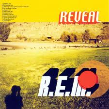

= Reveal
R.E.M.
2001
:toc:

link:../../links.html[Other albums]

== The Lifting

[verse]
____
Grounded 5 a.m.
The nightlite is comforting.
But gravity is holding you.

Once settled into sleep
You have watched on repeat,
The story of your life
Across the ceiling;
And in review,

You've said the air was singing
It's calling you you don't believe
These things you've never seen.

"Good morning, how are you?
The weather's fine, the sky is blue-
It's perfect for our seminar..."

"Now close your eyes,
And start to breathe.
Allow the noise to recede...
...Allow yourself to drift and fly away.
But you just stay.

You've said the air was singing
It's calling you you don't believe
These things you've never seen, never dreamed.

Did you hear these voices calling

Locked into a conference room,
"We're only what our minds assume..."
And rationale is leaving you.

This conceit these systems of belief,
Your counselor agrees,
"You've always mark these boundaries now you're free..."
And with relief.

You've said the air was singing
It's calling you you don't believe
These things you've never seen, never heard, never dreamed.

You said the air was singing
It's calling you you don't believe
These things you've never seen.

Never [x19]

Once you had a dream
Of oceans, and sunken cities
Memories of things you've never known 
____

== I've Been High

[verse]
____
The t
Have you seen?
Have not will travel
Have I missed the big reveal?
Do my eyes,
Do my eyes seem empty?
I've forgotten how this feels.

I've been high
I've climbed so high
The light, sometimes it washes over me.

Have you been?
Have done will travel
I fell down on me knees

Was I wrong?
I don't know, don't answer.
I just needed to believe.

I've been high
I've climbed so high
The light, sometimes it washes over me.

So I dive into a pool.
So cool and deep that if I sink I sink,
And when I swim I fly, so high.

What I want
All I really wanted
Just to live my life on high.

And I know
I know you want the same
I can see it in your eyes.

I've been high
I've climbed so high
The light, sometimes it washes over me.

Washes over me
I close my eyes
So I can see
Make my make believe, believe in me.
____

== All The Way To Reno

[verse]
____
Humming
All the way to Reno
You've dusted the non believers
And challenge the laws of chance
Now, sweet
You were so sugar sweet
You may as well have 'kick me'
Fastened on your sleeve

You know what you are
You're gonna be a star.
You know what you are
You're gonna be a star

Wing
Is written on your feet
Your achilles heel
Is a tendenc
To dream
But you've know that from the beginning
You didn't have to go so far
You didn't have to go.

You know what you are
You're gonna be a star.
You know what you are
You're gonna be a star

You know who you are
You know who you are
You know who you are

Humming
All the way to Reno
You've written your own directions
And whistled the rules of change.

You know what you are
You're gonna be a star (star)
You know what you are,
You're gonna be a star (star)
You know what you are,
You're gonna be a star (star)
You know what you are,
You're gonna be a star (star)

Humming
All the way to Reno
All the way to Reno
All the way to Reno
You're gonna be a star, you are
You're gonna be a star
You're gonna be a star, you are
You're gonna be a star
____

== She Just Wants To Be

[verse]
____
It's not that she walked away
Her world got smaller
All the usual places
The same destinations
Only something's changed.

It's not that she wasn't rewarded
With pomegranate afternoons
And Mingus, Chet Baker and chess
It's not stampede and fortune
Of prim affectations
She's off on a riot(?)
And she knows now
Is greater than the whole
Of the past
Is greater and now she knows

She just wants to be somewhere
She just wants to be.
She just wants to be somewhere
She just wants to be.

It's not that the transparency
Of her earlier incarnations
Now looked back on
Were rich and loaded
With beautiful vulnerability
But now she knows
Now is greater
And she knows that.

She just wants to be somewhere
She just wants to be
She just wants to be somewhere
She just wants to be.

Now is greater
Now is greater
And she knows that.

She just wants to be somewhere
She just wants to be.
She just wants to be somewhere
She just wants to be.

She just wants to be somewhere
She just wants to be.
She just wants to be somewhere
She just wants to be.

It's not like if angels
Could truly look down
Stir up the trappings
A light on the ground
Remind us of what, when, why or who
The how's up to us
Me and you
And now is greater than the whole
Of the past
Is greater and now she knows that.

Now she knows. 
____

== Disappear

[verse]
____
I dragged my feet across a seat
Jumped out the passenger side
The only thing worth looking for
Is what you find inside

But that had not yet appeared
Lost invisible here.

Tel Aviv and Agadir
Tone deaf for almost

Before I learned to see
The vanishing point appeared.

I looked for you everywhere
I looked for you everywhere.

There is a calm I haven't come to yet
I spent half my life figuring what comes next
I telescoped in I finally win
I finally win the prize

That now eyes see comets perfect timing squeeze
Head first fighting everything
The crushing force of memory
Erasing all I've been
The vanishing point appeared.

I looked for you everywhere.
I looked for you everywhere.
Tell me why you're here.
I came to disappear.

Look at this face
Can you believe it?
Am I living in the beautiful vacuum?
Because I can't see it
The vanishing point appears.

I looked for you everywhere.
I looked for you everywhere.
Tell me why you're here.
I came to disappear.
Tell me why you're here.
I came to disappear.
I came to disappear.
____

== Saturn Return

[verse]
____
Easy to poke yourself square in the eye
Harder to like yourself, harder to try

These are espouses
Postcards and neoprene
Roses a dollar a stem
Everyone sleeping or pulling the long haul and
Keys/caves(?) in the cooler it's three A.M.
And saturn is beckoning no-one
It's offering up.

Late shift convenience store, burn out the lights
Telescope roof towards the north-western sky
You pulled the ladder and no-ones the wiser
You find your sights and discover

Saturn is orbiting nothing
He's off on its own,
He's breaking from home.

Harder to look yourself square in the eye
Easy to take off...

You found the ladder in the pattern of your wrist
You've seen and you've marked horizions
Mother was difficult, she made you cry
Cover the mirror, look to the sky

You climb into your rocket ship trying
Lift up and hold out your hands.

Saturn is orbiting nothing
He's off on its own
He's breaking from home

Saturn is orbiting nothing
He's off on its own
He's breaking from home

Saturn returns when you chased down, it slows
Throw them into a new gravity

Harder to look yourself square in the eye
Easy to poke yourself, easy as pie
Easy to take off, harder to fly
Harder to wake Galileo. 
____

== Beat A Drum

[verse]
____
The sun reflected in
The back of my eye.
I knocked my head against the sky.

The dragonflies are busy buzzing me.
A seahorse as if we were in the sea.

Half way from coal
Half way from diamond.
My fall knocked a mean chip out of me.
Gathering as far as I can reach.
Perched up on a precipice
And this is what I've seen.

This is all I want,
It's all I need.
This is all I am.
This is all I want,
It's all I need.

A bluejay hectors from the felled Catalpa tree.
Doctorate in science and a theologians dream

The dragonflies are trying to lecture me.
The seahorses as if we were in the sea.

But this is all I want,
It's all I need.
This is all I am,
It's everything.
This is all I want,
It's all I need.

Beat a drum for me
Like a butterfly wing.
Tropical storm across the ocean.

But don't explain I'm sure I'll want to know
Don't forget we're just half way from coal.

This is all I want,
It's all I need.
This is all I am,
It's everything.
This is all I want,
It's all I need. 
____

== Imitation Of Life

[verse]
____
Charades, pop skill
Water hyacinth, named by a poet
Imitation of life
Like a koi in a frozen pond
Like a goldfish in a bowl
I don't want to hear you cry

That's sugarcane that tasted good
That's cinnamon, that's Hollywood
C'mon, c'mon no one can see you try

You want the greatest thing
The greatest thing since bread came sliced
You've got it all, you've got it sized
Like a Friday fashion show teenager
Freezing in the corner
Trying to look like you don't try

That's sugarcane that tasted good
That's cinnamon, that's Hollywood
C'mon, c'mon no one can see you try

No one can see you cry

That sugar cane that tasted good
That freezing rain, that's what you could
C'mon, c'mon on no one can see you cry

This sugarcane
This lemonade
This hurricane, I'm not afraid
C'mon, c'mon no one can see me cry

This lightning storm
This tidal wave
This avalanche, I'm not afraid
C'mon, c'mon no one can see me cry

That sugar cane that tasted good
That's who you are, that's what you could
C'mon, c'mon on no one can see you cry

That sugar cane that tasted good
That's who you are, that's what you could
C'mon, c'mon on no one can see you cry 
____

== Summer Turns To High

[verse]
____
Mercury is rising still
Turn the fan on high

I won't step on my own shadow
No-one wants to cry

Someone put a pox on me
I spit in their eyes
Summer turns to high

Lift my bed sheet keep in sandles
Circle search and there are candles
Summer's here but night is raising hopes and dragonflies

If those hopes are overshadowed by cotton-candy, caramel-wafer

Summer turns to high
Summer turns to high
Summer turns to high
Summer high

After wine and nectarines the fireflies in turn
Move like syrup through the evening with the sweet reign

I won't fight for can't happen
I'm preoccupied

Summer turns to high
Summer turns to high
Summer turns to high
Summer high 
____

== Chorus And The Ring

[verse]
____
Hey there now young Willy
Swing alone, quote the scriptures
Keep them guessing which bed you crawled from
Justify, just deny
Was it fun?
Your time has come
What have you done?
What have you done?

That's when the insults start to sting
You can't remember anything
The chorus chiming
Every chorus the machine of god
Is singin'.

It's the poison that it measures
Brings illuminating vision
It's the knowing with a wink
That we expect in Southern women
It's the wolf that knows which sheep to dip to save itself
It's the octopus that crawled back to the sea.

That's when the insults start to sting
You can't remember anything
The chorus chiming
Every chorus the machine of god
Hey.....

Hammered shooting plywood in the backyard
Laughin' 'cause the racket makes the blackbird sing
Like the holy terror
Suck the marrow from the bone
Singe, you're always burning books
You got the chorus and the ring

That's when the insults start to sting
You can't remember anything
The chorus chiming
Every chorus the machine sings.

That's when the insults start to sting
You can't remember anything
The chorus chiming
Every chorus the machine sings.

That's when the calibration brittle
As a stick hits you, the gold ring and the time museum
Cheaper than a link of gold rings
Gold ring.

Sing, sing, sing, sing. 
____

== I'll Take The Rain

[verse]
____
The rain came down
The rain came down
The rain came down on me.

The wind blew strong
The summer song
Fades to memory

I knew you when
I loved you then
The summer's young and helpless.

You laid me bare
You marked me there
The promises we made.

I used to think
As birds take wing
They sing through life so why can't we?
You cling to this
You claim the best
If this is what you're offering
I'll take the rain
I'll take the rain
I'll take the rain.

The nighttime creases
Summer schemes
And stretches out to stay.
The sun shines down
You came around
You love easy days.

But now the sun,
The winter's come.
I wanted just to say
That if I hold
I'd hope you'd fold Open up inside, inside of me.

I used to think
As birds take wing
They sing through life so why can't we?
You cling to this
You claim the best
If this is what you're offering
I'll take the rain
I'll take the rain
I'll take the rain.

This winter song
I'll sing along
I've searched its still refrain
I'll walk alone
I've given this, take wing
Celebrate the rain.

I used to think
As birds take wing
They sing through life so why can't we?
You cling to this
You claim the best
If this is what you're offering
I'll take the rain
I'll take the rain
I'll take the rain. 
____