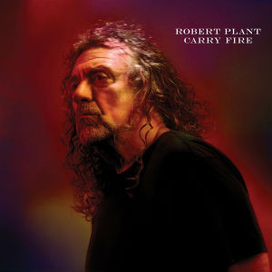

= Carry Fire
Robert Plant
2017
:toc:

From https://www.azlyrics.com/r/robertplant.html

++++
 
++++	

== The May Queen

[verse]
____
Lay down in sweet surrender
Your love so warm and tender

Oh, sweet surrender, now
So warm and tender, now

Oh-oh-oh
Ohhh

Inside my waves are breaking
Oh! Light of my salvation

Oh, my waves are breaking now
Ooh, sweet salvation now

Oh-oh-oh
Ohhh

I'm seeking love and glory just like I always do
The bosom of the freedom I very rarely choose

Out here the fire's still burning
So long into my night...
Still captive and still yearning
Surrender to your light...

A heart that never falters
A love that never dies
I linger in the shadows
The dimming of my light...

(Oh!)

The dimming of my light...
The dimming of my light...
The dimming of my light...
The dimming of my light...
____

== New World...

[verse]
____
With songs we praise a happy landing
On yet another virgin shore
Escape the old world
Embrace the new world
Out here the immigrant takes all

Across the planes and over mountains
Put plight to all who came before
They’re barely human
It’s time to move them
To let them kneel before the sword

Ohh, ohh, ohh
Ohh, ohh, ohh

Uneducate the noble savage
The great white father’s word is law
Subjugate them to liberate them
The poison pen the bloody sword

Ohh, ohh, ohh
Ohh, ohh, ohh

Ohh ohh, uh uh uh, Ohh ohh
Ohh ohh, uh uh uh, Ohh ohh
Ohh ohh, uh uh uh, Ohh ohh
____

== Season's Song

[verse]
____
Oh my love
What is there left to do
The youth that slept inside me
Went away when I found you

Oh my love
What is there to be done
My certain hell escape me
My mother’s on the run

Oh my love
Oh my love

The nights grow long
The snow up on the hill
A kiss up on your lips
I summon so farewell

No time my love
No dirty summer wave
You’re still my pretty songbird
No longer for me sing

Oh my love
Oh my love

Fall on me
Crazy Love
Oh-oh

(Ah-ah-ah-ah
Ah-ah-ah-ah)
Oh season time
Oh season time
(Ah-ah-ah-ah
Ah-ah-ah-ah)
Oh season time
Oh season time

To dream my love
The desert in my soul
I’ll piece alongside the wayside
On the solitary road

Oh my love
When all is said and done
I hear the sounds of heaven
In your wondrous season’s song

Oh my love
Oh my love

Oh crazy, crazy love
Fall on me faded love
(Ah-ah-ah-ah
Ah-ah-ah-ah)
My love, my love
Oh my crazy love
(Ah-ah-ah-ah
Ah-ah-ah-ah)
Crazy Love
(Ah-ah-ah-ah
Ah-ah-ah-ah)
____

== Dance With You Tonight

[verse]
____
And now the carnival is over
Someone turned out the light
Our fields of plenty filled with clover
So long ago and out of sight
This little light that keeps on shining
All through the darkness through the night
That ever more will keep reminding
The road is long the flame is bright

And if there's one more time I can dance with you
Let me dance with you tonight
Maybe the last chance our hearts
Will dance into the lovers night

Out in the land of never ending
The rich parade the roar of life
We shared a world forever changing
Through dancing days and wondrous nights
I offered up the secret places
Reveal the magic of the land
All bound by blood and lipstick traces
Till time conspired to steal our crown

And if there's one more time I can dance with you
Let me dance with you tonight
Maybe the last chance our hearts
Will dance into the lovers night

And if there's one more time I can dance with you
Let me dance with you tonight
Maybe the last chance our hearts
Will dance into the lovers night

Come on and dance another mile
Come on and wear your late, late smile
The flame still burning bright
Across the days. Across the years

If there's one more, only one more
Only one more night
Come, come, come on and dance with
Me baby make me feel alright

If there's one more, only one more
Only one more night
Come, come, come on and dance with
Me baby make me feel alright
____

== Carving Up The World Again... A Wall And Not A Fence

[verse]
____
The Russians, the Americans, the British and the French
They're carving up the world again, it's getting kind of tense
A whole lotta posture and very little sense
It's no surprise they hide behind a wall and not a fence

The Irish and the English and the Scottish and the Welsh
A damp and misty history they keep it to themselves
All lost in dark antiquity and smouldering descent
Invisible divisions "behind a wall and not a fence"

Trouble at the border. In the eleventh hour
Ditch and wire and palisade in the line of fire
Call up the cavalry and double up the guard
Preparing for catastrophe inside the house of cards

In China they got worried they built themselves a wall
They built it big and long and tall. To keep away the hoard
A hundred years of blood and toil. A million lives expend
The steely grip of dynasty "behind a wall and not a fence"

Trouble at the border. In the eleventh hour
Ditch and wire and palisade in the line of fire
Call up the cavalry and double up the guard
Preparing for catastrophe inside the house of cards

Trouble at the border. In the eleventh hour
Ditch and wire and palisade in the line of fire
Call up the cavalry and double up the guard
Preparing for catastrophe inside the house of cards

Emperors and Sultans, Kings and Presidents
Dictators and ambassadors engaged in our defence
A lifetime of great service, of selfless good intent
Guaranteed immunity "behind a wall and not a fence"

Trouble at the border. In the eleventh hour
Ditch and wire and palisade in the line of fire
Call up the cavalry and double up the guard
Preparing for catastrophe inside the house of cards

Trouble at the border. In the eleventh hour
Ditch and wire and palisade in the line of fire
Call up the cavalry and double up the guard
Preparing for catastrophe inside the house of cards
____

== A Way With Words

[verse]
____
Leave me here alone
For just as long as it takes
The seasons turn
Waiting for the weather to break
Blowing up a storm now
Many times I fell from grace
The seasons turn
Once again our world will change

Reaching out to find you
I put it all behind you
I'm back again, I know
Across the miles I find you
I put it all behind you
I'm back again, I know

Coming from the cold
Reaching for your sweet embrace
The seasons turn
Hit beyond your world I wait
Is your heart still warm?
A little flame, a special place
The seasons turn
And once again our world will change

Reaching out to find you
Put it all behind you
I'm back again, I know
Crossing miles to find you
Put it all behind you
I'm back again, I know

All we built but falling down
Holding you and hit the ground
I know
Blaming tears, the lonesome sound
Hopes and tears will burn the ground
I know

Reaching out to find you
I put it all behind you
I'm back again, I know
Across the miles I find you
I put it all behind you
I'm back again, back again
I've...

I'm reaching out to find you
I put it all behind you
'Cause I'm back, I'm back, I'm back, I'm back, I'm back

Reaching out to find you
I put it all behind you
I'm back again, I know
Back again, I know

(Mmmm, Mmmm, mmmm)
(Mmmm, Mmmm, mmmm)
____

== Carry Fire

[verse]
____
I sit and wait for you
Like so many others do
Just like they do for me
Well so I do for you

I'd carry fire for you
Here in my naked hands
I'd bare my heart to you
If you will understand

I was a stranger there
Inside your promised land
That turned me inside out
And turned me upside down

I'd carry fire for you
Here in my naked hands
I'd bare my heart to you
If you will understand

Just like
Just like
Just like I scarred you
Just like
Just like
Just like I scarred you

I'm reaching out for you
Across the broken gate
I feel the gathering years
Beyond these lonely wastes

I'd carry fire for you
Here in my naked hands
I'd bare my heart to you
If you will understand

Just like
Just like
Just like I scarred you
Just like
Just like
Just like I scarred you
____

== Bones Of Saints

[verse]
____
They're loading up in the ships
They're loading up in the planes
There's madness in the sky
Above the bones of saints

So much of me is broken
The servants of a lie
Now everything is burning
There's a fire up in the sky

And I said, no no no no no no no no no

We're up against the bench
While all the walls fall down
I hear the children scream
But then the fear abound

And that's the leading question
Where all the money comes
I'll say who makes the bullets
If you tell me who sells the guns

And I said, no no no no no no no no no
No no no no no no no no no

In the Garden of Eden
And the wheels go round and round
The sight of an angel
When the best fair deals come down

In the Garden of Eden
And the wheels go round and round
The sight of an angel
When the best fair deals come down

No no no no no no no no no
No no no no no no no no no

No...
No...
No...
No...
____

== Keep It Hid

[verse]
____
What you gonna do when it's cold outside?
And who'll keep you warm when the sun won't shine?
And who you gonna call when the day is done?
And who you gonna rock when your man has gone?

Now baby take the wine from the loving cup
Mamma, take your time, don't you spill a drop
Fine little mamma, let me be your kid
Keep it to yourself, baby keep it hid
To yourself, baby keep it hid
Keep it to yourself, baby keep it hid
To yourself, baby keep it hid

Baby takes her time, likes to walk by the sea
She's got some trouble in mind, life in a minor key
At the end of the world when the sun comes up
There's a silver key and a golden cup
Silver key and a golden cup
Silver key and a golden cup
Silver key and a golden cup

Silver key and a golden cup
Silver key and a golden cup
____

== Bluebirds Over The Mountain

[verse]
____
Bluebirds over the mountain, seagulls over the sea
Bluebirds over the mountain, bring my baby back to me

Boy and girl they fell in love, each was like the hands above
He looked in the eyes of blue, she vowed to him that she'd be true

Bluebirds over the mountain, seagulls over the sea
Bluebirds over the mountain, bring my baby back to me

(Well, well, well, well)

I miss you, oh, can't you see? You're the only one for me
Since you've gone, I'm all alone, c'mon, baby, come back home

Bluebirds over the mountain, seagulls over the sea
Bluebirds over the mountain, come on and bring my baby back to me
Bring my baby back to me
Bring my baby...

Bring her back to me
Bring her back to me
Bring her back to me
____

== Heaven Sent

[verse]
____
There's an angel at the gate singing
A stolen kiss, a fall from grace, singing out
He's heaven sent, he feeds the flame of everlasting love

His empire falls, his spell will break
Once cast aside, his song awakes
He's heaven sent, he rides the waves of freedom's golden flood

Now shadows fall, the hour is late
Still hear your song, but time won't wait
Once heaven sent above the world
The eagle and the dove

All that's worth the doing
Is seldom easy done
All that's worth the winning
Is never easy won
All the long goodbyes
All the goodbye songs
All the love for giving
Never really gone

All that's worth the doing
Is seldom easy done
All that's worth the winning
Is never easy won
All the long goodbyes
All the goodbye songs
Spend the time forgiving
Never really done

Never really done
____
