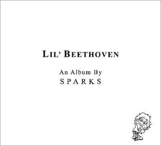

= Lil' Beethoven
Sparks
2002
:toc:

From https://www.azlyrics.com/s/sparks.html

++++
 
++++

== The Rhythm Thief

[verse]
____  
I am the rhythm thief
Say goodbye to the beat
I am the rhythm thief
Auf wiedersehen to the beat

Oh no, where did the groove go, where did the groove go, where did the groove go?
Lights out, Ibiza
Where did the groove go, where did the groove go, where did the groove go?

You'll never get it back, you'll never get it back,
The rhythm thief has got it and you'll never get it back
You'll never get it back, you'll never get it back,
The rhythm thief has got it and you'll never get it back
You'll never get it back, you'll never get it back,
The rhythm thief has got it and you'll never get it back

Lights out, Ibiza
I am the rhythm thief
Goodbye, goodbye, goodbye 
____  

== How do I Get to Carnegie Hall!

[verse]
____  
How do I get to Carnegie Hall?
How do I get to Carnegie Hall?
How do I get to Carnegie Hall?

Practice, man, practice
Practice, man, practice
Practice, man, practice
Practice, man, practice

How do I get to Carnegie Hall?
Practice, man, practice
How do I get to Carnegie Hall?
Practice, man, practice
To get yourself to Carnegie Hall
Practice, man, practice
Carnegie Hall, Carnegie Hall

Technical facility,
Old-word sensibility
All of this I did for you
Still there is no sign of you

I practiced, I practiced
Carnegie Hall was beckoning
I practiced, I practiced
Carnegie Hall was beckoning
I was ready, I was ready
Carnegie Hall was beckoning
Still there is no sign of you, still there is no sign of you

Steinway, Steinway, Steinway, Steinway,

How do I get to Carnegie Hall?
Practice, man, practice
How do I get to Carnegie Hall?
Practice, man, practice
To get yourself to Carnegie Hall
Practice man, practice
Carnegie Hall, Carnegie Hall

Practice on the Steinway,
Practice on the Steinway,
Practice on the Steinway,

They loved it, they showed it
The audience was deafening
I was ready, I was ready
The critics all said, "riveting"
On the Steinway, on the Steinway
I guess it doesn't mean a thing
Still there is no sign of you,
Still there is no sign of you

How do I get to Carnegie Hall?
Practice man, practice

How do I get to Carnegie Hall?
Practice, man, practice
How do I get to Carnegie Hall?
Practice man, practice

Still there is no sign of you.
____  

== What are All These Bands so Angry about!

[verse]
____  
Hey everybody, what do you say
Someone's stolen our spotlight, Ray
Hey everybody, what do you say
What are all these bands so angry about?

Hey everybody, what do you know
Something's stolen our thunder, Joe
Hey everybody, what do you know
What are all these bands so angry about?

Hey everybody, what do you know
Something's stolen our thunder, Joe
Hey everybody, what do you know
What are all these bands so angry about?

Hey everybody, what can we do?
Crank it up just a notch or two?
Hey, everybody, what can we do?
What are all these bands so angry about?

Hey everybody, they called our bluff
Our profane ain't profane enough
Hey everybody, they called our bluff
What are all these bands so angry about?

Hey everybody what do you say
Someone's bounced us from center stage

Some might have done it, but not today
Beethoven, Coltrane, or Lady Day
Some might have done it, but not today
What with all these things besieging us now

Some might have done it, broken on through
Wagner, Tatum, or Howlin' Wolf
Some might have done what we'll never do
What are all these bands so angry about?

Hey everybody, what do you know
Something's stolen our thunder, Joe
Hey everybody, what do you know
What are all these bands so angry about? 
____  

== I Married Myself

[verse]
____  
I married myself
I'm very happy together
I married myself
I'm very happy together

I married myself
I'm very happy together
Long, long walks on the beach, lovely times
I married myself, I'm very happy together
Candlelight dinners home, lovely times

This time it's gonna last, this time it's gonna last
Forever, forever, forever

I married myself
I'm very happy together
I married myself
I'm very happy together

This time it's gonna last, this time it's gonna last
Forever, forever, forever
This time it's gonna last, this time it's gonna last
Forever, forever, forever

I married myself
I'm very happy together
Long, long walks on the beach, lovely times
I married myself, I'm very happy together
Candlelight dinners home, lovely times

This time it's gonna last, this time it's gonna last
Forever, forever, forever
This time it's gonna last, this time it's gonna last
Forever, forever, forever 
____  

== Ride 'Em Cowboy

[verse]
____  
They laughed with me
Then laughed at me
They said "how true"
They said "not you"
They thought how wise
Then thought goodbye
Your hit your stride
Then Mr. Hyde
(Ride 'em cowboy, ride 'em)
They laughed with me
Then laughed at me
They said "how true"
They said "not you"
They thought how wise
Then thought goodbye
Your hit your stride
Then Mr. Hyde
Ride 'em
I got thrown again
Ride 'em
Get back on again

I swam, I sank
Top seed, unranked
The pole, the wall
The pride, the fall
A state of grace
Slapped in the face
A state of mind
Then card declined

From great to good
From good to fair
To barely pass
Stay after class

I'm hot I'm cold
I'm bought, I'm sold
First accolades
Then hand grenades
They hate your look
They hate your book
They hate your guts
You've heard enough
It's not your day
It's not your week
It's not your month
It's not your year

First AOK
Then IOU
BMOC
Then MIA
From DIY
To DUI
From 411
To 911
Ride 'em cowboy, ride 'em
Ride 'em cowboy, ride 'em

First AOK
Then IOU
BMOC
Then MIA
From DIY
To DUI
From 411
To 911

From soup to nuts
From job to cuts
From sure to chance
From can to can'ts
From smart to dumb
From bread to crumbs
From wowed to bored
Ole, then gored
Ride 'em cowboy, ride 'em
I got thrown again
Ride 'em cowboy, ride 'em
Get back on again

From just desserts
To just desserts
From you're for me
To ca suffit
From bon vivant
To sycophant
From open door
To merde alors
From just desserts
To just desserts
From you're for me
To ca suffit
From bon vivant
To sycophant
From open door
To merde alors
Ride 'em cowboy, ride 'em

I got thrown again
Ride 'em cowboy, ride 'em
Get back on again
Ride 'em Cowboy
Ride 'em cowboy 
____  

== My Baby's Taking Me Home

[verse]
____  
Home, my baby's taking me home
My baby's taking me home
My baby's taking me home
My baby's taking me home
My baby's taking me home

As we walk through the morning rain
And the skies are clearing
And the streets are glistening
Streets named for New England trees
A rainbow forms
But we're both colorblind
But we can hear what others can't hear
We can hear the sound of a chorus singing

Home, my baby's taking me home
My baby's taking me home
My baby's taking me home
My baby's taking me home
My baby's taking me home
____  

== Your Call's Very Important to Us. Please Hold...

[verse]
____  
Please hold. Please hold. Please hold. Please hold.
I'm getting mixed signals, mixed signals, mixed signals, mixed signals

At first she said, "your call is very important to us."
And then she said, "please hold, please hold".
Then she said, "your call is very important to us"
And then she said, "please hold, please hold"

At first she said, "your call is very important to us."
And then she said, "please hold, please hold".
Then she said, "your call is very important to us"
And then she said, "please hold, please hold"

At first she said your call was very important to us
And then she said please, please hold
At first she said your call was very important to us
And then she said please, please hold, please hold

Green, green light, red light
Green, green light, red light
At first she said, 'green light'
And then she said, 'red light'

At first she said, "your call is very important to us."
And then she said, "please hold, please hold".
Then she said, "your call is very important to us"
And then she said, "please hold, please hold"

Green, green light, red light
Green, green light, red light

At first she said, "your call is very important to us."
And then she said, "please hold, please hold".
Then she said, "your call is very important to us"
And then she said, "please hold, please hold"

At first she said, "your call is very important to us."
And then she said, "please hold, please hold".
Then she said, "your call is very important to us"
And then she said, "please hold, please hold"

I'm getting mixed signals, mixed signals. 
____  

== Ugly Guys with Beautiful Girls

[verse]
____  
Ugly guys with beautiful girls
You always know what the story is
Beautiful girls with ugly guys
What do they take us for anyway?
Ugly guys, with beautiful girls
Ugly guys with beautiful girls
As they walk down the street arm in arm
I see them
And once again feel the need to ask myself the question
The question that has weighed heavily on me of late
How is it possible that a guy and a girl
So dissimilar in physical appearance,
There being such a disparity in how attractive each is,
Be nonetheless in what would appear to be a relationship?

It ain't done with smoke and mirrors
It ain't done with smoke and mirrors
It ain't done with smoke and mirrors
Ugly guys with beautiful girls
Ugly guys with beautiful girls
Ugly guys with beautiful girls

How do we explain this?
An attraction of opposites?
No, that theory has been refuted
By many experts in the fields of human psychology
A much greater attraction seems to come
from one more similar to oneself
Personality perhaps?
Without intending to sound judgmental
That he doesn't look like
What was once called "live wire" or "the life of the party"
He appears rather expressionless.
His movements are stiff and even awkward
Perhaps he's a person of some intellect
An expert in science
The arts, political theory?
No, I think not.
See how well tailored his clothes are
How well cut his hair is

It ain't done with smoke and mirrors
It ain't done with smoke and mirrors
It ain't done with smoke and mirrors
Ugly guys with beautiful girls
Ugly guys with beautiful girls
Ugly guys with beautiful girls

I must confess to you, my listeners
That I have been a little less than honest
In pretending I had no answers to my previous questions
You see, I lost someone very dear to me
Someone very beautiful
To someone much like him
Ah, you ask, surely there must have been other areas
Where you were deficient and he was not
No, I don't believe so
My shortcomings were of an economic nature
He was rich, I was not
You see, I underestimated the appeal to her of things
Imported things on wheels
Large things with manicured lawns and
Olympic swimming pools
Things to wear around her neck that would
Glisten in the night light
Things!

Still I am not bitter
Rather, I am an observer
Who saw first hand how life may not be fair
Would things have turned out differently
Between me and her
Had I moved the corporate ladder quicker
Been born of more noble stock
Or done better on one of our journeys to Las Vegas?

Perhaps.
In fact, I am certain of it.
Things would have turned out differently
Between me and her
I know this now

It ain't done with smoke and mirrors
Ugly guys with beautiful girls
You always know what the story is
____  

== Suburban Homeboy

[verse]
____  
I am a suburban homeboy with a suburban 'ho right by my side
I am a suburban homeboy and I say yo dog to my pool cleaning guy
I hope I'm baggy enough for them
I play my Shaggy enough for them
I'll pop a cap up some fool at the Gap
'Cause I'm a suburban homeboy

I am a suburban homeboy with a suburban ho right by my side
I am a suburban homeboy and I say yo' dog to my detailing guy
I bought me cornrows on Amazon
I started listening to Farrakhan
My caddy and me he looks just like Jay-Z
And I'm a suburban homeboy

I am a suburban homeboy with a suburban ho right by my side
She's known as Miss Missy Tannenbaum and she's one freak bitch, ain't no lie
She's from the projects in St. Tropez
She looks like Iverson in a way
She yo yo's me and I yo yo her back
And I'm a suburban homeboy
She yo yo's me and I yo yo her back
And I'm a suburban homeboy
She yo yo's me and I yo yo her back
And I'm a suburban homeboy

We are suburban homeboys
With our suburban ho's right by our sides
We are suburban homeboys and we say yo dog and we mean it, by God
We've got an old school mentality
Oxford and Cambridge mentality
Props to our peeps and please keep your receipts
And we are suburban homeboys
Props to our peeps and please keep your receipts
And we are suburban homeboys
Props to our peeps and please keep your receipts
And we are suburban homeboys
Props to our peeps and please keep your receipts
And we are suburban homeboys 
____  
