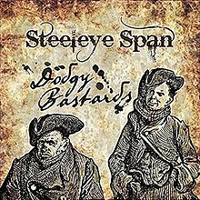

= Dodgy Bastards
Steeleye Span
2016
:toc:

link:../../links.html[Other albums]

== Cruel Brother

[verse]
____
Flowers that weep in the valley

The harp, the lute, the fife, the flute and the cymbal
Sweet goes the treble violin
Flowers that weep in the valley.

There was a man came over the sea,
This man was clad in red
And he has courted a fair lady,
He asked if she would him wed
He asked if she would him wed.

"And have you asked my father dear?
Have you asked my sister Ann?
Likewise the one that did me bear
And also my brother John,
Have you asked my brother John?"

The harp, the lute, the fife, the flute and the cymbal
Sweet goes the treble violin
Flowers that weep in the valley. x 2

"Yes, I have asked your father dear
And I have asked your sister Ann,
Likewise the one that did thee bear,
But not your brother John,
I've not asked your brother John."

Her father led her through the hall,
Her sister led her through the closs,
Her mother danced before them all,
Her brother set her on her horse,
John set her on her horse.

The harp, the lute, the fife, the flute and the cymbal
Sweet goes the treble violin
Flowers that weep in the valley.

She leaned over the saddle-bow
To give him a kiss before she goes
- Sweet goes the treble violin -
He's taken a knife both long and sharp
And stabbed that bonny bride to the heart
- Sweet goes the treble violin -
She had not ridden through half the town
'Till her heart's blood has stained the gown
- Sweet goes the treble violin -

"Lead me gently up yon hill,
And there I'll sit and make my will"
- Sweet goes the treble violin -

"What will you leave your father dear?"
"The silver-shod steed that brought me here."
"What will you leave your mother dear?"
"My wedding shift that I do wear,
But she must wash it very clean
For my heart's blood sticks in every seam."
"What will you give your sister Ann?"
"My silken snood and my feather fan."
"What will you give your brother John?"
"A rope and gallows to hang him on."
"What will you leave your brother's wife?"
"A widow's weeds and a quiet life..."

Flowers that weep in the valley

The harp, the lute, the fife, the flute and the cymbal
Sweet goes the treble violin
Flowers that weep in the valley.

The harp, the lute, the fife, the flute and the cymbal
Sweet goes the treble violin
Flowers that weep in the valley.
Flowers that weep in the valley.
Flowers that weep in the valley.
____

== All Things Are Quite Silent

Williams-Traditional

[verse]
____
All things are quite silent, each mortal at rest,
When me and my true love got snug in one nest,
When a bold set of ruffians broke into our cave,
And they forced my dear jewel to plough the salt wave.

I begged hard for my darling as I would for my life.
They'd not listen to me although a fond wife,
Saying: "The king must have sailors, to the seas he must go,"
And they've left me lamenting in sorrow and woe.

Through green fields and meadows we ofttimes have walked,
And the fond recollections together have talked,
Where the lark and the blackbird so sweetly did sing,
And the lovely thrushes' voices made the valleys to ring.

Now although I'm forsaken I won't be be cast down.
Who knows but my true love some day may return?
And will make me amends For all trouble and strife,
And me and my true love might live happy for life.
____

== Johnny Armstrong 

[verse]
____
Sum speiks of lords, sum speiks of lairds,
And siclyke men of hie degrie;
Of a gentleman I sing a sang,
Sumtyme calld Laird of Giluockie.

The king he wrytes a laving letter,
With his ain hand see tenderly:
 And he hath sent it to Johnnie Armstrang,
To cum and speik with him speidily.

The Eliots and Armstrangs did convene,
They were a gallant company:
'We'ill ryde and meit our lawful king,
And bring him safe to Gilnockiel'

'Make kinnen.footnote:[oxen] and capon ready, then,
And venison in great plenty;
We'ill welcome hame our royal king;
I hope he'ill dyne at Gilnockiel'

They ran their horse on the Langum howm.footnote:[low flat ground by river]
And brake their speirs with mekle main;
The ladys lukit free their loft-windows,
'God bring our men weil back again!'

When Johnnie came before the king,
With all his men see brave to see,
The King he movit his bonnet to him;
 He weind he was a king as well as he.

'May I find grace, my sovereign liege,
Grace for my loyal men and me?
For my name it is Johnnie Armstrang,
And subject of yours, my liege,' said he.

'Away, away, thou traytor, strang!
Out of my sicht thou mayst sune be!
I grantit nevir a traytors lyfe,
And now I'll not begin with thee.'

"Grant me my lyfe, my liege, my king,
And a bony gift I will give to thee:
Full four-and-twenty milk-whyt  steids.
Were a' foald in a yeir to me.

'I'll gie thee all these milk-whyt steids,
that prance and nicher at a speir,
With as mekle gude Inglis gilt
As four of their braid backs dow beir.'

'Away, away, thou traytor strang!
Out o' my sicht thou mayst sune be!
I grantit nevir a traytors Iyfe,
And now I'll not begin with thee.'

'Grant me my lyfe, my liege, my king,
And a bony gift I'll gie to thee;
Gude four-and-twenty ganging mills,
That gang throw a' the yeir to me.

'These four-and-twenty mills complete
Sall gang for thee throw all the yeir,
And as mekle of gude reid wheit
As all their trappers dow to bear.'

'Away, away, thou traytor, strang!
Out of my sicht thou mayst sune be!
I grantit nevir a traytors lyfe,
And now I'll not begin with thee.'

'Grant me my lyfe, my liege, my king,
And a great gift I'll gie to thee;
Bauld four-and-twenty sisters sons,
Sall for the fecht, tho all  sould flee.'

'Away, away, thou traytor, strang!
Out of my sicht thou mayst sune be!
I grantit nevir a traytors lyfe,
And now I'll not begin with thee.'

'Grant me my lyfe, my liege, my king,
And a brave gift I'll gie to thee;
All betwene heir and Newcastle town
Sall pay chair yeirly rent to thee.'

Away, away, thou traytor, strang!
Out of my sicht thou mayst sune be!
I grantit nevir a traytors lyfe,
And now I'll not begin with thee.'

'Ye lied, ye lied, now, king,' he says,
'Althocht a king and prince ye be,
For I luid naithing in all my lyfe,
I dare well say it, but honesty;

'But a fat horse, and a fair woman,
Twa bony dogs to kill a deir:
But Ingland suld half found me meil and malt,
Gif I had livd this hundred yeir!

'Scho suld half found me meil and malt,
And beif and mutton in all plentie;
But neir a Scots wyfe could half said
That eir I skaithd her a pure flie..footnote:[I did her a fly's worth of harm]

'To seik het water beneth cauld yce,
Surely it is a great folie;
I half asked grace at a graceless face,
But there is nane for my men and me.

'But had I kend, or I came free hame,
How thou unkynd wadst bene to me,
I wad half kept the border-syde,
In spyte of all they force and thee.

'Wist Englands king that I was tane,
O gin a blyth man wald he be!
For anes I slew his sisters son,
And on his breist-bane brak a tree.'

John wore a girdle about his midle,
Imbroidered owre with burning gold,
Bespangled with the same mettle,
Maist beautiful! was to behold.

Ther hang nine targets at Johnnies hat,
And ilk an worth three hundred pound:
'What wants that knave that a king suld haif,
But the sword of honour and the crown!

'O whair get thou these targets, Johnnie,
That blink see brawly abune thy brie?'
'I get them in the field fechting,
Wher, cruel king, thou durst not be.

'Had I my horse, and my harness gude,
And ryding as I wont to be,
It sould half bene tald this hundred yeir
The meiting of my king and me.

'God be withee, Kirsty, my brither,
Lang live thou Laird of Mangertoun!
Lang mayst thou live on the border-syde
Or thou se thy brither ryde up and doun.

'And God be withee, Kirsty, my son,
Whair thou sits on thy nurses knee!
But and thou live this hundred yeir,
Thy fathers better thoult never be.

'Farweil, my bonny Gilnock-Hall,
Whair on Esk-syde thou standest stout!
Gif I had lived but seven yeirs mair,
I wad haff gilt thee round about.'

John murdred was at Carlinrigg,
And all his galant companie,
But Scotlands heart was never sae wae,
To see sae mony brave men die.

Because they savd their country deir
Frae Englishmen; nane were sae bauld,
Whyle Johnnie livd on the border-syde,
Nane of them durst cum neir his hald.
____

== Boys of Bedlam

[verse]
____
For to see mad Tom of Bedlam
Ten thousand miles I'd travel
Mad Maudlin goes on dirty toes

For to save her shoes from gravel

Still I sing bonnie boys, bonnie mad boys
Bedlam boys are bonnie,
For they all go bare and they live by the air
And they want no drink nor money

I went down to Satan's kitchen
For to get me food one morning
And there I got souls piping hot
All on the spit a-turning

Still I sing bonnie boys, bonnie mad boys
Bedlam boys are bonnie,
For they all go bare and they live by the air
And they want no drink nor money

Me staff has murdered giants
And me bag a long knife carries
For to cut mince pies from children's thighs
With which to feed the fairies

Still I sing bonnie boys, bonnie mad boys
Bedlam boys are bonnie,
For they all go bare and they live by the air
And they want no drink nor money

This spirit's white as lightning
Would on me travels guide me
The moon would shake and the stars would quake
When ever they espied me

Still I sing bonnie boys, bonnie mad boys
Bedlam boys are bonnie,
For they all go bare and they live by the air
And they want no drink nor money

And when that I have murdered
The man in the moon to a powder
His staff I'll break and his dog I'll shake
And there'll howl no demon louder

Still I sing bonnie boys, bonnie mad boys
Bedlam boys are bonnie,
For they all go bare and they live by the air
And they want no drink nor money

For to see mad Tom of Bedlam
Ten thousand years I'd travel
Mad Maudlin goes on dirty toes
For to save her shoes from gravel

Still I sing bonnie boys, bonnie mad boys
Bedlam boys are bonnie,
For they all go bare and they live by the air
And they want no drink nor money
____

== Brown Robyn's Confession

[verse]
____
IT fell upon a Wodensday
Brown Robyn's men went to sea,
But they saw neither moon nor sun,
Nor starlight wi their ee.

'We'll cast kevels us amang,
See wha the unhappy man may be;'
The kevel fell on Brown Robyn,
The master-man was he.

'It is nae wonder,' said Brown Robyn,
'Altho I dinna thrive,
For wi my mither I had twa bairns,
And wi my sister five.

'But tie me to a plank o wude,
And throw me in the sea;
And if I sink, ye may bid me sink,
But if I swim, just let me bee.'

They've tyed him to a plank o wude,
And thrown him in the sea;
He didna sink, tho they bade him sink;
He swimd, and they bade lat him bee.

He hadna been into the sea
An hour but barely three,
Till by it came Our Blessed Lady,
Her dear young son her wi.

'Will ye gang to your men again,
Or will ye gang wi me?
Will ye gang to the high heavens,
Wi my dear son and me ?'

'I winna gang to my men again,
For they would be feared at mee;
But I woud gang to the high heavens,
Wi thy dear son and thee.'

'It's for nae honour ye did to me, Brown Robyn,
It's for nae guid ye did to mee;
But a' is for your fair confession
You've made upon the sea.'
____

== The Two Sisters

[verse]
____
There were two sisters in one bower
   Edinburgh, Edinburgh
There were two sisters in one bower
   Stirling for aye
Ah, there were two sisters in one bower
And there came a knight to be their wooer
   Bonny Saint Johnston stands upon Tay

Oh, he courted the eldest with glove and ring
But he loved the youngest above all things
Oh, the eldest, she was vexed full sore
And sore she envied her sister fair

And as it fell on one morning clear
The eldest came to her sister fair
Oh, sister, oh, sister, won't you walk down
And view the ships all sailing around

Oh, the youngest, she stood on the water's brink
And the eldest came and she pushed her in
Oh, she's took her by the middle so small
And she's broke her bonny back to the jaw

Oh, sister, oh, sister, lend me a hand
And you will be heir to half my lands
Oh, sister, oh, sister, I'll not lend me hand
I'll have your man and your houses and all of your land

Oh, sister, oh, sister, save my life
I swear I shall never be any man's wife
Oh, your cherry cheeks and your yellow hair
Make me go a maiden for ever more

Oh, sometimes she sank and sometimes she swam
Until that she came to the bonny mill dam
Oh, the miller's daughter was baking the bread
And she came out for water as she had need

Oh, father, father, there swims a swan
So now, won't you hasten and draw up your dam
Oh, the miller, he came and he drew up his dam
And there he saw the drowned woman

He laid down on the bank to dry
When the King's own harper, he passed by
Oh, he made a harp of her breastbone
Whose sounds would melt a heart of stone

And the strings he formed of her yellow hair
Whose notes made sad the listening ear
Oh, and he laid the harp down on a stone
And soon it began to play all alone

 And the first tune it played was, me father the King
And the second it played was, me mother the Queen
Oh, and yonder stands my brother Hugh
And by him, my William, sweet and true

And the third tune it played was, me false sister Jean
So slyly she pushed me into the stream
Oh, and then up spoke her false sister Jean
Says, we'll pay this harper and have him be gone

Oh, but up then spoke her father the King
Says, we'll have the tune played over again
Well, they built a fire that would burn any stone
And in it they threw her false sister Jean
____

== Gulliver, Gentle and Rose Marie

[verse]
____
There were three ladies playing at ball Gulliver, Gentle and Rose-Marie.
There came three Knights looked over the wall,
Sing "Oh the red rose and the pure white lily".

The first young Knight was clothed in red,
Oh the rose the blood red rose,
He said "Gentle lady will you me wed?"
Oh the red rose and the pure white lily.

The second young Knight was clothed in blue,
Oh the rose the blood red rose,
He said "To my love I will be true"
Oh the red rose and the pure white lily.

The third young Knight was clothed in green,
Oh the rose the blood red rose,
He said "Fair maiden will you be my Queen"
Oh the red rose and the pure white lily.

There were three ladies playing at ball Gulliver, Gentle and Rose-Marie.
There came three Knights looked over the wall,
Sing "Oh the red rose and the pure white lily".

The lady spoke to the Knight in red "with you Sir Knight I never can wed".
The lady spoke to the Knight in blue she said "little faith I have in you".
The lady spoke to the Knight in green she said " 'tis a court you must seek for a queen".

The three young Knights then rode away, the ladies laughed and went back to their play, the ladies laughed and went back to their play, the three young Knights then rode away.

There were three ladies playing at ball Gulliver, Gentle and Rose-Marie.
There came three Knights looked over the wall,
Sing "Oh the red rose and the pure white lily", 
"Oh the red rose and the pure white lily", 
"Oh the red rose and the pure white lily".
____

== The Lofty Tall Ship

[verse]
____
As we were got sailing five cold frosty nights,
Five cold frosty nights and four days;
It was there we espied a lofty tall ship,
She come bearing down on us, brave boys.

“Now, where are you a-going, you lofty tall ship?
How dare you to venture so nigh?
For I have turned robbing all on the salt sea
To maintain my two brothers and I.”

“Now, come heave up your courses and let go of your main sheets
And let her come under my lee.
And I shall take from you your rich merchant's good, merchant's goods,
And I'll point your bow guns to the sea.”

“I shall not heave up my courses nor let go of my main sheets
Not I'll let her come under your lee.
Nor you shall take me my rich merchant's good, merchant's goods,
Nor you'll point my bow guns to the sea.”

Now, broadside to broadside these two vessels did lay,
They were fighting four hours or more.
Till at length Henry Martin gave her a broadside
And she sank and she never rose more.

Sad news, Henry Martin, sad news I've to tell,
Sad news I'm a-going to tell,
Of a lofty tall ship lost on the salt sea
And the most of her merry men drowned.
____
