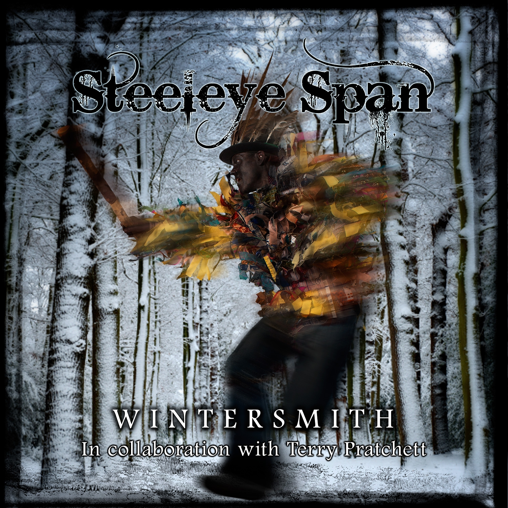

= Wintersmith 
Steeleye Span 
:toc:

link:../../links.html[Other albums]

== Overture

[verse]
____
(Through the stars,
The Turtle comes.
Drifting past,
A thousand suns.
Under the weight of,
Discworld.
Large as worlds,
& Old as Time.
Through the long,
Galactic night.)
____

	
== Ancient Eyes

[verse]
____
Through the stars, the Turtle comes.
Drifting past, a thousand suns.
Under the weight, of Discworld.

Large as worlds, and old as Time.
Through the long Galactic night.
Under the weight of Discworld.

Staring out, through ancient eyes.
Out of nowhere, into nowhere.
Through a billion stars, he flies.
Under the weight, of Discworld.

On and on, the Turtle flies.
The Colour of Magic, fills the skies.
As morning breaks, on Discworld.

One by one, they wake and rise.
Shake the magic, from their eyes.
Blaming, the Gods for Discworld.

Staring out, through ancient eyes.
Out of nowhere, into nowhere.
Through a billion stars, he flies.
Under the weight, of Discworld.
Staring out, through ancient eyes.
Out of nowhere, into nowhere.
Through a billion stars, he flies.
Under the weight, of Discworld.
____

	
== The Summer Lady

[verse]
____
We've suffered enough, at the hands of the WinterSmith!
All had our fill of the frost on the ground.
Let's drink, to the health of the fair Summer Lady.
And wish her the best, as she draws the sun down.

Go back to your mountains, you cold-hearted lover!
Your magic is broken, your mischief is done!
The time is at hand, for the fair Summer Lady.
To take up her place, and to draw the sun down.

Let the seasons turn!
Let the rivers start a flowin'!
Let the hot sun burn!
And melt our frozen hearts!

Too long, have we lived in the clutches of Winter.
Too long, have we lived in the grip of the cold.
One wave of her hand, and the fair Summer Lady.
Will turn the white fields, into yellow and gold.
To breeze through the corn, on the first day in Springtime.
To lie under skies of magnificent blue.
Just look in the eyes of the fair Summer Lady.
She'll harvest our dreams and she'll make them come true.

Let the seasons turn!
Let the rivers start a flowin'!
Let the hot sun burn!
And melt our frozen hearts!
Let the warm winds blow!
Send the North Wind on his journey!
Sweep away the snow!

The Summer Lady's here!

She'll smile on the hillside.
She'll dance on the lake.
She'll shimmer with brightness.
When she is awake.
She can turn the sun blood-red,
In a hot burning sky.
But when Summer is over,
The Lady MUST DIE!!

So drink, to the health of the fair Summer Lady!
Bathe in her glory and be of good cheer.
As sure, as the Summer is followed by Winter.
We'll call on the Lady of Summer each year.

Let the seasons turn!
Let the rivers start a flowin'!
Let the hot sun burn!
And melt our frozen hearts!
Let the warm winds blow!
Send, the North Wind on his journey!
Sweep away the snow!
The Summer Lady's here!
The Summer Lady's here!
The Summer Lady's here!
The Summer Lady's here!
____

	
== The Dark Morris Tune

	
== First Dance

	
== Crown of Ice

[verse]
____
Be my queen of the Winterworld
Live in a palace beyond all price
Now that I’m mortal and living in your world
Won’t you wear my crown of ice?
This is my world but it could be ours
I asked you once and I asked you twice
To be my bride in the Crystal Kingdom
You look so pretty in a crown of ice

Crown of Ice – the Gods have spoken
Crown of Ice – just a fleeting token
Crown of Ice – when a promise is broken
Love melts away
Farewell dress of the dancing light
The one that you wore at the very start
The palace is crashing all around us
And everything is melting but your heart
Crown of Ice – the Gods have spoken

Crown of Ice – just a fleeting token
Crown of Ice – when a promise is broken
Love melts away
Kiss my blue lips my only one
All is done now – {fire to ice}?.

Frost to fire - draw down the sun to melt your crown of ice
Crown of Ice – the Gods have spoken
Crown of Ice – just a fleeting token
Crown of Ice – when a promise is broken
Love
Crown of Ice – the Gods have spoken
Crown of Ice – just a fleeting token
Crown of Ice – when a promise is broken
Love melts away...
____

	
== The Making of a Man

[verse]
____
[Spoken]
Iron enough to make a nail, 
Lime enough to paint a wall, 
Water enough to drown a dog, 
Sulphur enough to stop the fleas, 
Potash enough to wash a shirt, 
Gold enough to buy a bean, 
Silver enough to coat a pin, 
Lead enough to ballast a bird, 
Phosphor enough to light the town, 
Poison enough to kill a cow.

You have 
Iron enough to make a nail, 
And lime enough to paint a wall, 
But that isn't enough to make you a man.

You have
Water enough to drown a dog, 
And Sulphur enough to stop the fleas, 
But that isn't enough to make you a man.

A man has.
Strength enough to build a home, 
and time enough to hold a child, 
and Love enough to break a heart.

You don't have
Strength enough to build a home, 
Or time enough to hold a child, 
Or Love enough to break a heart.

You have 
Potash enough to wash a shirt, 
And Gold enough to buy a bean, 
But that just isn't enough to make you a man.

You have 
Silver enough to coat a pin, 
and Lead enough to ballast a bird, 
But that isn't enough to make you a man.

A man has
Strength enough to build a home, 
and time enough to hold a child, 
and Love enough to break a heart.

You don't have
Strength enough to build a home, 
Or time enough to hold a child, 
Or Love enough to break a heart.

You have 
Phosphor enough to light the town, 
and Poison enough to kill a cow, 
But that isn't enough to make you a man.

You have
Iron enough to make a nail, 
and Lime enough to paint a wall, 
But that isn't enough to make you a man.

A man has
Strength enough to build a home, 
And time enough to hold a child, 
And Love enough to break a heart.

You don't have
Strength enough to build a home, 
Or time enough to hold a child, 
Or Love enough to break a heart...

Or Love enough to break my heart.
____

	
== Fire & Ice

	
== Hiver

	
== The Wee Free Men

[verse]
____
We are the Nac Mac Feegle,
The Wee Free Men!
No King, No Queen, No Master!
We'll not be fooled again!
We'll not be fooled again!
No King, No Queen, No Master!
No King, No Queen, No Master!

We like to go a' hunting,
We like to fight and drink!
We are the Nac Mac Feegle!
We'll vanish in a blink!

We like to go a' stealin',
We like to drink and fight!
We are the Nac Mac Feegle!
Faster than the Light!
We are faster than the Light! (Crivens!)

No King, No Queen, No Master!
No King, No Queen, No Master!
No King, No Queen, No Master!
Wee Free Men!
No King, No Queen, No Master!
We'll not be fooled again!

CRIVENS!

No King, No Queen, No Master!
No King, No Queen, No Master!
No King, No Queen, No Master!
Wee Free Men!
No King, No Queen, No Master!
We'll not be fooled again!
WE'LL NOT BE FOOLED AGAIN!
____
	

== Band of Teachers

[verse]
____
Band of Teachers.
Look like Tinkers.
Sold invisible things.
Always skint!
After they saw,
What they had, still had it.
They saw what everyone needed,
But often in the end.
A key to the year, there's a precious token.
Sold to those unaware, it was locked.
Kept apart from all other travellers.
With their ragged clothes, and change ware hats.
Sleeping under cold, cold stars.
On the moor, and deep in snow.
Heading for a land too far.
See the Band of Teachers.
Go.
Bright coloured pens and patchwork booths.
Hitched on the common,
Out of the way.
Patrolled by young apprentice teachers,
Looking for listeners, who didn't want to wait.
Teachers amass for counting styles.
Astronomers measured what they would.
Literary Teachers, made each one.
Geography Teachers, lost in the wood.

Sleeping under cold, cold stars.
On the moor, and deep in snow.
Heading for a land too far.
See, the Band of Teachers,
Go.
Band of Teachers.
Look like Tinkers.
Sold invisible things.
Always skint!
After they saw,
What they had, still had it.
They saw what everyone needed,
But often, not what they want.
Sleeping under cold, cold stars.
On the moor, and deep in snow.
Heading for a land too far.
See, the Band of Teachers,
Sleeping under cold, cold stars.
On the moor, and deep in snow.
Heading for a land too far.
See, the Band of Teachers,
Go.
____
	

== The Good Witch

[verse]
____
They never said why she was wicked,
That was just taken on Faith.
She'd a face to fill you with fear,
No teeth, and a wart sprouting hair.
Along with a welcoming leer.

But a Good Witch,
Really likes people.
Good Witches really do care.
For even, the mean stupid, hapless ones.
The feckless and foolish and silly ones.
The Hopeless, Mothers and little ones.

The Roots and Heart of Witchcraft.
Is so hard to control,
It's everyday caring, loving and sharing.
That's a Witch's center and soul.

And a Good Witch,
Looks to the ages.
Betwixt this world and the next.
More edges than people can know,
Night and the Day, or the Fast and the Slow,
Right and Wrong, don't always show.

The Roots and Heart of Witchcraft.

Is so hard to control,
It's everyday caring, loving and sharing,
That's a Witch's center and soul.

"A Good Witch,
Never Cackles.
Cackling is not just,
A 'Nasty' laughter.
It means your mind,
Drifting away from its anchor.
It means, loneliness and hard work.
Driving you crazy, a little bit at a time.
Until you thought it was normal to stop washing,
And wear a kettle on your head.
It means thinking,
Right and Wrong, are Negotiable.
In the end...
It means going to the Dark,
A BAD road!
At the end of that road,
With, Poison Spinning Wheels,
And Gingerbread Cottages..."
____

	
== You

[verse]
____
Ever since we danced in the dark parade
Something old was born anew
In spite of all the good things
Your good God has made
Everything I touch turns into you
Everything I touch turns into you

Ever since my eyes perceived your face
There was little doubt that I could do
Anything to save my fall from grace
Now everything I see turns into you
Everything I see turns into you

And ever since my ears received your cold clear voice
Singing silver lines so soft and true
My destiny was written, I had no choice
Now everything I hear turns into you
Everything I hear turns into you

Each snowflake that falls
Achieves your subtle form

The howling wind calls
Your name in the storm
The frost in the ground
That turns into dew
Each sight and each sound
Turns into you

A statue of your likeness
Floats through my dream
Carved in ice and glacial blue
You're in my heart forever
Or so it seems
Now everything I dream turns into you

Everything I touch turns into you

Everything I am turns into you
____

	
== Wintersmith

[verse]
____
Far along the back road, winding through the forest,
At the end of faith and hope and the dark black trees
An icy wind is rising, just as sharp as any knives.
Cutting through the lives of those who toil
Against the Freeze.

Where Death stands by the cradle.
Where blood runs through the moors.

Fire Burn! Fire blaze so bright!
Keep us warm through the long Winter night!
Flames keep away the fearsome sight
Of the WinterSmith!!
The WinterSmith!!

Among the chilling screams and the heavy drum of hooves.
Her centre never moves as the Sheep-girl waits to fight.
She's fair as stars in Heaven and the flowers of the land.
Lighting in her left hand and Thunder in her right.

Where Death stands by the cradle.
Where blood runs through the moors.

Fire Burn! Fire blaze so bright!
Keep us warm through the long Winter night!

Flames keep away the fearsome sight!
Of the WinterSmith!!
The WinterSmith!!

Where the Tangled bones of shipwreck lie upon a distant shore.
(There is the WinterSmith!)
Where a thousand drowning voices rise from the ocean floor.
(There is the WinterSmith!)
Where, the Silver Moon cast shapes upon the frozen floor.
(There is the WinterSmith!)
There is the WinterSmith!

Fire Burn! Fire blaze so bright!
Keep us warm through, the long Winter night!
Flames keep away the fearsome sight!
Of the WinterSmith!!
Fire, Burn! Fire blaze so bright!
Keep us warm through the long Winter night!
Flames keep away the fearsome sight!
Of the WinterSmith!!
WinterSmith!!
____
	

== The Dark Morris Song

[verse]
____
Dance, the Dark Morris!
You will find,
Summer turns to Wintertime.
Deep in the forest,
Clad in black,
Dance, the Dark Morris!
You may never dance back!
Boot thrum,
Stick clack.
Feel the Earth crack,
Underground.
Ancient incantation,
Calls the North wind down.
This is the land of,
Mystery & Myth!
This is the world,
Of the,
WinterSmith!
Dance, the Dark Morris!
You will find,
Summer turns to Wintertime.
Deep in the forest,
Clad in black,
Dance, the Dark Morris!
You may never dance back!
Coal-black faces,
Changing places,
Through the night.
Cold advance,
Is this a dance?
Is this a fight?
Beats as deep,
As oceans.
Thunder through,
Your soul.
Calling for the emotions,
You have never known.
These are the days of,
Mystery & Myth!
These are the ways,
Of the,
WinterSmith!
Dance, the Dark Morris!
You will find,
Summer turns to Wintertime.
Deep in the forest,
Clad in black,
Dance, the Dark Morris!
You may never dance back!
You feel someone behind you,
In front, above, below,
& beside you.
The dancers freeze,
But the world keeps spinning,
You know this is just,
The beginning!
These are the days of,
Mystery & Myth!
These are the ways,
Of the,
WinterSmith!
Dance, the Dark Morris!
You will find,
Summer turns to Wintertime.
Deep in the forest,
Clad in black,
Dance, the Dark Morris!
You may never dance back!
Dance, the Dark Morris!
Dance, the Dark Morris!
Dance, the Dark Morris!
Dance, the Dark Morris!
Dance, the Dark Morris!
Dance, the Dark Morris!
Dance, the Dark Morris!
Dance, the Dark Morris!
Dance, the Dark Morris!
____
	

== We Shall Wear Midnight

[verse]
____
You made me older than my years
I am young and barely grown
And when I cry, I cry your tears
for I have no life of my own.

Why don't you write me some candlelight
and wear your heart of gold?
and I will wear these Aching, heartbreaking years
''Til one day I shall wear midnight.

And if you should scream from your darkest dream
and in a whisper you'll hear me call?
And for a while I'll be sweet sixteen
and I'll have no power at all.

Why don't you write me a moonlight night
and wear your finest hour
and I will wear these Aching, heartbreaking years
Til one day I shall wear midnight

I am young, you are old, 
but not heartless and cold

I am warm from the love that you have shown
but you conjured me up 

from your hat full of dreams
and you keep me in a world of your own

Why don't you write me a guiding light
and wear your heart's desire?
and I will wear these Aching, heartbreaking years

Why don't you write me a guiding light and wear your heart's desire
And I will wear these Aching, heartbreaking years, ‘til one day
I shall wear midnight

And when you lay down on your final word,
it will be no comfort to me.
I have lived by the pen and I'll die by the sword, 
when it's time to set me free.

Why don't you write me a gallant knight and wear your honour and sword
And I will wear these Aching, heartbreaking years, til one day
I shall wear midnight

One day I shall wear midnight
Til one day we shall wear midnight 
____
