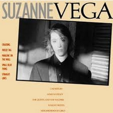

= Suzanne Vega
Suzanne Vega
1985
:toc:

link:../../links.html[Other albums]

== Cracking

[verse]
____
It's a one time thing
It just happens
A lot
Walk with me
And we will see
What we have got
Ah...

My footsteps are ticking
Like water dripping from a tree
Walking a harline
And stepping very carefully
Ah...

My heart is broken
It is worn out at the knees
Hearing muffled
Seeing blind
Soon it will hit the Deep Freeze

And something is cracking
I don't know where
Ice on the sidewalk
Brittle braches
In the air

The sun
Is blinding
Dizzy golden, dancing green
Through the park in the afternoon
Wondering where the hell
I have been
Ah... 
____

== Freeze Tag

[verse]
____
We go to the playground
In the wintertime
The sun is fading fast
Upon the slides into the past
Upon the swings of indecision
In the wintertime

In the dimming diamonds
Scattering in the park
In the tickling
And the trembling
Of freeze tag
In the dark

We play that we're actors
On a movie screen
I will be Dietrich
And you can be Dean

You stand
With your hand
In your pocket
And lean against the wall
You will be Bogart
And I will be
Bacall

And we can only say yes now
To the sky, to the street, to the night

Slow fade now to black
Play me one more game
Of chivalry
You and me
Do you see
where I've been hiding
In this hide-and-seek?

We go to the playground
In the wintertime
The sun is fading fast
Upon the slides into the past
Upon the swings of indecision
In the wintertime
Wintertime
Wintertime

We can only say yes now
To the sky, to the street, to the night
We can only say yes now
To the sky, to the street, to the night
____

== Marlene On The Wall

[verse]
____
Even if I am in love with you
All this to say, what's it to you?
Observe the blood, the rose tattoo
Of the fingerprints on me from you

Other evidence has shown
That you and I are still alone
We skirt around the danger zone
And don't talk about it later

Marlene watches from the wall
Her mocking smile says it all
As the records the rise and fall
Of every soldier passing

But the only soldier now is me
I'm fighting things I cannot see
I think it's called my destiny
That I am changing

Marlene on the wall

I walk to your house in the afternoon
By the butcher's shop with the sawdust strewn
"Don't give away the goods too soon"
Is what she might have told me

And I tried so hard to resist
When you held me in your handsome fist
And reminded me of the night we kissed
And of why I should be leaving

Marlene watches from the wall
Her mocking smile says it all
As the records the rise and fall
Of every man who's been here

But the only one here now is me
I'm fighting things I cannot see
I think it's called my destiny
That I am changing

Marlene on the wall 
____

== Small Blue Thing

[verse]
____
Today I am
A small blue thing
Like a marble
Or an eye

With my knees against my mouth
I am perfectly round
I am watching you

I am cold against your skin
You are perfectly reflected
I am lost inside your pocket
I am lost against
Your fingers

I am falling down the stairs
I am skipping on the sidewalk
I am thrown against the sky

I am raining down in pieces
I am scattering like light
Scattering like light
Scattering like light

Today I am
A small blue thing
Made of china
Made of glass

I am cool and smooth and curious
I never blink
I am turning in your hand
Turning in your hand
Small blue thing 
____

== Straight Lines

[verse]
____
There's a sound
Across the alley
Of cold metal
Touching skin

And you can see
If you look in her window
That she has gone and cut
Her hair again

In straight lines
Straight lines

Those soft golden lights in the morning
Are now on her wooden floor
The wind has swept them through the apartment
She don't need them
Any more
Any more
Any more...

She's cut down
On her lovers
Though she still dreams
Of them at night

She's growing straight lines
Where once were flowers
She is streamlined
She is taking the shade down
From the light

To see the straight lines
Straight lines

She wants to cut through the circles
That she has lived in before
She wants to finally kill the delusions
She won't need them
Any more
Any more
Any more...

But there's a sound
Across the alley
Of cold metal
Too close to the bone

And you can see
If you look in her window
The face of a woman
Finally alone

Behind straight lines
Straight lines 
____

== Undertow

[verse]
____
I believe right now if I could
I would swallow you whole
I would leave only bones and teeth
We could see what was underneath
And you would be free then

Once I thought only tears could make us free
Salt wearing down to the bone
Like sand against the stone
Against the shoreline

I am friend to the undertow
I take you in, I don't let go
And now I have you

I wanted to learn all the secrets
From the edge of a knife
From the point of a needle
From a diamond
From a bullet in flight
I would be free then

I am friend to the undertow
I take you in, I don't let go
And now I have you

I wanted to see how it would feel
To be that sleek
And instead I find this hunger's
Made me weak

I believe right now if I could
I would swallow you whole
I would leave only bones and teeth
We could see what was underneath
And you would be free then

I am friend to the undertow
I take you in, I don't let go
And now I have you

I am friend to the undertow
I take you in, I don't let go
And now I have you
____

== Some Journey

[verse]
____
If I had met you on some journey
Where would we be now
If we had met some eastbound train
Through some black sleeping town

Would you have worn your silken robes
All made of royal blue?
Would I have dressed in smoke and fire
For you to see through?

If we had met in a darkened room
Where people do not stay
But shadows touch and pass right through
And never see the day

Would you have taken me upstairs
And turned the lamplight low?
Would I have shown my secret self
And disappeared like the snow?

Oh, I could have played your little girl
Or I could have played your wife
I could have played your mistress
Running danger down through you life

I could have played your lady fair
All dressed in lace like the foam from the sea
I could have been your woman of the road
As long as you did not come back home to me

But as it is, we live in the city
And everything stays in place
Instead we meet on the open sidewalk
And it's well I know your face

We talk and talk, we tell the truth
There are no shadows here
But when I look into your eyes
I wonder what might have been here

Because if I had met you on some journey
Where would we be now? 
____

== The Queen & The Soldier

[verse]
____
The soldier came knocking upon the queen's door
He said, "I am not fighting for you any more"
The queen knew she'd seen his face someplace before
And slowly she let him inside.

He said, "I've watched your palace up here on the hill
And I've wondered who's the woman for whom we all kill
But I am leaving tomorrow and you can do what you will
Only first I am asking you why."

Down in the long narrow hall he was led
Into her rooms with her tapestries red
And she never once took the crown from her head
She asked him there to sit down.

He said, "I see you now, and you are so very young
But I've seen more battles lost than I have battles won
And I've got this intuition, says it's all for your fun
And now will you tell me why?"

The young queen, she fixed him with an arrogant eye
She said, "You won't understand, and you may as well not try"
But her face was a child's, and he thought she would cry
But she closed herself up like a fan.

And she said, "I've swallowed a secret burning thread
It cuts me inside, and often I've bled"
He laid his hand then on top of her head
And he bowed her down to the ground.

"Tell me how hungry are you? How weak you must feel
As you are living here alone, and you are never revealed
But I won't march again on your battlefield"
And he took her to the window to see.

And the sun, it was gold, though the sky, it was gray
And she wanted more than she ever could say
But she knew how it frightened her, and she turned away
And would not look at his face again.

And he said, "I want to live as an honest man
To get all I deserve and to give all I can
And to love a young woman who I don't understand
Your highness, your ways are very strange."

But the crown, it had fallen, and she thought she would break
And she stood there, ashamed of the way her heart ached
She took him to the doorstep and she asked him to wait
She would only be a moment inside.

Out in the distance her order was heard
And the soldier was killed, still waiting for her word
And while the queen went on strangeling in the solitude she preferred
The battle continued on
____

== Knight Moves

[verse]
____
Watch while the queen
In one false move
Turns herself into a pawn

Sleepy and shaken
And watching while the blury night
Turns into a very clear dawn

Do you love any, do you love none,
Do you love many, can you love one,
Do you love me?

Do you love any, do you love none,
Do you love many, can you love one,
Do you love me?

One false move
And a secret prophecy
Well, if you hold it against her,
First hold it up and see
That it's one side stone
One side fire
Standing alone among all men's desire
They want to know

Do you love any, do you love none,
Do you love many, can you love one,
Do you love me?

Do you love any, do you love none,
Do you love many, can you love one,
Do you love me?

And if you wonder
What I am doing
As I am heading
For the sink
I am spitting out all the bitterness
Along with half of my last drink
I am thinking
Of your woman
Who is crying in the hall
It's like drinking gasoline
To quench a thirst
Until there's nothing there left at all

Do you love any, do you love none,
Do you love many, can you love one,
Do you love me?

Do you love any, do you love none,
Do you love many, can you love one,
Do you love me?

"Walk on the blind side"?
Was the answer to the joke
It's said there isn't a political bone
In her body

She would rather be a riddle
But she keeps challenging the future
With a profound lack of history

Do you love any, do you love none,
Do you love many, can you love one,
Do you love me?

Do you love any, do you love none,
Do you love many, can you love one,
Do you love me?

And watch while the queen
In one false move
Turns herself into a pawn

Sleepy and shaken
And watching while the blury night
Turns into a very clear dawn

Do you love me? [X5]
____

== Neighborhood Girls

[verse]
____
"We had our
Neighborhood girl, she
Used to hang out, in front of
McKinsey's Bar, and we were
Interested in her, and her
Clientele...
We just wonder where she's gone..."
"Oh she's gone?"
"Yes, she's gone, gone, gone."

"I think you know your
Neighborhood girl, she
Lives on my street, now, with
Eyes of ice
I've seen her in the morning, when she is
Walking in the sun
And I always thought that she
Looked kind of nice

She spoke to me once
At a party, I think
And I thought at the time
That she had had too much to drink, because she
Said to me, `There's a backbone gone
And I've got to get it back
Before going on...'

And your neighborhood girl
Seems to have resigned
She was looking out at people
From the back of her mind
And before she went off
She spoke to me again
She came up and said

`You have the eyes of a friend
And there's a razor's edge
That I have lost somewhere
And I would like it back
So if you've seen it anywhere...
I've been out for a while
But I'll be back in a bit
I am just walking through the smoke
Finding out if this is it
Because I've got this feeling
That things are going grey
And I'd like to hear a straight line
To help me find my way...'

I looked at her
And I did not know waht to say.
She had long black hair."

"Must be a different
Neighborhood girl, cause
Ours had blonde hair, in front of
McKinsey's Bar
And we were interested in her
And her
Clientele...
We just wonder where she's gone..."
"Oh she's gone?"
"Yes, she's gone, gone, gone."
____
