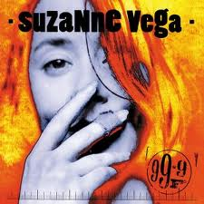

= 99.9F
Suzanne Vega
1992
:toc:

link:../../links.html[Other albums]

== Rock In This Pocket

[verse]
____
Excuse me
If I may
Turn your attention
My way
One moment
I won't plead
It isn't much
It's what I need

And what's so small to you
Is so large to me
If it's the last thing I do
I'll make you see

If you turn from me
You darken my sun
You snap that thin thread
I call my horizon
And I'd like to remind you
Of something small
That the rock in this pocket
Could cause your fall

And what's so small to you
Is so large to me
If it's the last thing I do
I'll make you see

So small to you
And so large to me
If its the last thing I do
I'll make you see

I might be out like a light
Extinguished in the throw
But I'll hit my mark
And you'll know
Because I'm really well acquainted
With the span of your brow
And if you didn't know me then
You'll know me now
You'll know me now

And what's so small to you
Is so large to me
If its the last thing I do
I'll make you see

So small to you
And so large to me
If it's the last thing I do
I'll make you see
Make you see
Make you see 
____

== Blood Makes Noise

[verse]
____
I'd like to help you doctor
Yes I really really would
But the din in my head
It's too much and it's no good
I'm standing in a windy tunnel
Shouting through the roar
And I'd like to give the information
You're asking for

But blood makes noise
It's a ringing in my ear
Blood makes noise
And I can't really hear you
In the thickening of fear

I think that you might want to know
The details and the facts
But there's something in my blood
Denies the memory of the acts
So just forget it Doc.
I think it's really
Cool that you're concerned
But we'll have to try again
After the silence has returned

Cause blood makes noise
It's a ringing in my ear
Blood makes noise
And I can't really hear you
In the thickening of fear

Blood makes noise... 
____

== In Liverpool

[verse]
____
In Liverpool
On Sunday
No traffic
On the avenue
The light is pale and thin
Like you
No sound, down
In this part of town
Except for the boy in the belfry
He's crazy, he's throwing himself
Down from the top of the tower
Like a hunchback in heaven
He's ringing the bells in the church
For the last half an hour
He sounds like he's missing something
Or someone that he knows he can't
Have now and if he isn't
I certainly am

Homesick for a clock
That told the same time
sometimes you made no sense to me
if you lie on the ground
in somebody's arms
you'll probably swallow some of their history

And the boy in the belfry
He's crazy, he's throwing himself
Down from the top of the tower
Like a hunchback in heaven
He's ringing the bells in the church
For the last half an hour
He sounds like he's missing something
Or someone that he knows he can't
Have now and if he isn't
I certainly am

I'll be the girl who sings for my supper
You'll be the monk whose forehead is high
He'll be the man who's already working
Spreading a memory all through the sky

In Liverpool
On Sunday
No reason to even remember you now

Except for the boy in the belfry
He's crazy, he's throwing himself
Down from the top of the tower
Like a hunchback in heaven
He's ringing the bells in the church
For the last half an hour
He sounds like he's missing something
Or someone that he knows he can't
Have now and if he isn't
I certainly am

In Liverpool [X2]
____

== 99.9F

[verse]
____
99.9 Fahrenheit degrees
Stable now, with rising possibilities
It could be normal but it isn't quite
Could make you want to stay awake at night

You seem to me
Like a man
0n the verge of burning
99.9 Fahrenheit degrees

Pale as a candle
And your face is hot
And if I touch you
I might get what you've got

You seem to me
Like a man
On the verge of running
99.9 Fahrenheit degrees

Something cool
Against the skin
Is what you could be
Something cool
Against the skin
Is what you
Could be needing

99.9 Fahrenheit degrees

You seem to me
Like a man
On the verge of burning
99.9 Fahrenheit degrees

Something cool
Against the skin
Is what you could be
Something cool
Against your skin
Is what you
Could be needing

99.9 Fahrenheit degrees [X2]
____

== Blood Sings

[verse]
____
When blood sees blood
Of its own
It sings to see itself again
It sings to hear the voice it's known
It sings to recognize the face

One body split and passed along the line
From the shoulder to the hip
I know these bones as being mine
And the curving of the lip

And my question to you is:
How did this come to pass?
How did this one life fall so far and fast?

Some are lean and some with grace, and some without;
All tell the story that repeats
Of a child who had been left alone at birth
Left to fend and taught to fight

See his eyes and how they start with light
Getting colder as the pictures go
Did he carry his bad luck upon his back?
That bad luck we've all come to know

And my question to you is:
How did this come to pass?
How did this one life fall so far and fast?

When blood sees blood
Of its own
It sings to see itself again
____

== Fat Man & Dancing Girl

[verse]
____
I stand in a wide flat land
No shadow or shade of a doubt
Whore the megaphone man
Met the girl with her hand that's
Covering most of her mouth

Fall in love with a bright idea
And the way a world is revealed to you
Fat man and dancing girl
And most of the show is concealed from view

Monkey in the middle
Keeps singing that tune
I don't want to hear it
Get rid of it soon

MC on the stage tonight
Is a man named Billy Purl
He's The International Fun Boy
And he knows the worth of beautiful girl

Stand on the tightrope
Never dreamed I would fall

Monkey in the middle
Keeps doing that trick
It's making me nervous
Get rid of it quick

I stand in a wide flat land
No shadow or shade of a doubt
Where the megaphone man
Met the girl with her hand
That's covering most of her mouth

Does she tell the truth?
Does she hide the lie?
Does she say it so no one can know?
Fat man and the dancing girl
And it's all part of the show

Stand on the tightrope
Never dreamed I could fall

Monkey in the middle
Keeps singing that tune
I don't want to hear it
Get rid of it soon

Monkey in the middle
Keeps doing that trick
It's making me nervous
Get rid of it quick
____

== (If You Were ) In My Movie

[verse]
____
If you were in my movie
I'd have you as the doctor
Small black bag
And a big black coat

I'd have you make a house call
To the woman
You could lay your
Diagnostic hand
Upon her belly and her throat

If you were in my movie
You could be the detective
You could sit behind the desk
With a question on your lip

Examine her for motive
Investigate the scene
In the ever present danger
Keep the holster at your hip

If you were in my movie
If you were in my movie
If you were in my movie

If you were in my movie
You could be the priest
Long black frock
White collar at the neck

You could come to the confession
You could give a girl a thrill
You could save her from her passion
Keep her body in check

If you were in my movie
If you were in my movie
If you were in my movie

If you were in my movie
You could be the gangster
Double-breasted pinstriped
Man with the cigarette

Go running down the alley
With a double-crossing blond
Explaining to the jury
That you hadn't done anything yet

If you were in my movie...
____

== As A Child

[verse]
____
As a child
You have a doll
You see this doll
Sitting in her chair

You watch her face
Her knees apart
Her eyes of glass
In a secretive stare

She seems to [X3]
Have a life

Pick up a stick
Dig up a crack
Dirt in the street
Becomes a town

All of the people
Depend on you
Not to hurt them
Or bang the stick comes down

And they seem to
They seem to [X2]
Have a life

As a child
You see yourself
And wonder why
You can't seem to move

Hand on the doorknob
Feel like a thing
One foot on the sidewalk
Too much to prove

And you learn to
You learn to [X2]
Have a life 
____

== Bad Wisdom

[verse]
____
Mother the doctor knows something is wrong
Cause my body has strange information
He's looked in my eyes and knows I'm not a child
But he doesn't dare ask the right question

Mother my friends are no longer my friends
And the games we once played have no meaning
I've gone serious and shy and they can't figure why
So they've left me to my own daydreaming

What price to pay
For bad wisdom
What price to pay
For bad wisdom
Too young to know
Too much too soon
Bad wisdom [X2]

Mother you've taught me the laws are so fine
If I'm good that I will be protected
I've fallen through the crack and there's no getting back
And I'll never trust whoever gets elected

Mother your eyes have gone suddenly cold
And it wasn't what I was expecting
Once I did think that I'd find comfort there
And instead you've gone hard and suspecting

What price to pay
For bad wisdom
What price to pay
For bad wisdom
Too young to know
Too much too soon
Bad wisdom [X2]

Mother I'm cut at the root like a weed
Cause there's no one to hear my small story
Just like a woman who walks in the street
I will pay for my life with my body

What price to pay
For bad wisdom
What price to pay
For bad wisdom
Too young to know
Too much too soon
Bad wisdom [X2] 
____

== When Heroes Go Down

[verse]
____
When heroes go down
They go down fast
So don't expect any time to
Equivocate the past

When heroes go down
They land in flame
So don't expect any slow and careful
Settling of blame

I heard you say
You look out for the feet of clay
That someone will be falling next
Without the chance
For last respects
You feel the disappointment

When heroes go down
Man or woman revealed
You can't expect any kind of mercy
On the battlefield

I heard you say
You look out for the feet of clay
That someone will be falling next
Without the chance for last respects
You feel the disappointment

When heroes go down
Man or woman revealed
Do you show any kind of mercy
On the battlefield?

When heroes go down [X3] 
____

== As Girls Go

[verse]
____
You make a really good girl
As girls go
Still kind of look like a guy
I never thought to wonder why

If I could pull this off
Would I know for certain
The real situation
Behind the curtain

So beautiful
damsel in distress
Not exactly natural
Stunning none the less

What happened to you?
To make you more girl than girls are
Would you ever show or tell
Cause you're so good so far

You make a really good girl
As girls go [X5]

Let's chronicle
The dark side of the life
Did you ever keep the date
With the steel side of the knife

Doesn't matter to me
Which side of the line
You happen to be
At any given time

You make a really good girl
As girls go [X5] 
____

== Song Of Sand

[verse]
____
If sand waves were sound waves
What song would be in the air now
What stinging tune
Could split this endless noon
And make the sky swell with rain

If war were a game that a man or a child
Could think of winning
What kind of rule
Can overthrow a fool
And leave the land with no stain. 
____
