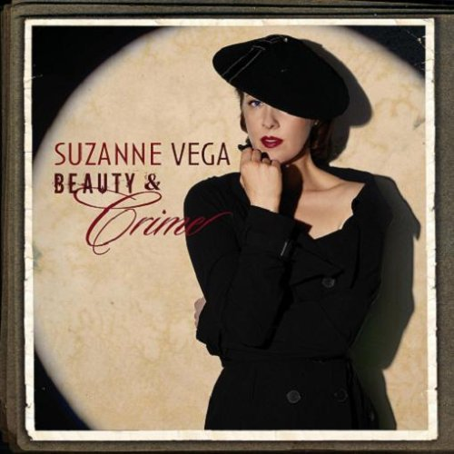

= Beauty & Crime
Suzanne Vega
2007
:toc:

link:../../links.html[Other albums]

== Zephyr & I

[verse]
____
Zephyr & I stand out on
West End Avenue
Talking about the things that
All of us used to do

And the wind kicks up with the smell of rain
The kids are gone but the souls remain

Zephyr and I sort out our
Long time memories
Do you remember, he says,
The 1970's

This was a youth mall
Of America on this street
All of us hanging here
Like underage cops on a beat

And the wind kicks up in the smell of rain
Now the kids are gone but their souls remain
The graffiti goes but the walls retain
The flowers go but the earth must still remain

In spring the tide in Riverside
Will wash away the cold and frozen
River rain will clean the stain and
Wash away wash away downstream

Out on the corner by the
Fireman's Monument
This was the place where all the
Fatherless teenagers went

Well the wind kicks up in the smell of rain
The kids are gone but the souls remain
The graffiti's gone and the walls complain
The flowers go but the earth must still remain 
____

== Ludlow Street

[verse]
____
Love is the only thing that matters.
Love is the only thing that's real.
I know we hear this every day.
It's still the hardest thing to feel.

This time
When I go back to Ludlow Street,
I find each stoop and doorway's incomplete,
Without you there.

Another generation's parties.
And it is still the same old scene.
I can recall each morning after.
Painted in nicotene.

This time
When I go back to Ludlow Street,
I find each stoop and doorway's incomplete
Without you there.

All of the people I once knew.
All of the ones I was close to.

Love is the only thing that matters.
Love the only thing that's real,
And when I think about you now
Love is the only thing I feel.

This time
When I go back to Ludlow Street,
I find each stoop and doorway's incomplete
Without you there.

Tim, this time
When I go back to Ludlow Street
I find each stoop and doorway's incomplete
Without you there. 
____

== New York Is A Woman

[verse]
____
New York City spread herself before you
With her bangles and her spangles and her stars
You were impressed with the city so undressed
You had to go out cruising all the bars

Your business trip extended through the weekend
Suburban boy here for your first time
From the 27th floor above the midtown roar
You were dazzled by her beauty and her crime

And she's every girl you've seen in every movie
Every dame you've ever known on late night TV
In her steam and steel is the passion you feel
Endlessly
New York is a woman she'll make you cry
And to her you're just another guy

Look down and see her ruined places
Smoke and ash still rising to the sky
She's happy that you're here but when you disappear
She won't know that you're gone to say goodbye

And she's every girl you've seen in every movie
Every dame you've ever known on late night tv
In her steam and steel is the passion you feel
Desperately
New York is a woman she'll make you cry
And to her you're just another guy 
____

== Pornoghrapher's Dream

[verse]
____
She's a pornographer's dream, he said.
I knew what he meant.
But it made me imagine: what kind of a dream
He would have, that hadn't been spent?

Would he still dream of the thigh? of the flesh upon high?
What he saw so much of?
Wouldn't he dream of the thing that he never
Could quite get the touch of?

It's out of his hands, over his head
Out of his reach, under this real life
Hidden in veils, covered in silk
He's dreaming of what might be

Out of his hands, over his head
Out of his reach, under this real life
Hidden in veils,
He's dreaming of mystery.

Bettie Page is still the rage
With her legs and leather;
She turns to tease the camera, and please us at home,
And we let her.

Who's to know what she'll show of herself,
In what measure?
If what she reveals, or what she conceals,
Is the key to our pleasure?

It's out of our hands, over our heads
Out of our reach, under this real life
Hidden in veils, covered in silk
We're dreaming of what might be

It's out of our hands, over our heads
Out of our reach, under this real life
Hidden in veils
We're dreaming of mystery.

She's a pornographer's dream, he said.
I knew what he meant.
But it made me imagine: what kind of a dream
He would have? 
____

== Frank & Ava

[verse]
____
On the way to the bidet
Is when the trouble used to start
It didn't mean she wasn't queen
Of the tinderbox that was his heart

Her fire his desire meant that
Everything must come undone
And so now we know it's not enough to be in love

He's so true. she is too. she says
I love you Frank and then they drank
All night. what a fight.
He says it isn't me you're thinking of

She's cool. it makes him cruel
And they needle till the jewels
Go raining down upon the ground
She says its not enough to be in love

Not enough to be in love
Not enough to be in love

They woke up, and they broke up.
They were volatile, and all the while
Life passed, it went so fast,
And yet they never could forget,

Their chemistry, like you and me
Proved to keep them both apart for life
And so, now we know
That it's not enough to be in love

Not enough to be in love
To be in love
To be in love
To be in love 
____

== Edith Wharton's Figurine

[verse]
____
Edith wharton's lovely figurines
Still speak to me today
From their mantlepiece in time
Where they wrestle and they play

With passions and with prudences
Finances and fears
Her face and what its worth to her
In the passing of the years

See the portrait come to life
See the vanity behind
Cause in the struggle for survival
Love is never blind

Now, olivia lies under anasthesia
Her wit and wonder snuffed
In a routine operation
Her own beauty not enough,

Her passions and her prudences
Finances and fears
Her face, what it was worth to her
In the passing of the years

See the portrait come to life
See the vanity behind
Cause in the struggle for survival
Love is never blind

Edith whartons lovely figurines
Still speak to me today
From their mantlepiece in time
Where they wrestle and they play

We lie under anesthesia
Our wit and wonder snuffed
In our routine operations
Our own beauty not enough 
____

== Bound

[verse]
____
The way of the world
Has taken its toll
Ravaged my body
And bitten my soul

I am ruined by rain
Weathered by wind
I've been invaded
Without and within

And I ask
I am asking you
Asking you if you
Might still want me.

Once you said
I'm made of fine stuff.
But I've been corrupted.
And taken enough.

Now you appear.
Making your claim.
Inside my heart
Is the sign of your name.

And I ask
I am asking you
Asking you if you
Might still want me?

All these words
Like darling and angel and dear
Crowd my mouth
In a path to your ear.
The way of the world
Has taken it's toll
Ravaged my body
Bitten my soul

And I ask
I am asking you
Asking you if you
Might still want me?

When I said:
I am bound to you forever
Here's what I meant:
I am bound to you forever. 
____

== Unbound

[verse]
____
I knew a plant
Whose roots were bound
And returned
Into the ground

Every day
I watched it grow
Every day
It struggled so

Roots were bound roots were bound
Roots were bound into the ground
Watched it grow watched it grow
Watched it as it struggled so

I dug it up
I cut the twine
And so like this
I made it mine

I watched it drink
And watched it feed
And grow beyond
It's simple need

Cut the twine cut the twine
Cut the twine and made it mine
Watched it feed watched it feed
Watched it feed the simple need

Unbound roots unbound
Unbound into the ground
Unbound roots unbound
Unbound into the ground

I was once
Bound at the root
Confined with twine
Both mind and foot

I cut it loose
And now am free
As anything
Alive can be

At the root bound at the root
Confined both mind and foot
Am free now am free
As anything alive can be

Unbound roots unbound
Unbound into the ground
Unbound roots unbound
Unbound into the ground 
____

== As You Are Now

[verse]
____
I will take up all your tears
Salty tissues through the years
Spread them in the sun to dry
Diamonds from each time you cry

I will treasure all your teeth
Your laughter and the pearls beneath
Keep them in a cardboard box
Through the tickings and the tocks

I will gather all your hair
Floating in the sultry air
We will make a braid of gold
For you to keep when you are old

Now I kiss your milky skin
Sheet of silk and soul within
Put this kiss upon your brow
Treasure you as you are now 
____

== Angel's Doorway

[verse]
____
Angel comes home
His clothes in a cloud
Of the dust and the dirt and destruction

She waits inside
She knows he's arrived
She feels this with no introduction

At angel's door,
You have to leave it on the floor,
Don't bring it in.

He can't show
What she doesn't want to know
Those things he's seen.

She knows the smell
Of that life he can't tell
Of the fires and the flesh and confusion

Inside his brain
It's never the same
Though he tries to maintain the illusion

At angel's door,
You have to leave it on the floor,
Don't bring it in.

He can't show
What she doesn't want to know
Those things he's seen.

Angel comes home
His clothes in a cloud
Of the dust and the dirt and destruction 
____

== Anniversary

[verse]
____
Fall and all attendant memories
Crowd the day with unrelated histories
Each year leaves its unresolving fantasies
To hang around each corner
Hang around each street.

Thick with ghosts, the wind whips round in circuitries
Carrying words as strangers exchange pleasantries
Do they intrude upon your private reveries
As they meet you on each corner
Meet you on each street.

Watch for daily braveries
Notice newfound courtesies
Finger sudden legacies
As they clean up every corner
Wash down every street.

Mark the month and all its anniversaries
Put away the draft of all your eulogies
Clear the way for all your private memories
As they meet you on each corner
Meet you on every street.

Make the time for all your possibilities.
They live on every street.
____
