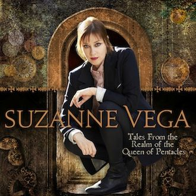

= Tales From The Realm Of The Queen Of Pentacles
Suzanne Vega
2014
:toc:

link:../../links.html[Other albums]

== Crack In The Wall

[verse]
____
A crack appeared inside a wall,
A door sprang up around it.
Each of these so finely drawn
I could not believe I found it.

A wildish wind blew it open wide,
My childish mind followed on outside,
And so I found myself among
My hearts delight surrounded.

A world of wonder lay without,
It was all of nature’s calling.
With field and forest, clouds and sun
Cascades of salt water falling.

Heights and valleys, dark ravines
Ivy thick and wild, deep and thorny scenes,
And yet each thing did love its place
In the lap of all of nature’s sprawling.

And so and so it goes.

I asked the one whose land this was
If I might have a token
To take with me back to the other side
To have and to keep unspoken.

I asked three times and was thrice denied.
I asked again without my pride
And found I’d lost that world I’d lived
Returned as one now broken,

To a crumb, a rag, a withered leaf
In the chilly winds of cold relief
I knew myself as I had been,
As from a dream awoken.

And so and so it goes.

But then… a crack appeared inside a wall
And a door sprang up around it. 
____

== Fool's Complaint

[verse]
____
How I hate the Queen of Pentacles!
Sitting on her golden throne
In her domestic tyranny
All roads lead back to her alone.

The whole wide world is a great big drain
And the vortex is her heart.
Her needs and wants and
Wishes and whims
All take precedence on this chart.

But what do I know?
My card’s the fool, the fool, the fool
That merry rootless man,
With air beneath my footstep
And providence as my plan.
Providence as my plan.

Oh it’s such expensive innocence!
Never knowing any cost.
She throws around her finery
For us to fetch when it gets lost.

But what do I know?
My card’s the Fool! The fool, the fool.
That merry rootless man.
With air beneath my footstep
And providence as my plan.
Providence as my plan. 
____

== I Never Wear White

[verse]
____
I never wear white
White is for virgins
Children in summer
Brides in the park.

My color is black black black
Black is for secrets
Outlaws and dancers
For the poet of the dark.

Black is the truth
Of my situation.
And for those of my station
In life. All other colors
Lie.

I never wear white
White is too blinding
Always reminding
Of the innocent who fall

My color is black black black
For the crone, and the bastard
The schoolgirl in uniform
The servant in the hall.

Black is the truth
Of my situation,
And for those of my station
In life. All other colors
Lie.

My color is black black black
Like the gangster and widow
It’s the shade and the shadow
It’s the depth into your eye

My color is black black black black black 
____

== Portrait Of The Knight Of Wands

[verse]
____
He stood upon the last
Bastions of the place
Looked out on the ruins
With thunder in his face

An introverted spectacle
In the flowers on the rocks
The daisies on the ramparts
Blowing free

His heart was divided
Clouds gathered in the sky
The belfry made of wood and steel
Was silenced in it’s cry

Something must have happened
What, he wouldn’t say
But shown within
The wider lens of history

[Chorus:]
His mission the transmission
Of technology

One cannon trained upon the church
This one caught his eye
“to keep the bishop in his place”
He muttered with a sigh

His mood was melancholy
His attitude severe
His inner burden
Weighed upon him mightily
A bird as never seen in books
Flew in overhead
A kind of dove it might have been
But not a sound was said

All the ancient knowledge lay
In pieces on the ground
The cause of all his suffering
Was not for love of me.

[Chorus:]
His mission the transmission
Of technology 
____

== Don't Uncork What You Can't Contain

[verse]
____
A man finds a bottle on the bottom shelf
Forgotten and covered in dust
The label is already half worn off
Still, open it up he must.

As the corkscrew into the cork it goes
He hears the weird refrain,
“Do you what you like, but never uncork
Uncork what you can’t contain
Do what you like but never uncork
Uncork what you can’t contain.”

Pandora had a pretty little box,
Wisely she kept it hid
Until one day she couldn’t resist
Playing around with the lid
As the demons flew and the shadows grew
This song went around her brain:

“You can do what you like but never uncork
Uncork what you can’t contain,
You can do what you like but never uncork
Uncork what you can’t contain.”

As the demons flew and the shadows grew
This song went around her brain:
“You can do what you like but never uncork
Uncork what you can’t contain.”

Macklemore went to the thrift shop
Looking to pop some tags
Found an ancient oil lamp
Hidden among the rags
So he picked it up and he rubbed it down
Thought he’d gone insane

Cause a genie flew out, singing “Never uncork
Uncork what you can’t contain”
Genie flew out, singing “Never uncork
Uncork what you can’t contain”

He picked it up and he rubbed it down
Thought he’d gone insane
Cause the genie flew out singing “Never uncork
Uncork what you can’t contain.”
But sometimes though you have to
Let out what you’re keeping inside
If you keep it all in, your head will spin
And your mouth is all tongue tied

You’ve got to find the way to say what you say
And get it down on the page
Or the stage
It’s the cage for that tiger rage that you can’t contain

Yes the page and the stage is the cage for that tiger rage
That you can’t contain, for real
The page and the stage is the cage
For that tiger rage, what it is that you feel
So, do what you like but you better uncork
Uncork what you can’t contain
Do what you like but you better uncork
Uncork what you can’t contain

Cause the page and the stage is the cage
For that tiger rage that’ll cause you pain
Do what you like but you better uncork
Uncork what you can’t contain 
____

== Jacob And The Angel

[verse]
____
The angel came to Jacob
The room began to glow
Jacob asked the angel
Are you friend or are you foe?

The angel never answered
But smote him on the thigh
They wrestled through the darkness
Till morning filled the sky

This thing between us, has wings, it has teeth
It has got horns and feathers, and sinews beneath
Angel or demon, to the truth I am bound, and so
This thing between us must be wrestled down

Jacob held on to the angel,
Who turned to fly, and to flee
He said I must have your blessing
Before I let you leave me

The angel never answered
But smote him on the thigh
They wrestled through the darkness
Till morning filled the sky

And in the light
He knew another name
As he struggled and surrendered
To the next part of the game

This thing between us, has wings, it has teeth
It has got horns and feathers, and sinews beneath
Angel or demon, to the truth I am bound, and so
This thing between us must be wrestled down

This thing between us, has wings, it has teeth
It has got horns and feathers, and sinews beneath
Angel or demon to the truth I am bound and so
This thing between us must be wrestled down. 
____

== Silver Bridge

[verse]
____
My heart is full today
For the recently departed
Of sorrow and of sympathy
Into that land uncharted

The old man turned away from me
The stairway he ascended
I heard his struggle through the night
with Saturn’s hand extended

All those nights when you can’t sleep
Your heart and mind is racing
Are you standing on that bridge
Which way are you facing?

I stared upon his body as
My soul was filled with wonder
I stayed there frozen in one place
I could not be pulled asunder

All those nights when you can’t sleep
Your heart and mind is racing
Are you standing on that bridge
Which way are you facing?

I’d sent him upstairs with a kiss
Now he lay in light of silver
It seemed to me I saw that bridge
That he had taken over

Should I make the move to him?
He wasn’t mine for claiming
I witnessed all there was to see
And withdrew without the naming

When I knew that he had been
So much more than sleeping
I stayed with him the afternoon
In a kind of vigil keeping

All those nights when you can’t sleep
Your heart and mind is racing
Are you standing on that bridge
Which way are you facing?

My heart is full today
For the recently departed
Of sorrow and of sympathy
Into that land uncharted.
____

== Song Of The Stoic

[verse]
____
I am a man
I’ve been working all my days
This is my accounting
Of my means and of my ways

More years are behind me now
Than years that are ahead
Looking back I feel
This is my story to be said.

I faced my father down
Inside the hallway of our home
18 years of pain
Upon my body to the bone

Demons lived inside of him
They forced him to the act
The layers of the bruises
To my body was the fact.

Ooooh

I grew and went into the world
I learned to know it’s code
Of spoken and unspoken
And I learned to love the road

I shoulder every burden like
A mule with a heavy pack
Every coin I earn is another
Knot within my back.

Ooooh

Ecstasy and pleasure come
At much too great a cost
I keep myself upon the earth
But measure what I’ve lost

Winged things they brush against me
Never mine to hold
I keep my eyes upon the ground
And carry on as old.

I met a woman
She had the gifted touch
Her hands were wise with healing
And with wonder and all such

As the fates would have it
Each to others we are wed
We confine ourselves to friendship
And we stay out of the bed.

Oooh

Now I turn around to face
The specter of my age
My soul it fights my body
Like a bird will fight its cage.

I see that last horizon
I hope it brings me peace
I look forward to the day
At last my body knows release.

Ooooh
Ooooh
____

== Laying On Of Hands / Stoic 2

[verse]
____
Mother Theresa understood the laying on of hands
What I often wonder is how she kept from hearing love’s demands
If in her loneliness she ever dreamed of following earthly commands, oh yeah.
Mother Theresa understood the laying on of hands.

Touch is a language. What it you have to say to me?
Come and talk about it. Tell me where you’re locked and where you’re free.
Brutality or tenderness, our bodies are exchanged in all eternity, oh yeah.
Touch is a language. What is it you have to say to me?
In this wilderness do we hurt or heal within our daily plans, oh yeah.
Mother Theresa understood the laying on of hands.
Mother Theresa understood the laying on of hands
Mother Theresa understood the laying on of hands.

Epictetus probably slept with hands above the covers
Lost no sleep in counting sheep or numbers of ex-lovers.
The thing about a stoic is he’s always understated
I don’t know about happiness but virtue’s overrated.

La la la la
La la la la
La la la la la la 
____

== Horizon (There Is A Road)

[verse]
____
There is a road
Beyond this one
It’s called the path
We don’t yet take

I can feel how it longs
To be entered upon
It calls to me with a cry
And an ache

As we go along this one
And we live the way we do
Love pulls us on to that
Distant horizon so true.

I knew a man
He lived in jail
And his tale
Is often told

He dreamed of that line that he
Called the divine
And when he was free
He led his country

Yes he taught the way of love
And he lived in that way too
Love pulled him on to that
Distant horizon so true.

There is a road beyond this one
Called the path we don’t yet take
I can feel how it longs to be entered upon
It calls to me with a cry and an ache

As we go along this one
And we live the way we do
Love pulls us on to that distant horizon
Love pulled him on to that perfect horizon
Love pulls us on to that distant horizon
So true.
____
