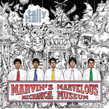

= Marvin's Marvelous Mechanical Museum
Tally Hall
2005
:toc:

  

From https://www.azlyrics.com/t/tallyhall.html

== Good Day

[verse]
____
I'd like to say hello and welcome you good day that is my name
Come here and sit down I'm so glad you even really truly came
We can even go and take a walk or something like that or something like that
But first I need to introduce my what and introduce my when

Let us sing! (Ah...)

Its name I like to call it likes to say it's nothing (it's nothing)
It lives and breathes and it insists that it insists that it is something (it's something)
It never liked to speak or run or walk or sleep or eat (oh oh oh...)
It even thought that everybody tried to thought to take its seat

Looking through glass eyes
Give it a few tries
Nothing goes right in its time
Kill all its bad dreams
Wonder 'bout no things
Circles and spirals in mind

But we know that this song is not about a no or yes or why
What's really truly what I say is that about a little sigh
So come along I think I'm done I think we're done yes this is done
What's truly that I think about it and it thinks about a ton

Let us sing! (Ah...)

Looking through glass eyes
Giving a few tries
Nothing goes right in its time
Kill all its bad dreams
Wonder 'bout no things
Circles and spirals in mind

I thought you knew I knew but
Why and by and why and by and by
I wanted you to know
I thought you knew but
Why and by and why

(Everyone loves a potato monkey...
I stepped in gum! I stepped in gum! Ohoho!)

Let us sing!...

Birds and bees and television
Cardboard houses, x-ray vision
Many little silly rhymes
Things forgotten lost their times
Telephones and silly games
Periods and lots of question marks 
____

== Greener

[verse]
____
Here's that part again
Where everything's more than it should be and
Greener seems to fall beneath your feet

Seconds tick like boulders
Whenever you don't call
Does it seem like that where you are
Wherever it is you are
Does it seem like that where you are... (yeah yeah yeah yeah)

Time for time together
And depending on the weather
We'll either argue in your
House or outside

How different I felt
Before I got this notch on my belt
'cause in my plans you were all for me
Yeah but now it seems that you'd just rather leave

Wherever you go
Is breaking me slowly
Don't leave it alone
Don't leave it alone
You sound so much further on the phone
You fit just right
Right next to me
But there's always a reason why it can't be

Telephones make you seem miles away from home
All alone I get a little meaner
I leave a message at your tone
And miles away from home
You get a little cleaner of me
And I find a little greener shade of envy

Wherever you go
Is breaking me slowly
Don't leave it alone
Don't leave it alone
You sound so much further on the phone
You fit just right
Right next to me
But there's always a reason why it can't be

Tissues get used
Getting rid of you
Don't you see what you do to me
And you just let it be

I wish you'd get used
And then come running back
To the shoulder that's become me
To the shoulder that's me

Wherever you are
Is breaking my heart
Don't leave it alone
Don't leave it alone

You fit just right
Right next to me 
____

== Welcome To Tally Hall

[verse]
____
Welcome to Marvin's Marvellous Mechanical Museum
Known from coast to coast like butter and toast
From inland to Finland
Uluru to Peru
No other place is continued in the United States
Or other environments of the world
Welcome

Can I get a T? ("T")
And if you hit me with the A L L Y
Then you'd see why
The Hall is here for y'all
The mini mall is calling us all in
So kids, pack up your mom's car
Back up the Windstar
Kick it in drive and arrive at the mega mart
Slide the side hatch with pride 'cause your ties match
On booty duty like your name was Eddie Thatch

W W T H D
We like to kick it at the university
But all work and no play makes us crazy
So we jump in the bumping SUV
Hit the street get the sweet tunes on
Do a donut on your momma's front lawn
And sooner than you know
You found the rock'n'roll show
At the Tizzy Hizzy we'll be gone

We're in the mini mall
Working the carnival
We like to play it all
Welcome to Tally Hall

"Who's to blame?"
The automated players, I proclaim
Yellow tie, this suave fellow writes
Heterophonic tunes of how love bites
Red, the proud loud guy we adore
"Is my amp too high?" "No, turn it up more!"
So Grey in the back, sippin' 'gnac, can hear
He's knockin' down the shots like Bill Laimbeer
Send home the locksmith, Green's got keys
To unlock the rock in the act if you please
Now open the case, give Blue the bass
And jiggle your badigle all over the place

We're in the mini mall
Working the carnival
We like to play it all
Welcome to Tally Hall

Can I get a click
Flick off the switch
And we'll ignite the night in pitch
Singin' songs you like to hear
And the world will disappear
Then we'll be glowing in the dark
Lighting up the park
Revealing that the Hall is the place that aims to please
With unpredictable games and antiquities
The collectibles so delectable
The unreliable style's undetectable

Like I might rap like an English chap
Take you by the knickers and a bum you'll slap
You didn't think we had the gall
Well, bloody welcome to Tally Hall!

We're stereosonic, we're animatronic
We're rappin' with the robolectronic ebonics
A quick distraction, a mechanic attraction
Got a penny in your pocket for the slot
Rock!

Hey, ho, don't'cha know?
It's a good old-fashioned puppet show!
That's right, quite the set
With a marionette quintet

We think we're playing in a band
We'd love to give you all a hand
Woo!

We're in the mini mall
Working the carnival
We like to play it all
Welcome to Tally Hall

We think we're playing in a band
We'd love to give you all a hand
We think we're playing in a band
We'd love to give you all a hand 
____

== Taken For A Ride

[verse]
____
Marvin walked into a helpless land
And wondered lightly am I happy?
Is this happy?

Following the footsteps left by man
He stepped to reprimand the mystic
Who's sadistic

Took a step into the elevator
Who said guess I'll see you later
Don't you worry

Fifteen flights that lasted nights
And days that spent without a cent
For creatures, with their beat shirts

Listening to painted whispered
Light on top forgotten hills

Next the stranded senate of the white brick house
With flowers asked some questions
For their story

All feeling now he took his bow
And left the stage of time with no answers
To no questions

Lonely paperbacks that wanted
Just a taste of feeling to implode them
Before living

Tiptoed to the wooden sign and said
Now take your place in line for happy
This is lovely

Listening to painted whispered
Light on top forgotten hills

One secondary smile
To go that extra mile
To make me feel today
To make it go away
The chemistry is gone
Taken for a ride
Far away from you
No longer left inside

The actor with his world renown
Was thinking 'bout his last real day of silence
Was it over?

Or is it just we all think
That our answer isn't real, it's just a picture
Of a letter

Bumble Mumble, make the rounds
No matter what, you'll seem profound
It's useless just to worry

Something normal happens
Somewhere far away in clouds so please
Stop thinking; this is happy

Listening to painted whispered
Light on top forgotten hills

One secondary smile
To go that extra mile
To make me feel today
To make it go away
The chemistry is gone
Taken for a ride
Far away from you
No longer left inside
[x2]

There no secrets in the door
Just a moment doing chores (there's nothing there)
And there's something
And there's something
And there's something
And there's something
Next to nothing
And there's something
And there's something
But you're gone 
____

== The Bidding

[verse]
____
I've been sleeping in a cardboard box
Spending every dollar at the liquor shop
And even though I know I haven't got a lot
I'll try to give you love until the day you drop

I've been training like a Pavlov dog
Send my independence out to take a hike
All you got to do is activate my bell
And I'll fetch you anything you like

Going once
Going twice
Every man here has a price
Over where
Over there
Sold to not a single lady in here

I've been here like a thousand times
Dated every woman in the atmosphere
I've been to every continent
Broken all the hearts in every hemisphere
And if I'm not the type of guy you like to circumvent
Just remember not to love me when I disappear

I graduated at the top
I like to take advantage of the bourgeoisie
So if you have a fantasy of being a queen
Maybe you should blow a couple bucks on me

Going once
Going twice
Won't these gentlemen suffice?
Any here
Any there
Any motions anywhere

Going twice
Going thrice
Guess this means we'll go four times a lady

I promise I'll be all you'll need
Ever need
You'll never have to shop around
(Don't shop around)
And I'll give you all you'll ever need
Ever need
Don't worry; I will never let you down
Let you down
Don't worry; I will never let you down

So many ladies
Are wanting for mates
And the prospects are good
But the date's never great
Over here
Over there
Over where
Anywhere
They're too busy
With winning
The bidding
To care
And he's sold 
____

== Be Born

[verse]
____
I suppose you're quite content
In your swimming pool
All you pink skinned babes are the same

And you can't stay forever young
So get out here and see the sun
You're only six inches away from becoming one

I was in your shoes before
Or lack thereof
And things worked out for me

There's a dozen people here
And they're waiting for you
It's your party you can cry if you want to

What if I told you
I could show you something
What if I told you
I could make you live
Follow my instruction
Swim in the direction
Of my voice
Hear my voice
Of my voice
Hear my voice

You think that you've seen it all
In your little ball
Man you're wrong and she's been waiting

Long and hard to kiss your head
And hold your hands
And hold you while you fall asleep

What if I told you
I could show you something
What if I told you
I could make you live
Follow my instruction
Swim in the direction
Of my voice
Hear my voice
Of my voice
Hear my voice

Ba ba ba...

What if I told you
I could show you something
What if I told you
I could make you live
Follow my instruction
Swim in the direction
Of my voice
Hear my voice
Of my voice
Hear my voice 
____

== Banana Man

[verse]
____
(Ladies and gentleman, Colonel PT Chester Whitmore is proud to present:
Bung Vulchungo and the Zimbabwe Songbirds!)

Do you see Banana man
Hopping over on the white hot sand
Here he come with some for me
Freshly taken from banana tree
(1, 2, 3, 4)
Banana man, me want a ton
Give me double and a bonus one
Give me more for all me friends
Dis banana flow will never end

Do you want a banana?
Peel it down and go mm mm mm mm
Do you want a banana?
Dis banana for you

Tonight we dance around a flame
Then we get to play spirit game
Spirit names we shout out loud
Shake the thunder from the spirit cloud
All the songbirds in the tree
Chant a tune to let the spirits free
Then we see them in the night
Spirits jumpin' by the fire light

Do you want a banana? (Do you want a banana?)
Peel it down and go mm mm mm mm
Do you want a banana? (Do you want a banana?)
Dis banana for you

Look you, you're too uptight you know
You can laugh and kick it back and go
But without a rhythm or a rhyme
You do not banana all the time
Fly away from city on the run
Try to make a little fun

Look you, come to the bungalow
African't you tell me don't you so
Don't you love the bumping of the drum
Make you shake until the bum go numb
Let the bongo play you till you drop
Dis banana never stop (never stop, never stop)

Forget all your troubles and go with the flow
Forget about whatever you may never know
Like whether whatever you are doing is whatever you should
And whether anything you do is ever anything good
And then forget about banana when it stick in your throat
And when they make you wanna bellow but you're stuck in a choke
And you forget about the yellow from the colorful man who make you take another one
And make a mock of your plan

Bungalay, Bungalow; make up your mind and tell me no

Well it's nine o'clock and it's getting dark
And the sun is falling from the sky
I've never left so early and you may wonder why

Tomorrow morning on the plane
No banana make you go insane
Floating back to busy town
No banana make you want to frown

Do you want a banana? (Do you want a banana?)
Peel it down and go mm mm mm mm
Do you want a banana?
Dis banana for you 
____

== Just Apathy

[verse]
____
I'm too much
Or not enough
Maybe everyone else is messed up
Well anyway
I can't seem to stay in just one state of mind

Waiting round for something better
I'm the one that wouldn't let her
Now I'm back and forth
I get bored when she's no perfect find

'Cause it's one thing
Or another
I don't even know why I bother
One thing just tears her down

'Cause it's one thing
Or another
I don't even know why I bother
Something I just can't get around

Consider the possibility
That you've been had but not by me
We're just kids
Don't worry about this

My course is run and I'm so tired
Until the next one comes inspired
I feel bad and I should
I made her sad and I knew it would

'Cause it's one thing
Or another
I don't even know why I bother
One thing just tears her down

'Cause it's one thing
Or another
I don't even know why I bother
Something I just can't get around

I need to learn
To wait in turn
Cause now I just step blindly

And I'm only happy when
I can close my eyes and I just dive in
And forget about about acting kindly

('Cause it's always one)
'Cause it's one thing
Or another
I don't even know why I bother
One thing just tears her down

'Cause it's one thing
Or another
I don't even know why I bother

Some things I just can't get around

Still I know you won't let me down 
____

== Spring And A Storm

[verse]
____
One time I tried to sing
About spring and a storm
But you know
How it goes

Blah blah blah blah
Blah blah blah blah blah
All along

Won't you please stop complaining
I'm playing a song

But all the rain comes down the same
Falling to from where it came
On the ground then back around
Up into the sky

I wish you could have heard the music
When the clouds growled overhead
I finally felt enthusiastic
I finally felt alive

Blah blah blah blah
Blah blah blah blah blah
So you said

Would it please you to listen
To thunder instead

Man the rain came down that day
And it drained my soul away
And I wondered why I even
Bothered to try

Mr. Moon (Yeah?)
Tell us about the sky

The sky is deep and dark and eternally high
Many people think that's where you go when you die

Do you?

Well I think you return to obscure
Or wherever you were
Before you were
But I won't let you lose yourself
In the rain

We have so much left to sing
There's a storm for every spring
All you see and you and me
Became from a star

You're a star
Yes you are

(Silent explosive and silent explosive and...)

Create until nothing is left to create and
The universe bursts with an overworked sigh then
Pretend to pretend to re-crown the creation and
Sing the same thing till the clouds start to cry and then
Over and over and over again and then
Over and over and
Never again
____

== Two Wuv

[verse]
____
I have this little thing
It's probably just a fling
Two girls I like a lot
I think they're really hot
But I'm not sure if they know
How my love began to grow
It took a lot of time
But right now it's solely mine

(Today) I drew a mural of
The things I'd like to love
And where my heart resides
Is with two girls with gray eyes

If they just gave me a chance
I'd show them what they want and teach 'em what they've got
I'd tickle each and every one of their fancies
And I'd take the key to my heart and open it and let the love shine through

Mary Kate and Ashley, I hope you understand
That I love you a lot and I wanna be your man
And I think that it'd be totally cool
If I hung around your apartments and enrolled in your school

(Mary Kate) I saw you on TV
You dressed up like a bee
Reminds me of the time
How it's gone and it's gone and it's gone
It's sadness every day that passes
Without you and I really want I really want
I really wanna hold you both tight
And tell you you're mine but instead I sing

Mary Kate and Ashley, I hope you understand
That I love you a lot and I wanna be your man
And I think that it'd be totally cool
If I hung around your apartments and enrolled in your school

Mary Kate and Ashley I hope you understand
That I love you a lot and I wanna be your man
And I think that it'd be totally cool
If I hung around your apartments and enrolled in your school

I know that life without you and you would be sad
And I know it'd be bad

Mary Kate and Ashley I hope you understand
That your loveliness blossomed
And I wanna hold your hands
And I think that it'd be totally cool
If I hung around your apartments and enrolled in your school

Mary Kate and Ashley I hope you understand
That I love you a lot and I wanna be your man
And I think that it'd be totally cool
If I hung around your apartments and enrolled in your school

Mary Kate and Ashley I hope you understand
That I love you a lot and I wanna be your man
And I think that it'd be totally cool
If I hung around your apartments and enrolled in your school

Once you learn to love me
Life will be all right

Once you learn to love me
Life will be all right

Once you learn to love me
Life will be all right 
____

== Haiku

[verse]
____
I have been trying
To write a haiku for you
Some things I just can't do

Maybe you're beyond
Ancient Asian poetry
Or maybe it's just me

I have been trying
To get this haiku just right
All night for you all right

I'm through!

Maybe this poem
Was lost in the sauce we spilled
That never got refilled

I've never thought much
Of formulaic verse anyway
And rhymes are not my fort-

I have been trying
To get this haiku just right
All night for you all right

I'm through!

I'm trying not to try too hard
But you're hard to write down right
So I pen these trite attempts
At haikus for you tonight

La da dee diddum
Lada da dum doo diddle
Dum doo la dee do

There that's sufficient
I wrote a haiku for you

Well I tried at least
And that's not so bad
I'm working here
Can that be said for you?

I'm trying not to try too hard
But you're hard to write down right
So I pen these trite attempts
At haikus for you tonight

Words don't work like Webster says
They trip me up all night
I'm just trying to write for you
But you're hard to write down right 
____

== The Whole World And You

[verse]
____
There's lots of pretty people here
Sharing sotries and passing letters and
There's lots of questions answered and
Metaphysical astronomical songs
Words printed all on papers
That seemed too mystical
It's so magical
People that dance and compute that
No one's better than you

La la la...

There's kings in distant cities
Who rule their persons and
Make them happy and
We won't forget about all the
Servisory congratulatory
Even the animals know that something's brewing
And they're all cooing
Cause in the end I'd like to say
No one's better than you

I hope you're happy now
I've revealed the truth
I've even written this whole song about you
And not about me
And not about me

Please don't just laugh and clap right now
This is serious
I'm not delirious
I've waited very patiently
Just to let you know
Who should run the show
'Cause we all know these are the facts
Nothing to retract
Nothing too abstract
Concluding in the song
I'll say
No one's better than you
No one's better than you
No one's better than
You 
____

== 13
(Instrumental)

== Ruler Of Everything

[verse]
____
Juno was mad
He knew he'd been had
So he shot at the sun with a gun
Shot at the sun with a gun
Shot at his wily one only friend

In the gallows or the ghetto
In the town or the meadow
In the billows even over the sun
Every end of the time is another begun

You understand
Mechanical hands
Are the ruler of everything (ah)
Ruler of everything (ah)
I'm the ruler of everything
In the end

Do you like how I dance?
I've got zirconium pants!
Consequential enough
To slip you into a trance

Do you like how I walk?
Do you like how I talk?
Do you like how my face
Disintegrates into chalk?

I have a wonderful wife
I have a powerful job
She criticizes me for being egocentric (ha ha ha)

You practice your mannerisms
Into the wall
If this mirror were clearer
I'd be standing so tall

I saw you slobber over clovers on the side of the hill
I was observing the birds
Circle in for the kill

I've been you
I know you
Your facade is a scam

You know you're making me cry
This is the way that I am

I've been living a lie
A metamorphical scheme
Detective undercover brotherhood
Objective: obscene

Oh no, no
Oh yeah

Do you hear the flibbity jibbity jibber jabber
With an oh my god I've got to get out of here or I'll have another
Word to sell
Another story to tell
Another time piece ringing the bell
Do you hear the clock stop when you reach the end
No
You know it must be never ending
Comprehend if you can
But when you try to pretend to understand
You resemble a fool
Although you're only a man
So give it up and
Smile

You understand
Mechanical hands
Are the ruler of everything (ah)
Ruler of everything (ah)
I'm the ruler of everything
In the end

Without looking down
Gliding around
Like a bumbling dragon I fly
Scraping my face on the sky

Oh no, no
Oh yeah 
____

== Hidden In The Sand
(Hidden Track)

[verse]
____
We were playing in the sand
And you found a little band
You told me you fell in love with it
Hadn't gone as I planned

When you had to bid adieu
Said you'd never love anew
I wondered if I could hold it
And fall in love with it too

You told me to buy a pony
But all I wanted was you 
____
