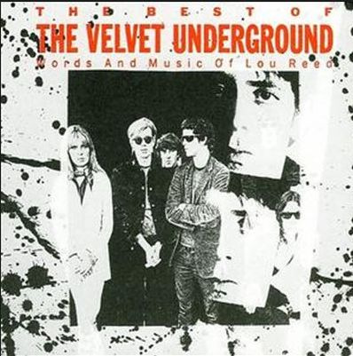

= The Best of the Velvet Underground
Velvet Underground
:toc:

From https://www.azlyrics.com/v/velvetunderground.html

== I'm Waiting For The Man

[verse]
____
I'm waiting for my man
Twenty-six dollars in my hand
Up to Lexington, 125
Feel sick and dirty, more dead than alive
I'm waiting for my man
Hey, white boy, what you doin' uptown?
Hey, white boy, you chasin' our women around?
Oh pardon me sir, it's the furthest from my mind
I'm just lookin' for a dear, dear friend of mine
I'm waiting for my man
Here he comes, he's all dressed in black
Beat up shoes and a big straw hat
He's never early, he's always late
First thing you learn is you always gotta wait I'm waiting for my man
Up to a Brownstone, up three flights of stairs
Everybody's pinned you, but nobody cares
He's got the works, gives you sweet taste
Ah then you gotta split because you got no time to waste
I'm waiting for my man
Baby don't you holler, darlin' don't you bawl and shout
I'm feeling good, you know I'm gonna work it on out
I'm feeling good, I'm feeling oh so fine
Until tomorrow, but that's just some other time
I'm waiting for my man 
____

== Femme Fatale

[verse]
____
Here she comes, you better watch your step
She's going to break your heart in two, it's true It's not hard to realize
Just look into her false colored eyes
She builds you up to just put you down, what a clown
'Cause everybody knows (She's a femme fatale)
The things she does to please (She's a femme fatale)
She's just a little tease (She's a femme fatale)
See the way she walks
Hear the way she talks
You're put down in her book
You're number 37, have a look
She's going to smile to make you frown, what a clown
Little boy, she's from the street
Before you start, you're already beat
She's gonna play you for a fool, yes it's true
'Cause everybody knows (She's a femme fatale)
The things she does to please (She's a femme fatale)
She's just a little tease (She's a femme fatale)
See the way she walks Hear the way she talks 
____

== Run Run Run

[verse]
____
Teenage Mary said to Uncle Dave
I sold my soul, must be saved
Gonna take a walk down to Union Square
You never know who you're gonna find there
You gotta run, run, run, run, run
Take a drag or two
Run, run, run, run, run
Gypsy Death and you
Tell you whatcha do
Marguerita Passion had to get her fix
She wasn't well, she was getting sick
Went to sell her soul, she wasn't high
Didn't know, thinks she could buy it
And she would run, run, run, run, run
Take a drag or two
Run, run, run, run, run
Gypsy Death and you
Tell you whatcha do
Seasick Sarah had a golden nose
Hobnail boots wrapped around her toes
When she turned blue, all the angels screamed
They didn't know, they couldn't make the scene
She had to run, run, run, run, run
Take a drag or two
Run, run, run, run, run
Gypsy Death and you
Tell you whatcha do
Beardless Harry, what a waste
Couldn't even get a small-town taste
Rode the trolleys down to forty-seven
Figured he was good to get himself to heaven
'Cause he had to run, run, run, run, run Take a drag or two
Run, run, run, run, run
Gypsy Death and you
Tell you whatcha do
____

== Heroin

[verse]
____
I don't know just where I'm going
But I'm gonna try for the kingdom, if I can
'Cause it makes me feel like I'm a man
When I put a spike into my vein
And I'll tell ya, things aren't quite the same
When I'm rushing on my run
And I feel just like Jesus' son
And I guess that I just don't know
And I guess that I just don't know
I have made the big decision
I'm gonna try to nullify my life
'Cause when the blood begins to flow
When it shoots up the dropper's neck
When I'm closing in on death
And you can't help me now, you guys
And all you sweet girls with all your sweet talk
You can all go take a walk
And I guess that I just don't know
And I guess that I just don't know
I wish that I was born a thousand years ago
I wish that I'd sail the darkened seas
On a great big clipper ship
Going from this land here to that
In a sailor's suit and cap
Away from the big city
Where a man can not be free
Of all of the evils of this town
And of himself, and those around
Oh, and I guess that I just don't know
Oh, and I guess that I just don't know
Heroin, be the death of me
Heroin, it's my wife and it's my life
Because a mainer to my vein
Leads to a center in my head
And then I'm better off and dead
Because when the smack begins to flow
I really don't care anymore
About all the Jim-Jim's in this town
And all the politicians makin' crazy sounds
And everybody puttin' everybody else down
And all the dead bodies piled up in mounds
'Cause when the smack begins to flow
Then I really don't care anymore
Ah, when the heroin is in my blood
And that blood is in my head
Then thank God that I'm as good as dead
Then thank your God that I'm not aware
And thank God that I just don't care
And I guess I just don't know
And I guess I just don't know 
____

== All Tomorrow's Parties

[verse]
____
And what costume shall the poor girl wear
To all tomorrow's parties
A hand-me-down dress from who knows where
To all tomorrow's parties
And where will she go and what shall she do
When midnight comes around
She'll turn once more to Sunday's clown
And cry behind the door
And what costume shall the poor girl wear
To all tomorrow's parties
Why silks and linens of yesterday's gowns
To all tomorrow's parties
And what will she do with Thursday's rags When Monday comes around
She'll turn once more to Sunday's clown
And cry behind the door
And what costume shall the poor girl wear
To all tomorrow's parties
For Thursday's child is Sunday's clown
For whom none will go mourning
A blackened shroud, a hand-me-down gown
Of rags and silks, a costume
Fit for one who sits and cries
For all tomorrow's parties
____

== I'll Be Your Mirror

[verse]
____
I'll be your mirror
Reflect what you are, in case you don't know
I'll be the wind, the rain and the sunset
The light on your door to show that you're home
When you think the night has seen your mind
That inside you're twisted and unkind
Let me stand to show that you are blind
Please put down your hands
'Cause I see you
I find it hard to believe you don't know
The beauty that you are
But if you don't let me be your eyes
A hand in your darkness, so you won't be afraid
When you think the night has seen your mind
That inside you're twisted and unkind
Let me stand to show that you are blind
Please put down your hands
'Cause I see you
I'll be your mirror 
____

== White Light / White Heat

[verse]
____
White light, White light goin' messin' up my mind
White light, and don't you know its gonna make me go blind
White heat, aww white heat it tickle me down to my toes
White light, Ooo have mercy white light have it goodness knows

White light, White light goin' messin' up my brain
White light, Aww white light its gonna drive me insane
White heat, Aww white heat it tickle me down to my toes
White light, Aww white light I said now goodness knows, do it

Hmm hmm, White light
Aww I surely do love to watch that stuff tip itself in
Hmm hmm, White light
Watch that side, watch that side don't you know it gonna be dead in the drive
Hmm hmm, White heat
Hey foxy mama watchin' her walk down the street
Hmm hmm, White light
Come up side your head gonna make a deadend on your street

White light, White light moved in me through my brain
White light, White light goin' makin' you go insane
White heat, Aww white heat it tickle me down to my toes
White light, Aww white light I said now goodness knows

White light, Aww white light it lighten up my eyes
White light, don't you know it fills me up with suprise
White light, Aww white heat tickle me down to my toes
White light, Aww white light I tell you now goodness knows, now work it

Hmm hmm, White light
Aww she surely do moves me
Hmm hmm, White light
Watch that speed freak, watch that speed freak everybody gonna go and make it every week
Hmm hmm, White heat
Aww sputter mutter everybody gonna go kill their mother
Hmm hmm, White light
Here she comes, here she comes, everybody get 'n gone make me run to her
____

== Stephanie Says

[verse]
____
Stephanie says that she wants to know
Why she's given half her life, to people she hates now
Stephanie says when answering the phone
What country shall I say is calling from across the world

But she's not afraid to die, the people all call her Alaska
Between worlds so the people ask her 'cause it's all in her mind
It's all in her mind

Stephanie says that she wants to know
Why it is thought she's the door She can't be the room

Stephanie says but doesn't hang up the phone
What sea shell sea is calling from across the world

But she's not afraid to die, the people all call her Alaska
Between worlds so the people ask her 'cause it's all in her mind
It's all in her mind

She asks you is it good or bad
It's such an icy feeling it's so cold in Alaska,
it's so cold in Alaska, it's so cold in Alaska 
____

== What Goes On

[verse]
____
What goes on in your mind?
I think that I am falling down.
What goes on in your mind?
I think that I am upside down.
Baby, be good, do what you should, you know it will work alright.
Baby, be good, do what you should, you know it will be alright.
I'm going up, and I'm going down.
I'm going from side to side.
See the bells, up in the sky,
Somebody's cut their string in two.
Baby, be good, do what you should, you know it will work alright.
Baby, be good, do what you should, you know it will be alright.
One minute born, one minute doomed,
One minute up, one minute down.
What goes on in your mind?
I think that I am falling down.
Baby, be good, do what you should, you know it will work alright.
Baby, be good, do what you should, you know it will be alright.
____

== Beginning To See The Light

[verse]
____
Well, I'm beginning to see the light.
Well, I'm beginning to see the light.
Some people work very hard,
but still they never get it right.
Well, I'm beginning to see the light.

I wanna tell all you people, now.
Now, now, baby, I'm beginning to see the light.
Hey, now, baby, I'm beginning to see the light.

Wine in the mornin', and some breakfast at night.
Well, I'm beginning to see the light.

Here we go again, playing the fool again.
Here we go again, acting hard again.
All right!
Well, I'm beginning to see the light!
I wanna tell you, ooh-oh-oh!
Hey, now, baby, I'm beginning to see the light!
It comes very softly now.
I wore my teeth in my hands so I could miss the hell of a night.
Hey! Well, I'm beginning to see the light!
Now, now, now, now, now, now, now, now, now, baby,
I'm beginning to see the light, now!
It comes softer!
Hey, now, baby, I'm beginning to see the light.

I met myself in a dream, and I just want to tell you,
Everything was alright.
Hey, now, baby, I'm beginning to see the light.

Here comes two of you.
Which one will you choose?
One is black and one is blue,
Don't know just, what to do.
Alright!

Well, I'm beginning to see the light, oh, now, here she comes!
Hey, yeah, baby, I'm beginning to see the light!
Oh-ahhhh!
Some people work very hard,
But still they never get it right.
Well, I'm begiing to see the light.
Ah, it's getting a little softer, maybe, in there.
Now, now, baby, I'm beginning to see the light.
Ah, it's coming around again,
Hey, now, now, now, baby, I'm beginning to see the light.
One more time.
There are problems in these times,
But, woo!, none of them are mine!
Oh, baby, I'm beginning to see the light.

Here we go again,
I thought that you were my friend.
Here we go again,
I thought that you were my friend.
How does it feel, to be loved?
How does it feel, to be loved? 
____

== Pale Blue Eyes

[verse]
____
Sometimes I feel so happy,
Sometimes I feel so sad.
Sometimes I feel so happy,
But mostly you just make me mad.
Baby, you just make me mad.
Linger on, your pale blue eyes.
Linger on, your pale blue eyes.

Thought of you as my mountain top,
Thought of you as my peak.
Thought of you as everything,
I've had but couldn't keep.
I've had but couldn't keep.
Linger on, your pale blue eyes.
Linger on, your pale blue eyes.

If I could make the world as pure and strange as what I see,
I'd put you in the mirror,
I put in front of me.
I put in front of me.
Linger on, your pale blue eyes.
Linger on, your pale blue eyes.

Skip a life completely.
Stuff it in a cup.
She said, Money is like us in time,
It lies, but can't stand up.
Down for you is up."
Linger on, your pale blue eyes.
Linger on, your pale blue eyes.

It was good what we did yesterday.
And I'd do it once again.
The fact that you are married,
Only proves, you're my best friend.
But it's truly, truly a sin.
Linger on, your pale blue eyes.
Linger on, your pale blue eyes.
____

== I Can't Stand It

[verse]
____
Before being a man
Livin' in a garbage pail
My landlady call me up
She tried to hit me with a mop

I can't stand it anymore more
I can't stand it anymore more
I can't stand it anymore more
But if Shelly she would just come back
It'll be allright
But if Shelly she would just come back
It'll be allright

I live with thirteen dead cats
A purple who hear spats
They're all livin in a hall
And I can't stand it anymore

I can't stand it anymore more
I can't stand it anymore more
I can't stand it anymore more
But if Shelly she would just come back
It'll be allright
But if Shelly she would just come back
It'll be allright

Before being a man
Livin' in a garbage pail
My landlady call me up
She tried to hit me with a mop

I can't stand it anymore more
I can't stand it anymore more
I can't stand it anymore more
But if Shelly she would just come back
It'll be allright
But if Shelly she would just come back
It'll be allright
Be allright, be allright....
____

== Lisa Says

[verse]
____
Lisa says that it's allright
When she meets me alone at night
Lisa says that she has a fun
And she'll do it with just about anyone.

Lisa says, Lisa says, Lisa says, Lisa says
Lisa says that she's on the run
Looking for a special one
Lisa says that every time she makes his trip
She knows her heart will beat

Lisa says, Lisa says, Lisa says, Lisa says
Looking for a part and some action
Going to make it feel okay
But what do you find
When the time has come on, now
Look at it run

Lisa says, Lisa says, Lisa says, Lisa says
Lisa says, Lisa says, Lisa says... 
____

== Sweet Jane

[verse]
____
Standin' on a corner
Suitcase in my hand
Jack's in his corset, Jane is in her vest
and me I'm in a rock 'n' roll band. Huh.
Riding a Stutz Bear Cat, Jim
ya know, those were different times
all the poets studied rules of verse
and those ladies they rolled their eyes
Sweet Jane
Sweet Jane
Sweet Jane
Now Jack, he is a banker
and Jane, she's a clerk
and both of them save their monies
when they get home from work
sittin downby the fire
Ooo, the radio does play
the classical music there, Jim
The March of the Wooden Soldiers
All you protest kids
you can hear Jack say
Sweet Jane
Sweet Jane
Sweet Jane
Some people they like to go out dancin
and other people they have to work. Just watch me now
and there's even some evil mothers
Well there gonna tell you that everthing is just dirt
you know that women never really faint
and that villians always blink their eyes
that children are the only ones who blush
and that life is just to die
But anyone who ever had a heart
they wouldn't turn around and break it
and anyone who ever played a part
They wouldn't turn around and hate it
Sweet Jane, Sweet Sweet Jane 
____

== Rock And Roll

[verse]
____
Jenny said when she was just five years old
You know there's nothing happening at all
Every time she puts on the radio
There was nothing goin' down at all
Then one fine mornin' she puts on a New York station
She couldn't believe what she heard at all
She started dancin' to that fine fine music
You know her life was saved by Rock 'n' Roll

Despite all the amputations
You could just dance to a rock 'n' roll station

Jenny said when she was just five years old
My parents are gonna be the death of us all
Two TV sets and two Cadillac cars--
Ain't gonna help us at all

Then one fine mornin' she puts on a New York station
She don't believe what she heard at all
She started dancin' to that fine fine music
You know her life was saved by Rock 'n' Roll

Despite all the computations
You could just dance to a rock 'n' roll station
And it was alright. 
____
