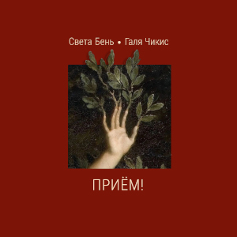

= Приём!
Света Бень, Галя Чикисс
2022
:toc:

С сайта: https://litpoint.org/2024/07/28/14339/

== Кёртису

[verse]
____
Черепаха не спешит
Очень медленно дышит
Медленно знает
Медленно молчит
Я лежу – во мне стучит
Там где сердце и выше
Темное злое море стучит
Ничего не слышать
Никогда и ничего не слышать
Ничего не слышать
Только так и выжить

Только он
Кёртис Йен
Только он
Убедителен

Пожалею себя
Пожалею себя
Обниму
Отниму
Заверну
Перепрячу
Никаких новостей! Никаких новостей!
К черту ленту новостей!
Не желаю, не значу

Никого не видеть
Никогда и никого не видеть
Только так и не обидеть никого

Только он
Кёртис Йен
Только он
Убедителен
И спокоен
____

== Я слышу чаек

[verse]
____
Я вижу чаек, за домом море,
Я слышу чаек, они поют,
Летят-летят инопланетяне за мной
И увезут отсюда, увезут меня.

Летите! Помчимся к звёздам!
Скорей возьмите меня с собой!
Спешите, пока не поздно,
Пока за домом гудит прибой,
Гудит прибой.

За домом ветер в высоких клёнах,
За домом море и тополя,
Летят-летят в лучах зелёных
Межгалактические друзья.

Летите! Помчимся к звёздам!
Скорей возьмите меня с собой!
Спешите, пока не поздно,
Пока за домом гудит прибой,
Гудит прибой.

За домом стройка и автомойка
За домом моря в помине нет,
Кружатся чайки
Вокруг помойки,
И нет сигналов с других планет,
Но я стою, кручу настройки,
Я жду сигналов с других планет.
Летите! Помчимся к звёздам!
Скорей возьмите меня с собой!
Спешите, пока не поздно,
Пока за домом гудит прибой.

Летите! Помчимся к звёздам!
Скорей возьмите меня с собой!
Спешите, пока не поздно,
пока не поздно.
____

== Зеркальный шар

[verse]
____
Там был такой красивый зеркальный шар
Там кружился такой красивый зеркальный шар
Скользкий пол, хлипкий стул, липкий бар
Но там кружился такой красивый зеркальный шар
История моя, как грядка
была длинна, черна и скучна
И если рассказывать кратко,
То мне – хана
Мир так угрюм и опасен
Я в рассинхроне с ним
План эвакуации ясен,
Но невыполним

Там был такой красивый зеркальный шар
Пряничный человечек, держи удар
Заклеивай липким тестом свой разломанный рай
Но если сказать тебе честно:
You must die

Но шар говорил — ложь!
Ты никогда не умрешь
Ты танцуешь, ты никогда не умрёшь
Смотри мне в глаза
Разве я вру? Разве я вру?
Ты танцуешь, ты никогда не умрешь
Я кружусь, я никогда не умру
Я кружусь только для тебя
Только для тебя
Только для тебя
Я – зеркальный шар
Только для тебя
Только для тебя
Только для тебя
Твой зеркальный шар
____

== Чёрные бидоны

[verse]
____
Время все засыпает хлоркой
Глядя на нас через лунку сортира
Время все заливает
Толстым слоем подкожного жира
Время лечит
Время прекрасно лечит
Только тех, кого не сильно калечит
Вместо культи оно не отрастит тебе новой руки
Не заменит тебе позвонки
Но все таки станет полегче

Чтобы выжить мне надо все это забыть
Мне надо все это забыть
Чтоб никого не убить
Мне надо, мне надо все это забыть
Чтобы выжить

По черным улицам едут чёрные бидоны железные
Чёрное развозят молоко по домам
В бидонах достаточно места
По пять человек помещается в один стакан
Люди, похожие на гроб на колесиках
Ставят крестик на дверях
Где есть много вопросиков
Гроб на колесиках
Нить на колесиках
На твоём этаже
Уже

Чтобы выжить мне надо все это забыть
Мне надо все это забыть
Чтоб никого не убить
Мне надо, мне надо все это забыть, чтобы выжить

Мне нужны тонны мусора
Горы щебня
Самосвалы камней
Чтоб засыпать, чтоб завалить этот голос
Который во мне и который всего больней
Силикатный клей – в альвеолах
Легкие мои – стекловолокно
В голове колючие ветки
И красное слепое окно

Чтобы выжить мне надо все это забыть
Мне надо все это забыть
Чтоб никого не убить
Мне надо, мне надо все это забыть, чтобы выжить

Выживут только те, кто и не был в живых
И те, кто плевать хотел на семь ножевых
И тот, кто умеет легко превратиться в Дух
Собираясь в количестве двух
Человек во имя Твоё
И тот, кто стоит у СИЗО и в пакетике держит белье
Сигареты, конфеты без фантиков и упаковки
Выживут только те, кто спасая друг друга, целуется на остановке
Чтобы выложить жуть
Из мозга спинного
Из страха наскального
Страха свиного
Из темного дома, уже неродного
Мне надо все это забыть
Мне надо все это забыть, чтоб не мучиться
Вряд ли получится
____

== Самое злое

[verse]
____
Отключая инстинкт самосохранения
Начинаешь верить, что эти ранения
Происходят не с тобой
Боль дает отбой
Таким образом все эти пули попавшие в цель
Одновременно пролетают мимо —
Их принимает тень.
А тени по**й: она неуловима.
Ни за что не несёт ответственность,
У неё дурная наследственность.
Она моя.
Как остры у неё края.
Как у крышки банки консервов,
У тени нет нервов.
Она не я.

Самое злое во мне спасибо за
Самое злое во мне.
Оно красиво. Красиво непереносимо
Самое злое во мне! Такое
Цельное. Драгоценное
Самое злое во мне
Самое неподдельное
Самое, самое злое во мне!

В доброте намешано многое.
В ярости примесей нет.
Если хочешь — спроси у Бога,
Из чего он ещё извлекает свет.
Только из предельной ярости
Свет запредельной яркости
Только из ярости свет.
Ты лежишь обглодан и оглушён, вскрытый консервным ножом,
Среди рыбьих костей, среди кочек и ям.
Всё сгорает к х*ям.
Но ты рад как ребёнок, сжигающий школьный дневник:
На какой-то миг
Озаряешь свою бесконечную тьму,
И жмёшь руку себе самому.

Самое злое во мне спасибо за
Самое злое во мне.
Оно красиво.
Красиво непереносимо
Самое злое во мне!
Такое цельное.
Драгоценное
Самое злое во мне
Самое неподдельное
Самое, самое злое во мне!
Самое злое во мне
Спасибо за самое злое во мне.
Спасибо, за самое злое во мне.
____

== Не виноват

[verse]
____
Золотая осень
Чёрный листопад
Если ты не спрятался
Никто не виноват

Говорят
Плюшевый медведь опять бежал из мест заключения
Ориентировки на него висели во всех отделениях
Милиции
Вся милиция ходила с тусклыми лицами
А мы – наоборот!!!
Говорят, его видели в столовой,
он брал пирожки и компот.
Говорят, его видели в промзоне
Он спал на газоне,
подстелив кусок клеёнки.
Говорят, его видели в частном секторе,
он пил воду из колонки…

Мы знали, он – где-то рядом,
он не уйдёт далеко
И мы оставляли
Ему в подвале
Хлеб и молоко
Папино пальто
Стихи Барто
Немного мёда,
зеленки и йода
Иголку и нитку для зашивания ран
для связи – мобильник,
у которого треснул экран.

Вчера я увидел его, когда шёл в магазин
Он был не один
Он лежал на серой машине
Руки – за спину
Лицом – в капот
У него был вспорот живот
Он повернулся ко мне – глаз висел на одной нитке
«Понимаешь, – сказал он – просто добро движется чуть медленнее улитки.
Ему нельзя поспешить,
чтоб нечаянно не совершить
ничего плохого
А зло – оно, конечно, спешит, не то слово!
И зла не надо бояться. Надо бояться стать частью зла»
Потом он начал смеяться
И машина его увезла.

В следах от машины – вода,
листва,
кровь, грязь, синтепон
Я ещё постоял
И пошёл в подвал
Чтоб оставить ему молоко и батон

Золотая осень
Чёрный листопад
Если ты не прятался
Ты не виноват
____

== Не печалуйся

[verse]
____
Не печалуйся ничем
Всё вокруг не насовсем
Всё что движется обрящет
Деревянный ящик

Перемелется в муку
Затеряется в стогу
Станет прахом одним махом
И ку-ку !
Крокодил-дил-дил идёт
Бегемот-мот-мот плывёт
Всё проходит
Всё проходит
Всё проходит
Всё пройдёт
Изотрется в порошок
Упакуется в мешок
Белым снегом засыпаясь
Засыпай скорей, дружок

Где твои мысли?
На соплях повисли
Где твои заботы?
Им бы вспомнить кто ты!
Где твои Победы?
Им скажи – покедова!
Где Всё что было?
Там где Всё что было

Не печалуйся, не ной
Каждый болен сам – собой
Каждый трудится как может
Свой ведёт неравный бой
Каждый хрупок и раним
Каждый – Босх Иероним
Со своим сражайся адом
И не лезь во ад к другим
____

== Ласточки

[verse]
____
Ласточки в полёте становятся то крестиком, то стрелой,
То ранкой в нёбе неба, то рыболовным крючком, то острой рыбной иглой,
Становятся точкой, точкой-тире, точкой и запятой,
прочерком, почерком, строчкой, написанной на песке и смытой водой,
снуют, словно моют небесную банку, в которой вчера было молоко,
меняют уют на сиюминтность, не ноют и двигаются легко,
двигаются легко.

Дом ласточки – балкон и крыша,
Распорядок дня – проснулся и вышел.
Дом ласточки – балкон и крыша,
Распорядок дня – проснулся и вышел.

У ласточек идёт охота на мелкую мошкару,
Для ласточек это работа, снизу похожая на танец или игру,
Делают сальто-мортале, режут воздух хвостом,
ласточки не устали, а если устали, никому не расскажут о том,
Как ласточки в полёте становятся сюрикеном, запущенным ввысь,
ласточки не остановятся, и ты держись, если можешь, если можешь, держись.
Если можешь, если можешь, держись.

Дом ласточки – балкон и крыша,
Распорядок дня – проснулся и вышел.
____

== Может

[verse]
____
Может, это было бы и лучше, если б не было меня, вовсе не было меня.
Но уточню на всякий случай, здесь решаю не я, решаю не я.
Зачем-то сюда привинчен, зачем-то сюда прибит
мой организм, что так обидчив и так невзрачен на вид?
Зачем-то сюда загружен, зачем-то сюда помещён,
Значит, к чему-то здесь нужен, если пока что не выдворен вон
с планеты Земля не выдворен вон.

Может, это было бы и лучше, разобраться что к чему, разобраться что к чему,
Но уточню на всякий случай, здесь всё неясно никому, всё неясно никому.
Зачем-то сюда заброшен, зачем-то сюда залит
мой организм, что довольно изношен, но странным образом не убит,
Зачем-то обезоружен, размазан и сокрушён,
Значит, к чему-то здесь нужен, если пока что не выдворен вон
с планеты Земля не выдворен вон.
____

== Приём!

[verse]
____
Под деревом дерева кости лежат
Холодные ветви-обрубки
Послушай, покуда нас не сторожат,
в горло не вставлены трубки,
Давай убежим
нарушим больничный режим
ключ в шкафчике под бельём
Приём, приём, приём

Ты кости деревьев пойди, собери,
Затопим зубастую печку,
Снаружи тревожно, прозрачно внутри,
И кровь загустела как кетчуп,
Пожалуйста, будь со мной,
Мне нужен второй связной,
Мне будет нестрашно,
если мы будем вдвоём
Приём, приём, приём

Под деревом дерева кости лежат
Холодные ветви-обрубки
Послушай, покуда нас не сторожат,
Приём, приём, приём
____
